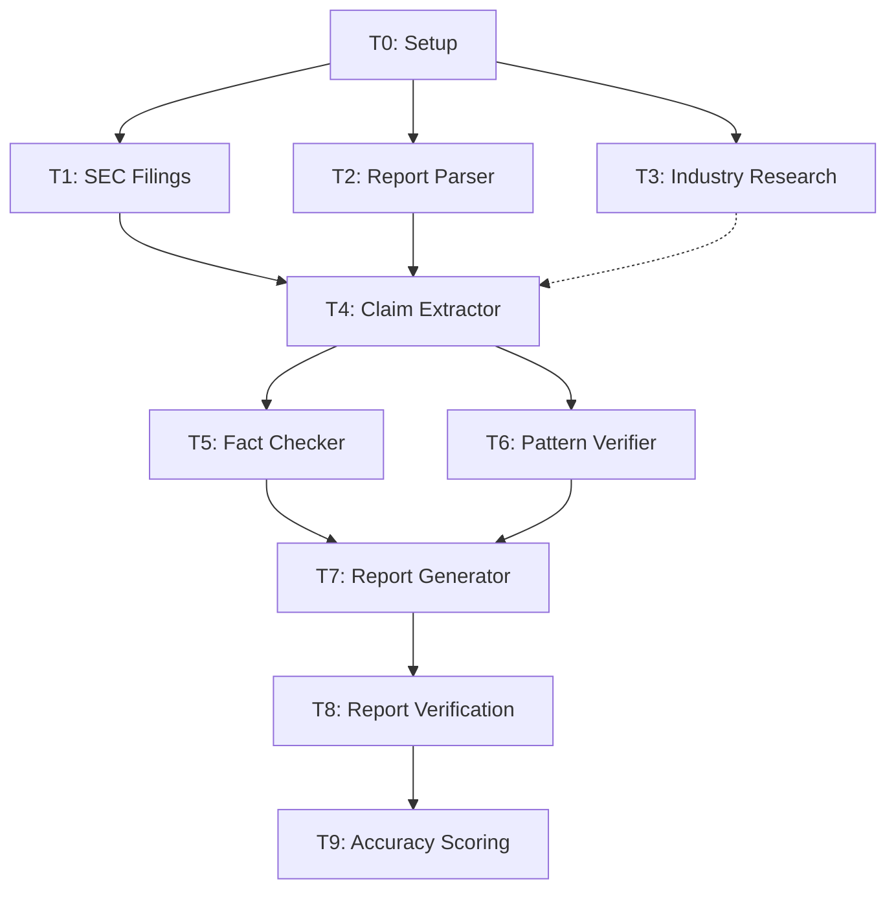

# ca-eval Skill

KYの投資判断軸（dogma.md 12ルール）に基づいて競争優位性を評価するワークフローです。

## 目的

アナリストレポートを入力とし、KYの12ルール + 却下/高評価パターン + few-shot例を全て直接読み込んだ上で、構造化された競争優位性評価レポートを生成します。

**Difyワークフローからの主要改善点:**
- KB chunking/RAG → 全KBファイル（25個, ~62KB）を直接読み込み。検索漏れゼロ
- 静的KB4（10-K手動アップロード） → SEC EDGAR MCPツールでライブ取得。常に最新
- 直列10ノード → Agent Teamsで並列実行（Phase 1: 3並列、Phase 3: 2並列）
- 市場データなし → yfinance/FRED連携
- 手動精度比較 → phase2_KYデータとの自動精度検証

## いつ使用するか

### 明示的な使用

- `/ca-eval TICKER` コマンド
- 「ORLYの競争優位性を評価して」「この銘柄のCA評価をして」などの要求

## パラメータ

| パラメータ | 必須 | デフォルト | 説明 |
|-----------|------|-----------|------|
| ticker | Yes | - | 評価対象のティッカーシンボル |
| report_path | No | analyst/raw/ 配下を自動検索 | アナリストレポートのパス |
| skip_industry | No | false | 業界データ収集をスキップ（PoC用） |

## 処理フロー

```
/ca-eval ORLY
    |
    Phase 0: Setup (Lead直接実行)
    |-- [T0] research-meta.json作成 + ディレクトリ作成
    |       [HF0] パラメータ確認
    |
    Phase 1: データ収集 (3並列)
    |-- [T1] sec-collector (finance-sec-filings)
    |-- [T2] report-parser (ca-report-parser)
    |-- [T3] industry (industry-researcher)
    |
    Phase 2: 主張抽出 + ルール適用 (直列)
    |-- [T4] extractor (ca-claim-extractor)
    |       blockedBy: [T1, T2, T3]
    |
    Phase 3: ファクトチェック + パターン検証 (2並列)
    |-- [T5] fact-checker (ca-fact-checker)
    |-- [T6] pattern-verifier (ca-pattern-verifier)
    |       blockedBy: [T4]
    |       [HF1] 中間品質レポート
    |
    Phase 4: レポート生成 + 検証 (直列)
    |-- [T7] reporter (ca-report-generator)
    |       blockedBy: [T5, T6]
    |-- [T8] Lead: レポート3層検証（20チェック項目、自動修正）
    |-- [T9] Lead: 精度検証（常時実行: フル or 簡易モード）
    |       [HF2] 最終出力
    |
    Phase 5: Cleanup (TeamDelete)
```

### 依存関係グラフ



## チームメイト構成（6エージェント）

| # | 名前 | エージェント | Phase | 致命的 |
|---|------|------------|-------|--------|
| 1 | sec-collector | finance-sec-filings | 1 | Yes |
| 2 | report-parser | ca-report-parser | 1 | Yes |
| 3 | industry | industry-researcher | 1 | No |
| 4 | extractor | ca-claim-extractor | 2 | Yes |
| 5 | fact-checker | ca-fact-checker | 3 | No |
| 6 | pattern-verifier | ca-pattern-verifier | 3 | No |
| 7 | reporter | ca-report-generator | 4 | Yes |

T0（Setup）、T8（3層検証: 20チェック項目、自動修正）、T9（精度検証: フル/簡易モード、常時実行）は Lead 自身が実行。

## ナレッジベース参照

| KB | パス | ファイル数 | 用途 |
|----|------|-----------|------|
| KB1 ルール集 | `analyst/dify/kb1_rules/` | 8 | ルール適用（T4, T8） |
| KB2 パターン集 | `analyst/dify/kb2_patterns/` | 12 | パターン検証（T6, T8） |
| KB3 few-shot集 | `analyst/dify/kb3_fewshot/` | 5 | キャリブレーション（T4） |
| Dogma | `analyst/Competitive_Advantage/analyst_YK/dogma.md` | 1 | 全フェーズ |
| Phase 2 検証データ | `analyst/phase2_KY/` | 5 | 精度検証（T9） |

## 出力ディレクトリ構造

```
research/CA_eval_{YYYYMMDD}_{TICKER}/
├── 00_meta/
│   └── research-meta.json
├── 01_data_collection/
│   ├── sec-data.json              <- T1
│   ├── parsed-report.json         <- T2
│   └── industry-context.json      <- T3
├── 02_claims/
│   └── claims.json                <- T4
├── 03_verification/
│   ├── fact-check.json            <- T5
│   └── pattern-verification.json  <- T6
└── 04_output/
    ├── report.md                  <- T7
    ├── structured.json            <- T7
    ├── verified-report.md         <- T8
    ├── verification-results.json  <- T8
    └── accuracy-report.json       <- T9 (常時: フルモード5銘柄 / 簡易モードその他)
```

## 精度検証（T9）

T9 は常時実行。モードは対象銘柄により自動切り替え:

| モード | 対象 | 内容 |
|--------|------|------|
| **フルモード** | CHD, COST, LLY, MNST, ORLY（Phase 2データあり） | AI vs Y の主張単位比較。合格基準: 平均乖離≤10% |
| **簡易モード** | 上記以外の全銘柄 | 8項目ヒューリスティック検証（confidence分布妥当性等） |

## エラーハンドリング

| Phase | タスク | 致命的 | 対処 |
|-------|--------|--------|------|
| 1 | T1 SEC Filings | Yes | リトライ → 失敗時は中断 |
| 1 | T2 Report Parser | Yes | リトライ → 失敗時は中断 |
| 1 | T3 Industry | No | 警告付きで続行（`--skip-industry` でスキップ可） |
| 2 | T4 Claim Extractor | Yes | リトライ → 失敗時は中断 |
| 3 | T5 Fact Checker | No | 警告付きで続行（verification_status=unverifiable） |
| 3 | T6 Pattern Verifier | No | 警告付きで続行（pattern_match=skipped） |
| 4 | T7 Report Generator | Yes | リトライ → 失敗時は中断 |

## 使用例

```bash
# 基本的な使用
/ca-eval ORLY

# レポートパスを指定
/ca-eval CHD --report analyst/raw/CHD_report.md

# 業界データをスキップ（PoC用）
/ca-eval ORLY --skip-industry
```

## 関連ファイル

| ファイル | パス |
|---------|------|
| リーダーエージェント | `.claude/agents/deep-research/ca-eval-lead.md` |
| Dify詳細設計書 | `analyst/memo/dify_workflow_design.md` |
| ワークフロー設計書 | `analyst/claude_code/workflow_design.md` |
| Dify比較表 | `analyst/claude_code/dify_comparison.md` |
| Dogma | `analyst/Competitive_Advantage/analyst_YK/dogma.md` |

## 注意事項

- 本スキルは投資判断の参考情報を提供するものであり、投資助言ではありません
- KYの判断パターンの再現を目指していますが、完全な一致を保証するものではありません
- 精度検証で ±10% 以上の乖離がある場合は、ルール適用のキャリブレーションを検討してください
