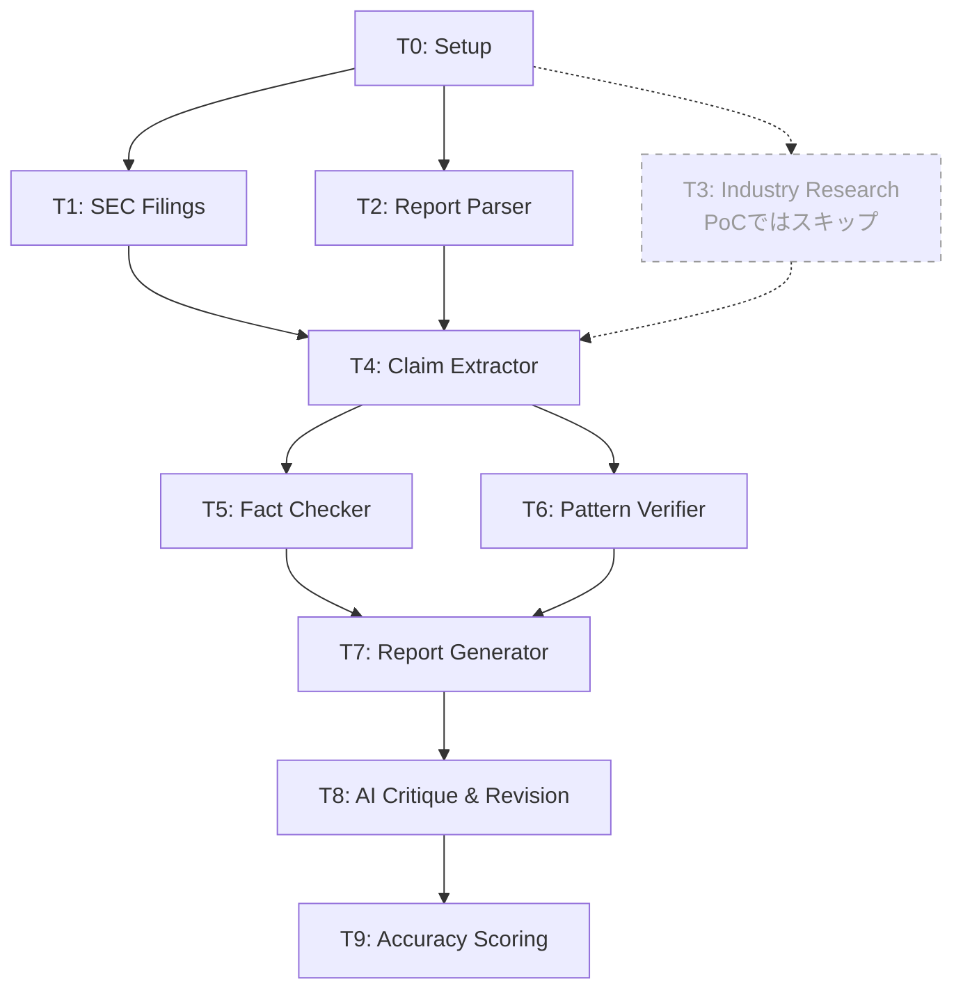

# ca-eval Skill

KYの投資判断軸（dogma.md 12ルール）に基づいて競争優位性を評価するワークフローです。

## 目的

アナリストレポートを入力とし、KYの12ルール + 却下/高評価パターン + few-shot例を全て直接読み込んだ上で、構造化された競争優位性評価レポートを生成します。

**Difyワークフローからの主要改善点:**
- KB chunking/RAG → 全KBファイル（25個, ~62KB）を直接読み込み。検索漏れゼロ
- 静的KB4（10-K手動アップロード） → SEC EDGAR MCPツールでライブ取得。常に最新
- 直列10ノード → Agent Teamsで並列実行（Phase 1: 2並列、Phase 3: 2並列）
- 手動精度比較 → phase2_KYデータとの自動精度検証

## PoC段階の外部データソースポリシー

**PoC段階では、SEC EDGAR 以外の外部データソースを使用しない。**

| データソース | 使用可否 | 説明 |
|-------------|---------|------|
| アナリストレポート（ローカルファイル） | Yes | 入力データ。Yの判断軸に基づく競争優位性の抽出元 |
| KB1-KB3 + dogma.md（ローカルファイル） | Yes | Yの判断ルール・パターン・few-shot例 |
| SEC EDGAR（MCP） | Yes | ファクトチェック用の財務データ・開示情報 |
| WebSearch / WebFetch | **No** | PoC段階では使用しない。業界データ等のWeb検索は将来フェーズで追加予定 |
| yfinance / FRED | **No** | PoC段階では使用しない |

**PoC段階のデータフロー:**
```
アナリストレポート → [T2] 構造化解析 → [T4] Yの判断軸で主張抽出
                                           ↑
SEC EDGAR ──────── → [T1] 財務データ取得 ──┘
                                           ↓
                                    [T5] ファクトチェック（SEC vs 主張）
                                    [T6] パターン検証（KB2 vs 主張）
                                           ↓
                                    [T7] レポート生成 → [T8] AI批判 → [T9] 精度検証
```

## いつ使用するか

### 明示的な使用

- `/ca-eval TICKER` コマンド
- 「ORLYの競争優位性を評価して」「この銘柄のCA評価をして」などの要求

## パラメータ

| パラメータ | 必須 | デフォルト | 説明 |
|-----------|------|-----------|------|
| ticker | Yes | - | 評価対象のティッカーシンボル |
| report_path | No | analyst/raw/ 配下を自動検索 | アナリストレポートのパス |
| skip_industry | No | true | 業界データ収集をスキップ（PoC段階ではデフォルトtrue。SEC EDGAR以外の外部データ不使用ポリシーに準拠） |

## 処理フロー

```
/ca-eval ORLY
    |
    Phase 0: Setup (Lead直接実行)
    |-- [T0] research-meta.json作成 + ディレクトリ作成
    |       [HF0] パラメータ確認
    |
    Phase 1: データ収集 (2並列)
    |-- [T1] sec-collector (finance-sec-filings)
    |-- [T2] report-parser (ca-report-parser)
    |-- [T3] industry (industry-researcher) ※PoCではスキップ
    |
    Phase 2: 主張抽出 + ルール適用 (直列)
    |-- [T4] extractor (ca-claim-extractor)
    |       blockedBy: [T1, T2, T3]
    |
    Phase 3: ファクトチェック + パターン検証 (2並列)
    |-- [T5] fact-checker (ca-fact-checker)
    |-- [T6] pattern-verifier (ca-pattern-verifier)
    |       blockedBy: [T4]
    |       [HF1] 中間品質レポート
    |
    Phase 4: レポート生成 + AI批判 + 精度検証 (直列)
    |-- [T7] reporter (ca-report-generator): ドラフト生成（全12ルール明示）
    |       blockedBy: [T5, T6]
    |       出力: draft-report.md + structured.json
    |-- [T8] Lead: AI批判プロセス (Step 1: 批判生成 → Step 2: 反映・修正)
    |       出力: critique.json + revised-report.md
    |-- [T9] Lead: 精度検証（簡素化版: 1メトリクス、ブロックなし）
    |       出力: accuracy-report.json
    |       [HF2] 最終出力
    |
    Phase 5: Cleanup (TeamDelete)
```

### 依存関係グラフ



## チームメイト構成（7エージェント）

| # | 名前 | エージェント | Phase | 致命的 |
|---|------|------------|-------|--------|
| 1 | sec-collector | finance-sec-filings | 1 | Yes |
| 2 | report-parser | ca-report-parser | 1 | Yes |
| 3 | industry | industry-researcher | 1 | No（PoCではスキップ） |
| 4 | extractor | ca-claim-extractor | 2 | Yes |
| 5 | fact-checker | ca-fact-checker | 3 | No |
| 6 | pattern-verifier | ca-pattern-verifier | 3 | No |
| 7 | reporter | ca-report-generator | 4 | Yes |

T0（Setup）、T8（AI批判プロセス: 批判生成→反映・修正の2段階）、T9（精度検証: 簡素化版、1メトリクス、ブロックなし）は Lead 自身が実行。

## モデル設定

Lead はユーザー選択モデルを継承（`model: inherit`）。チームメイトは Sonnet で固定。

| エージェント | モデル |
|-------------|--------|
| ca-eval-lead（Lead） | inherit（ユーザー選択モデルを継承） |
| finance-sec-filings（T1） | Sonnet |
| ca-report-parser（T2） | Sonnet |
| industry-researcher（T3） | Sonnet |
| ca-claim-extractor（T4） | Sonnet |
| ca-fact-checker（T5） | Sonnet |
| ca-pattern-verifier（T6） | Sonnet |
| ca-report-generator（T7） | Sonnet |

T8, T9 は Lead 直接実行のため、Lead のモデルに従う。実行時のモデル設定は `research-meta.json` の `model_config` に記録される。

## PoC簡素化方針

| 簡素化項目 | 内容 |
|-----------|------|
| 外部データソース制限 | **SEC EDGAR 以外の外部データソースを使用しない**。WebSearch/WebFetch/yfinance/FRED は使用禁止。T3（業界リサーチ）はスキップ |
| 四半期レポート区別の省略 | レポート種別（期初/四半期）の区別を行わない。インプットされたレポートをそのまま処理する |
| T8: AI批判プロセス | 「バグ修正」から「AI批判プロセス」へ転換。ドラフト→批判→反映の2段階 |
| T9: 精度検証の簡素化 | 1メトリクスのみ。不合格でもブロックしない（注釈付きで出力） |
| フィードバック最優先 | 完璧より高速イテレーション。不合格でもブロックしない |

## ナレッジベース参照

| KB | パス | ファイル数 | 用途 |
|----|------|-----------|------|
| KB1 ルール集 | `analyst/Competitive_Advantage/analyst_YK/kb1_rules/*.md` | 8 | ルール適用（T4, T8） |
| KB2 パターン集 | `analyst/Competitive_Advantage/analyst_YK/kb2_patterns/*.md` | 12 | パターン検証（T6, T8） |
| KB3 few-shot集 | `analyst/Competitive_Advantage/analyst_YK/kb3_fewshot/*.md` | 5 | キャリブレーション（T4; T8） |
| Dogma | `analyst/Competitive_Advantage/analyst_YK/dogma.md` | 1 | 全フェーズ |
| Phase 2 検証データ | `analyst/phase2_KY/` | 5 | 精度検証（T9） |

## テンプレートファイル

### レポートフォーマット（Markdown）

| テンプレート | パス | 用途 |
|-------------|------|------|
| draft-report フォーマット | `.claude/skills/ca-eval/templates/draft-report-format.md` | T7（ca-report-generator）がドラフトレポートを生成する際のフォーマット |
| revised-report フォーマット | `.claude/skills/ca-eval/templates/revised-report-format.md` | T8（Lead直接実行）が批判反映版レポートを生成する際のフォーマット |

### 構造化出力スキーマ（JSON）

| スキーマ | 対応出力 | 生成タスク |
|---------|---------|-----------|
| `schemas/research-meta.schema.md` | `00_meta/research-meta.json` | T0 |
| `schemas/sec-data.schema.md` | `01_data_collection/sec-data.json` | T1 |
| `schemas/parsed-report.schema.md` | `01_data_collection/parsed-report.json` | T2 |
| `schemas/claims.schema.md` | `02_claims/claims.json` | T4 |
| `schemas/fact-check.schema.md` | `03_verification/fact-check.json` | T5 |
| `schemas/pattern-verification.schema.md` | `03_verification/pattern-verification.json` | T6 |
| `schemas/structured.schema.md` | `04_output/structured.json` | T7 |
| `schemas/critique.schema.md` | `04_output/critique.json` | T8 |
| `schemas/accuracy-report.schema.md` | `04_output/accuracy-report.json` | T9 |

## 出力ディレクトリ構造

> **注意**: 同日・同一銘柄で複数評価する場合のフォルダ名衝突を防ぐため、時刻（HHMM）は省略禁止。`date '+%Y%m%d-%H%M'` で取得。

```
research/CA_eval_{YYYYMMDD}-{HHMM}_{TICKER}/
├── 00_meta/
│   └── research-meta.json
├── 01_data_collection/
│   ├── sec-data.json              <- T1
│   ├── parsed-report.json         <- T2
│   └── industry-context.json      <- T3
├── 02_claims/
│   └── claims.json                <- T4
├── 03_verification/
│   ├── fact-check.json            <- T5
│   └── pattern-verification.json  <- T6
└── 04_output/
    ├── draft-report.md            <- T7: ドラフト版レポート（全12ルール明示）
    ├── structured.json            <- T7: 構造化JSON（applied_rules / not_applied_rules / confidence_rationale 含む）
    ├── critique.json              <- T8: AI批判内容（claim単位の指摘 + 全体傾向）
    ├── revised-report.md          <- T8: 批判反映版レポート（Yに渡す最終版）
    └── accuracy-report.json       <- T9: 精度検証結果（簡素化版: 1メトリクス）
```

## 精度検証（T9）- 簡素化版

T9 は常時実行。モードは対象銘柄により自動切り替え。不合格でもレポートをブロックしない（注釈付きで出力）。

| モード | 対象 | 内容 |
|--------|------|------|
| **フルモード** | CHD, COST, LLY, MNST, ORLY（Phase 2データあり） | AI評価 vs Y評価の平均乖離のみチェック。合格基準: 平均乖離≤15% |
| **簡易モード** | 上記以外の全銘柄 | contradicted → 10% の適用確認のみ |

## エラーハンドリング

| Phase | タスク | 致命的 | 対処 |
|-------|--------|--------|------|
| 1 | T1 SEC Filings | Yes | リトライ → 失敗時は中断 |
| 1 | T2 Report Parser | Yes | リトライ → 失敗時は中断 |
| 1 | T3 Industry | No | 警告付きで続行（`--skip-industry` でスキップ可） |
| 2 | T4 Claim Extractor | Yes | リトライ → 失敗時は中断 |
| 3 | T5 Fact Checker | No | 警告付きで続行（verification_status=unverifiable） |
| 3 | T6 Pattern Verifier | No | 警告付きで続行（pattern_match=skipped） |
| 4 | T7 Report Generator | Yes | リトライ → 失敗時は中断 |

## 使用例

```bash
# 基本的な使用
/ca-eval ORLY

# レポートパスを指定
/ca-eval CHD --report analyst/raw/CHD_report.md

# 業界データをスキップ（PoC用）
/ca-eval ORLY --skip-industry
```

## 関連ファイル

| ファイル | パス |
|---------|------|
| リーダーエージェント | `.claude/agents/deep-research/ca-eval-lead.md` |
| Dify詳細設計書 | `analyst/memo/dify_workflow_design.md` |
| ワークフロー設計書 | `analyst/claude_code/workflow_design.md` |
| Dify比較表 | `analyst/claude_code/dify_comparison.md` |
| Dogma | `analyst/Competitive_Advantage/analyst_YK/dogma.md` |

## 注意事項

- 本スキルは投資判断の参考情報を提供するものであり、投資助言ではありません
- KYの判断パターンの再現を目指していますが、完全な一致を保証するものではありません
- 精度検証で平均乖離が15%を超える場合は、ルール適用のキャリブレーションを検討してください
