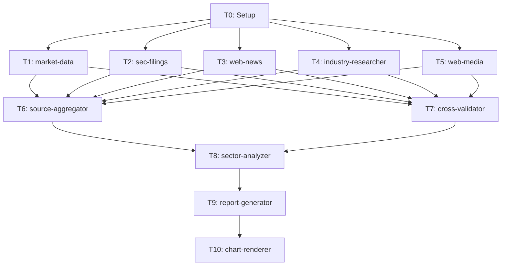

# dr-industry Skill

セクター・業界の包括的なリサーチを実行するスキルです。

## 目的

特定のセクターに対して、以下の5つの分析ピラーで包括的に分析します:

1. **セクター概況分析**: 市場規模、成長率、セクターローテーション動向
2. **競争構造分析**: 市場シェア、参入障壁、バリューチェーン
3. **企業間比較分析**: 財務指標比較、バリュエーション比較、成長性比較
4. **カタリスト・リスク分析**: セクター固有リスク、規制動向、技術変化、マクロ影響
5. **銘柄選定分析**: セクター内トップピック、投資テーマ別推奨

## いつ使用するか

### 明示的な使用（ユーザー要求）

- `/dr-industry` コマンド
- 「半導体業界を分析して」「テクノロジーセクターを深掘りして」などの直接的な要求
- 「このセクターの投資先を比較して」などの要求

### プロアクティブ使用（提案）

以下の状況では、このスキルの使用を提案してください:

1. **セクター全体の投資判断が必要な場合**
   - 「半導体業界はどうなる?」 → セクター分析が必要であることを説明し、/dr-industry を提案

2. **セクター内の銘柄比較が必要な場合**
   - 「半導体株でどれが一番良い?」 → セクター横断分析を提案

3. **セクターローテーションの判断が必要な場合**
   - 「今はどのセクターに投資すべき?」 → 複数セクター分析を提案

## パラメータ

| パラメータ | 必須 | デフォルト | 説明 |
|-----------|------|-----------|------|
| `sector` | Yes | - | 分析対象のセクター（例: Technology, Healthcare, Energy） |
| `subsector` | No | セクター全体 | サブセクター（例: Semiconductors, Pharmaceuticals） |
| `companies` | No | プリセットから自動取得 | 分析対象企業のティッカー一覧（例: NVDA,AMD,INTC,TSM） |
| `sector_etf` | No | セクターから自動判定 | セクター代表 ETF（例: XLK, XLV, XLE） |
| `analysis_period` | No | 5y | 分析期間（1y, 3y, 5y） |
| `output` | No | report | 出力形式（report, article, memo） |

### パラメータ詳細

#### sector（必須）

分析対象のセクター名。`data/config/industry-research-presets.json` に定義されたセクターを指定。

```
/dr-industry Technology
/dr-industry --sector Healthcare
```

##### 利用可能なセクター

| セクター | 説明 | 代表 ETF |
|---------|------|---------|
| Technology | テクノロジー | XLK |
| Healthcare | ヘルスケア | XLV |
| Financials | 金融 | XLF |
| Consumer_Discretionary | 一般消費財 | XLY |
| Energy | エネルギー | XLE |

#### subsector（任意）

セクター内のサブ業界を指定。省略時はセクター全体を分析対象とする。

```
/dr-industry Technology --subsector Semiconductors
/dr-industry Healthcare --subsector Pharmaceuticals
```

##### 利用可能なサブセクター

| セクター | サブセクター |
|---------|-------------|
| Technology | Semiconductors, Software_Infrastructure |
| Healthcare | Pharmaceuticals, Biotechnology, Medical_Devices |
| Financials | Banks, Insurance, Capital_Markets |
| Consumer_Discretionary | Retail, E_Commerce, Restaurants |
| Energy | Oil_Gas, Renewable_Energy, Energy_Services |

#### companies（任意）

カンマ区切りで分析対象企業のティッカーを指定。省略時は `industry-research-presets.json` のピアグループから自動取得。

```
/dr-industry Technology --subsector Semiconductors --companies NVDA,AMD,INTC,TSM,AVGO,QCOM,MRVL
```

#### sector_etf（任意）

セクター代表 ETF を指定。省略時はセクター/サブセクター ETF マッピングテーブルから自動判定。

```
/dr-industry Technology --sector-etf XLK
/dr-industry Technology --subsector Semiconductors --sector-etf SMH
```

##### セクター ETF マッピング

| セクター | ETF | 説明 |
|---------|-----|------|
| Technology | XLK | Technology Select Sector SPDR Fund |
| Healthcare | XLV | Health Care Select Sector SPDR Fund |
| Financials | XLF | Financial Select Sector SPDR Fund |
| Consumer_Discretionary | XLY | Consumer Discretionary Select Sector SPDR Fund |
| Consumer_Staples | XLP | Consumer Staples Select Sector SPDR Fund |
| Energy | XLE | Energy Select Sector SPDR Fund |
| Industrials | XLI | Industrial Select Sector SPDR Fund |
| Materials | XLB | Materials Select Sector SPDR Fund |
| Utilities | XLU | Utilities Select Sector SPDR Fund |
| Real_Estate | XLRE | Real Estate Select Sector SPDR Fund |
| Communication_Services | XLC | Communication Services Select Sector SPDR Fund |

##### サブセクター ETF マッピング（利用可能な場合）

| サブセクター | ETF | 説明 |
|-------------|-----|------|
| Semiconductors | SMH | VanEck Semiconductor ETF |
| Software_Infrastructure | IGV | iShares Expanded Tech-Software Sector ETF |
| Biotechnology | IBB | iShares Biotechnology ETF |
| Oil_Gas | XOP | SPDR S&P Oil & Gas Exploration & Production ETF |
| Banks | KBE | SPDR S&P Bank ETF |
| Retail | XRT | SPDR S&P Retail ETF |
| Renewable_Energy | ICLN | iShares Global Clean Energy ETF |

#### output（任意）

出力形式を指定。デフォルトは `report`。

| 形式 | 説明 | テンプレート |
|------|------|------------|
| report | セクター分析レポート形式（10-20ページ） | `./output-templates/industry-analysis.md` |
| article | note記事形式（2,000-4,000字） | `./output-templates/industry-article.md` |
| memo | 投資メモ形式（1ページ） | `./output-templates/industry-memo.md` |

## 入力バリデーション

### sector バリデーション

```yaml
validation:
  required: true
  type: string
  allowed_values:
    - Technology
    - Healthcare
    - Financials
    - Consumer_Discretionary
    - Consumer_Staples
    - Energy
    - Industrials
    - Materials
    - Utilities
    - Real_Estate
    - Communication_Services
  error_message: |
    無効なセクター名です。以下のいずれかを指定してください:
    Technology, Healthcare, Financials, Consumer_Discretionary, Energy, ...
    利用可能なセクターは data/config/industry-research-presets.json を参照してください。
```

### subsector バリデーション

```yaml
validation:
  required: false
  type: string
  conditional: |
    指定された sector に属する subsector であること。
    industry-research-presets.json の該当セクターの sub_sectors リストに含まれていること。
  error_message: |
    無効なサブセクターです。
    セクター "{sector}" に対して利用可能なサブセクター:
    {available_subsectors}
```

### companies バリデーション

```yaml
validation:
  required: false
  type: list[string]
  format: "カンマ区切りのティッカーシンボル"
  constraints:
    - min_count: 2  # 比較分析には最低2社必要
    - max_count: 15 # 分析品質のため15社以内
    - pattern: "^[A-Z]{1,5}$"  # ティッカー形式
  fallback: |
    未指定の場合は industry-research-presets.json から該当セクターのピアグループを取得。
    subsector が指定されている場合はそのサブセクターのピアグループのみ使用。
    プリセットも見つからない場合はエラー（業界分析ではプリセットが必須）。
```

## 設計方針

| 項目 | 方針 |
|------|------|
| 深度モード | **なし**（常にフルパイプライン実行） |
| 信頼度スコアリング | cross-validator に統合（専用エージェント不要） |
| 可視化 | Python チャートテンプレートの Bash 実行（エージェント不要） |
| 業界分析 | industry-researcher を致命的依存として扱う（業界分析の中核） |
| SEC Filings | 非致命的（業界分析では個別企業 Filings は補助的） |

## 処理フロー

```
Phase 0: Setup
  T0: research-meta.json 生成 + ディレクトリ作成
  [HF0] パラメータ確認

Phase 1: Data Collection（5並列）
  T1: finance-market-data     セクター ETF + 企業群の株価・財務指標
  T2: finance-sec-filings     企業群の 10-K/10-Q・財務データ（非致命的）
  T3: finance-web（ニュース）  セクターニュース・アナリストレポート
  T4: industry-researcher      業界構造・競争環境・バリューチェーン（致命的）
  T5: finance-web（業界メディア）業界専門メディアの最新記事

Phase 2: Integration + Validation（2並列）
  T6: dr-source-aggregator    5ファイル → raw-data.json 統合
  T7: dr-cross-validator      データ照合 + 信頼度付与
  [HF1] データ品質レポート

Phase 3: Analysis
  T8: dr-sector-analyzer       セクター比較分析（5ピラー）

Phase 4: Output（2並列）
  T9: dr-report-generator     レポート生成 + チャートスクリプト出力
  T10: chart-renderer           チャート出力（Bash で Python 実行）
  [HF2] 最終出力提示

Phase 5: Cleanup
  TeamDelete + 完了通知
```

### 依存関係グラフ



## dr-stock スキルとの主要な差異

| 項目 | dr-stock | dr-industry |
|------|---------|-------------|
| 入力 | ticker（個別銘柄） | sector + subsector（セクター） |
| タスク数 | 10 | 11 |
| Phase 1 並列数 | 4 | 5（業界メディア追加） |
| チームメイト数 | 8 | 9 |
| T2 sec-filings | 致命的 | 非致命的 |
| T4 industry-researcher | 非致命的 | 致命的 |
| T5 | dr-source-aggregator | finance-web（業界メディア） |
| Phase 3 分析 | dr-stock-analyzer（4ピラー） | dr-sector-analyzer（5ピラー） |
| research-meta.json type | "stock" | "industry" |
| 追加メタフィールド | - | sector, subsector, companies[], sector_etf |
| リサーチID | DR_stock_{date}_{TICKER} | DR_industry_{date}_{SECTOR} |
| 出力テンプレート | stock-report/article/memo | industry-analysis/article/memo |

## チームメイト構成（9エージェント）

| # | 名前 | エージェント | Phase | 致命的 |
|---|------|------------|-------|--------|
| 1 | market-data | finance-market-data | 1 | Yes |
| 2 | sec-filings | finance-sec-filings | 1 | No |
| 3 | web-news | finance-web | 1 | No |
| 4 | industry | industry-researcher | 1 | Yes |
| 5 | web-media | finance-web | 1 | No |
| 6 | aggregator | dr-source-aggregator | 2 | Yes |
| 7 | validator | dr-cross-validator | 2 | No |
| 8 | analyzer | dr-sector-analyzer | 3 | Yes |
| 9 | reporter | dr-report-generator | 4 | Yes |

T0（Setup）と T10（chart-renderer）は Lead 自身が実行。

## 委譲

本スキルは `dr-industry-lead` エージェントにワークフロー全体を委譲します。

```yaml
Task:
  subagent_type: "dr-industry-lead"
  prompt: |
    /dr-industry ワークフローを実行してください。

    ## パラメータ
    - sector: {sector}
    - subsector: {subsector}
    - companies: {companies}
    - sector_etf: {sector_etf}
    - analysis_period: {analysis_period}
    - output: {output}

    ## プリセット設定
    data/config/industry-research-presets.json

    ## 出力テンプレート
    .claude/skills/dr-industry/output-templates/
```

## データ収集詳細

### T1: finance-market-data

| データ | ソース | 内容 |
|--------|--------|------|
| セクター ETF 株価 | `src/market/yfinance/` | セクター ETF の OHLCV（分析期間分） |
| 企業群株価 | `src/market/yfinance/` | 全企業の OHLCV |
| 財務指標 | yfinance.Ticker.info | P/E, P/B, EV/EBITDA, ROE, ROA 等 |
| 相対パフォーマンス | 計算 | セクター ETF vs SPY、企業間相対パフォーマンス |
| 配当履歴 | yfinance.Ticker.dividends | 分析期間分 |

### T2: finance-sec-filings（非致命的）

| データ | MCP ツール | 内容 |
|--------|-----------|------|
| 財務データ | `mcp__sec-edgar-mcp__get_financials` | 代表的2-3社の直近2年分 |
| 10-K/10-Q | `mcp__sec-edgar-mcp__get_recent_filings` | 直近2年分 |
| キーメトリクス | `mcp__sec-edgar-mcp__get_key_metrics` | 主要指標 |
| 10-K セクション | `mcp__sec-edgar-mcp__get_filing_sections` | Risk Factors, Competition, Industry Overview |
| セクター共通リスク | 抽出 | 複数企業の Risk Factors から共通リスクを抽出 |

### T3: finance-web（ニュース）

| データ | ツール | 検索クエリ例 |
|--------|--------|-------------|
| セクター最新ニュース | WebSearch | `"{sector}" sector outlook 2026` |
| アナリスト見通し | WebSearch | `"{sector}" analyst report sector rotation` |
| 規制動向 | WebSearch | `"{sector}" regulation policy impact` |
| マクロ影響 | WebSearch | `"{sector}" macro economic sensitivity` |
| 競合構造変化 | WebSearch | `"{subsector}" competitive landscape changes` |

最大20件の記事を WebFetch で本文取得。

### T4: industry-researcher（致命的）

業界構造・競争環境・バリューチェーンの調査。**業界分析ワークフローの中核タスク。**

**データソース優先度**:

| 優先度 | ソース | 取得方法 | 内容 |
|--------|--------|---------|------|
| 1 | プリセット蓄積データ | `data/raw/industry_reports/` | 7日以内のデータを再利用 |
| 2 | スクレイピングスクリプト | `uv run python -m market.industry.collect` | McKinsey, BCG, Deloitte 等 |
| 3 | WebSearch | WebSearch + WebFetch | 最新の業界動向 |
| 4 | 10-K セクション | SEC EDGAR (T2 と共有) | Competition, Risk Factors |

**プリセット設定**: `data/config/industry-research-presets.json`

### T5: finance-web（業界メディア）

| データ | ソース | 内容 |
|--------|--------|------|
| 業界専門メディア | `industry-research-presets.json` の industry_media | セクター固有の専門メディア記事 |
| 技術トレンド | WebSearch | focus_areas に基づく検索 |
| 業界動向 | WebFetch | 最大15件の記事本文取得 |

## 分析ピラー（T8: dr-sector-analyzer）

### 1. セクター概況分析

- 市場規模とTAM（Total Addressable Market）推計
- セクター成長率（CAGR）とドライバー分析
- セクターローテーション動向（ETF フロー分析）
- マクロ経済感応度（金利、GDP、インフレとの相関）

### 2. 競争構造分析

- 業界集中度（HHI推計、CR3/CR5）
- バリューチェーン分析（上流・中流・下流のポジショニング）
- 参入障壁の高さと要因
- 代替脅威の評価
- Porter's Five Forces サマリー

### 3. 企業間比較分析

- 財務指標比較（売上成長、利益率、ROE、FCFマージン）
- バリュエーション比較（P/E、EV/EBITDA、P/B）
- 成長性比較（売上 CAGR、EPS 成長率）
- competitive_factors（プリセット定義の競争要因）による評価
- dogma.md 12判断ルールに基づく競争優位性スコアリング

### 4. カタリスト・リスク分析

- セクター固有リスク（規制変更、技術変化、地政学リスク）
- 10-K Risk Factors に基づくセクター共通リスク評価
- マクロ経済シナリオの影響評価
- テーマ別投資機会（AI、ESG、地政学等）

### 5. 銘柄選定分析

- セクター内トップピック（バリュー、グロース、クオリティ別）
- 投資テーマ別推奨（テーマ適合度スコアリング）
- リスクリワード比ランキング
- ポートフォリオ内でのセクター配分推奨

## 出力ディレクトリ構造

```
research/DR_industry_{YYYYMMDD}_{SECTOR}/
├── 00_meta/
│   └── research-meta.json
├── 01_data_collection/
│   ├── market-data.json        <- T1
│   ├── sec-filings.json        <- T2
│   ├── web-data.json           <- T3
│   ├── industry-data.json      <- T4
│   ├── web-media.json          <- T5
│   └── raw-data.json           <- T6（統合版）
├── 02_validation/
│   └── cross-validation.json   <- T7
├── 03_analysis/
│   └── sector-analysis.json    <- T8
└── 04_output/
    ├── report.md               <- T9
    ├── render_charts.py        <- T9（生成スクリプト）
    └── charts/                 <- T10（生成画像）
        ├── sector_vs_spy.png
        ├── valuation_heatmap.png
        ├── financial_radar.png
        ├── market_share.png
        └── sector_rotation.png
```

## research-meta.json スキーマ

```json
{
  "research_id": "DR_industry_20260215_Technology",
  "type": "industry",
  "sector": "Technology",
  "subsector": "Semiconductors",
  "companies": ["NVDA", "AMD", "INTC", "TSM", "AVGO", "QCOM", "MRVL"],
  "sector_etf": "SMH",
  "created_at": "2026-02-15T10:00:00Z",
  "parameters": {
    "sector": "Technology",
    "subsector": "Semiconductors",
    "companies": ["NVDA", "AMD", "INTC", "TSM", "AVGO", "QCOM", "MRVL"],
    "sector_etf": "SMH",
    "analysis_period": "5y",
    "output_format": "report"
  },
  "status": "in_progress",
  "workflow": {
    "phase_0": "done",
    "phase_1": "pending",
    "phase_2": "pending",
    "phase_3": "pending",
    "phase_4": "pending",
    "phase_5": "pending"
  }
}
```

## 品質管理

### クロス検証（T7: dr-cross-validator）

- 企業間財務データの照合（SEC vs Yahoo Finance）
- 業界データのクロスリファレンス（industry vs web-media）
- 市場シェアデータの複数ソース照合
- 矛盾の検出と解決
- データポイントごとの信頼度付与

### ソース Tier（業界分析用）

業界分析では、dr-stock と異なり industry-data を Tier 1 として扱う。

| Tier | ソース | 例 |
|------|--------|-----|
| Tier 1 | 業界分析データ | industry-data.json（プリセット収集・dogma.md 評価） |
| Tier 2 | 市場データ・SEC | market-data.json, sec-filings.json |
| Tier 3 | Web検索・ニュース | web-data.json, web-media.json |

### 信頼度スコアリングルール

```
high:   Tier 1 ソースで確認 + 他ソースと矛盾なし
medium: Tier 2 ソースで確認 or Tier 1 だが他ソースと軽微な差異
low:    Tier 3 のみ or ソース間で矛盾あり
```

## ヒューマンフィードバックポイント

| ID | Phase | タイミング | 内容 |
|----|-------|-----------|------|
| HF0 | 0 | Setup 後 | パラメータ確認（セクター、企業群、セクター ETF、分析期間） |
| HF1 | 2 | Validation 後 | データ品質レポート（収集成功/失敗、矛盾、低信頼度データ） |
| HF2 | 4 | Output 後 | 最終出力提示（レポート概要、チャート一覧、主要結論） |

## エラーハンドリング

### Phase 1 の部分失敗

| 失敗タスク | 影響 | 対処 |
|-----------|------|------|
| T1 market-data | 致命的 | リトライ → 失敗時は中断 |
| T2 sec-filings | 非致命的 | 警告付きで続行（企業分析は縮小版） |
| T3 web-news | 非致命的 | 警告付きで続行 |
| T4 industry | 致命的 | リトライ → 失敗時は中断 |
| T5 web-media | 非致命的 | 警告付きで続行 |

### Phase 2 の部分失敗

| 失敗タスク | 影響 | 対処 |
|-----------|------|------|
| T6 aggregator | 致命的 | リトライ → 失敗時は中断 |
| T7 validator | 非致命的 | 警告付きで続行（信頼度=unknown） |

### Phase 4 の部分失敗

| 失敗タスク | 影響 | 対処 |
|-----------|------|------|
| T9 reporter | 致命的 | リトライ → 失敗時は中断 |
| T10 chart-renderer | 非致命的 | 警告付きで続行（レポートのみ出力） |

## 生成チャート

| チャート | 使用クラス/関数 | ファイル名 |
|---------|---------------|-----------|
| セクター ETF vs S&P 500 | `LineChart` | `charts/sector_vs_spy.png` |
| 企業間バリュエーション比較 | `HeatmapChart` | `charts/valuation_heatmap.png` |
| 財務指標レーダーチャート | `RadarChart` | `charts/financial_radar.png` |
| 市場シェア円グラフ | `PieChart` | `charts/market_share.png` |
| セクターローテーション分析 | `plot_cumulative_returns()` | `charts/sector_rotation.png` |

## 使用例

### 基本的な使用（セクター全体）

```bash
/dr-industry Technology
```

### サブセクターを指定

```bash
/dr-industry Technology --subsector Semiconductors
```

### 企業群を指定

```bash
/dr-industry Healthcare --subsector Pharmaceuticals --companies JNJ,PFE,MRK,ABBV,LLY,BMY,AZN
```

### セクター ETF を指定

```bash
/dr-industry Technology --subsector Semiconductors --sector-etf SMH
```

### note記事形式で出力

```bash
/dr-industry Energy --output article
```

### 投資メモ形式で出力

```bash
/dr-industry Financials --subsector Banks --output memo
```

### 分析期間を指定

```bash
/dr-industry Technology --analysis-period 3y
```

## 既存システム連携

### 記事化連携

```
/dr-industry Technology → research/DR_industry_{date}_Technology/04_output/
                              |
/finance-edit --from-research DR_industry_{date}_Technology
                              |
articles/{article_id}/
```

### dr-stock との連携

```
/dr-industry Technology --subsector Semiconductors
  → セクター全体のトップピック: NVDA
  → /dr-stock NVDA（個別銘柄の深掘り分析へ）
```

## リソース

### ./output-templates/

出力形式別のテンプレート:
- industry-analysis.md - セクター分析レポート形式
- industry-article.md - note記事形式
- industry-memo.md - 投資メモ形式

### 設計書

- `docs/plan/2026-02-15_dr-industry-lead-design.md`

### 関連プリセット

- `data/config/industry-research-presets.json`

### 競争優位性フレームワーク

- `analyst/Competitive_Advantage/analyst_YK/dogma.md`

### リーダーエージェント

- `.claude/agents/deep-research/dr-industry-lead.md`

## 注意事項

- 本スキルは情報提供を目的としており、投資助言ではありません
- 生成されたレポートは投資判断の参考情報としてご利用ください
- データの正確性は可能な限り検証していますが、保証はできません
- 最終的な投資判断は自己責任で行ってください
- 深度モードはありません。常にフルパイプラインを実行します
- 業界分析では industry-researcher（T4）が致命的依存です。プリセット設定が必須です

## トラブルシューティング

### プリセットが見つからない

- `data/config/industry-research-presets.json` に対象セクターが登録されているか確認
- セクター名の表記揺れに注意（例: "Technology" vs "Tech"）
- 未登録セクターの場合は手動で companies を指定

### データ収集が失敗する

- ネットワーク接続を確認
- yfinance のレート制限に注意（`src/market/yfinance/` のポライトディレイ設定）
- SEC EDGAR API のレート制限に注意
- 代替ソースを試行

### 信頼度スコアが低い

- industry-researcher（T4）が成功しているか確認
- 追加のデータソースを収集
- 手動での検証を検討

### チャート生成エラー

- `src/analyze/visualization/` のパッケージが正しくインストールされているか確認
- レポートのみの出力に切り替え（チャート生成は非致命的エラーとして処理）
