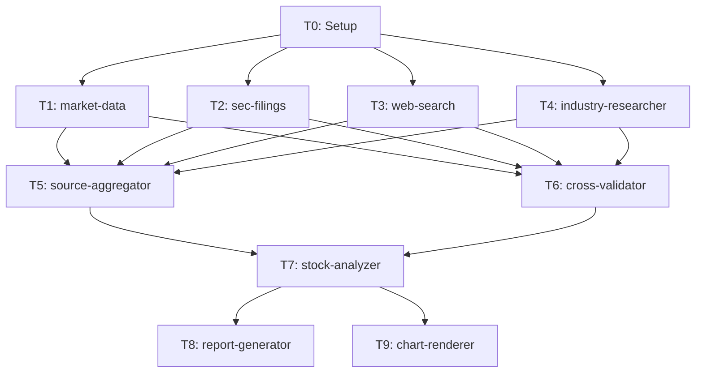

# dr-stock Skill

個別銘柄の包括的なリサーチを実行するスキルです。

## 目的

特定の銘柄に対して、以下の4つの分析ピラーで包括的に分析します:

1. **財務健全性分析**: 5年トレンド、収益性、キャッシュフロー
2. **バリュエーション分析**: DCF、相対評価、ヒストリカルレンジ
3. **ビジネス品質分析**: 競争優位性、経営陣、資本配分
4. **カタリスト・リスク分析**: イベントカレンダー、リスクマトリックス、シナリオ分析

## いつ使用するか

### 明示的な使用（ユーザー要求）

- `/dr-stock` コマンド
- 「AAPL を詳しく分析して」「この銘柄を深掘りして」などの直接的な要求
- 「投資判断のためにリサーチして」などの要求

### プロアクティブ使用（提案）

以下の状況では、このスキルの使用を提案してください:

1. **個別銘柄の投資判断が必要な場合**
   - 「この銘柄買うべき?」 → 分析が必要であることを説明し、/dr-stock を提案

2. **銘柄の比較分析が必要な場合**
   - 「AAPL と MSFT どちらが良い?」 → 両銘柄の分析を提案

## パラメータ

| パラメータ | 必須 | デフォルト | 説明 |
|-----------|------|-----------|------|
| `ticker` | Yes | - | 分析対象のティッカーシンボル（例: AAPL, MSFT） |
| `peer_tickers` | No | プリセットから自動取得 | ピアグループのティッカー一覧（例: MSFT,GOOGL,AMZN,META） |
| `industry_preset` | No | ticker から自動判定 | 業界プリセットキー（例: Technology/Software_Infrastructure） |
| `analysis_period` | No | 5y | 分析期間（1y, 3y, 5y） |
| `output` | No | report | 出力形式（report, article, memo） |

### パラメータ詳細

#### ticker（必須）

米国上場銘柄のティッカーシンボル。

```
/dr-stock AAPL
/dr-stock --ticker NVDA
```

#### peer_tickers（任意）

カンマ区切りでピアグループのティッカーを指定。省略時は `industry_preset` またはプリセット設定ファイルから自動取得。

```
/dr-stock AAPL --peer-tickers MSFT,GOOGL,AMZN,META
```

#### industry_preset（任意）

`data/config/industry-research-presets.json` のプリセットキー。`{Sector}/{SubIndustry}` 形式で指定。省略時は ticker の情報から自動判定。

```
/dr-stock AAPL --industry-preset Technology/Software_Infrastructure
/dr-stock NVDA --industry-preset Technology/Semiconductors
```

利用可能なプリセット:

| セクター | サブ業界 |
|---------|---------|
| Technology | Semiconductors, Software_Infrastructure |
| Healthcare | Pharmaceuticals |
| Financials | Banks |
| Consumer_Discretionary | Retail |
| Energy | Oil_Gas |

#### output（任意）

出力形式を指定。デフォルトは `report`。

| 形式 | 説明 | テンプレート |
|------|------|------------|
| report | 分析レポート形式（5-15ページ） | `./output-templates/stock-report.md` |
| article | note記事形式（2,000-4,000字） | `./output-templates/stock-article.md` |
| memo | 投資メモ形式（1ページ） | `./output-templates/stock-memo.md` |

## 設計方針

| 項目 | 方針 |
|------|------|
| 深度モード | **なし**（常にフルパイプライン実行） |
| 信頼度スコアリング | cross-validator に統合（専用エージェント不要） |
| 可視化 | Python チャートテンプレートの Bash 実行（エージェント不要） |
| 業界分析 | Python スクレイピングスクリプト + プリセット設定で収集 |

## 処理フロー

```
Phase 0: Setup
  T0: research-meta.json 生成 + ディレクトリ作成
  [HF0] パラメータ確認

Phase 1: Data Collection（4並列）
  T1: finance-market-data     株価・財務指標・ピアグループデータ
  T2: finance-sec-filings     10-K/10-Q/8-K/Form4
  T3: finance-web              ニュース・アナリストレポート
  T4: industry-researcher      業界ポジション・競争優位性

Phase 2: Integration + Validation（2並列）
  T5: dr-source-aggregator    raw-data.json 統合
  T6: dr-cross-validator      データ照合 + 信頼度付与
  [HF1] データ品質レポート

Phase 3: Analysis
  T7: dr-stock-analyzer       包括的銘柄分析（4ピラー）

Phase 4: Output（2並列）
  T8: dr-report-generator     レポート生成 + チャートスクリプト出力
  T9: chart-renderer           チャート出力（Bash で Python 実行）
  [HF2] 最終出力提示

Phase 5: Cleanup
  TeamDelete + 完了通知
```

### 依存関係グラフ



## チームメイト構成（8エージェント）

| # | 名前 | エージェント | Phase | 致命的 |
|---|------|------------|-------|--------|
| 1 | market-data | finance-market-data | 1 | Yes |
| 2 | sec-filings | finance-sec-filings | 1 | Yes |
| 3 | web-search | finance-web | 1 | No |
| 4 | industry | industry-researcher | 1 | No |
| 5 | aggregator | dr-source-aggregator | 2 | Yes |
| 6 | validator | dr-cross-validator | 2 | No |
| 7 | analyzer | dr-stock-analyzer | 3 | Yes |
| 8 | reporter | dr-report-generator | 4 | Yes |

T0（Setup）と T9（chart-renderer）は Lead 自身が実行。

## データ収集詳細

### T1: finance-market-data

| データ | ソース | 内容 |
|--------|--------|------|
| 株価（日足） | `src/market/yfinance/` | 5年分 OHLCV |
| ピア株価 | `src/market/yfinance/` | ピアグループ全銘柄の OHLCV |
| 財務指標 | yfinance.Ticker.info | P/E, P/B, EV/EBITDA, ROE, ROA 等 |
| ピア財務指標 | yfinance.Ticker.info | 同上（ピア全銘柄） |
| 配当履歴 | yfinance.Ticker.dividends | 5年分 |

### T2: finance-sec-filings

| データ | MCP ツール | 内容 |
|--------|-----------|------|
| 財務データ | `mcp__sec-edgar-mcp__get_financials` | 5年分の損益/BS/CF |
| 最近の 10-K/10-Q | `mcp__sec-edgar-mcp__get_recent_filings` | 直近2年分 |
| 8-K イベント | `mcp__sec-edgar-mcp__get_recent_filings` (8-K) | 直近1年 |
| インサイダー取引 | `mcp__sec-edgar-mcp__get_insider_summary` | サマリー |
| キーメトリクス | `mcp__sec-edgar-mcp__get_key_metrics` | 主要指標 |
| 10-K セクション | `mcp__sec-edgar-mcp__get_filing_sections` | Risk Factors, Competition |

### T3: finance-web

| データ | ツール | 検索クエリ例 |
|--------|--------|-------------|
| 最新ニュース | WebSearch | `"{TICKER}" latest news 2026` |
| アナリスト評価 | WebSearch | `"{TICKER}" analyst rating target price` |
| 決算レビュー | WebSearch | `"{TICKER}" earnings review Q{N} 2026` |
| 競合動向 | WebSearch | `"{TICKER}" vs competitors {peer_tickers}` |
| 経営陣動向 | WebSearch | `"{TICKER}" CEO management changes` |

最大20件の記事を WebFetch で本文取得。

### T4: industry-researcher

業界ポジション・競争優位性の分析。

**データソース優先度**:

| 優先度 | ソース | 取得方法 | 内容 |
|--------|--------|---------|------|
| 1 | SEC EDGAR 10-K | T2 と共有 | Competition, Risk Factors セクション |
| 2 | コンサルレポート | Bash: `uv run python -m market.industry.collect` | McKinsey, BCG, Deloitte Insights |
| 3 | 投資銀行レポート | Bash: 同上 | Goldman, Morgan Stanley 公開部分 |
| 4 | 政府統計 API | Bash: 同上 | BLS 業界別データ |
| 5 | 業界専門メディア | WebSearch + WebFetch | セクター固有の専門サイト |

**プリセット設定**: `data/config/industry-research-presets.json`

## 分析ピラー（T7: dr-stock-analyzer）

### 1. 財務健全性分析

- 売上高 CAGR、営業利益率、ROE/ROA/ROIC
- D/E、流動比率、インタレストカバレッジ
- FCF マージン、FCF トレンド
- 5年トレンド + セグメント分析

### 2. バリュエーション分析

- 絶対評価: DCF 簡易試算
- 相対評価: P/E, P/B, EV/EBITDA, PEG vs 業界平均
- ヒストリカルレンジ: 5年 P/E レンジと現在位置

### 3. ビジネス品質分析

- T4 industry-researcher の結果を統合
- dogma.md フレームワークによる競争優位性評価
- 経営陣評価、資本配分分析

### 4. カタリスト・リスク分析

- 製品/財務/規制/戦略のカタリスト
- 10-K Risk Factors に基づくリスク評価
- ブル/ベース/ベアの3シナリオ

## 出力ディレクトリ構造

```
research/DR_stock_{YYYYMMDD}_{TICKER}/
├── 00_meta/
│   └── research-meta.json
├── 01_data_collection/
│   ├── market-data.json        <- T1
│   ├── sec-filings.json        <- T2
│   ├── web-data.json           <- T3
│   ├── industry-data.json      <- T4
│   └── raw-data.json           <- T5（統合版）
├── 02_validation/
│   └── cross-validation.json   <- T6
├── 03_analysis/
│   └── stock-analysis.json     <- T7
└── 04_output/
    ├── report.md               <- T8
    ├── render_charts.py        <- T8（生成スクリプト）
    └── charts/                 <- T9（生成画像）
        ├── price_chart.png
        ├── peer_comparison.png
        ├── financial_trend.png
        ├── valuation_heatmap.png
        └── sector_performance.png
```

## research-meta.json スキーマ

```json
{
  "research_id": "DR_stock_20260211_AAPL",
  "type": "stock",
  "ticker": "AAPL",
  "created_at": "2026-02-11T10:00:00Z",
  "parameters": {
    "ticker": "AAPL",
    "peer_tickers": ["MSFT", "GOOGL", "AMZN", "META"],
    "analysis_period": "5y",
    "industry_preset": "Technology/Software_Infrastructure"
  },
  "status": "in_progress"
}
```

## 品質管理

### クロス検証（T6: dr-cross-validator）

- 複数ソースでデータを照合
- 矛盾の検出と解決
- データポイントごとの信頼度付与

### 信頼度スコアリングルール

```
high:   Tier 1 ソースで確認 + 他ソースと矛盾なし
medium: Tier 2 ソースで確認 or Tier 1 だが他ソースと軽微な差異
low:    Tier 3 のみ or ソース間で矛盾あり
```

### データソース信頼度Tier

| Tier | ソース | 例 |
|------|--------|-----|
| Tier 1 | SEC EDGAR | 10-K, 10-Q, 8-K |
| Tier 2 | 市場データ・業界レポート | yfinance, コンサルレポート |
| Tier 3 | Web検索・ニュース | アナリスト記事、ブログ |

## ヒューマンフィードバックポイント

| ID | Phase | タイミング | 内容 |
|----|-------|-----------|------|
| HF0 | 0 | Setup 後 | パラメータ確認（ticker、ピアグループ、分析期間） |
| HF1 | 2 | Validation 後 | データ品質レポート（収集成功/失敗、矛盾、低信頼度データ） |
| HF2 | 4 | Output 後 | 最終出力提示（レポート概要、チャート一覧、主要結論） |

## エラーハンドリング

### Phase 1 の部分失敗

| 失敗タスク | 影響 | 対処 |
|-----------|------|------|
| T1 market-data | 致命的 | リトライ → 失敗時は中断 |
| T2 sec-filings | 致命的 | リトライ → 失敗時は中断 |
| T3 web-search | 非致命的 | 警告付きで続行 |
| T4 industry | 非致命的 | 警告付きで続行（業界分析は縮小版） |

### Phase 2 の部分失敗

| 失敗タスク | 影響 | 対処 |
|-----------|------|------|
| T5 aggregator | 致命的 | リトライ → 失敗時は中断 |
| T6 validator | 非致命的 | 警告付きで続行（信頼度=unknown） |

### Phase 4 の部分失敗

| 失敗タスク | 影響 | 対処 |
|-----------|------|------|
| T8 reporter | 致命的 | リトライ → 失敗時は中断 |
| T9 chart-renderer | 非致命的 | 警告付きで続行（レポートのみ出力） |

## 生成チャート

| チャート | 使用クラス/関数 | ファイル名 |
|---------|---------------|-----------|
| 株価チャート（ローソク足 + MA） | `CandlestickChart` | `charts/price_chart.png` |
| ピア比較（相対パフォーマンス） | `LineChart` | `charts/peer_comparison.png` |
| 財務指標トレンド | `LineChart` | `charts/financial_trend.png` |
| バリュエーション比較 | `HeatmapChart` | `charts/valuation_heatmap.png` |
| セクターパフォーマンス | `plot_cumulative_returns()` | `charts/sector_performance.png` |

## 使用例

### 基本的な使用

```bash
/dr-stock AAPL
```

### ピアグループを指定

```bash
/dr-stock NVDA --peer-tickers AMD,INTC,AVGO,QCOM --industry-preset Technology/Semiconductors
```

### note記事形式で出力

```bash
/dr-stock MSFT --output article
```

### 投資メモ形式で出力

```bash
/dr-stock GOOGL --output memo
```

## 既存システム連携

### 記事化連携

```
/dr-stock AAPL → research/DR_stock_{date}_AAPL/04_output/
                      |
/finance-edit --from-research DR_stock_{date}_AAPL
                      |
articles/{article_id}/
```

## リソース

### ./output-templates/

出力形式別のテンプレート:
- stock-report.md - 分析レポート形式
- stock-article.md - note記事形式
- stock-memo.md - 投資メモ形式

### 設計書

- `docs/project/research-restructure/dr-stock-lead-design.md`

### 関連プリセット

- `data/config/industry-research-presets.json`

### 競争優位性フレームワーク

- `analyst/Competitive_Advantage/analyst_YK/dogma.md`

## 注意事項

- 本スキルは情報提供を目的としており、投資助言ではありません
- 生成されたレポートは投資判断の参考情報としてご利用ください
- データの正確性は可能な限り検証していますが、保証はできません
- 最終的な投資判断は自己責任で行ってください
- 深度モードはありません。常にフルパイプラインを実行します

## トラブルシューティング

### データ収集が失敗する

- ネットワーク接続を確認
- SEC EDGAR API のレート制限に注意
- 代替ソースを試行

### 信頼度スコアが低い

- 追加のデータソースを収集
- 手動での検証を検討

### チャート生成エラー

- `src/analyze/visualization/` のパッケージが正しくインストールされているか確認
- レポートのみの出力に切り替え（チャート生成は非致命的エラーとして処理）
