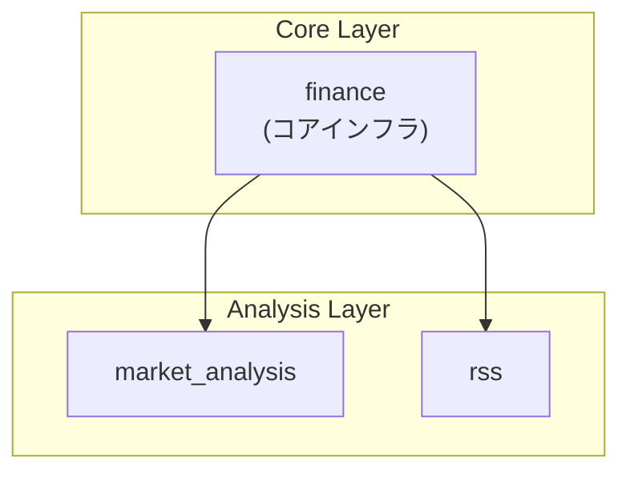
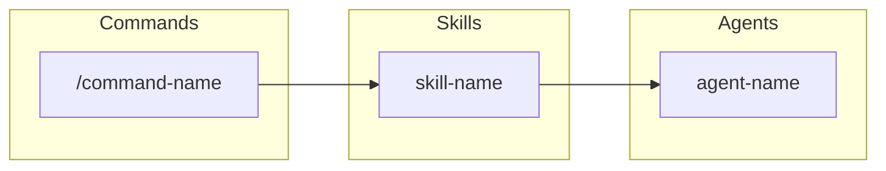

# Index スキル 設計ガイド

このガイドは CLAUDE.md/README.md の自動更新機能について詳細に説明します。

## 目次

1. [CLAUDE.md 更新手順](#claudemd-更新手順)
2. [README.md 更新手順](#readmemd-更新手順)
3. [依存関係図更新手順](#依存関係図更新手順)
4. [マーカーセクション形式](#マーカーセクション形式)
5. [除外パターン一覧](#除外パターン一覧)
6. [自動検出の仕組み](#自動検出の仕組み)
7. [並列実行アーキテクチャ](#並列実行アーキテクチャ)
8. [エラーハンドリング](#エラーハンドリング)
9. [トラブルシューティング](#トラブルシューティング)

---

## CLAUDE.md 更新手順

CLAUDE.md のディレクトリ構成セクションを自動更新する手順です。

### 対象セクション

CLAUDE.md 内の以下のマーカー間が更新対象:

```markdown
<!-- AUTO-GENERATED: DIRECTORY -->

```
finance/                                    # Project root
├── .claude/                                # Claude Code configuration
...
```

<!-- END: DIRECTORY -->
```

### 更新フロー

```
1. ディレクトリスキャンを実行
   │
   ├─ MCP ツール使用（推奨）
   │   ToolSearch: "select:mcp__filesystem__directory_tree"
   │   mcp__filesystem__directory_tree:
   │     path: "."
   │     max_depth: 4
   │
   └─ フォールバック（MCP 利用不可時）
       Bash: "tree -L 4 -I '除外パターン' --dirsfirst"

2. 除外パターンを適用してフィルタリング

3. template.md に従ってフォーマット
   - コメント付加（ファイル数、説明等）
   - 省略表記の適用

4. CLAUDE.md のマーカー間を置換
   Edit:
     file_path: "CLAUDE.md"
     old_string: "<!-- AUTO-GENERATED: DIRECTORY -->...<!-- END: DIRECTORY -->"
     new_string: "更新後の内容"
```

### 実行例

```yaml
# Step 1: ディレクトリ構成を取得
ToolSearch:
  query: "select:mcp__filesystem__directory_tree"

mcp__filesystem__directory_tree:
  path: "."
  max_depth: 4

# Step 2: CLAUDE.md を読み込み
Read:
  file_path: "CLAUDE.md"

# Step 3: マーカー間を更新
Edit:
  file_path: "CLAUDE.md"
  old_string: |
    <!-- AUTO-GENERATED: DIRECTORY -->

    ```
    [古いディレクトリ構成]
    ```

    <!-- END: DIRECTORY -->
  new_string: |
    <!-- AUTO-GENERATED: DIRECTORY -->

    ```
    [新しいディレクトリ構成]
    ```

    <!-- END: DIRECTORY -->
```

---

## README.md 更新手順

README.md のプロジェクト構造セクションを自動更新する手順です。

### 対象セクション

README.md 内の以下のマーカー間が更新対象:

```markdown
<!-- AUTO-GENERATED: DIRECTORY -->

```
finance/                                    # Project root
├── src/
...
```

<!-- END: DIRECTORY -->
```

### 更新フロー

CLAUDE.md と同様のフローですが、README.md 用に簡略化された構成を使用します:

```
1. ディレクトリスキャンを実行（CLAUDE.md と共通）

2. README.md 用にフォーマット
   - 主要ディレクトリのみ表示
   - 詳細は CLAUDE.md 参照を促す

3. README.md のマーカー間を置換
```

### パッケージ README の更新

各パッケージ（src/*/）の README.md も `package-readme-updater` エージェントで更新可能:

```yaml
# 各パッケージの README を並列更新
Task:
  subagent_type: "package-readme-updater"
  description: "Update finance README"
  prompt: |
    src/finance/ の README.md を更新してください。
    パッケージ名: finance
```

**更新内容**:
- ディレクトリ構成
- 実装状況
- 公開 API
- 統計情報
- クイックスタート
- 使用例

---

## 依存関係図更新手順

README.md の依存関係図（Mermaid形式）を自動更新する手順です。

### 対象セクション

README.md 内の以下のマーカー間が更新対象:

```markdown
<!-- AUTO-GENERATED: DEPENDENCY -->

### Pythonパッケージ依存関係
[Mermaid図]

### コマンド → スキル → エージェント 依存関係
[Mermaid図]

<!-- END: DEPENDENCY -->
```

### 更新フロー

```
1. 依存関係を検出
   │
   ├─ コマンド→スキル: .claude/commands/*.md から skill: 参照を抽出
   ├─ スキル→エージェント: .claude/skills/*/SKILL.md から Task 呼び出しを抽出
   └─ Pythonパッケージ: src/*/__init__.py から import 文を解析

2. Mermaid形式に変換
   - Pythonパッケージ: graph TB 形式
   - コマンド→スキル→エージェント: graph LR 形式
   - ワークフロー: 並列・直列を表現

3. README.md のマーカー間を置換
```

### 検出対象

#### 1. Pythonパッケージ依存関係

| ソース | 検出方法 |
|--------|----------|
| `src/*/__init__.py` | `from {package} import` を抽出 |
| `src/*/core/*.py` | 外部パッケージ import を抽出 |

**依存関係の階層**:
```
finance (base)
├── market_analysis
│   ├── factor
│   │   └── strategy
│   └── strategy
├── rss
└── bloomberg
```

#### 2. コマンド→スキル依存関係

| ソース | 検出方法 |
|--------|----------|
| `.claude/commands/*.md` | frontmatter の `skill:` フィールド |
| `.claude/commands/*.md` | 本文中の `Skill(skill: "xxx")` 呼び出し |

#### 3. スキル→エージェント依存関係

| ソース | 検出方法 |
|--------|----------|
| `.claude/skills/*/SKILL.md` | `Task(subagent_type: "xxx")` 呼び出し |
| `.claude/skills/*/*.md` | ガイド内のエージェント参照 |

### Mermaid図の形式

#### Pythonパッケージ依存関係



#### コマンド→スキル→エージェント



### 実行例

```yaml
# Step 1: 依存関係を検出
Task:
  subagent_type: "Explore"
  description: "Detect dependencies"
  prompt: |
    以下の依存関係を検出してください:
    1. コマンド→スキル: .claude/commands/*.md の skill: 参照
    2. スキル→エージェント: .claude/skills/*/SKILL.md の Task 呼び出し
    3. Pythonパッケージ: src/*/ の import 文

# Step 2: Mermaid図を生成
# 検出結果からMermaid形式のグラフを生成

# Step 3: README.md のマーカー間を更新
Edit:
  file_path: "README.md"
  old_string: "<!-- AUTO-GENERATED: DEPENDENCY -->...<!-- END: DEPENDENCY -->"
  new_string: "新しいMermaid図"
```

---

## マーカーセクション形式

自動更新されるセクションを識別するためのマーカー構文です。

### 基本形式

```markdown
<!-- AUTO-GENERATED: SECTION_NAME -->

自動生成される内容

<!-- END: SECTION_NAME -->
```

### マーカー名一覧

| マーカー名 | 使用ファイル | 内容 |
|-----------|-------------|------|
| `COMMANDS` | index.md | コマンド一覧テーブル |
| `SKILLS` | index.md | スキル一覧テーブル |
| `AGENTS` | index.md | エージェント一覧 |
| `DIRECTORY` | index.md, CLAUDE.md, README.md | ディレクトリ構成 |
| `DEPENDENCY` | README.md | 依存関係図（Mermaid） |

### マーカー配置ルール

1. **開始・終了マーカーはペアで必須**
   - 片方だけでは動作しない
   - 名前は完全一致が必要

2. **マーカー間の内容は完全に置換される**
   - 手動編集は次回更新時に上書き
   - 永続化したい内容はマーカー外に配置

3. **マーカーの入れ子は非対応**
   - 同じ名前のマーカーを入れ子にしない
   - 異なる名前でも入れ子は避ける

### マーカー更新のロジック

```python
# 疑似コード
def update_marker_section(content: str, marker_name: str, new_content: str) -> str:
    start_marker = f"<!-- AUTO-GENERATED: {marker_name} -->"
    end_marker = f"<!-- END: {marker_name} -->"

    start_idx = content.find(start_marker)
    end_idx = content.find(end_marker)

    if start_idx == -1 or end_idx == -1:
        raise MarkerNotFoundError(f"Marker pair not found: {marker_name}")

    before = content[:start_idx + len(start_marker)]
    after = content[end_idx:]

    return f"{before}\n\n{new_content}\n\n{after}"
```

---

## 除外パターン一覧

ディレクトリスキャン時に除外されるパターンの完全なリストです。

### 必須除外パターン

| パターン | 説明 |
|---------|------|
| `__pycache__` | Python バイトコードキャッシュ |
| `.git` | Git リポジトリメタデータ |
| `.venv` | Python 仮想環境 |
| `.pytest_cache` | pytest キャッシュ |
| `.ruff_cache` | Ruff リンターキャッシュ |
| `node_modules` | Node.js 依存関係 |
| `*.egg-info` | Python パッケージメタデータ |

### 追加除外パターン（任意）

| パターン | 説明 |
|---------|------|
| `.mypy_cache` | mypy キャッシュ |
| `.pyright` | Pyright キャッシュ |
| `*.pyc` | コンパイル済み Python ファイル |
| `.DS_Store` | macOS メタデータ |
| `*.egg` | Python egg パッケージ |
| `dist` | ビルド出力 |
| `build` | ビルド出力 |
| `.tox` | tox テスト環境 |
| `.nox` | nox テスト環境 |
| `htmlcov` | カバレッジ HTML レポート |
| `.coverage` | カバレッジデータ |

### tree コマンドでの除外指定

```bash
# 基本除外パターン
tree -L 4 -I '__pycache__|.git|.venv|.pytest_cache|.ruff_cache|node_modules|*.egg-info' --dirsfirst

# 拡張除外パターン
tree -L 4 -I '__pycache__|.git|.venv|.pytest_cache|.ruff_cache|.mypy_cache|.pyright|node_modules|*.egg-info|*.pyc|.DS_Store|dist|build|htmlcov|.coverage' --dirsfirst
```

### MCP ツールでの除外

MCP の `directory_tree` ツールは自動的に一般的なパターンを除外しますが、追加除外が必要な場合は結果をフィルタリングします。

---

## 自動検出の仕組み

### コマンド検出

**対象**: `.claude/commands/*.md`（`index.md` を除く）

**抽出項目**: frontmatter の `description` フィールド

```yaml
# コマンドファイルの構造
---
description: コマンドの説明文
---

# コマンド本文
...
```

**検出手順**:
1. Glob で `.claude/commands/*.md` を列挙
2. 各ファイルを Read で読み込み
3. frontmatter をパースして description を抽出
4. ファイル名からコマンド名を生成（`commit-and-pr.md` → `/commit-and-pr`）

### スキル検出

**対象**: `.claude/skills/*/SKILL.md`

**抽出項目**: frontmatter の `name`, `description` フィールド

```yaml
# スキルファイルの構造
---
name: skill-name
description: |
  スキルの説明文。
  複数行可能。
allowed-tools: Read, Write
---

# スキル本文
...
```

**検出手順**:
1. Glob で `.claude/skills/*/SKILL.md` を列挙
2. 各ファイルを Read で読み込み
3. frontmatter をパースして name, description を抽出
4. description は改行を除去して単一行に

### エージェント読み込み

**対象**: `.claude/agents.md`

**抽出項目**: カテゴリ別エージェント定義

```markdown
# エージェント定義の構造
### 汎用エージェント

| エージェント | 説明 |
|-------------|------|
| Bash | コマンド実行 |
```

**検出手順**:
1. `.claude/agents.md` を Read で読み込み
2. テーブル構造をパース
3. カテゴリ別にエージェント情報を抽出

### ディレクトリスキャン

**対象**: プロジェクトルート

**深さ**: 4 層まで

**除外パターン**:
- `__pycache__`
- `.git`
- `.venv`
- `.pytest_cache`
- `.ruff_cache`
- `node_modules`
- `*.egg-info`

**スキャン方法**:

```yaml
# 方法1: MCP ツール使用（推奨）
ToolSearch: "select:mcp__filesystem__directory_tree"
mcp__filesystem__directory_tree:
  path: "."
  max_depth: 4

# 方法2: フォールバック（MCP 利用不可時）
Bash: "tree -L 4 -I '__pycache__|.git|.venv|.pytest_cache|.ruff_cache|node_modules|*.egg-info' --dirsfirst"
```

## 並列実行アーキテクチャ

### Phase 1: 検出フェーズ（4 並列）

```
/index --update
    │
    ├─> Task(Explore): コマンド検出 ─────────────┐
    ├─> Task(Explore): スキル検出 ────────────────┤ 並列実行
    ├─> Task(Explore): エージェント読み込み ──────┤
    └─> Task(Explore): ディレクトリスキャン ──────┘
                        │
                        v
              結果統合（YAML形式）
```

### Phase 2: README 更新フェーズ（5 並列）

```
              結果統合後
                  │
    ├─> Task(package-readme-updater): finance ────────┐
    ├─> Task(package-readme-updater): market_analysis ┤ 並列実行
    ├─> Task(package-readme-updater): rss ────────────┤
    ├─> Task(package-readme-updater): factor ─────────┤
    └─> Task(package-readme-updater): strategy ───────┘
                        │
                        v
              README 更新確認
```

### Phase 3: 統合・更新フェーズ

```
        検出結果 + README 更新結果
                  │
    ┌─────────────┼──────────────────┬──────────────────┐
    v             v                  v                  v
index.md     CLAUDE.md          README.md       src/*/README.md
 更新           更新               更新              確認
```

## サブエージェント詳細

### コマンド検出エージェント

```yaml
subagent_type: "Explore"
description: "Detect commands"
prompt: |
  .claude/commands/*.md から frontmatter の description を抽出してください。
  index.md は除外してください。

  出力形式:
  ```yaml
  commands:
    - name: "analyze"
      description: "多次元コード分析"
    - name: "commit-and-pr"
      description: "変更のコミットとPR作成"
  ```
```

### スキル検出エージェント

```yaml
subagent_type: "Explore"
description: "Detect skills"
prompt: |
  .claude/skills/*/SKILL.md から frontmatter の name, description を抽出してください。

  出力形式:
  ```yaml
  skills:
    - name: "architecture-design"
      description: "アーキテクチャ設計書を作成するための詳細ガイドとテンプレート"
    - name: "skill-expert"
      description: "Create and optimize Claude Code skills"
  ```
```

### エージェント読み込みエージェント

```yaml
subagent_type: "Explore"
description: "Load agents"
prompt: |
  .claude/agents.md からカテゴリ別エージェント定義を抽出してください。

  出力形式:
  ```yaml
  agents:
    - category: "汎用エージェント"
      items:
        - name: "Bash"
          description: "コマンド実行"
        - name: "Explore"
          description: "コードベース探索"
  ```
```

### ディレクトリスキャンエージェント

```yaml
subagent_type: "Explore"
description: "Scan directory"
prompt: |
  プロジェクトルートから 4 層までのディレクトリ構成を取得してください。

  除外パターン:
  - __pycache__
  - .git
  - .venv
  - .pytest_cache
  - .ruff_cache
  - node_modules
  - *.egg-info

  出力形式: ASCII ツリー形式
```

### package-readme-updater エージェント

```yaml
subagent_type: "package-readme-updater"
description: "Update {package_name} README"
prompt: |
  src/{package_name}/ の README.md を更新してください。

  パッケージ名: {package_name}
  モード: {mode}  # minimal | standard | detailed
```

## 結果統合スキーマ

```yaml
metadata:
  generated_at: "2026-01-22T10:00:00Z"
  execution_status:
    commands: "success"
    skills: "success"
    agents: "success"
    directory: "success"
    package_readme_finance: "success"
    package_readme_market_analysis: "success"
    package_readme_rss: "success"
    package_readme_factor: "success"
    package_readme_strategy: "success"
  errors: []

commands:
  - name: "analyze"
    description: "多次元コード分析"
  - name: "commit-and-pr"
    description: "変更のコミットとPR作成"

skills:
  - name: "architecture-design"
    description: "アーキテクチャ設計書を作成"
  - name: "skill-expert"
    description: "スキル設計・管理"

agents:
  - category: "汎用エージェント"
    items:
      - name: "Bash"
        description: "コマンド実行"

directory_structure:
  tree: |
    finance/
    ├── .claude/
    │   ├── agents/
    │   ├── commands/
    │   └── skills/
    ...

package_readmes:
  finance: "updated"
  market_analysis: "updated"
  rss: "updated"
  factor: "skipped"  # 変更なし
  strategy: "skipped"
```

## エラーハンドリング

### サブエージェントタイムアウト

**タイムアウト**: 各エージェント 60 秒

**対処法**:
- タイムアウトしたエージェントの結果は既存内容を維持
- 警告メッセージを表示
- 他のエージェントの結果は正常に処理

### ファイル読み込み失敗

**原因**:
- ファイルが存在しない
- 権限エラー
- エンコーディングエラー

**対処法**:
- 該当ファイルをスキップ
- 警告メッセージを表示
- 他のファイルは処理を継続

### マーカーペア不正

**原因**:
- 開始/終了マーカーの片方のみ存在
- マーカー名の不一致
- マーカーが入れ子になっている

**対処法**:
- エラーメッセージを表示
- 処理を中断
- 手動修正を促す

### 検出結果が空

**原因**:
- 対象ファイルが存在しない
- frontmatter がない
- パースエラー

**対処法**:
- 警告を表示
- 既存内容を維持
- 空の場合は「なし」と表示

## トラブルシューティング

### コマンドが検出されない

**確認項目**:
1. ファイルが `.claude/commands/` に存在するか
2. ファイル拡張子が `.md` か
3. frontmatter に `description` があるか
4. YAML 構文が正しいか

**解決方法**:
```yaml
# 正しい frontmatter 形式
---
description: コマンドの説明
---
```

### スキルが検出されない

**確認項目**:
1. ディレクトリが `.claude/skills/{name}/` に存在するか
2. `SKILL.md` が存在するか
3. frontmatter に `name`, `description` があるか

**解決方法**:
```yaml
# 正しい frontmatter 形式
---
name: skill-name
description: スキルの説明
---
```

### ディレクトリ構成が更新されない

**確認項目**:
1. MCP サーバーが起動しているか
2. `mcp__filesystem__directory_tree` が利用可能か
3. マーカーが正しく配置されているか

**解決方法**:
```bash
# MCP サーバー状態確認
# フォールバックとして tree コマンドを使用
tree -L 4 -I '__pycache__|.git|.venv'
```

### マーカー更新が失敗する

**確認項目**:
1. 開始マーカーと終了マーカーが両方存在するか
2. マーカー名が一致しているか
3. マーカーが正しい形式か

**解決方法**:
```markdown
<!-- AUTO-GENERATED: DIRECTORY -->

[内容がここに入る]

<!-- END: DIRECTORY -->
```

## ベストプラクティス

### DO（推奨）

1. **定期的な更新**
   - 新しいコマンド/スキル/エージェント追加後は `/index --update` を実行
   - パッケージ構造変更後も更新を実行

2. **エラー確認**
   - 更新後は警告メッセージを確認
   - 問題があれば該当ファイルを修正

3. **マーカーの保護**
   - 手動編集時はマーカー外の部分のみ変更
   - マーカー名を変更しない

### DON'T（避けるべき）

1. **マーカー間の手動編集**
   - 自動生成部分を手動で編集すると次回更新時に上書きされる

2. **マーカーの削除**
   - マーカーを削除すると自動更新が機能しなくなる

3. **不完全な frontmatter**
   - 必須フィールドを省略すると検出されない
