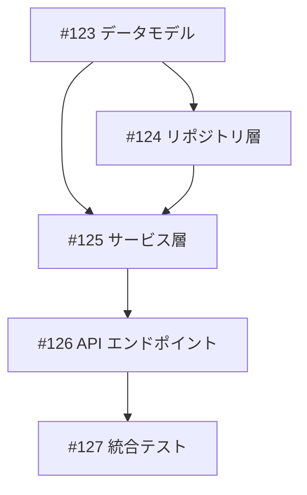

# Issue Creation Templates

Issue 作成時に使用するテンプレート集です。

---

## 0. 依存関係の明記（必須）

⚠️ **並列開発のために依存関係は必須です**

GitHub Project では Issue を並列開発することを前提としています。
`/plan-worktrees` で正しく Wave 分類するために、**全ての Issue に依存関係を明記**してください。

### 0.1 依存関係の書き方

```markdown
## 依存関係

depends_on: #120, #121
blocks: #125
```

**依存がない場合も「なし」と明記**:

```markdown
## 依存関係

depends_on: なし
blocks: なし
```

### 0.2 依存関係の判断基準

| 質問 | はい → 依存あり | いいえ → 依存なし |
|------|-----------------|-------------------|
| この Issue を始める前に完了が必要な Issue があるか？ | `depends_on: #XXX` | `depends_on: なし` |
| この Issue の成果物を使う Issue があるか？ | `blocks: #YYY` | `blocks: なし` |
| 設計やAPIの決定を待つ必要があるか？ | `depends_on: #XXX` | - |
| 共通コンポーネントを先に作成する必要があるか？ | `depends_on: #XXX` | - |

### 0.3 依存関係が曖昧な場合

**暗黙の依存を明示化**:

| 例 | 暗黙の依存 | 明示すべき記載 |
|----|-----------|----------------|
| #771「レポート設計」→ #774「テンプレート作成」 | 設計後に実装 | #774 に `depends_on: #771` |
| #770「調査」→ #771「設計」 | 調査結果を設計に反映 | #771 に `depends_on: #770` |

**迷ったら依存ありとして記載**してください。
後から依存を外すより、見落とした依存を後から追加する方がコストが高いです。

### 0.4 /plan-worktrees との連携

依存関係が正しく記載されていると、`/plan-worktrees` は以下のように Wave 分類します:

```
Wave 1: 依存なしの Issue（即座に並列開発可能）
Wave 2: Wave 1 に依存する Issue（Wave 1 完了後に開発可能）
Wave 3: Wave 2 に依存する Issue
...
```

依存関係が曖昧だと、本来順次実行すべき Issue が同じ Wave に分類され、
手戻りやコンフリクトの原因になります。

---

## 1. 標準 Issue テンプレート

### 1.1 新機能追加

```markdown
## 概要
[機能の概要を1-2文で簡潔に記述]

## 詳細
[実装の詳細、技術的な背景、コンテキストを記述]

### 背景
- なぜこの機能が必要か
- 解決したい問題

### スコープ
- 実装する機能
- 実装しない機能（スコープ外）

## 受け入れ条件
- [ ] [測定可能な条件1: 具体的な数値や状態を含む]
- [ ] [測定可能な条件2: 「〜ができること」形式]
- [ ] [測定可能な条件3: テスト可能な表現]
- [ ] make check-all が成功する

## 依存関係
depends_on: #XXX, #YYY（または「なし」）
blocks: #ZZZ（または「なし」）

## 備考
- 関連 Issue: #XXX
- 参考資料: [リンク]
```

### 1.2 バグ修正

```markdown
## 概要
[バグの概要を1-2文で記述]

## 再現手順
1. [手順1]
2. [手順2]
3. [手順3]

## 期待される動作
[正しい動作の説明]

## 実際の動作
[現在の問題のある動作]

## 環境
- OS: [OS名/バージョン]
- Python: [バージョン]
- 関連パッケージ: [バージョン]

## 受け入れ条件
- [ ] バグが再現しなくなる
- [ ] リグレッションテストが追加されている
- [ ] make check-all が成功する

## 依存関係
depends_on: なし（または #XXX）
blocks: なし（または #YYY）

## 備考
- エラーログ: [該当箇所]
- 関連 Issue: #XXX
```

### 1.3 リファクタリング

```markdown
## 概要
[リファクタリングの概要を1-2文で記述]

## 現状の問題
- [問題点1]
- [問題点2]
- [問題点3]

## 改善後の状態
- [改善点1]
- [改善点2]
- [改善点3]

## 影響範囲
- [影響を受けるファイル/モジュール]
- [影響を受ける機能]

## 受け入れ条件
- [ ] 既存テストが全て通る
- [ ] 動作に変更がない
- [ ] コードの可読性が向上している
- [ ] make check-all が成功する

## 依存関係
depends_on: なし（または #XXX）
blocks: なし（または #YYY）

## 備考
- 関連 Issue: #XXX
```

## 2. 受け入れ条件テンプレート

### 2.1 種類別標準条件

#### 新機能の追加
```markdown
- [ ] ユニットテストが追加されている
- [ ] 機能が正常に動作する
- [ ] エラーハンドリングが実装されている
- [ ] make check-all が成功する
```

#### 既存機能の改善
```markdown
- [ ] 既存テストが通る
- [ ] 改善内容が動作する
- [ ] 後方互換性が維持されている
- [ ] make check-all が成功する
```

#### バグ修正
```markdown
- [ ] バグが再現しなくなる
- [ ] リグレッションテストが追加されている
- [ ] 関連する既存テストが通る
- [ ] make check-all が成功する
```

#### リファクタリング
```markdown
- [ ] 既存テストが全て通る
- [ ] 動作に変更がない
- [ ] コードの可読性/保守性が向上している
- [ ] make check-all が成功する
```

### 2.2 測定可能な条件の書き方

| 曖昧な表現 | 測定可能な表現 |
|-----------|---------------|
| パフォーマンスが改善される | 平均レスポンスタイムが 500ms 以下になる |
| テストが通る | `make test` が成功する |
| ドキュメントがある | README.md に使用例が記載されている |
| 使いやすい | フォーム入力が 3 ステップ以内で完了する |
| バグが直る | エラーログに該当例外が出力されない |
| エラーハンドリングがある | 不正入力時に適切なエラーメッセージが表示される |
| ログが出力される | INFO レベルで処理開始/完了がログ出力される |

## 3. Tasklist テンプレート

### 3.1 親 Issue の Tasklist

```markdown
## 実装タスク

### Phase 1: 基盤
- [ ] #123 データモデルの定義
- [ ] #124 リポジトリ層の実装

### Phase 2: ビジネスロジック
- [ ] #125 サービス層の実装
- [ ] #126 バリデーションの追加

### Phase 3: 統合
- [ ] #127 API エンドポイントの実装
- [ ] #128 統合テストの追加
```

### 3.2 依存関係の表現

```markdown
## 依存関係


```

## 4. Issue 作成完了レポート

```markdown
## Issue を作成しました

- **Issue**: [#番号](URL)
- **タイトル**: [タイトル]
- **ラベル**: [ラベル一覧]
- **Project**: [追加先]（オプション）

### 次のステップ
- 実装を開始: `/issue-implement {番号}`
- 詳細を追記: `gh issue edit {番号} --body "..."`
- project.md と同期: `/issue @docs/project/xxx.md`
```

## 5. 同期結果レポート

```markdown
## 処理結果

### 作成した Issue
- [#123](URL): 機能 1.1 - ユーザー認証
- [#124](URL): 機能 1.2 - セッション管理

### 更新した Issue
- [#100](URL): Tasklist に #123 を追加
- [#101](URL): チェックボックス状態を同期

### project.md の更新
- 機能 1.1: Issue #123 を紐付け
- 機能 1.2: Issue #124 を紐付け

### 現在のタスク一覧

| 優先度 | タイトル | ステータス | Issue |
|--------|----------|------------|-------|
| high | 機能 1.1 | todo | [#123](URL) |
| medium | 機能 1.2 | in_progress | [#124](URL) |
| low | 機能 1.3 | done | [#125](URL) |

### 依存関係
- #124 depends_on #123
- #125 depends_on #124
```
