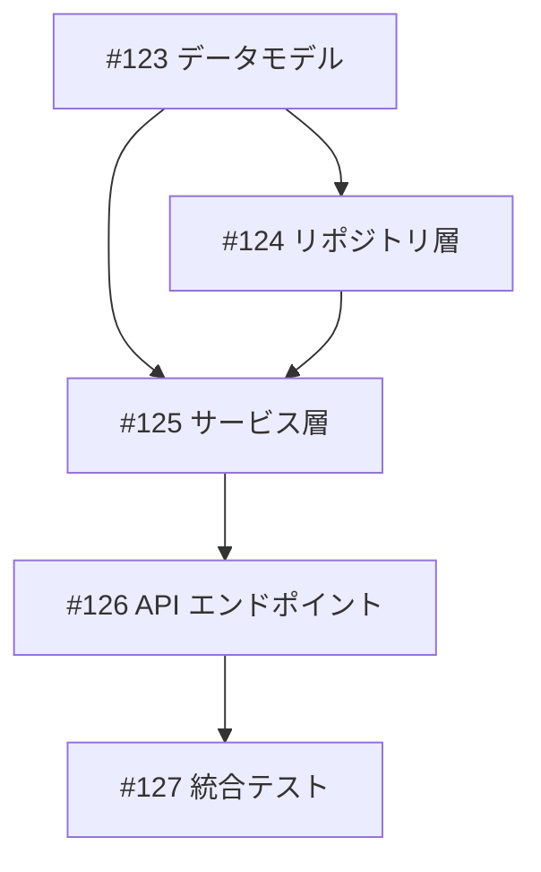

# Issue Templates

Issue 作成・更新時に使用するテンプレート集です。

## 1. 標準 Issue テンプレート

### 1.1 新機能追加

```markdown
## 概要
[機能の概要を1-2文で簡潔に記述]

## 詳細
[実装の詳細、技術的な背景、コンテキストを記述]

### 背景
- なぜこの機能が必要か
- 解決したい問題

### スコープ
- 実装する機能
- 実装しない機能（スコープ外）

## 受け入れ条件
- [ ] [測定可能な条件1: 具体的な数値や状態を含む]
- [ ] [測定可能な条件2: 「〜ができること」形式]
- [ ] [測定可能な条件3: テスト可能な表現]
- [ ] make check-all が成功する

## 備考
- 関連 Issue: #XXX
- 参考資料: [リンク]
```

### 1.2 バグ修正

```markdown
## 概要
[バグの概要を1-2文で記述]

## 再現手順
1. [手順1]
2. [手順2]
3. [手順3]

## 期待される動作
[正しい動作の説明]

## 実際の動作
[現在の問題のある動作]

## 環境
- OS: [OS名/バージョン]
- Python: [バージョン]
- 関連パッケージ: [バージョン]

## 受け入れ条件
- [ ] バグが再現しなくなる
- [ ] リグレッションテストが追加されている
- [ ] make check-all が成功する

## 備考
- エラーログ: [該当箇所]
- 関連 Issue: #XXX
```

### 1.3 リファクタリング

```markdown
## 概要
[リファクタリングの概要を1-2文で記述]

## 現状の問題
- [問題点1]
- [問題点2]
- [問題点3]

## 改善後の状態
- [改善点1]
- [改善点2]
- [改善点3]

## 影響範囲
- [影響を受けるファイル/モジュール]
- [影響を受ける機能]

## 受け入れ条件
- [ ] 既存テストが全て通る
- [ ] 動作に変更がない
- [ ] コードの可読性が向上している
- [ ] make check-all が成功する

## 備考
- 関連 Issue: #XXX
```

## 2. 受け入れ条件テンプレート

### 2.1 種類別標準条件

#### 新機能の追加
```markdown
- [ ] ユニットテストが追加されている
- [ ] 機能が正常に動作する
- [ ] エラーハンドリングが実装されている
- [ ] make check-all が成功する
```

#### 既存機能の改善
```markdown
- [ ] 既存テストが通る
- [ ] 改善内容が動作する
- [ ] 後方互換性が維持されている
- [ ] make check-all が成功する
```

#### バグ修正
```markdown
- [ ] バグが再現しなくなる
- [ ] リグレッションテストが追加されている
- [ ] 関連する既存テストが通る
- [ ] make check-all が成功する
```

#### リファクタリング
```markdown
- [ ] 既存テストが全て通る
- [ ] 動作に変更がない
- [ ] コードの可読性/保守性が向上している
- [ ] make check-all が成功する
```

### 2.2 測定可能な条件の書き方

| 曖昧な表現 | 測定可能な表現 |
|-----------|---------------|
| パフォーマンスが改善される | 平均レスポンスタイムが 500ms 以下になる |
| テストが通る | `make test` が成功する |
| ドキュメントがある | README.md に使用例が記載されている |
| 使いやすい | フォーム入力が 3 ステップ以内で完了する |
| バグが直る | エラーログに該当例外が出力されない |
| エラーハンドリングがある | 不正入力時に適切なエラーメッセージが表示される |
| ログが出力される | INFO レベルで処理開始/完了がログ出力される |

## 3. Tasklist テンプレート

### 3.1 親 Issue の Tasklist

```markdown
## 実装タスク

### Phase 1: 基盤
- [ ] #123 データモデルの定義
- [ ] #124 リポジトリ層の実装

### Phase 2: ビジネスロジック
- [ ] #125 サービス層の実装
- [ ] #126 バリデーションの追加

### Phase 3: 統合
- [ ] #127 API エンドポイントの実装
- [ ] #128 統合テストの追加
```

### 3.2 依存関係の表現

```markdown
## 依存関係



## 4. コメント同期レポート

### 4.1 ステータス更新レポート

```markdown
## コメント同期結果

### 対象 Issue
- [#123](URL): タイトル1
- [#124](URL): タイトル2

### ステータス更新
| Issue | 変更前 | 変更後 | 根拠 |
|-------|--------|--------|------|
| #123 | in_progress | done | 「対応完了しました」|
| #124 | todo | in_progress | 「着手しました」|

### 受け入れ条件更新
| Issue | 条件 | 状態 | 根拠 |
|-------|------|------|------|
| #123 | OAuth対応 | ✅ 完了 | 「OAuth対応完了」|
| #123 | Apple Sign-In | 📝 追加 | 「追加で必要」|

### 新規サブタスク
- [#125](URL): GitHub OAuth対応（#123 から派生）
```

### 4.2 project.md 更新レポート

```markdown
### project.md の更新
- 機能 1.1: ステータスを done に更新
- 機能 1.1: 受け入れ条件「Apple Sign-In対応」を追加
- 機能 1.3: 新規タスク「GitHub OAuth対応」を追加

### GitHub Project の更新
- #123: ステータスを Done に更新
- #125: Project に追加、ステータスを Todo に設定
```

## 5. Issue 改善プレビュー

### 5.1 差分表示形式

```markdown
## Issue #{number}: {title}

### タイトル
- **改善前**: {old_title}
- **改善後**: {new_title}

### 本文の変更

#### 概要
```diff
- 処理が遅い
+ API レスポンスが 3 秒以上かかるケースがある
```

#### 受け入れ条件
```diff
- [ ] パフォーマンスが改善される
- [ ] テストが通る
+ [ ] 平均レスポンスタイムが 500ms 以下になる
+ [ ] 95パーセンタイルが 1 秒以下になる
+ [ ] make test が成功する
+ [ ] make check-all が成功する
```
```

### 5.2 改善サマリー

```markdown
### 改善サマリー

- **タイトル改善**: より具体的な表現に変更
- **概要改善**: 問題の具体化と影響範囲の明記
- **受け入れ条件**: 4 条件を測定可能な形式に変換
  - 曖昧 → 具体的: 2 件
  - 新規追加: 2 件
```

## 6. 完了レポート

### 6.1 /issue-implement 完了レポート

```markdown
================================================================================
                    /issue-implement #{number} 完了
================================================================================

## サマリー
- Issue: #{number} - {title}
- 実行時間: {duration}
- 作成したPR: #{pr_number}

## Phase 結果

| Phase | 状態 | 詳細 |
|-------|------|------|
| 0. 検証・準備 | ✓ | Issue情報取得済み |
| 1. テスト作成 | ✓ | {test_count} tests |
| 2. 実装 | ✓ | {task_count}/{task_count} tasks |
| 3. 品質保証 | ✓ | make check-all PASS |
| 4. PR作成 | ✓ | #{pr_number} |
| 5. 完了処理 | ✓ | Project: In Progress |

## 作成したファイル
- tests/{library_name}/unit/test_{feature}.py
- src/{library_name}/core/{feature}.py

## 次のステップ

1. PRをレビュー:
   gh pr view {pr_number} --web

2. PRをマージ:
   /merge-pr {pr_number}

3. クリーンアップ（マージ後）:
   /worktree-done feature/issue-{number}-{slug}

================================================================================
```

### 6.2 エラー時レポート

```markdown
================================================================================
                    /issue-implement #{number} エラー
================================================================================

## エラー発生 Phase
Phase {n}: {phase_name}

## エラー内容
- 種類: {error_type}
- 詳細: {error_detail}

## 実行された処理
- Phase 0: 検証・準備 ✓
- Phase 1: テスト作成 ✓
- Phase 2: 実装 ✗ ({completed}/{total} tasks)
- Phase 3: 品質保証 - (未実行)
- Phase 4: PR作成 - (未実行)
- Phase 5: 完了処理 - (未実行)

## 推奨アクション
1. {action1}
2. {action2}

================================================================================
```
