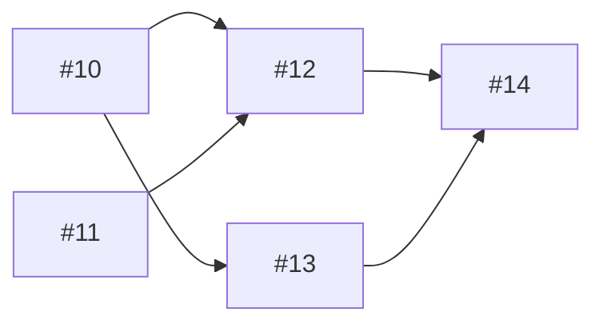
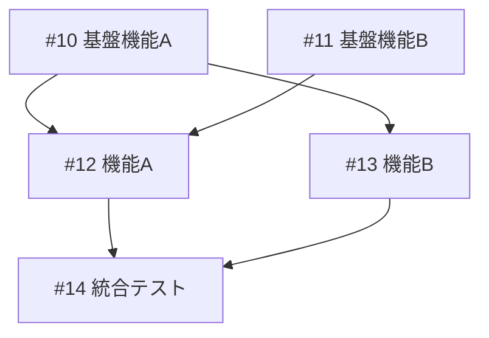
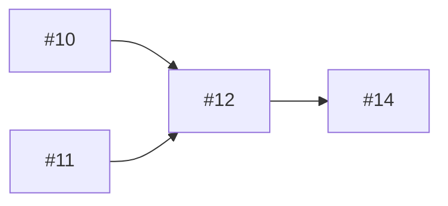

# Project Implementation テンプレート

## 進捗ファイルスキーマ

ファイルパス: `.tmp/project-{番号}-progress.json`

### スキーマ定義

```json
{
  "$schema": "https://json-schema.org/draft/2020-12/schema",
  "type": "object",
  "required": ["project_number", "branch", "started_at", "updated_at", "issues", "status"],
  "properties": {
    "project_number": {
      "type": "integer",
      "description": "GitHub Project 番号"
    },
    "branch": {
      "type": "string",
      "pattern": "^feature/project-\\d+$",
      "description": "作業ブランチ名"
    },
    "started_at": {
      "type": "string",
      "format": "date-time",
      "description": "開始日時（ISO 8601）"
    },
    "updated_at": {
      "type": "string",
      "format": "date-time",
      "description": "最終更新日時（ISO 8601）"
    },
    "issues": {
      "type": "object",
      "required": ["total", "completed", "current", "pending"],
      "properties": {
        "total": {
          "type": "integer",
          "description": "対象 Issue の総数"
        },
        "completed": {
          "type": "array",
          "items": { "type": "string", "pattern": "^#\\d+$" },
          "description": "完了した Issue 番号のリスト"
        },
        "current": {
          "type": ["string", "null"],
          "pattern": "^#\\d+$",
          "description": "現在実装中の Issue 番号（null は未着手/完了）"
        },
        "pending": {
          "type": "array",
          "items": { "type": "string", "pattern": "^#\\d+$" },
          "description": "未着手の Issue 番号のリスト"
        },
        "failed": {
          "type": ["string", "null"],
          "pattern": "^#\\d+$",
          "description": "失敗した Issue 番号（null は失敗なし）"
        }
      }
    },
    "status": {
      "type": "string",
      "enum": ["in_progress", "completed", "failed"],
      "description": "全体のステータス"
    },
    "last_error": {
      "type": ["string", "null"],
      "description": "最後に発生したエラーメッセージ"
    },
    "pr_number": {
      "type": ["integer", "null"],
      "description": "作成した PR 番号（null は未作成）"
    },
    "implementation_order": {
      "type": "array",
      "items": { "type": "string", "pattern": "^#\\d+$" },
      "description": "依存関係を考慮した実装順序"
    },
    "dependency_graph": {
      "type": "object",
      "additionalProperties": {
        "type": "array",
        "items": { "type": "string", "pattern": "^#\\d+$" }
      },
      "description": "依存関係グラフ（Issue 番号 → 依存先リスト）"
    }
  }
}
```

### サンプル（新規開始）

```json
{
  "project_number": 1,
  "branch": "feature/project-1",
  "started_at": "2026-01-25T10:00:00Z",
  "updated_at": "2026-01-25T10:00:00Z",
  "issues": {
    "total": 5,
    "completed": [],
    "current": null,
    "pending": ["#10", "#11", "#12", "#13", "#14"],
    "failed": null
  },
  "status": "in_progress",
  "last_error": null,
  "pr_number": null,
  "implementation_order": ["#10", "#11", "#12", "#13", "#14"],
  "dependency_graph": {
    "#10": [],
    "#11": [],
    "#12": ["#10", "#11"],
    "#13": ["#10"],
    "#14": ["#12", "#13"]
  }
}
```

### サンプル（実装中）

```json
{
  "project_number": 1,
  "branch": "feature/project-1",
  "started_at": "2026-01-25T10:00:00Z",
  "updated_at": "2026-01-25T11:30:00Z",
  "issues": {
    "total": 5,
    "completed": ["#10", "#11"],
    "current": "#12",
    "pending": ["#13", "#14"],
    "failed": null
  },
  "status": "in_progress",
  "last_error": null,
  "pr_number": 101,
  "implementation_order": ["#10", "#11", "#12", "#13", "#14"],
  "dependency_graph": {
    "#10": [],
    "#11": [],
    "#12": ["#10", "#11"],
    "#13": ["#10"],
    "#14": ["#12", "#13"]
  }
}
```

### サンプル（失敗）

```json
{
  "project_number": 1,
  "branch": "feature/project-1",
  "started_at": "2026-01-25T10:00:00Z",
  "updated_at": "2026-01-25T12:00:00Z",
  "issues": {
    "total": 5,
    "completed": ["#10", "#11"],
    "current": null,
    "pending": ["#13", "#14"],
    "failed": "#12"
  },
  "status": "failed",
  "last_error": "CI check failed: mypy error in src/module.py:45",
  "pr_number": 101,
  "implementation_order": ["#10", "#11", "#12", "#13", "#14"],
  "dependency_graph": {
    "#10": [],
    "#11": [],
    "#12": ["#10", "#11"],
    "#13": ["#10"],
    "#14": ["#12", "#13"]
  }
}
```

---

## 完了レポートテンプレート

### 成功時

```markdown
================================================================================
                    /project-implement #{project_number} 完了
================================================================================

## サマリー
- Project: #{project_number}
- ブランチ: feature/project-{project_number}
- 実装した Issue: {completed_count} 件
- PR: #{pr_number}
- 所要時間: {duration}

## 実装結果
| # | タイトル | 状態 | コミット |
|---|----------|------|----------|
| #{issue1_number} | {issue1_title} | Done | {commit1_hash} |
| #{issue2_number} | {issue2_title} | Done | {commit2_hash} |
| #{issue3_number} | {issue3_title} | Done | {commit3_hash} |

## 依存関係


## 品質チェック
- CI: PASS
- コミット数: {commit_count}
- 変更ファイル数: {changed_files_count}

## 次のステップ
PR #{pr_number} をレビュー・マージしてください:
```bash
gh pr view {pr_number} --web
```

================================================================================
```

### 中断時

```markdown
================================================================================
                    /project-implement #{project_number} 中断
================================================================================

## 状況
- 完了: {completed_issues} ({completed_count} 件)
- 失敗: #{failed_issue}
- 未着手: {pending_issues} ({pending_count} 件)
- PR: #{pr_number} (CI 失敗中)

## エラー詳細
Issue #{failed_issue} の CI チェックで失敗:

```
{error_message}
```

## 試行した自動修正
| 試行 | 結果 | 詳細 |
|------|------|------|
| 1 | 失敗 | {attempt1_detail} |
| 2 | 失敗 | {attempt2_detail} |
| 3 | 失敗 | {attempt3_detail} |

## 再開方法

### 手動修正後に再開
1. エラーを確認して手動で修正
2. 変更をコミット & プッシュ:
   ```bash
   git add -A
   git commit -m "fix(#{failed_issue}): エラーを修正"
   git push
   ```
3. CI パスを確認後、再開:
   ```bash
   /project-implement --resume
   ```

### Issue をスキップして継続
1. 進捗ファイルを編集:
   ```bash
   # .tmp/project-{project_number}-progress.json を編集
   # failed の Issue を pending から削除
   ```
2. 再開:
   ```bash
   /project-implement --resume
   ```

## 進捗ファイル
`.tmp/project-{project_number}-progress.json`

```json
{progress_file_content}
```

================================================================================
```

---

## 開始レポートテンプレート

```markdown
================================================================================
                    /project-implement #{project_number} 開始
================================================================================

## Project 情報
- Project: #{project_number}
- リポジトリ: {repository}
- ブランチ: feature/project-{project_number}

## 対象 Issue ({total_count} 件)
| # | タイトル | ステータス | 依存 |
|---|----------|-----------|------|
| #{issue1_number} | {issue1_title} | {issue1_status} | {issue1_deps} |
| #{issue2_number} | {issue2_title} | {issue2_status} | {issue2_deps} |

## 依存関係グラフ


## 実装順序（Wave 分類）

### Wave 1（依存なし - 即座に実装）
- #{wave1_issue1}: {wave1_title1}
- #{wave1_issue2}: {wave1_title2}

### Wave 2（Wave 1 に依存）
- #{wave2_issue1}: {wave2_title1}
- #{wave2_issue2}: {wave2_title2}

### Wave 3（Wave 2 に依存）
- #{wave3_issue1}: {wave3_title1}

## 実装開始

Phase 0: 初期化 ✓ 完了
Phase 1: Issue 取得・解析 ✓ 完了

次のフェーズ: Phase 2 - Issue #{first_issue} の実装

================================================================================
```

---

## Issue 完了通知テンプレート

```markdown
## Issue #{issue_number} 完了 ✓

- タイトル: {issue_title}
- コミット: {commit_hash}
- CI: PASS
- Project ステータス: Done

### 実装内容
{implementation_summary}

### 変更ファイル
{changed_files}

### 進捗
{completed_count}/{total_count} ({percentage}%)

▓▓▓▓▓▓▓▓▓▓░░░░░░░░░░ {percentage}%

次の Issue: #{next_issue} - {next_title}
```

---

## コミットメッセージテンプレート

### 標準コミット

```
feat(#{issue_number}): {issue_title}

Implements #{issue_number}

Changes:
- {change1}
- {change2}
- {change3}

Co-Authored-By: Claude Opus 4.5 <noreply@anthropic.com>
```

### WIP コミット（エラー発生時）

```
wip(#{issue_number}): 実装途中（エラー発生）

Issue #{issue_number} の実装中にエラーが発生しました。
詳細は .tmp/project-{project_number}-progress.json を参照。

Error: {error_summary}

Co-Authored-By: Claude Opus 4.5 <noreply@anthropic.com>
```

### 修正コミット（自動修正成功時）

```
fix(#{issue_number}): 品質チェックエラーを修正

- {fix1}
- {fix2}

Co-Authored-By: Claude Opus 4.5 <noreply@anthropic.com>
```

---

## PR 本文テンプレート

```markdown
## 概要

Project #{project_number} の Issue を順次実装しました。

## 実装した Issue

| # | タイトル | コミット |
|---|----------|----------|
| #{issue1} | {title1} | {hash1} |
| #{issue2} | {title2} | {hash2} |
| #{issue3} | {title3} | {hash3} |

## 依存関係



## 変更内容

- {change1}
- {change2}
- {change3}

## テストプラン

- [x] CI が成功することを確認
- [x] 各 Issue の受け入れ条件を確認
- [ ] コードレビュー

Closes #{issue1}, #{issue2}, #{issue3}

---

🤖 Generated with [Claude Code](https://claude.ai/code)

Co-Authored-By: Claude Opus 4.5 <noreply@anthropic.com>
```
