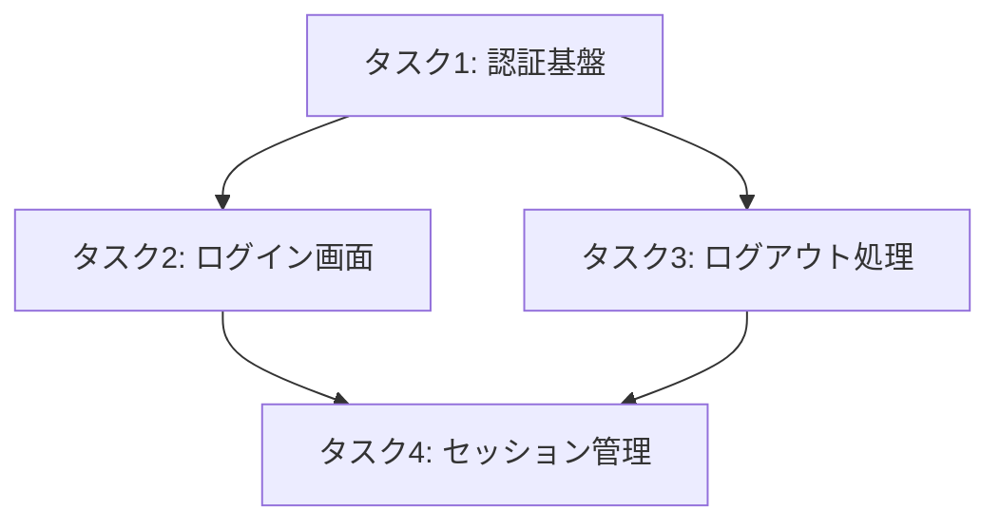
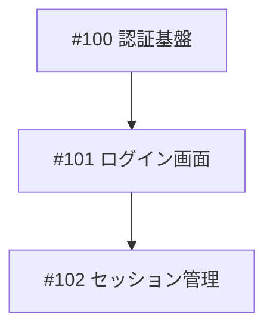
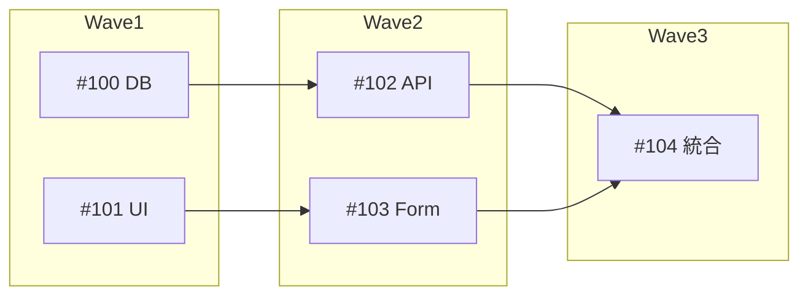

# タスク分解スキル

要件定義からのタスク分解、依存関係解析、類似タスク判定を行うナレッジベーススキルです。

## 目的

このスキルは以下を提供します：

- **タスク分解**: 大きな要件を実装可能な単位に分解する方法論
- **依存関係解析**: タスク間の依存関係を特定・可視化する手法
- **類似タスク判定**: 既存 Issue との類似性を判定する基準
- **Mermaid 可視化**: 依存関係グラフを Mermaid 形式で生成

## いつ使用するか

### プロアクティブ使用（自動的に検討）

以下の状況では、ユーザーが明示的に要求しなくても使用を検討：

1. **要件からタスクを作成する場合**
   - 「この機能を実装したい」
   - 「〜の機能を分解して」
   - LRD や設計書からの Issue 作成

2. **依存関係を可視化したい場合**
   - 「タスクの依存関係を確認したい」
   - 「どの順番で実装すべきか」
   - 並行開発の計画（/plan-worktrees）

3. **類似タスクの判定が必要な場合**
   - 新規タスク追加時
   - 重複 Issue の検出

### 明示的な使用（ユーザー要求）

- `/task` コマンド
- `/issue` コマンド
- 「タスクを分解して」「依存関係を見せて」などの直接的な要求

## スキル設計原則

### 1. 実装可能単位への分解

タスクは「1-2時間で完了できるサイズ」を目安に分解します。

**分解基準**:
```yaml
適切なサイズ:
  - 1つの機能 = 1つのタスク
  - 1つのテストファイル = 1つのタスク
  - 1つの API エンドポイント = 1つのタスク

分解が必要なサイン:
  - 「〜と〜」という接続詞が含まれる
  - 受け入れ条件が5個以上
  - 複数のファイルにまたがる変更
```

### 2. 依存関係の明示化

タスク間の依存関係を3種類に分類します。

**依存関係の種類**:
```yaml
明示的依存（explicit）:
  - 定義: 直接的な参照関係
  - 例: "認証機能"が"ログイン画面"に必要

暗黙的依存（implicit）:
  - 定義: データフローや処理順序による依存
  - 例: "DB設計"が"データ取得API"に先行

ブロッキング依存（blocking）:
  - 定義: 完了しないと次が開始できない
  - 例: "スキーマ定義"が"マイグレーション"をブロック
```

### 3. 循環依存の検出と解消

循環依存は設計上の問題を示唆するため、検出と解消が重要です。

## プロセス

### 1. 要件の分析

要件ドキュメントまたはユーザー入力から、実装すべき機能を抽出します。

```bash
# 既存の Issue を確認
gh issue list --json number,title,state,labels

# project.md を確認
cat src/{library_name}/docs/project.md
```

- **確認項目**: 機能の境界、前提条件、制約事項
- **ドメイン境界**: 1つのドメインに閉じた機能か、横断的か

### 2. タスク分解の実行

以下の基準でタスクを分解：

| 基準 | 説明 |
|------|------|
| 単一責任 | 1タスク = 1つの責任 |
| テスト可能 | 独立してテスト可能 |
| 見積もり可能 | 1-2時間で完了可能 |
| 依存明確 | 先行タスクが明確 |

**分解テンプレート**:
```markdown
### タスク: [タスク名]
- 概要: [何をするか]
- 受け入れ条件:
  - [ ] [条件1]
  - [ ] [条件2]
- 依存: [先行タスク]
- 見積もり: [時間]
```

### 3. 依存関係の解析

タスク間の依存関係を特定し、グラフ化します。

**解析手順**:
1. 各タスクの入出力を特定
2. データフローを追跡
3. 明示的な参照関係を抽出
4. 循環依存をチェック

### 4. 類似タスク判定

新規タスクと既存 Issue の類似性を判定します。

**判定基準**:
```yaml
高類似度（70%以上）:
  - 同じ機能領域
  - 同じコンポーネント
  - 対応: 既存 Issue の sub-issue として追加

中類似度（40-70%）:
  - 関連する機能領域
  - 一部共通するキーワード
  - 対応: ユーザーに確認

低類似度（40%未満）:
  - 異なる機能領域
  - 対応: 新規 Issue として作成
```

### 5. Mermaid での可視化

依存関係グラフを Mermaid 形式で出力します。

**出力フォーマット**:


### 6. 検証

作成した分解結果を検証：

- [ ] 全タスクが独立してテスト可能
- [ ] 循環依存がない
- [ ] 見積もりが現実的
- [ ] 受け入れ条件が明確

## 活用ツールの使用方法

### GitHub CLI（Issue 操作）

```bash
# Issue 一覧取得
gh issue list --json number,title,body,labels,state

# Issue 作成
gh issue create \
  --title "[日本語タイトル]" \
  --body "[日本語本文]" \
  --label "enhancement"

# Issue 更新
gh issue edit [番号] --body "[更新本文]"

# Issue クローズ
gh issue close [番号]
```

### gh project（Project 操作）

```bash
# Project Item 一覧
gh project item-list {project_number} --owner @me --format json

# Project に Issue を追加
gh project item-add {project_number} --owner @me --url {issue_url}

# ステータス更新
gh project item-edit \
  --project-id {project_id} \
  --id {item_id} \
  --field-id {status_field_id} \
  --single-select-option-id {status_option_id}
```

### 組み込みツール

| ツール | 用途 |
|--------|------|
| Read | project.md、Issue テンプレートの読み込み |
| Write | 分解結果の出力 |
| Grep | 既存タスクの検索 |
| Task | task-decomposer エージェントの起動 |

## リソース

このスキルには以下のリソースが含まれています：

### ./guide.md

タスク分解・依存関係管理の詳細ガイド：

- タスク分解のベストプラクティス
- 依存関係解析の詳細手法
- 類似タスク判定アルゴリズム
- Mermaid グラフ生成の詳細

### ./template.md

タスク分解テンプレート：

- Issue 本文テンプレート
- project.md セクションテンプレート
- 依存関係グラフテンプレート
- 分解結果レポートテンプレート

## 使用例

### 例1: 新機能のタスク分解

**状況**: 「ユーザー認証機能を追加したい」という要件

**処理**:
1. 要件を分析し、構成要素を抽出
2. 認証、ログイン、セッション管理に分解
3. 依存関係を特定（認証基盤 → ログイン → セッション）
4. 各タスクの受け入れ条件を定義
5. Mermaid グラフで可視化

**期待される出力**:
```markdown
## タスク分解結果

### 1. 認証基盤の実装
- Issue: [#100](URL)
- 依存: なし
- 受け入れ条件:
  - [ ] JWT トークン生成
  - [ ] トークン検証

### 2. ログイン画面の実装
- Issue: [#101](URL)
- 依存: #100
- 受け入れ条件:
  - [ ] フォーム実装
  - [ ] バリデーション

## 依存関係グラフ


```

---

### 例2: 既存タスクとの類似性判定

**状況**: 「APIエラーハンドリングを追加」という新規タスク

**処理**:
1. 既存 Issue を検索
2. 類似度を計算（タイトル、本文、ラベル）
3. 類似 Issue を提示
4. ユーザーに確認

**期待される出力**:
```yaml
類似性判定結果:
  新規タスク: "APIエラーハンドリングを追加"

  類似 Issue:
    - number: 50
      title: "エラーレスポンスの統一"
      similarity: 75%
      recommendation: "sub-issue として追加を推奨"

    - number: 32
      title: "バリデーションエラーの処理"
      similarity: 45%
      recommendation: "関連として紐付けを検討"

推奨アクション: #50 の sub-issue として作成
```

---

### 例3: 循環依存の検出と解消

**状況**: タスク A → B → C → A という循環が検出された

**処理**:
1. 循環依存を検出
2. 原因を分析（共有リソース、設計上の問題）
3. 解消案を提示
4. ユーザーと解消方法を決定

**出力**:
```
⚠️ 循環依存を検出しました

循環パス:
  タスクA (認証) → タスクB (API) → タスクC (セッション) → タスクA (認証)

原因分析:
  - セッション管理が認証に依存
  - 認証がセッション状態を参照

解消案:
  1. インターフェース分離: 共通インターフェースを抽出
  2. 依存逆転: セッション → 認証の依存を逆転
  3. 共有コンポーネント: 共通部分を別タスクに分離

推奨: 案3「共有コンポーネント」- 認証コアを独立タスクとして分離
```

---

### 例4: 並行開発のためのグルーピング

**状況**: 5つのタスクを並行開発可能なグループに分類したい

**処理**:
1. 依存関係グラフを構築
2. 依存のないタスク群（Wave 1）を特定
3. Wave 1 完了後に開始可能なタスク（Wave 2）を特定
4. グループ化結果を出力

**期待される出力**:
```markdown
## 並行開発グループ（Wave 分析）

### Wave 1（並行開発可能）
- #100: DB スキーマ定義
- #101: UI コンポーネント基盤

### Wave 2（Wave 1 完了後）
- #102: データ取得 API（依存: #100）
- #103: フォームコンポーネント（依存: #101）

### Wave 3（Wave 2 完了後）
- #104: 統合テスト（依存: #102, #103）


```

## 品質基準

### 必須（MUST）

- [ ] 全タスクに明確な受け入れ条件がある
- [ ] 依存関係が明示されている
- [ ] 循環依存がない
- [ ] タスクが1-2時間で完了可能なサイズ

### 推奨（SHOULD）

- 各タスクが独立してテスト可能
- Mermaid での可視化が含まれている
- 既存 Issue との類似性チェックが実施されている
- 見積もり時間が記載されている

## 出力フォーマット

### タスク分解完了時

```
================================================================================
                    タスク分解完了
================================================================================

## 分解結果
- 元の要件: {requirement_title}
- 分解数: {task_count} タスク

## タスク一覧
| # | タイトル | 依存 | 見積もり |
|---|----------|------|----------|
| 1 | [タスク1] | - | 1h |
| 2 | [タスク2] | #1 | 2h |

## 依存関係グラフ
[Mermaid グラフ]

## 次のステップ
1. Issue を作成: gh issue create ...
2. Project に追加: gh project item-add ...

================================================================================
```

### 類似性判定時

```yaml
判定結果:
  対象タスク: "{task_title}"
  類似 Issue:
    - number: {issue_number}
      similarity: {percentage}%
      recommendation: "{action}"

判定: {new_issue | sub_issue | confirm_with_user}
```

## エラーハンドリング

### 循環依存の検出

**原因**:
1. 設計上の問題
2. 共有リソースの不適切な参照

**対処法**:
- 循環パスを特定
- 共通部分を抽出して独立タスク化
- 依存の方向を見直し

### 類似判定の失敗

**原因**:
1. 既存 Issue のデータ不足
2. 曖昧なタスク説明

**対処法**:
- AskUserQuestion で詳細を確認
- 手動で類似 Issue を指定

### 分解粒度の不適切

**原因**:
1. 要件が曖昧
2. 分解基準が不明確

**対処法**:
- ユーザーに要件の詳細を確認
- 分解基準を明示的に提示

## 完了条件

このスキルは以下の条件を満たした場合に完了とする：

- [ ] 全タスクが受け入れ条件を持っている
- [ ] 依存関係グラフが作成されている
- [ ] 循環依存がないことを確認
- [ ] 類似タスクのチェックが完了
- [ ] 出力フォーマットに準拠

## 関連スキル

- **skill-expert**: スキル自体の設計・管理
- **workflow-expert**: ワークフロー設計（スキル連携）
- **project-file**: project.md の作成・管理

## 参考資料

- `CLAUDE.md`: プロジェクト全体のガイドライン
- `.claude/agents/task-decomposer.md`: 統合元エージェント
- `.claude/skills/skill-expert/template.md`: スキルテンプレート
- `docs/plan/2026-01-21_System-Update-Implementation.md`: システム更新計画書
