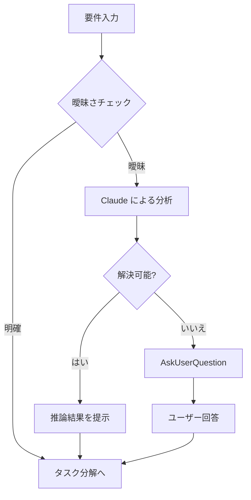
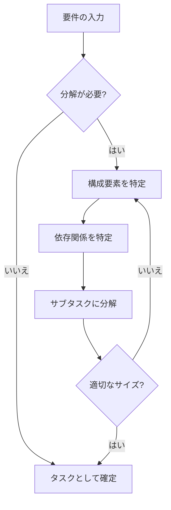
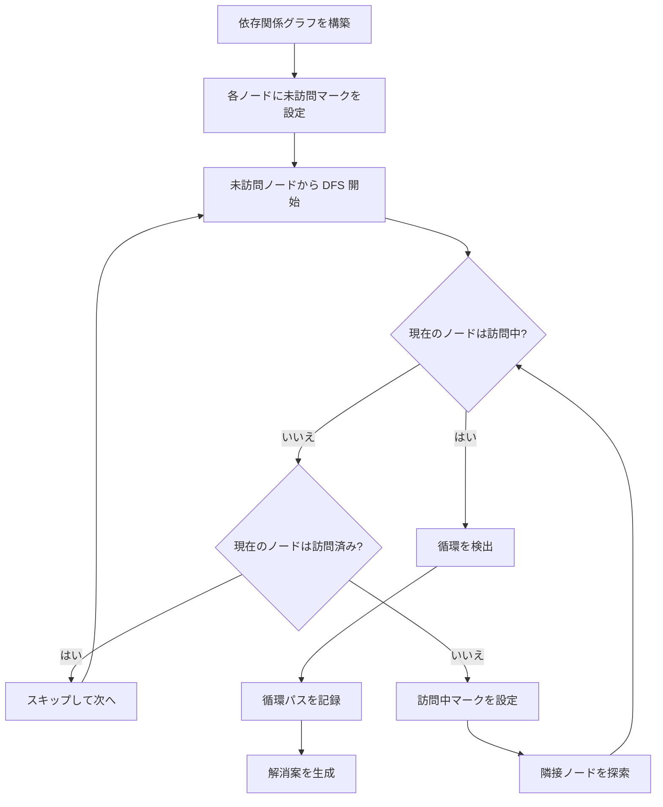
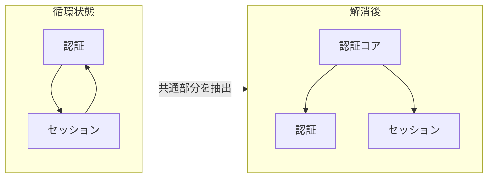
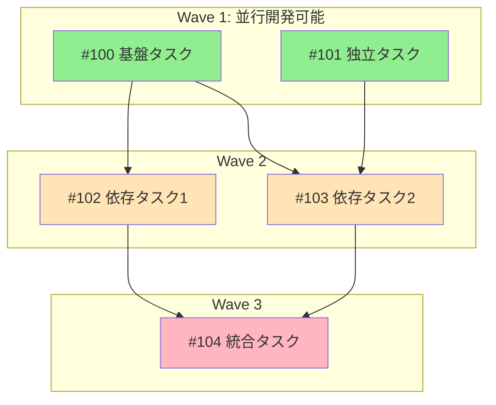
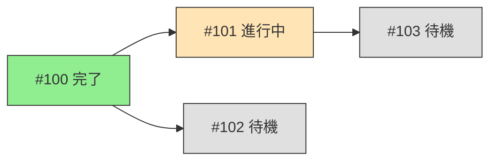
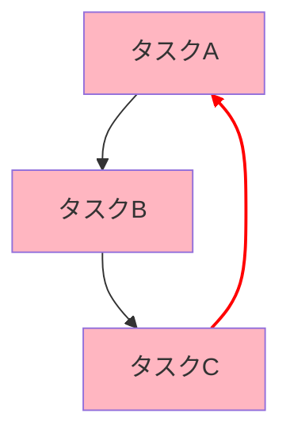

# タスク分解・依存関係管理ガイド

このガイドはタスク分解と依存関係管理の詳細な手法を提供します。
**Claude の推論能力を活用**して、要件の曖昧さを解消し、適切な粒度でタスクを分解します。

## Claude の推論能力を活用した分析アプローチ

### コンテキスト理解

Claude は以下の情報を総合的に分析して依存関係を推論します：

```yaml
分析対象:
  1. 要件ドキュメント:
     - 機能説明
     - 受け入れ条件
     - 制約事項

  2. コードベース:
     - 既存のモジュール構造
     - インポート関係
     - 型定義・インターフェース

  3. プロジェクトコンテキスト:
     - CLAUDE.md のガイドライン
     - 既存の Issue・PR
     - ディレクトリ構成
```

### 推論パターン

| パターン | 説明 | 活用場面 |
|----------|------|----------|
| 因果推論 | 「AがあればBが必要」という関係を特定 | 機能間の依存関係 |
| 類推 | 類似の既存実装から依存パターンを推測 | 新規機能の依存関係 |
| 分類 | タスクを適切なカテゴリに分類 | 並行開発グループ化 |
| 抽象化 | 共通部分を抽出して独立タスク化 | 循環依存の解消 |

### 曖昧さの解消プロセス



**分析例**:
```
入力: 「ユーザー認証を追加したい」

Claude の推論:
1. 「認証」は通常以下を含む:
   - 認証基盤（トークン生成・検証）
   - ログイン機能（UI + API）
   - セッション管理

2. プロジェクトの技術スタック（pyproject.toml）から:
   - Python 3.12+ 使用
   - JWT ライブラリの有無を確認

3. 既存コードから:
   - ユーザーモデルの有無
   - 既存の認証パターン

4. 推論結果:
   - 3つのタスクに分解を推奨
   - 認証基盤 → ログイン → セッション の順序
```

## 1. タスク分解のベストプラクティス

### 1.1 分解の基本原則

#### 単一責任の原則

```yaml
良い例:
  - "ログインフォームの実装"
  - "JWT トークン生成の実装"
  - "セッション管理の実装"

悪い例:
  - "認証機能の実装"  # 複数の責任を含む
  - "ユーザー関連機能"  # 範囲が曖昧
```

#### サイズの目安

| サイズ | 時間 | 特徴 |
|--------|------|------|
| 小 | 30分-1時間 | 単一の関数/コンポーネント |
| 中 | 1-2時間 | 1つのモジュール/機能 |
| 大 | 2-4時間 | 複数モジュール（分解を検討） |

### 1.2 分解のトリガー

以下の場合はタスクを分解すべきです：

1. **接続詞の存在**
   - 「〜と〜」「〜かつ〜」が含まれる
   - 例: 「認証**と**認可の実装」→ 認証、認可に分離

2. **複数の受け入れ条件**
   - 5個以上の受け入れ条件
   - 例: 10個の条件 → 2-3タスクに分割

3. **複数ファイルへの変更**
   - 3ファイル以上の変更
   - 例: モデル + API + テスト → 各レイヤーで分割

4. **複数のドメイン**
   - 異なるドメインにまたがる
   - 例: フロントエンド + バックエンド → 分離

### 1.3 分解の手順



## 2. 依存関係解析の詳細手法

### 2.0 Claude による依存関係解析手順

Claude は以下の手順で依存関係を体系的に解析します：

#### ステップ 1: 情報収集

```bash
# 1. 既存の Issue を確認
gh issue list --json number,title,body,labels,state

# 2. 関連コードを検索
# Claude は Grep/Glob を使用して関連ファイルを特定
```

#### ステップ 2: 依存関係の推論

```yaml
推論プロセス:
  1. 機能要件の分析:
     - 入力: 何を受け取るか
     - 出力: 何を生成するか
     - 副作用: 何に影響を与えるか

  2. コード依存の特定:
     - import 文の解析
     - 型定義の参照関係
     - API 呼び出しの追跡

  3. データフローの追跡:
     - データの生成元
     - データの消費先
     - 変換処理の特定

  4. 暗黙的依存の推論:
     - 設定ファイルの依存
     - 環境変数の依存
     - 外部サービスの依存
```

#### ステップ 3: 依存関係グラフの構築

```python
# Claude が内部で構築する依存関係モデル
class TaskDependency:
    """タスク間の依存関係を表現."""

    task_id: str
    depends_on: list[str]  # 先行タスク
    blocks: list[str]      # 後続タスク
    dependency_type: str   # explicit | implicit | blocking

# 依存関係の表現例
dependencies = {
    "DB設計": {
        "depends_on": [],
        "blocks": ["マイグレーション", "データ取得API"],
        "type": "blocking"
    },
    "マイグレーション": {
        "depends_on": ["DB設計"],
        "blocks": ["シードデータ"],
        "type": "blocking"
    }
}
```

#### ステップ 4: 検証と最適化

```yaml
検証項目:
  - [ ] 循環依存がないか
  - [ ] 孤立したタスクがないか
  - [ ] 依存関係の粒度は適切か

最適化:
  - 依存チェーンが長すぎる場合は並列化を検討
  - 共通の依存先がある場合は抽出を検討
```

### 2.1 依存関係の種類

#### 明示的依存（Explicit Dependency）

```yaml
定義: コード上で直接参照される依存
例:
  - import 文による参照
  - API エンドポイントの呼び出し
  - データベーステーブルの参照

識別方法:
  - "〜を使用する"
  - "〜から取得する"
  - "〜を呼び出す"
```

#### 暗黙的依存（Implicit Dependency）

```yaml
定義: データフローや処理順序による依存
例:
  - DB マイグレーション → シード投入
  - 設定ファイル → アプリケーション起動
  - 環境変数 → 機能動作

識別方法:
  - "〜の後に"
  - "〜が完了したら"
  - "〜を前提として"
```

#### ブロッキング依存（Blocking Dependency）

```yaml
定義: 完了しないと次が開始できない依存
例:
  - スキーマ定義 → マイグレーション
  - インターフェース定義 → 実装
  - テスト設計 → テスト実装

識別方法:
  - "〜なしでは開始できない"
  - "〜が必須"
  - "〜をブロック"
```

### 2.2 依存関係グラフの構築

```python
# 依存関係の表現
dependencies = {
    "#100": [],                    # ルートタスク（依存なし）
    "#101": ["#100"],              # #100 に依存
    "#102": ["#100", "#101"],      # #100 と #101 に依存
    "#103": ["#101"],              # #101 に依存
}

# トポロジカルソートで実行順序を決定
# 結果: [#100] → [#101] → [#102, #103]
```

### 2.3 循環依存の検出

Claude は以下のアルゴリズムで循環依存を検出・解消します。

#### 検出アルゴリズム



#### 検出の実装概念

```python
def detect_cycles(dependencies: dict[str, list[str]]) -> list[list[str]]:
    """循環依存を検出する.

    Parameters
    ----------
    dependencies : dict[str, list[str]]
        タスクIDをキー、依存先タスクIDのリストを値とする辞書

    Returns
    -------
    list[list[str]]
        検出された循環パスのリスト
    """
    cycles = []
    visited = set()
    rec_stack = set()
    path = []

    def dfs(node: str) -> bool:
        visited.add(node)
        rec_stack.add(node)
        path.append(node)

        for neighbor in dependencies.get(node, []):
            if neighbor not in visited:
                if dfs(neighbor):
                    return True
            elif neighbor in rec_stack:
                # 循環を検出
                cycle_start = path.index(neighbor)
                cycles.append(path[cycle_start:] + [neighbor])
                return True

        path.pop()
        rec_stack.remove(node)
        return False

    for node in dependencies:
        if node not in visited:
            dfs(node)

    return cycles
```

#### 循環依存の原因分析

```yaml
よくある原因:
  1. 相互参照:
     - モジュールAがモジュールBを参照
     - モジュールBがモジュールAを参照
     - 解決: 共通インターフェースを抽出

  2. レイヤー違反:
     - 下位レイヤーが上位レイヤーに依存
     - 解決: 依存逆転の原則を適用

  3. 設計上の問題:
     - 責任の分離が不十分
     - 解決: 責任を明確化して再分割
```

#### 解消パターン

| パターン | 説明 | 例 |
|----------|------|-----|
| インターフェース分離 | 共通インターフェースを抽出 | Auth ← ISession → Session |
| 依存逆転 | 依存の方向を逆転 | A → B を B → A に |
| 共有コンポーネント | 共通部分を別タスクに | A, B → Common → C |
| イベント駆動 | 直接依存をイベント経由に | A → Event → B |

#### 解消の具体例



**解消プロセス**:
1. 循環に含まれるタスクの責任を分析
2. 共通して必要な機能を特定
3. 共通機能を独立タスクとして抽出
4. 元のタスクは抽出したタスクに依存

### 2.4 Wave 分析（並行開発グルーピング）

```yaml
アルゴリズム:
  1. 依存のないタスクを Wave 1 に分類
  2. Wave 1 のタスクのみに依存するタスクを Wave 2 に分類
  3. 繰り返し

例:
  Wave 1: [#100, #101]  # 依存なし、並行開発可能
  Wave 2: [#102, #103]  # Wave 1 完了後に開始可能
  Wave 3: [#104]        # Wave 2 完了後に開始可能
```

## 3. 類似タスク判定アルゴリズム

Claude は意味的理解を活用して、単純なキーワードマッチングを超えた類似性判定を行います。

### 3.0 Claude による類似性判定の特徴

```yaml
従来の手法との違い:
  キーワードマッチング:
    - 文字列の一致度のみを評価
    - 同義語や言い換えを認識できない
    - 例: "ログイン" と "認証" は低類似度

  Claude による意味的判定:
    - 文脈を理解した類似性評価
    - 同義語・関連概念を認識
    - 例: "ログイン" と "認証" は高類似度

判定プロセス:
  1. タスクの本質的な目的を理解
  2. 影響を受けるコンポーネントを特定
  3. 必要なスキル・リソースを比較
  4. 総合的な類似度を算出
```

### 3.1 類似度計算

```yaml
計算要素:
  タイトル類似度: 40%
  本文キーワード: 30%
  ラベル一致: 20%
  パス一致: 10%

総合類似度 = Σ(要素 × 重み)
```

### 3.2 タイトル類似度

```python
# Jaccard 係数による類似度
def title_similarity(title1: str, title2: str) -> float:
    words1 = set(tokenize(title1))
    words2 = set(tokenize(title2))
    intersection = words1 & words2
    union = words1 | words2
    return len(intersection) / len(union)
```

### 3.3 キーワードマッチング

```yaml
重要キーワード:
  機能名: 認証, ログイン, API, DB, UI
  アクション: 追加, 修正, 削除, リファクタ
  コンポーネント: フォーム, テーブル, モデル

マッチングルール:
  - 完全一致: 1.0
  - 部分一致: 0.5
  - 同義語: 0.7
```

### 3.4 判定閾値

| 類似度 | 判定 | アクション |
|--------|------|------------|
| 70%以上 | 高類似 | sub-issue として追加を推奨 |
| 40-70% | 中類似 | ユーザーに確認を求める |
| 40%未満 | 低類似 | 新規 Issue として作成 |

## 4. Mermaid グラフ生成の詳細

### 4.1 基本構文

```mermaid
graph TD
    %% ノード定義
    A[タスク名]           %% 角丸四角
    B(タスク名)           %% 丸角四角
    C{判定}               %% ひし形
    D[[サブルーチン]]     %% 二重枠

    %% エッジ定義
    A --> B               %% 矢印
    A --- C               %% 線
    A -.-> D              %% 点線矢印
```

### 4.2 依存関係グラフテンプレート



### 4.3 ステータス付きグラフ



### 4.4 循環依存の可視化



## 5. project.md との連携

### 5.1 パッケージ開発モード

```markdown
#### 機能 1.1: [機能名]
- Issue: [#123](URL)
- 優先度: high | medium | low
- ステータス: todo | in_progress | done
- 依存関係:
  - depends_on: [#120](URL)
  - blocks: [#125](URL)
- 説明: [詳細説明]
- 受け入れ条件:
  - [ ] [条件1]
  - [x] [完了した条件]
```

### 5.2 軽量プロジェクトモード

```markdown
# {プロジェクト名}

**GitHub Project**: [#7](URL)

## タスク一覧

### 準備
- [ ] タスク1
  - Issue: [#47](URL)
  - ステータス: todo
- [x] タスク2
  - Issue: [#48](URL)
  - ステータス: done

### 実装
- [ ] タスク3
  - Issue: [#49](URL)
  - ステータス: in_progress
```

## 6. GitHub Project との同期

### 6.1 ステータスマッピング

| project.md | GitHub Project | Issue State |
|------------|----------------|-------------|
| `- [ ]` + `todo` | Todo | open |
| `- [ ]` + `in_progress` | In Progress | open |
| `- [x]` + `done` | Done | closed |

### 6.2 同期コマンド

```bash
# Project Item 一覧取得
gh project item-list {number} --owner @me --format json

# ステータス更新
gh project item-edit \
  --id {item_id} \
  --project-id {project_id} \
  --field-id {status_field_id} \
  --single-select-option-id {option_id}
```

## 7. トラブルシューティング

### 7.1 分解が難しい場合

```yaml
問題: 要件が曖昧で分解できない
解決:
  1. AskUserQuestion で詳細を確認
  2. 具体的なユースケースを特定
  3. 最小限の機能から始める

問題: 分解しすぎて管理が困難
解決:
  1. 関連タスクを親 Issue にグループ化
  2. Epic として管理
  3. sub-issue を活用
```

### 7.2 依存関係が複雑な場合

```yaml
問題: 依存関係が多すぎる
解決:
  1. 共通部分を抽出して独立タスク化
  2. レイヤーごとに分離
  3. インターフェースを定義

問題: 依存関係が不明確
解決:
  1. データフローを図示
  2. 入出力を明確化
  3. 仮の依存を設定してレビュー
```

### 7.3 類似判定が困難な場合

```yaml
問題: 類似度が中間（40-70%）
解決:
  1. ユーザーに確認
  2. 両方の Issue の詳細を比較表示
  3. 関連リンクとして紐付け

問題: 類似 Issue が見つからない
解決:
  1. キーワードを変えて再検索
  2. 関連ラベルで絞り込み
  3. 新規 Issue として作成
```
