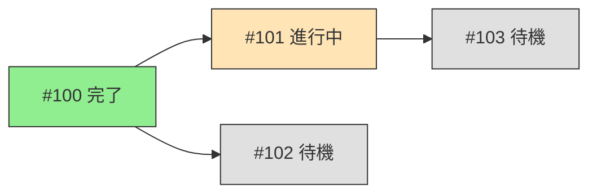
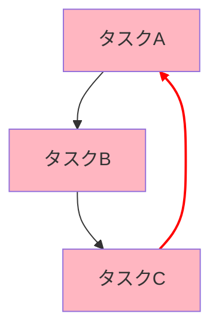
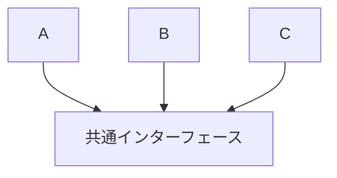
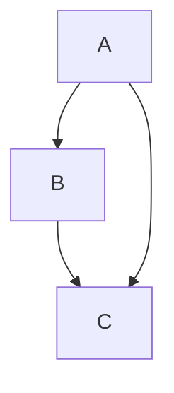
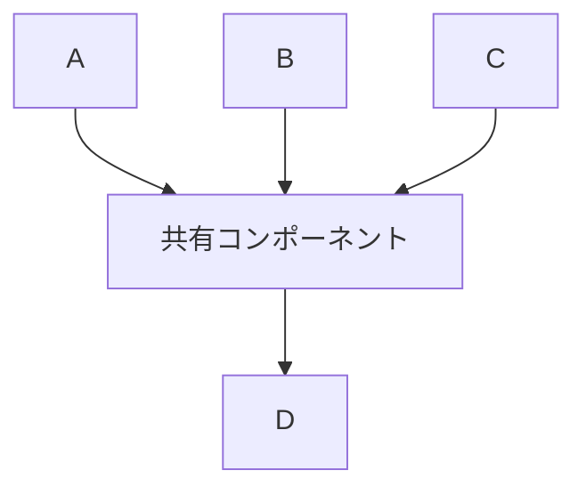

# タスク分解テンプレート

このファイルはタスク分解で使用するテンプレート集です。

## 1. Issue 本文テンプレート

### 1.1 標準 Issue テンプレート

```markdown
## 概要

[機能・タスクの概要を1-2文で説明]

## 詳細

[詳細な説明。実装方針、技術的な考慮事項など]

## 受け入れ条件

- [ ] [測定可能な条件1]
- [ ] [測定可能な条件2]
- [ ] [測定可能な条件3]

## 依存関係

- depends_on: [依存する Issue があれば]
- blocks: [この Issue がブロックしている Issue があれば]

## 備考

[補足情報、参考資料へのリンクなど]
```

### 1.2 機能追加 Issue テンプレート

```markdown
## 概要

{機能名}を実装する。

## 詳細

### 背景
[なぜこの機能が必要か]

### 実装方針
[どのように実装するか]

### 影響範囲
- 変更するファイル: [ファイルパス]
- 影響を受けるコンポーネント: [コンポーネント名]

## 受け入れ条件

- [ ] {機能}が動作すること
- [ ] ユニットテストが追加されていること
- [ ] ドキュメントが更新されていること
- [ ] make check-all がパスすること

## 依存関係

- depends_on: なし

## 備考

- 関連ドキュメント: [リンク]
```

### 1.3 バグ修正 Issue テンプレート

```markdown
## 概要

{問題の概要}を修正する。

## 詳細

### 現象
[発生している問題の詳細]

### 再現手順
1. [手順1]
2. [手順2]
3. [手順3]

### 期待される動作
[本来あるべき動作]

### 原因（わかっている場合）
[問題の原因]

## 受け入れ条件

- [ ] 問題が解消されていること
- [ ] 回帰テストが追加されていること
- [ ] 関連するテストがパスすること

## 依存関係

- depends_on: なし

## 備考

- エラーログ: [ログの抜粋]
- 関連 Issue: [あれば]
```

## 2. project.md セクションテンプレート

### 2.1 パッケージ開発モード

```markdown
## 実装タスク

### フェーズ 1: 基盤構築

#### 機能 1.1: {機能名}
- Issue: [#{番号}]({URL})
- 優先度: high
- ステータス: todo
- 依存関係:
  - depends_on: なし
  - blocks: [#{番号}]({URL})
- 説明: {機能の説明}
- 受け入れ条件:
  - [ ] {条件1}
  - [ ] {条件2}

#### 機能 1.2: {機能名}
- Issue: [#{番号}]({URL})
- 優先度: medium
- ステータス: todo
- 依存関係:
  - depends_on: [#{番号}]({URL})
- 説明: {機能の説明}
- 受け入れ条件:
  - [ ] {条件1}
  - [ ] {条件2}

### フェーズ 2: コア機能

#### 機能 2.1: {機能名}
...
```

### 2.2 軽量プロジェクトモード

```markdown
# {プロジェクト名}

**GitHub Project**: [#{番号}]({URL})

## タスク一覧

### 準備

- [ ] {タスク名1}
  - Issue: [#{番号}]({URL})
  - ステータス: todo
- [ ] {タスク名2}
  - Issue: [#{番号}]({URL})
  - ステータス: todo

### 実装

- [ ] {タスク名3}
  - Issue: [#{番号}]({URL})
  - ステータス: todo
- [ ] {タスク名4}
  - Issue: [#{番号}]({URL})
  - ステータス: todo

### テスト

- [ ] {タスク名5}
  - Issue: [#{番号}]({URL})
  - ステータス: todo
```

## 3. 依存関係グラフテンプレート

### 3.1 シンプルな依存関係

```mermaid
graph TD
    A[#100 {タスク1}] --> B[#101 {タスク2}]
    A --> C[#102 {タスク3}]
    B --> D[#103 {タスク4}]
    C --> D
```

### 3.2 Wave 分析付きグラフ

```mermaid
graph TD
    subgraph Wave1[Wave 1: 並行開発可能]
        A[#100 {タスク1}]
        B[#101 {タスク2}]
    end

    subgraph Wave2[Wave 2]
        C[#102 {タスク3}]
        D[#103 {タスク4}]
    end

    subgraph Wave3[Wave 3]
        E[#104 {タスク5}]
    end

    A --> C
    A --> D
    B --> D
    C --> E
    D --> E

    style A fill:#90EE90
    style B fill:#90EE90
    style C fill:#FFE4B5
    style D fill:#FFE4B5
    style E fill:#FFB6C1
```

### 3.3 ステータス付きグラフ



### 3.4 循環依存の警告表示



## 4. 分解結果レポートテンプレート

### 4.1 タスク分解完了レポート

```markdown
================================================================================
                    タスク分解完了
================================================================================

## 分解結果
- 元の要件: {requirement_title}
- 分解数: {task_count} タスク
- 総見積もり時間: {total_hours} 時間

## タスク一覧

| # | タイトル | 優先度 | 依存 | 見積もり |
|---|----------|--------|------|----------|
| 1 | {タスク1} | high | - | 1h |
| 2 | {タスク2} | high | #1 | 2h |
| 3 | {タスク3} | medium | #1 | 1.5h |
| 4 | {タスク4} | medium | #2, #3 | 2h |

## 依存関係グラフ

```mermaid
graph TD
    A[#1 {タスク1}] --> B[#2 {タスク2}]
    A --> C[#3 {タスク3}]
    B --> D[#4 {タスク4}]
    C --> D
```

## Wave 分析

| Wave | タスク | 並行開発可能 |
|------|--------|--------------|
| 1 | #1 | - |
| 2 | #2, #3 | ✓ |
| 3 | #4 | - |

## 次のステップ

1. Issue を作成:
```bash
gh issue create --title "{タスク1}" --body "..." --label "enhancement"
```

2. Project に追加:
```bash
gh project item-add {project_number} --owner @me --url {issue_url}
```

================================================================================
```

### 4.2 類似タスク判定レポート

```markdown
================================================================================
                    類似タスク判定結果
================================================================================

## 対象タスク
タイトル: {new_task_title}
説明: {new_task_description}

## 類似 Issue 一覧

### 高類似度（70%以上）

| Issue | タイトル | 類似度 | 推奨アクション |
|-------|----------|--------|----------------|
| #{number} | {title} | {percentage}% | sub-issue として追加 |

### 中類似度（40-70%）

| Issue | タイトル | 類似度 | 推奨アクション |
|-------|----------|--------|----------------|
| #{number} | {title} | {percentage}% | ユーザー確認 |

### 低類似度（40%未満）

類似 Issue なし → 新規 Issue として作成を推奨

## 判定結果

推奨: {new_issue | sub_issue | confirm_with_user}
対象 Issue: #{number}（該当する場合）

================================================================================
```

### 4.3 循環依存検出レポート

```markdown
================================================================================
                    ⚠️ 循環依存を検出
================================================================================

## 循環パス

{タスクA} → {タスクB} → {タスクC} → {タスクA}

## 依存関係の詳細

| From | To | 依存理由 |
|------|-----|----------|
| {タスクA} | {タスクB} | {理由} |
| {タスクB} | {タスクC} | {理由} |
| {タスクC} | {タスクA} | {理由} ← 循環の原因 |

## 原因分析

{循環が発生した原因の説明}

## 解消案

### 案1: インターフェース分離



### 案2: 依存逆転



### 案3: 共有コンポーネント分離



## 推奨

案{番号}: {推奨理由}

================================================================================
```

## 5. gh コマンドテンプレート

### 5.1 Issue 作成

```bash
# 基本的な Issue 作成
gh issue create \
  --title "[{カテゴリ}] {タイトル}" \
  --body "$(cat <<'EOF'
## 概要

{概要}

## 詳細

{詳細}

## 受け入れ条件

- [ ] {条件1}
- [ ] {条件2}

## 備考

{備考}
EOF
)" \
  --label "{ラベル}"

# ラベル複数指定
gh issue create \
  --title "{タイトル}" \
  --body "{本文}" \
  --label "enhancement" \
  --label "priority:high"
```

### 5.2 Issue 更新

```bash
# 本文更新
gh issue edit {番号} --body "$(cat <<'EOF'
{更新された本文}
EOF
)"

# ラベル追加
gh issue edit {番号} --add-label "{ラベル}"

# ラベル削除
gh issue edit {番号} --remove-label "{ラベル}"
```

### 5.3 Project 操作

```bash
# Project に Issue を追加
gh project item-add {project_number} --owner @me --url {issue_url}

# Project Item 一覧取得
gh project item-list {project_number} --owner @me --format json

# ステータス更新
gh project item-edit \
  --id {item_id} \
  --project-id {project_id} \
  --field-id {status_field_id} \
  --single-select-option-id {status_option_id}
```

## 6. 使用上の注意

### 6.1 テンプレート選択ガイド

| 状況 | 使用するテンプレート |
|------|----------------------|
| 新規機能追加 | 機能追加 Issue テンプレート |
| バグ修正 | バグ修正 Issue テンプレート |
| パッケージ開発 | パッケージ開発モード project.md |
| 軽量プロジェクト | 軽量プロジェクトモード project.md |
| 依存関係可視化 | 適切な Mermaid テンプレート |

### 6.2 カスタマイズのポイント

- `{...}` プレースホルダーを実際の値に置換
- 不要なセクションは削除
- プロジェクト固有の情報を追加
- ラベルはプロジェクトの規約に従う
