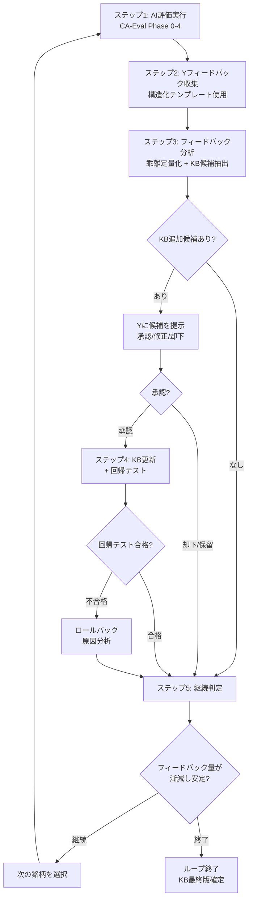

# CA-Eval ワークフロー詳細設計書

> 作成日: 2026-02-17
> 前提: [Dify詳細設計書](../memo/dify_workflow_design.md) | [Dify比較表](dify_comparison.md)
> 上位文書: [CAGR推定フレームワーク](../memo/cagr_estimation_framework.md)
> 上位文書: [Dogma](../Competitive_Advantage/analyst_YK/dogma.md)

---

## 1. 概要

本文書は、Difyワークフロー（KYの投資判断を模倣する競争優位性評価）を Claude Code Agent Teams で再実装するための詳細設計書である。

### 目的

アナリストレポートと SEC EDGAR ライブデータを入力として、KYの12ルール＋補足に基づく競争優位性評価レポートを自動生成する。

### 設計原則

| 原則 | 内容 | Difyからの変更 |
|------|------|----------------|
| KYの暗黙知のみ注入 | 外部フレームワーク（Seven Powers等）は導入しない | 変更なし |
| 主張は破棄しない | ファクトチェック失敗でもアノテーション付きで保持 | 変更なし |
| 全KB直接読み込み | RAG不要。25ファイル（~62KB）を全てコンテキストに含める | **新規**（RAG→直接読み込み） |
| SECライブデータ | KB4の手動アップロードを SEC EDGAR MCP に置換 | **新規** |
| 並列実行 | Phase 1: 3並列、Phase 3: 2並列で時間短縮 | **新規** |
| 自動精度検証 | phase2_KYデータとの数値比較を自動実行 | **新規** |

### プロジェクト全体の位置づけ

```
Phase 1-2（完了）: Yの暗黙知を抽出・体系化（12ルール, 12パターン, 5 few-shot）
    ↓
Phase 0-4（本設計書）: AIでYの判断をレプリケート（CA-Eval自動評価）
    ↓
暗黙知拡充ループ（本設計書 §14）: AI評価 → Yフィードバック → KB更新 → 反復
```

---

## 2. ナレッジベース設計

### 2.1 KB一覧（直接読み込み方式）

| KB | 名称 | ファイルパス | ファイル数 | 合計サイズ | 使用タスク |
|----|------|------------|-----------|-----------|-----------|
| KB1 | ルール集 | `analyst/Competitive_Advantage/analyst_YK/kb1_rules/*.md` | 8 | ~15KB | T4, T8 |
| KB2 | パターン集 | `analyst/Competitive_Advantage/analyst_YK/kb2_patterns/*.md` | 12 | ~20KB | T6, T8 |
| KB3 | few-shot集 | `analyst/Competitive_Advantage/analyst_YK/kb3_fewshot/*.md` | 5 | ~15KB | T4 |
| Dogma | 判断軸 | `analyst/Competitive_Advantage/analyst_YK/dogma.md` | 1 | ~12KB | 全タスク |
| **合計** | | | **26** | **~62KB** | |

### 2.2 KB1: ルール集（8ファイル直接読み込み）

**✅ 実体確認済み**: `analyst/Competitive_Advantage/analyst_YK/kb1_rules/` (2026-02-17)

| ファイル | ルール | カテゴリ | サイズ | 重要度 |
|---------|--------|---------|--------|--------|
| `rule01_capability_not_result.md` | ルール1: 能力・仕組み ≠ 結果・実績 | 優位性の定義 | 3.0KB | ★★★ |
| `rule02_noun_attribute.md` | ルール2: 名詞で表現される属性 | 優位性の定義 | 1.9KB | ★★★ |
| `rule04_quantitative_evidence.md` | ルール4: 定量的裏付け | 裏付けの質 | 2.2KB | ★★ |
| `rule06_structural_vs_complementary.md` | ルール6: 構造的 vs 補完的を区別 | 優位性の定義 | 2.0KB | ★★★ |
| `rule07_pure_competitor_differentiation.md` | ルール7: 純粋競合への差別化 | 裏付けの質 | 2.2KB | ★★ |
| `rule08_strategy_not_advantage.md` | ルール8: 戦略 ≠ 優位性 | 優位性の定義 | 2.5KB | ★★★ |
| `rule10_negative_case.md` | ルール10: ネガティブケース（断念例） | 裏付けの質 | 2.3KB | ★ |
| `rule11_industry_structure_fit.md` | ルール11: 業界構造×企業ポジション合致 | 裏付けの質 | 2.6KB | ★★★ |

**ファイル構造**（全ルール共通）:
- **ルール定義**: 明確な基準
- **良い例**: KYが高評価したケース（実銘柄・実スコア付き）
- **悪い例**: KYが低評価したケース（実銘柄・実スコア付き）
- **KYの原文**: feedback.md からの直接引用

**重要な発見**:
- **ルール2の教訓**: REASONING段階での批判的推論を最終出力まで反映すべき → **T8検証の核心**
- **ルール11の厳格性**: 90%評価は業界構造×企業ポジション合致のみ（全34件中2件 = 6%）

**Difyとの差異**: RAG検索による取りこぼしゼロ。全8ルールが常にコンテキストに含まれる。

### 2.3 KB2: パターン集（12ファイル直接読み込み）

**✅ 実体確認済み**: `analyst/Competitive_Advantage/analyst_YK/kb2_patterns/` (2026-02-17)

#### 却下パターン（confidence 低下）

| ファイル | パターン | 名称 | サイズ | 影響 | 確信度 |
|---------|---------|------|--------|------|--------|
| `pattern_A_result_as_cause.md` | A | 結果を原因と取り違え | 1.8KB | -30%以上 | 30%以下 |
| `pattern_B_industry_common.md` | B | 業界共通で差別化にならない | 2.1KB | -30%以上 | 20-30% |
| `pattern_C_causal_leap.md` | C | 因果関係の飛躍 | 2.0KB | -20% | 30% |
| `pattern_D_qualitative_only.md` | D | 定性的で定量的裏付けなし | 1.9KB | -10〜20% | 10-20% |
| `pattern_E_factual_error.md` | E | 事実誤認 | 1.7KB | → 10% | 10% |
| `pattern_F_strategy_confusion.md` | F | 戦略を優位性と混同 | 2.0KB | -20% | 30% |
| `pattern_G_unclear_vs_pure_competitor.md` | G | 純粋競合に対する優位性不明 | 1.9KB | -10〜20% | 30-50% |

#### 高評価パターン（confidence 上昇）

| ファイル | パターン | 名称 | サイズ | 影響 | 確信度 |
|---------|---------|------|--------|------|--------|
| `pattern_I_quantitative_differentiation.md` | I | 定量的裏付けのある差別化 | 1.9KB | +20% | 70-90% |
| `pattern_II_direct_cagr_mechanism.md` | II | 直接的なCAGR接続メカニズム | 2.3KB | +20% | 90% |
| `pattern_III_capability_over_result.md` | III | 能力 > 結果（プロセスの評価） | 1.9KB | +10〜20% | 70% |
| `pattern_IV_structural_market_position.md` | IV | 構造的な市場ポジション | 2.2KB | +30% | 90% |
| `pattern_V_specific_competitor_comparison.md` | V | 競合との具体的比較 | 2.2KB | +10〜20% | 70% |

**ファイル構造**（全パターン共通）:
- **パターン定義**: 明確な検出基準
- **具体例**: 実銘柄での適用例（ORLY, COST, MNST等）
- **KYのルール**: 原則の直接引用
- **検出のチェックポイント**: 実装時の判定基準

**適用順序の重要性**:
1. **却下パターン（A-G）を先に適用** → confidence 下方調整
2. **高評価パターン（I-V）を後で適用** → confidence 上方調整

**Difyとの差異**: 12パターン全てが同時に参照可能。Difyでは Top-K=4 のため最大4パターンしか検索できなかった。

### 2.4 KB3: few-shot集（5ファイル直接読み込み）

**✅ 実体確認済み**: `analyst/Competitive_Advantage/analyst_YK/kb3_fewshot/` (2026-02-17)

| ファイル | 銘柄 | サイズ | 平均優位性スコア | 特徴 | KYが重視した視点 |
|---------|------|--------|----------------|------|----------------|
| `fewshot_ORLY.md` | ORLY | 3.5KB | 63%（最高） | 90%評価×2件 | 市場構造（フラグメント）×企業ポジション（規模・密度）の合致 |
| `fewshot_COST.md` | COST | 3.3KB | 39%（最低） | 分散大（10%〜90%） | 数値裏付けの有無、純粋競合（SAMS CLUB）との差別化 |
| `fewshot_MNST.md` | MNST | 2.9KB | 40% | 事実誤認は即却下 | シェア=結果の原則、ブランド力の背後要因 |
| `fewshot_CHD.md` | CHD | 3.5KB | 50% | 能力vs結果の区別 | ポート管理運営力（能力）vs ポートシフト（結果） |
| `fewshot_LLY.md` | LLY | 3.7KB | 47% | 業界共通能力を厳しく批判 | メガファーマ共通能力は30%、Novo対比で70% |

**ファイル構造**（全銘柄共通）:
- **銘柄概要**: 平均スコア、特徴、KYの全体印象
- **主張一覧と評価**: 各主張のスコア、KYの理由、KYの指摘、該当ルール/パターン
- **KYが重視した視点**: 銘柄ごとの判断基準のポイント

**確信度スケールの実分布**（全34件）:

| 確信度 | 件数 | 割合 | 特徴 |
|--------|------|------|------|
| 90% | 2 | 6% | **極めて稀**。業界構造×企業ポジション合致のみ（ORLY#2, #5） |
| 70% | 8 | 26% | 定量的裏付け、競合との具体的比較 |
| **50%** | **11** | **35%** | **最頻値**。方向性は認めるが裏付け不十分 |
| 20-30% | 8 | 26% | 業界共通、因果関係の飛躍 |
| 10% | 2 | 6% | 事実誤認（MNST#6）、定性的で評価不可能（COST#2） |

**重要な発見**:
- **50%がデフォルト**: KYは多くの仮説を「まあ納得」と評価する傾向
- **90%は極めて厳格**: 業界構造分析なしに90%を付与してはならない
- **数値裏付けの影響**: COST#1（退職率9% vs 20%+）→ 70%、COST#2（劇場的価値）→ 10%

**Difyとの差異**: 5銘柄の全評価例が常に参照可能。KYのスコア分布傾向のキャリブレーションが正確に。

### 2.5 KB4 → SEC EDGAR MCP（完全置換）

Difyの KB4（10-K/10-Q 手動アップロード）を SEC EDGAR MCP ツールで完全に置換。

| Dify | Claude Code | 改善 |
|------|------------|------|
| 銘柄ごとにKB作成 | `mcp__sec-edgar-mcp__get_financials` | 手動作業ゼロ |
| セクション単位でチャンク分割 | `mcp__sec-edgar-mcp__get_filing_sections` | チャンク設計不要 |
| 手動アップロード必要 | ティッカー指定のみ | 常に最新データ |
| 静的データ | ライブ取得 | 更新不要 |
| PoC対象銘柄のみ | 任意の米国上場企業 | 銘柄制限なし |

---

## 3. ワークフロー設計

### 3.1 全体構成: 10タスク・5フェーズ

```
/ca-eval ORLY
    |
    Phase 0: Setup (Lead直接実行)
    |-- [T0] research-meta.json作成 + ディレクトリ作成
    |       [HF0] パラメータ確認
    |
    Phase 1: データ収集 (3並列)
    |-- [T1] sec-collector (finance-sec-filings) ----+
    |-- [T2] report-parser (ca-report-parser) -------+ 並列
    |-- [T3] industry (industry-researcher) ---------+
    |
    Phase 2: 主張抽出 + ルール適用 (直列)
    |-- [T4] extractor (ca-claim-extractor)
    |       blockedBy: [T1, T2, T3]
    |
    Phase 3: ファクトチェック + パターン検証 (2並列)
    |-- [T5] fact-checker (ca-fact-checker) ----------+
    |-- [T6] pattern-verifier (ca-pattern-verifier) --+ 並列
    |       blockedBy: [T4]
    |       [HF1] 中間品質レポート
    |
    Phase 4: レポート生成 + 検証 (直列)
    |-- [T7] reporter (ca-report-generator)
    |       blockedBy: [T5, T6]
    |-- [T8] Lead: レポート3層検証
    |-- [T9] Lead: 精度検証 (常時実行: フル or 簡易モード)
    |       [HF2] 最終出力
    |
    Phase 5: Cleanup (TeamDelete)
```

### 3.2 Difyステップとの対応

| Dify ステップ | Claude Code タスク | 改善点 |
|-------------|-------------------|--------|
| 知識検索①(KB4) + LLM①(主張抽出) | **T4: ca-claim-extractor** | KB1+KB3も同時読み込み。RAG不要 |
| 知識検索②(KB1+KB3) + LLM②(ルール適用) | **T4に統合** | ステップ分離不要 |
| 知識検索③(KB4) + LLM③(ファクトチェック) | **T5: ca-fact-checker** | SEC EDGAR MCPで追加検証 |
| 知識検索④(KB2) + LLM④(検証/JSON) | **T6: ca-pattern-verifier** | 12パターン全て同時参照 |
| LLM⑤(レポート生成) | **T7: ca-report-generator** | 全検証結果を統合 |
| 知識検索⑤(KB1+KB2) + LLM⑥(レポート検証) | **T8: Lead直接実行** | 3層検証 |
| *(なし)* | **T1: SEC Filings取得** | 新機能: KB4の完全置換 |
| *(なし)* | **T2: Report Parser** | 新機能: ①/②区別 |
| *(なし)* | **T3: Industry Research** | 新機能: 業界データ |
| *(なし)* | **T9: 精度検証** | 新機能: 自動精度比較 |

---

## 4. 各タスクの詳細設計

### 4.1 T0: Setup（Lead直接実行）

**リサーチID生成**: `CA_eval_{YYYYMMDD}_{TICKER}`

**ディレクトリ作成**:
```
research/CA_eval_{YYYYMMDD}_{TICKER}/
├── 00_meta/
│   └── research-meta.json
├── 01_data_collection/
├── 02_claims/
├── 03_verification/
├── 04_output/
└── 05_feedback/
```

**レポート検索**:
1. `report_path` が指定されていればそれを使用
2. 未指定の場合は `analyst/raw/` 配下で ticker に一致するファイルを Glob 検索
3. 見つからない場合はエラー

**research-meta.json 出力**:
```json
{
  "research_id": "CA_eval_20260217_ORLY",
  "type": "ca_eval",
  "ticker": "ORLY",
  "created_at": "2026-02-17T10:00:00Z",
  "parameters": {
    "ticker": "ORLY",
    "report_path": "analyst/raw/ORLY_report.md"
  },
  "status": "in_progress",
  "workflow": {
    "phase_0": "done",
    "phase_1": "pending",
    "phase_2": "pending",
    "phase_3": "pending",
    "phase_4": "pending",
    "phase_5": "pending"
  }
}
```

### 4.2 T1: SEC Filings 取得（finance-sec-filings）

**エージェント**: `finance-sec-filings`（既存、stock モード）

**処理内容**:
- 5年分の財務データ（損益/BS/CF）
- 直近2年分の 10-K/10-Q
- 直近1年の 8-K イベント
- インサイダー取引サマリー
- キーメトリクス
- 10-K セクション（Business, Risk Factors, Properties, MD&A）

**出力**: `{research_dir}/01_data_collection/sec-data.json`

**致命度**: Fatal=Yes（SEC データなしでは主張検証が不可能）

### 4.3 T2: Report Parser（ca-report-parser）

**エージェント**: `ca-report-parser`（新規）

**処理内容**:
1. レポート種別の判定（**期初投資仮説レポート** / **四半期継続評価レポート** / 混合）
2. セクション分割（投資テーゼ、事業概要、競争優位性、財務分析等）
3. レポート種別の帰属付与
4. 競争優位性の抽出候補、事実の主張、CAGR参照を識別

**出力**: `{research_dir}/01_data_collection/parsed-report.json`

**致命度**: Fatal=Yes（レポート解析なしでは主張抽出が不可能）

### 4.4 T3: Industry Research（industry-researcher）

**エージェント**: `industry-researcher`（既存）

**処理内容**:
- 業界構造・市場規模
- 主要プレイヤー・競争環境
- 参入障壁・モート
- dogma.md 12判断ルールに基づく競争優位性の予備評価

**出力**: `{research_dir}/01_data_collection/industry-context.json`

**致命度**: Fatal=No（業界データなしでも主張抽出・評価は可能。縮小版で続行）

### 4.5 T4: Claim Extraction + Rule Application（ca-claim-extractor）

**エージェント**: `ca-claim-extractor`（新規）

**Difyからの統合**: ステップ1（主張抽出）+ ステップ2（ルール適用）

**入力ファイル**:
- `{research_dir}/01_data_collection/sec-data.json`（T1, 必須）
- `{research_dir}/01_data_collection/parsed-report.json`（T2, 必須）
- `{research_dir}/01_data_collection/industry-context.json`（T3, 任意）
- `analyst/Competitive_Advantage/analyst_YK/dogma.md`
- `analyst/Competitive_Advantage/analyst_YK/kb1_rules/` 配下 8ファイル
- `analyst/Competitive_Advantage/analyst_YK/kb3_fewshot/` 配下 5ファイル

**処理内容**:
1. **主張抽出**: parsed-report.json の `advantage_candidates` から 5-15件を抽出
2. **ルール適用**: KB1の8ルール + ゲートキーパー（ルール9, 3）を適用
3. **KB3キャリブレーション**: 5銘柄の評価例を参照し確信度を調整
4. **①/②区別**: ルール12を適用

**出力スキーマ**: Dify設計書§6 に準拠した claims.json

**出力**: `{research_dir}/02_claims/claims.json`

**致命度**: Fatal=Yes（主張抽出が全ての下流タスクの基盤）

### 4.6 T5: Fact Check（ca-fact-checker）

**エージェント**: `ca-fact-checker`（新規）

**Dify対応**: ステップ3

**入力ファイル**:
- `{research_dir}/02_claims/claims.json`（T4, 必須）
- `{research_dir}/01_data_collection/sec-data.json`（T1, 必須）
- SEC EDGAR MCP ツール（追加検証用）

**処理内容**:
1. 各 `factual_claim` を sec-data.json と照合
2. sec-data.json で不足する場合は SEC EDGAR MCP ツールで追加取得
3. `verified` / `contradicted` / `unverifiable` を判定
4. `contradicted` → ルール9自動適用（confidence → 10%）

**出力**: `{research_dir}/03_verification/fact-check.json`

**致命度**: Fatal=No（ファクトチェック失敗時は全件 unverifiable として続行）

### 4.7 T6: Pattern Verification（ca-pattern-verifier）

**エージェント**: `ca-pattern-verifier`（新規）

**Dify対応**: ステップ4

**入力ファイル**:
- `{research_dir}/02_claims/claims.json`（T4, 必須）
- `analyst/Competitive_Advantage/analyst_YK/kb2_patterns/` 配下 12ファイル
- `analyst/Competitive_Advantage/analyst_YK/dogma.md`

**処理内容**:
1. 各主張を却下パターン A-G と照合（confidence 下方調整）
2. 各主張を高評価パターン I-V と照合（confidence 上方調整）
3. CAGR接続のパターン照合（パターンII特化）
4. 一貫性チェック（同じパターンに同じロジック適用、KY基準との分布比較）

**出力**: `{research_dir}/03_verification/pattern-verification.json`

**致命度**: Fatal=No（パターン検証なしでもレポート生成は可能）

### 4.8 T7: Report Generation（ca-report-generator）

**エージェント**: `ca-report-generator`（新規）

**Dify対応**: ステップ5

**入力ファイル**:
- `{research_dir}/02_claims/claims.json`（T4, 必須）
- `{research_dir}/03_verification/fact-check.json`（T5, 任意）
- `{research_dir}/03_verification/pattern-verification.json`（T6, 任意）
- `analyst/Competitive_Advantage/analyst_YK/dogma.md`

**処理内容**:
1. claims.json にファクトチェック結果とパターン検証結果をマージ
2. 最終 confidence を算出（5層評価ロジック）
3. Markdown レポート生成（フィードバックテンプレート埋込）
4. 構造化 JSON（five_layer_evaluation 含む）生成

**出力**:
- `{research_dir}/04_output/report.md`
- `{research_dir}/04_output/structured.json`

**致命度**: Fatal=Yes

#### 4.8.1 report.md テンプレート仕様

**要件**:
- 想定読者: Y + 他のチームメンバー（文脈説明を含む）
- 分量: 5-8ページ相当
- フィードバックテンプレートは暗黙知拡充ループ（§14）と整合

**セクション構成と分量**:

```
report.md（全体 5-8ページ相当）
├── 1. ヘッダー情報（~0.3ページ）
├── 2. 評価サマリーテーブル（~0.5ページ）
├── 3. 個別主張セクション x N件（~3-5ページ、各 0.4-0.6ページ）
├── 4. CAGR接続サマリー（~0.5ページ）
├── 5. 警鐘セクション（~0.3ページ）
├── 6. 全体フィードバックセクション（~0.3ページ）
└── 7. メタデータ・技術情報（折りたたみ、~0.1ページ）
```

**セクション1: ヘッダー情報**:

```markdown
# [TICKER] 競争優位性評価レポート

| 項目 | 値 |
|------|-----|
| **対象銘柄** | [TICKER]（[企業名]） |
| **入力レポート** | [report_source]（①期初 / ②四半期 / 混合） |
| **生成日** | [YYYY-MM-DD] |
| **リサーチID** | [research_id] |
| **データソース** | SEC EDGAR (MCP), アナリストレポート, 業界分析 |
| **KBバージョン** | [kb_version] |
| **主張数** | 競争優位性 [N]件 / CAGR接続 [N]件 / 事実 [N]件 |
```

**セクション2: 評価サマリーテーブル**:

Phase 2のYの評価テーブル形式（横型テーブル）に合わせる。

```markdown
## 評価サマリー

| # | 優位性 | AI確信度 | CAGR接続 | CAGR確信度 |
|---|--------|---------|----------|-----------|
| 1 | [主張テキスト（30字以内に要約）] | [X]% | [接続先・寄与内容] | [Y]% |
| 2 | ... | ... | ... | ... |

### 確信度分布

| 確信度 | AI評価 | KY基準値 | 判定 |
|--------|--------|---------|------|
| 90%（かなり納得） | [N]件 ([X]%) | 6% | [OK/要確認] |
| 70%（おおむね納得） | [N]件 ([X]%) | 26% | [OK/要確認] |
| 50%（まあ納得） | [N]件 ([X]%) | 35% | [OK/要確認] |
| 30%（あまり納得しない） | [N]件 ([X]%) | 26% | [OK/要確認] |
| 10%（却下） | [N]件 ([X]%) | 6% | [OK/要確認] |

### ファクトチェック結果サマリー

- verified: [N]件 / contradicted: [N]件 / unverifiable: [N]件 / not_checked: [N]件
```

**判定ロジック**: AI出現率がKY基準値から15%以上乖離 → 「要確認」。

**セクション3: 個別主張セクション**（テンプレート）:

```markdown
---

### #[N]: [主張テキスト]

**分類**: [descriptive_label]
**レポート種別**: ①期初投資仮説レポート / ②四半期継続評価レポート
[②の場合のみ表示:]
> ⚠️ この主張は四半期レビュー（②）から抽出されました。
> 期初レポート（①）での妥当性を再検討してください。

#### AI評価: [ランク名]（[X]%）

[2-3文のコメント。5層評価に基づく。結論→根拠→改善提案の順。]
[重要な指摘は<u>下線</u>で強調]

#### CAGR接続

| パラメータ | AI確信度 | コメント |
|-----------|---------|---------|
| 売上成長寄与 +X% | [Y]% | [1-2文] |
| マージン改善寄与 +X% | [Z]% | [1-2文] |

#### 根拠（アナリストレポートより）

[evidence_from_report]

#### ルール適用結果

| ルール | 判定 | 根拠 |
|--------|------|------|
| ルール[N] | [verdict] | [reasoning（1文）] |

※ 該当ルールのみ記載。

#### 検証結果

- **ファクトチェック**: [verified/contradicted/unverifiable/not_checked]
  - [検証の詳細（1-2文）]
- **パターン照合**:
  - 高評価: [該当パターン名 + 概要] / なし
  - 却下: [該当パターン名 + 概要] / なし

---

**納得度:**  10% / 30% / 50% / 70% / 90%  ← 丸をつける

**該当する質問に一言お願いします（1文で十分です）:**
- 納得しない場合 → 一番引っかかる点は？
- どちらとも言えない場合 → 何があれば納得度が上がる？
- 納得する場合 → 他の企業でも同じことが言えない理由は？

回答:


**この指摘は他の銘柄にも当てはまりますか？（任意）**
□ はい → KB追加候補として記録
□ いいえ → この銘柄固有の判断
□ わからない

**補足（任意）:**


---
```

**設計判断**:
- ルール適用結果は**該当ルールのみ記載**（全ルール列挙は冗長）
- コメントは2-3文（dogma.md「コメント記述ルール」5原則準拠）
- `<u>`下線はYのPhase 2スタイルに合わせて使用
- 「他の銘柄にも当てはまりますか」は暗黙知拡充ループ（§14.3）と整合

**セクション4: CAGR接続サマリー**:

```markdown
## CAGR接続サマリー

### 構造的 vs 補完的の区分

| # | CAGR接続 | 区分 | 寄与パラメータ | AI確信度 | ソース優位性 |
|---|---------|------|-------------|---------|------------|
| C1 | [接続テキスト] | 構造的 / 補完的 | 売上成長 +X% | [Y]% | #[N] |

### CAGR接続の全体評価

[1-2段落: 因果チェーンの直接性、TAM→シェア→利益率の中間ステップ有無、
 ブレークダウン数値の根拠妥当性、①/②由来の区別]
```

**セクション5: 警鐘セクション**:

```markdown
## 警鐘事項

### ①/②区別の確認

| # | 主張 | ソース | 警戒レベル |
|---|------|--------|----------|
| [N] | [主張テキスト] | ②四半期レビュー | ⚠️ 拡大解釈の可能性 |

### 既存判断への警鐘

[1-2段落: 既存判断への無批判的追従、①の前提の現在の合理性、
②の積み重ねからの拡大解釈、銘柄間の推論パターン一貫性]
```

**セクション6: 全体フィードバックセクション**:

```markdown
## 全体フィードバック

**レポート全体として、あなたの考え方に沿った議論ができていますか？**
□ 概ね沿っている  □ 部分的に沿っている  □ 沿っていない

**最も良かった主張の番号:**  #___
**最も問題のある主張の番号:**  #___

**全体的な印象（自由記述）:**


**AIの評価で最も違和感のある点（1文で十分です）:**

```

**セクション7: メタデータ**:

`<details>` タグで折りたたみ。KBバージョン、ロード数、データ利用可否、実行時間。

#### 4.8.2 structured.json スキーマ（five_layer_evaluation 追加）

既存スキーマに `five_layer_evaluation` フィールドを追加:

```json
{
  "claims": [
    {
      "id": 1,
      "claim_type": "competitive_advantage",
      "claim": "主張テキスト",
      "descriptive_label": "ラベル",
      "evidence_from_report": "根拠",
      "report_type_source": "initial | quarterly",
      "supported_by_facts": [3, 4],
      "cagr_connections": [2],
      "rule_evaluation": { "...既存..." },
      "verification": { "...既存..." },
      "five_layer_evaluation": {
        "layer_1_prerequisite": {
          "rule_9_factual_accuracy": "pass | fail",
          "rule_3_relative_advantage": "pass | fail"
        },
        "layer_2_nature": {
          "rule_1_capability_vs_result": "capability | result",
          "rule_2_noun_test": "pass | fail",
          "rule_8_strategy_vs_advantage": "advantage | strategy"
        },
        "layer_3_evidence": {
          "rule_4_quantitative": "present | absent",
          "rule_7_pure_competitor": "present | absent",
          "rule_10_negative_case": "present | absent",
          "rule_11_industry_structure": "strong_fit | weak_fit | absent"
        },
        "layer_4_cagr": {
          "rule_5_directness": "direct | indirect",
          "rule_6_structural_vs_complementary": "structural | complementary",
          "verifiability": "high | medium | low"
        },
        "layer_5_source": {
          "rule_12_source_type": "initial | quarterly",
          "overinterpretation_risk": "low | medium | high"
        }
      },
      "ai_comment": "2-3文のコメント"
    }
  ],
  "summary": {
    "...既存...",
    "warning_flags": {
      "quarterly_derived_claims": 1,
      "overinterpretation_risks": 0,
      "confidence_distribution_anomaly": false
    }
  }
}
```

### 4.9 T8: Report Verification（Lead直接実行）

**Dify対応**: ステップ6

**処理**: report.md と structured.json を3層で検証し、問題を自動修正して verified-report.md を生成する。

**出力**:
- `{research_dir}/04_output/verified-report.md`（自動修正済みレポート）
- `{research_dir}/04_output/verification-results.json`（検証結果 + 修正履歴）

#### 4.9.1 重大度分類

| 重大度 | 定義 | 対処 |
|--------|------|------|
| **Critical** | Yへの信頼性を損なう問題 | 必ず自動修正 |
| **Warning** | Yの指摘を予測できる問題 | 自動修正 + `[⚠️ T8修正]` 注釈 |
| **Info** | 改善提案レベル | verification-results.json に記録のみ |

#### 4.9.2 検証層A: JSON-レポート整合性（7項目）

| ID | チェック項目 | 重大度 | 自動修正 |
|----|-------------|--------|---------|
| A-1 | 主張の網羅性（JSON全件がMDに記載） | Critical | 欠落主張を追記 |
| A-2 | confidence転記の正確性 | Critical | MD値をJSON値に合わせ修正 |
| A-3 | confidenceとトーンの一致 | Critical | コメント文を書き換え |
| A-4 | ルール適用結果の反映 | Warning | 欠落ルールを追記 |
| A-5 | contradicted事実の明示 | Critical | 事実の記述を追加 |
| A-6 | パターン照合結果の反映 | Warning | パターン情報を追記 |
| A-7 | CAGR接続の対応関係 | Warning | リンク修正 |

**A-3判定ロジック**:
- confidence <= 30% かつ 肯定的表現（「納得感あり」「優位性として妥当」等） → Critical
- confidence >= 70% かつ 否定的表現が主論点 → Critical
- confidence == 50% は中間的表現が適切

#### 4.9.3 検証層B: KYルール準拠（9項目）

| ID | チェック項目 | 重大度 | 自動修正 |
|----|-------------|--------|---------|
| B-1 | ルール1（能力vs結果）の適用 | Warning | ルール1適用結果を追加 |
| B-2 | ルール2（名詞テスト）の適用 | Warning | 名詞形への変換提案を追加 |
| B-3 | ルール3（相対性）の適用 | Warning | 相対性検証コメントを追加 |
| B-4 | ルール4（定量的裏付け）の反映 | Info | 改善提案として記録 |
| B-5 | ルール7（純粋競合比較）の反映 | Warning | 競合比較の不足を指摘 |
| B-6 | ルール8（戦略vs優位性）の適用 | Warning | ルール8適用を追加 |
| B-7 | ルール9（事実誤認 → 10%）の適用 | Critical | confidence を 10% に強制修正 |
| B-8 | **ルール11なしの90%排除** | Critical | 90%→70%に引き下げ |
| B-9 | ルール12（①/②区別）フラグ | Warning | 警戒フラグを追加 |

**B-8は最重要チェック**: KB3実績で90%はORLY#2, #5のみ（全34件中2件）。いずれもパターンIV（構造的市場ポジション）を満たす。業界構造分析なしの90%は許容しない。

#### 4.9.4 検証層C: パターン一貫性（4項目）

| ID | チェック項目 | 重大度 | 自動修正 |
|----|-------------|--------|---------|
| C-1 | 却下パターン検出時のconfidence上限 | Critical | 上限値に引き下げ |
| C-2 | 高評価パターン検出時のconfidence下限 | Warning | 注釈付与 |
| C-3 | 複数パターン該当時の調整 | Warning | 却下優先で再計算 |
| C-4 | 銘柄間一貫性 | Info | 参考情報として記録 |

**C-1: 却下パターンのconfidence上限テーブル**:

| 却下パターン | confidence上限 | KB3根拠 |
|-------------|--------------|---------|
| A: 結果を原因と取り違え | 50% | CHD#4=30%, MNST#1=50% |
| B: 業界共通で差別化にならない | 30% | LLY#6=30% |
| C: 因果関係の飛躍 | 30% | MNST#5=30% |
| D: 定性的で定量的裏付けなし | 30% | COST#2=10% |
| E: 事実誤認 | 10% | 強制（ルール9） |
| F: 戦略を優位性と混同 | 50% | ORLY#2分離後90% |
| G: 純粋競合に対する優位性不明 | 50% | COST#3=50% |

**C-2: 高評価パターンのconfidence下限テーブル**:

| 高評価パターン | confidence下限 | KB3根拠 |
|---------------|--------------|---------|
| I: 定量的裏付けのある差別化 | 50% | COST#1=70% |
| II: 直接的なCAGR接続メカニズム | 50% | CAGR全般50%+ |
| III: 能力 > 結果 | 50% | CHD#1=70% |
| IV: 構造的な市場ポジション | 70% | ORLY#2,#5=90% |
| V: 競合との具体的比較 | 50% | ORLY#1=70% |

**C-3: 複数パターン該当時の解決ルール**:
1. パターンE（事実誤認）は全てに優先 → 強制10%
2. 却下パターン（A-G、E以外）を先に適用
3. 高評価パターン（I-V）を後に適用
4. 上限90%、下限10%

#### 4.9.5 自動修正の優先順位

| 順位 | 修正対象 | 対象ファイル |
|------|---------|------------|
| 1 | confidence値 | structured.json + report.md |
| 2 | コメント文 | report.md |
| 3 | 主張の追記 | report.md |
| 4 | ルール適用の追記 | report.md |
| 5 | 注釈の追加 | report.md |

全修正は verification-results.json の `corrections` 配列に記録。

#### 4.9.6 verification-results.json スキーマ

```json
{
  "research_id": "...",
  "ticker": "ORLY",
  "verification_timestamp": "2026-02-17T10:35:00Z",
  "verification_layers": {
    "layer_a_json_report_consistency": {
      "status": "pass | fail | pass_with_warnings",
      "checks": [
        {
          "check_id": "A-3",
          "name": "confidenceとトーンの一致",
          "status": "fail",
          "severity": "critical",
          "details": "主張#3（confidence 30%）のコメントが肯定的トーン",
          "affected_claims": [3]
        }
      ]
    },
    "layer_b_ky_rule_compliance": { "...同構造..." },
    "layer_c_pattern_consistency": { "...同構造..." }
  },
  "corrections": [
    {
      "correction_id": 1,
      "source_check": "A-3",
      "claim_id": 3,
      "type": "comment_rewrite | confidence_adjustment | claim_addition | annotation",
      "before": "ある程度の優位性として認められる",
      "after": "方向性は認めるが、定量的裏付けが不足しており納得感は限定的",
      "reason": "confidence 30% に対してトーンが肯定的すぎた"
    }
  ],
  "overall_status": "pass | fail | pass_with_corrections",
  "statistics": {
    "total_checks": 20,
    "passed": 18,
    "failed_critical": 1,
    "failed_warning": 1,
    "info": 0,
    "corrections_applied": 2
  }
}
```

### 4.10 T9: Accuracy Scoring（Lead直接実行、常時実行）

**Difyにない新機能**。

#### 4.10.1 モード切り替え

| モード | 対象 | 内容 |
|--------|------|------|
| **フルモード** | Phase 2の5銘柄（CHD, COST, LLY, MNST, ORLY） | AI評価 vs Y評価の主張単位比較 |
| **簡易モード** | 上記以外の全銘柄 | confidence分布+ヒューリスティック検証 |

Phase 2データファイルパターン: `analyst/phase2_KY/*_{TICKER}_phase2.md`

#### 4.10.2 フルモード

**主張マッチング**:
AI主張（competitive_advantage）とY評価の主張テキストを意味的類似性で1:1マッチング。マッチングできないものは unmatched / missing_in_ai として記録。

**乖離の定量化**:

| 乖離幅 | 分類 |
|--------|------|
| 0 | exact_match |
| 1-10% | within_target |
| 11-20% | acceptable |
| 21-30% | significant |
| 31%+ | critical |

**合格基準**:

| メトリクス | 合格基準 |
|----------|---------|
| 平均乖離（優位性） | mean(abs(AI - Y)) <= 10% |
| 平均乖離（CAGR接続） | mean(abs(AI - Y)) <= 10% |
| 最大乖離 | max(abs(AI - Y)) <= 30% |
| 20%超乖離の主張数 | <= 全主張の25% |
| 方向性バイアス | mean(AI - Y)の絶対値 <= 5% |

**不合格時**: accuracy-report.json に不合格理由を記録し報告。レポート自体は出力する（ブロックしない）。

#### 4.10.3 簡易モード（8チェック項目）

| ID | チェック項目 | 重大度 | 判定基準 |
|----|-------------|--------|---------|
| S-1 | 90%の出現率 | Warning | 全主張の15%以下（KY基準: 6%） |
| S-2 | 50%の最頻値確認 | Info | 50%付近が30%以上 |
| S-3 | 10%の希少性 | Info | 全主張の15%以下（contradicted除く） |
| S-4 | CAGR > CA平均スコア | Info | 平均CAGR確信度 >= 平均CA確信度 |
| S-5 | 却下パターンconfidence上限 | Warning | T8 C-1と同一基準 |
| S-6 | ルール11なしの90%排除 | Critical | 業界構造分析なしに90%不可 |
| S-7 | 主張数の妥当性 | Warning | 5-15件の範囲内 |
| S-8 | ルール9自動適用確認 | Critical | contradicted → 10% |

#### 4.10.4 accuracy-report.json スキーマ

```json
{
  "research_id": "...",
  "ticker": "ORLY",
  "mode": "full | simplified",
  "generated_at": "2026-02-17T10:37:00Z",
  "kb_version": "v1.0.0",
  "full_mode_results": {
    "y_data_source": "analyst/phase2_KY/phase1_ORLY_phase2.md",
    "claim_matching": {
      "ai_claims_total": 6,
      "y_evaluations_total": 6,
      "matched": 5,
      "unmatched_ai": 1,
      "missing_in_ai": 1
    },
    "advantage_accuracy": {
      "comparisons": [
        {
          "claim_id": 1,
          "ai_confidence": 70,
          "y_confidence": 70,
          "deviation": 0,
          "severity": "exact_match",
          "deviation_analysis": "一致"
        }
      ],
      "mean_abs_deviation": 8.0,
      "max_abs_deviation": 20,
      "direction_bias": "slight_underestimate"
    },
    "cagr_accuracy": { "...同構造..." },
    "overall_verdict": "pass | fail",
    "pass_criteria": {
      "mean_deviation_within_10": true,
      "max_deviation_within_30": true,
      "over_20_percent_under_25_pct": true,
      "direction_bias_within_5": true
    },
    "improvement_suggestions": ["..."]
  },
  "simplified_mode_results": {
    "checks": [
      {
        "check_id": "S-1",
        "name": "confidence分布の妥当性（90%の出現率）",
        "status": "pass | warning | fail",
        "value": "1件 (16.7%)",
        "threshold": "15%以下"
      }
    ],
    "overall_status": "pass | pass_with_warnings | fail",
    "warning_count": 1,
    "critical_count": 0
  }
}
```

---

## 5. 依存関係マトリクス

```yaml
dependency_matrix:
  # Phase 1: 全て独立（依存なし）
  T1: {}  # SEC Filings
  T2: {}  # Report Parser
  T3: {}  # Industry Research

  # Phase 2: T1-T3 に混合依存
  T4:
    T1: required   # SEC データは必須
    T2: required   # パースドレポートは必須
    T3: optional   # 業界データは任意

  # Phase 3: T4 に必須依存
  T5:
    T4: required   # claims.json は必須
  T6:
    T4: required   # claims.json は必須

  # Phase 4: T5, T6 に混合依存
  T7:
    T4: required   # claims.json は必須（ベースデータ）
    T5: optional   # fact-check.json は任意
    T6: optional   # pattern-verification.json は任意

  # T8, T9 は Lead 直接実行
  T8:
    T7: required
  T9:
    T8: required
```

---

## 6. 構造化JSON出力スキーマ

Dify設計書§6 のスキーマを踏襲し、Claude Code 固有フィールドを追加:

```json
{
  "ticker": "ORLY",
  "report_source": "アナリストA",
  "extraction_metadata": {
    "kb1_rules_loaded": 8,
    "kb3_fewshot_loaded": 5,
    "dogma_loaded": true,
    "sec_data_available": true,
    "industry_context_available": true
  },
  "claims": [
    {
      "id": 1,
      "claim_type": "competitive_advantage",
      "claim": "ローカルな規模の経済による配送・在庫の効率化",
      "descriptive_label": "配送密度による原価優位",
      "evidence_from_report": "店舗数5,800超、配送センター30拠点（レポートp.8）",
      "report_type_source": "initial",
      "supported_by_facts": [3, 4],
      "cagr_connections": [2],
      "rule_evaluation": {
        "applied_rules": ["rule_6", "rule_11"],
        "results": [
          {
            "rule": "rule_6",
            "verdict": "structural",
            "reasoning": "配送密度は競合が容易に再現できない構造的優位"
          }
        ],
        "confidence": 90,
        "confidence_adjustments": [],
        "overall_reasoning": "市場構造との合致が明確"
      },
      "verification": {
        "fact_check_status": "verified",
        "pattern_matches": ["IV"],
        "pattern_rejections": [],
        "final_confidence": 90,
        "confidence_delta": 0
      }
    },
    {
      "id": 2,
      "claim_type": "cagr_connection",
      "claim": "店舗密度の拡大 → 配送効率 → マージン改善 → 営業利益CAGR +2pp",
      "descriptive_label": "配送密度→マージン改善経路",
      "source_advantage": 1,
      "rule_evaluation": {
        "applied_rules": ["rule_5", "rule_12"],
        "results": [
          {
            "rule": "rule_5",
            "verdict": "direct",
            "reasoning": "2ステップの因果。検証可能"
          }
        ],
        "confidence": 80,
        "confidence_adjustments": [],
        "overall_reasoning": "因果メカニズムが直接的で検証可能"
      }
    },
    {
      "id": 3,
      "claim_type": "factual_claim",
      "claim": "店舗数5,829",
      "verification_status": "verified",
      "verification_attempted": [
        "2024年10-K Item 2: 'We operated 5,829 stores as of December 31, 2024'"
      ],
      "what_would_verify": null,
      "confidence_impact": "none",
      "affected_claims": [1],
      "verification_source": "sec-data.json + SEC EDGAR MCP"
    }
  ],
  "accuracy_comparison": {
    "ky_data_available": true,
    "ky_data_source": "analyst/phase2_KY/phase1_ORLY_phase2.md",
    "comparisons": [
      {
        "claim_id": 1,
        "ai_confidence": 90,
        "ky_confidence": 90,
        "deviation": 0,
        "deviation_analysis": "一致"
      }
    ],
    "average_deviation": 5.0,
    "max_deviation": 20,
    "within_target": true
  }
}
```

---

## 7. 実行時間見積もり

| フェーズ | タスク | 推定時間 | 備考 |
|---------|--------|---------|------|
| Phase 0 | T0 Setup | ~10秒 | Lead直接実行 |
| Phase 1 | T1+T2+T3 並列 | ~3分 | SEC MCP + レポート解析 + 業界検索 |
| Phase 2 | T4 主張抽出 | ~2分 | KB読み込み + 5-15件評価 |
| Phase 3 | T5+T6 並列 | ~2分 | SEC MCP追加検証 + 12パターン照合 |
| Phase 4 | T7 レポート生成 | ~1.5分 | Markdown + JSON |
| Phase 4 | T8 3層検証 | ~1分 | Lead直接実行 |
| Phase 4 | T9 精度検証 | ~30秒 | 常時実行（フル or 簡易） |
| Phase 5 | Cleanup | ~10秒 | TeamDelete |
| **合計** | | **~10分** | 全自動 |

Dify比較: ~6分 + 手動前処理 → Claude Code: ~10分（全自動、追加検証含む）

---

## 8. エラーハンドリング設計（部分障害時の挙動）

| シナリオ | 現在の設計 | 決定事項（KB分析を踏まえて） |
|---------|-----------|---------------------------|
| **T3失敗** (industry-researcher) | 縮小版で続行 | industry-context.json がない場合、T4は「業界構造分析なし」として処理。ルール11を適用できず、90%評価は不可能と明記 |
| **T5失敗** (fact-checker) | 全件 unverifiable | レポート生成時に「ファクトチェック未実施」の警告を追加 |
| **T6失敗** (pattern-verifier) | パターン検証なし | KB2の12パターン照合なしでレポート生成。検証結果に影響範囲を明記 |
| **T1失敗** (SEC Filings) | Fatal | 再試行3回、タイムアウト30秒/回 |

---

## 9. KB分析結果と設計上の洞察

> **調査日**: 2026-02-17
> **調査範囲**: KB1（8ファイル）、KB2（12ファイル）、KB3（5ファイル）、dogma.md の全量確認

### 9.1 確信度計算の2段階方式

KB分析から、確信度計算は以下の2段階で行うべきことが判明：

```python
# Phase 1: ルール適用（KB1 + KB3キャリブレーション）
base_confidence = apply_rules(
    claim=claim,
    kb1_rules=load_all_8_rules(),  # ルール1,2,4,6,7,8,10,11
    kb3_calibration=load_5_fewshots()  # スコア分布の参照
)

# Phase 2: パターン照合（KB2）
adjusted_confidence = apply_patterns(
    base_confidence=base_confidence,
    reject_patterns=load_patterns_A_to_G(),  # 先に適用（-30%〜-10%）
    approve_patterns=load_patterns_I_to_V()   # 後で調整（+10%〜+30%）
)
```

**重要**: 却下パターン（A-G）を先に適用し、その後に高評価パターン（I-V）で調整する順序を守ること。

### 9.2 90%評価の厳格化

**KB3の重要な発見**:
- 90%評価は全34件中わずか2件（6%）
- いずれも「業界構造×企業ポジション合致」（ORLY#2, #5）
- 50%が最頻値（35%）→ KYは多くの仮説を「まあ納得」と評価

**実装への影響**:

```python
def is_90_percent_qualified(claim: dict) -> bool:
    """90%評価の条件チェック（KB3の実績に基づく厳格な基準）"""
    return (
        has_industry_structure_analysis(claim) and  # 業界構造の分析が明確
        has_company_position_analysis(claim) and    # 企業ポジションが構造的
        has_clear_fit_explanation(claim) and        # 両者の合致が説明されている
        base_confidence >= 85                       # 厳格な閾値
    )

# デフォルトバイアス: 50%
# 業界構造分析なしに90%を付与してはならない
```

### 9.3 REASONING保持の仕組み（T8検証の核心）

**KB1ルール2の教訓**:
```markdown
> AIのREASONING段階での示唆
> LLYの評価では、REASONING段階（最終出力の前段階）で以下のような有益な指摘がなされた
> **教訓**: REASONING段階での批判的推論は、最終出力まで反映されるべき。
```

**T8: 3層検証の具体化（20チェック項目）**:

| 検証層 | 項目数 | 内容 | 実装方法 |
|--------|-------|------|----------|
| **検証A: JSON-レポート整合** | 7 | 主張網羅性、confidence転記、トーン一致（A-3）、ルール反映、contradicted明示 | LLM判定 + ルールベース |
| **検証B: KYルール準拠** | 9 | 能力vs結果、名詞テスト、相対性、定量裏付け、純粋競合比較、戦略混同、**事実誤認→10%（B-7）**、**ルール11なしの90%排除（B-8、最重要）**、①/②フラグ | ルールベース + LLM判定 |
| **検証C: パターン一貫性** | 4 | 却下パターンconfidence上限（C-1）、高評価パターンconfidence下限（C-2）、複数パターン調整（C-3）、銘柄間一貫性（C-4） | confidence上限/下限テーブルで判定 |

### 9.4 ①/②区別と警鐘機能

**プロジェクトの最優先事項**（dogma.md §5.2より）:

| 優先度 | 機能 |
|--------|------|
| **最高** | 既存判断への警鐘（FM/ANが既存判断に縛られていることへの指摘） |
| **高** | 推論段階での批判が最終出力で消えないこと |
| **高** | 銘柄間での一貫した推論パターンの適用 |

**実装への影響**:
- **T2（ca-report-parser）**: 期初投資仮説レポート/四半期継続評価レポート/混合の判定アルゴリズム
- **T4（ca-claim-extractor）**: ②から抽出された優位性には警戒フラグを付与
- **T7（ca-report-generator）**: ②由来の主張には注意書き追加
  - 例: 「⚠️ この主張は四半期レビュー（②）から抽出されました。期初レポート（①）での妥当性を再検討してください。」

---

## 10. プロジェクトの目的と設計思想

> **出典**: `analyst/Competitive_Advantage/analyst_YK/dogma.md` + `feedback.md`

### 10.1 プロジェクトの核心的な目的

**アナリスト Y（吉沢）の競争優位性判断に関する暗黙知の抽出と体系化**

| 項目 | 内容 |
|------|------|
| **何を抽出するか** | Y の競争優位性評価の判断基準（12ルール + 補足） |
| **どう体系化するか** | Phase 2 全5銘柄のフィードバックから、確信度スケール・評価体系を明文化 |
| **最終アウトプット** | アナリストレポート → Y の判断軸に基づく競争優位性評価レポート自動生成 |
| **外部フレームワーク** | Seven Powers 等は導入しない。Y の暗黙知のみ注入 |

### 10.2 優位性の定義（5原則）

| # | 原則 | 根拠 |
|---|------|------|
| 1 | **優位性は「能力・仕組み」であり、「結果・実績」ではない** | CHD#4「成長加速は結果であって背景となる優位性ではない」 |
| 2 | **優位性は「名詞」で表現される属性である** | LLY feedback「ブランド力、スイッチングコスト、エコシステム、技術力…」 |
| 3 | **優位性は競合に対して「相対的に際立つ」ものでなければならない** | LLY#6「グローバル大手医薬品であればほぼ同等」→ 30% |
| 4 | **優位性は業界構造・競争環境と密接に関係する** | ORLY#2, #5（フラグメント市場 × 規模・密度 → 90%） |
| 5 | **定量的裏付けがあると納得度が上がる** | COST#1（退職率9% vs 業界20%+ → 70%） |

### 10.3 優位性と認めないもの（6却下基準）

| # | 却下基準 | 典型例 |
|---|---------|--------|
| 1 | **結果の優位性への誤帰属** | MNST#1「シェアはあくまで結果」→ 50% |
| 2 | **業界共通の能力** | LLY#6「メガファーマなら誰でも持っている」→ 30% |
| 3 | **戦略の優位性への混同** | ORLY#2「ドミナント出店戦略＝戦略は優位性ではない」 |
| 4 | **定性的で測定不能な主張** | COST#2「劇場的価値」→ 10% |
| 5 | **因果関係の飛躍** | MNST#5「低所得→コンビニ→粘着力 は飛躍」→ 30% |
| 6 | **事実誤認に基づく仮説** | MNST#6「OPMをGPMと誤認」→ 10%（即却下） |

### 10.4 確信度スケール

| ランク | 確信度 | 定義 |
|--------|--------|------|
| かなり納得 | 90% | 構造的優位性 + 明確なCAGR接続 + 定量的裏付け |
| おおむね納得 | 70% | 妥当な仮説 + 一定の裏付け（競合比較または数値あり） |
| まあ納得 | 50% | 方向性は認めるが裏付け不十分（追加情報があれば上がりうる） |
| あまり納得しない | 30% | 飛躍的解釈・因果関係の逆転・差別化根拠不十分 |
| 却下 | 10% | 事実誤認・競争優位性として不成立 |

### 10.5 AI への期待機能（最優先）

| 優先度 | 機能 |
|--------|------|
| **最高** | 既存判断への警鐘（FM/AN が既存判断に縛られていることへの指摘） |
| **高** | 推論段階での批判が最終出力で消えないこと |
| **高** | 銘柄間での一貫した推論パターンの適用 |
| **中** | Few-shot examples の影響を制御した安定的な出力 |

### 10.6 期初投資仮説レポート vs 四半期継続評価レポート

```markdown
優先度: ①（主） > ②（従）

- 期初投資仮説レポート: 投資仮説の根幹。ここで設定された優位性が基準
- 四半期継続評価レポート: ①の妥当性を再検証するための材料

⚠️ ②から新たな優位性を「発見」することへの警戒
⚠️ ①の妥当性を再検討させるような仕組みが必要
```

> 「②の積み重ねから拡大解釈するのでなく、①の妥当性を再検討させるような仕組み考えられないのでしょうか?」（feedback.md より）

---

## 11. 用語定義

| 用語 | 定義 |
|------|------|
| **期初投資仮説レポート** | 投資前提の設定。投資判断の根幹となる仮説を記述したアナリストレポート |
| **四半期継続評価レポート** | 期初仮説の妥当性を追跡検証するフォローアップレポート |
| **AI評価** | CA-Evalワークフロー（Phase 0-4）で生成されたconfidenceスコア（10-90%） |
| **Y評価** | Yが実際にフィードバックで付与したconfidenceスコア |
| **乖離** | AI評価とY評価の差分（deviation = AI評価 - Y評価） |
| **KB（ナレッジベース）** | KB1（ルール集）、KB2（パターン集）、KB3（few-shot集）、dogma.md の総称 |
| **拡充サイクル** | 暗黙知拡充ループのステップ1〜5の1回分の実行単位 |

---

## 12. ディレクトリ構造

### 12.1 リサーチディレクトリ

```
research/CA_eval_{YYYYMMDD}_{TICKER}/
├── 00_meta/
│   └── research-meta.json
├── 01_data_collection/         # Phase 1
│   ├── sec-data.json           # T1: SEC Filings
│   ├── parsed-report.json      # T2: Report Parser
│   └── industry-context.json   # T3: Industry Research
├── 02_claims/                  # Phase 2
│   └── claims.json             # T4: Claim Extraction + Rule Application
├── 03_verification/            # Phase 3
│   ├── fact-check.json         # T5: Fact Check
│   └── pattern-verification.json # T6: Pattern Verification
├── 04_output/                  # Phase 4
│   ├── report.md               # T7: 初版レポート
│   ├── structured.json         # T7: 構造化JSON（five_layer_evaluation含む）
│   ├── verified-report.md      # T8: 3層検証後の自動修正版レポート
│   ├── verification-results.json # T8: 検証結果（20チェック項目 + 修正履歴）
│   └── accuracy-report.json    # T9: 精度検証結果（フル or 簡易モード）
└── 05_feedback/                # 暗黙知拡充ループ
    ├── feedback.json           # ステップ2: Yのフィードバック
    ├── gap-analysis.json       # ステップ3: 乖離分析（支援ツール出力）
    ├── kb-candidates.json      # ステップ3: KB追加候補
    └── kb-update-log.json      # ステップ4: KB更新ログ
```

### 12.2 KB関連

```
analyst/Competitive_Advantage/analyst_YK/
├── dogma.md                    # 判断軸
├── kb1_rules/                  # ルール集（更新対象）
├── kb2_patterns/               # パターン集（更新対象）
├── kb3_fewshot/                # few-shot集（更新対象）
├── kb_version.json             # バージョン管理
└── kb_snapshots/               # 各バージョンのスナップショット
    ├── v1.0.0/
    └── v1.1.0/
```

---

## 13. 実装前の確認事項

### 13.1 最優先：暗黙知の正確な再現

| タスク | 決めるべき詳細 | KBからの示唆 |
|--------|---------------|------------|
| **T4: ca-claim-extractor** | KB1+KB3の読み込み順序、確信度計算式の詳細 | ルール適用順序（ルール1→2→6→8→11）、KB3のスコア分布でキャリブレーション |
| **T6: ca-pattern-verifier** | 12パターン同時参照の実装、確信度調整ロジック | 却下パターン（A-G）を先に適用 → 高評価パターン（I-V）で調整 |
| **T8: 3層検証** | REASONING段階の批判を保持する仕組み | **ルール2の教訓**：REASONING段階での批判を最終出力まで反映 |
| **T9: 精度検証** | Phase 2 データとの乖離許容範囲（±10%）を超えた場合のアクション | 暗黙知再現の品質保証 |

### 13.2 高優先：レポート種別区別の実装

| タスク | 決めるべき詳細 |
|--------|---------------|
| **T2: ca-report-parser** | 期初投資仮説レポート/四半期継続評価レポート/混合の判定アルゴリズム |
| **T4: ca-claim-extractor** | 四半期継続評価レポートから抽出された優位性への警戒フラグの付与 |
| **T7: ca-report-generator** | 四半期継続評価レポート由来の主張への注意書き追加 |

### 13.3 中優先：検証可能性の確保

| タスク | 決めるべき詳細 |
|--------|---------------|
| **T5: ca-fact-checker** | SEC MCP による追加検証の範囲 |
| **T9: 精度検証** | 乖離分析レポートのフォーマット |

### 13.4 エージェント設計の推奨順序

1. **Phase 0**: T0（Lead直接実行）← 既存パターンで実装可能
2. **Phase 1**: T2（ca-report-parser）← レポート種別区別が全体に影響
3. **Phase 2**: T4（ca-claim-extractor）← 暗黙知再現の核心
4. **Phase 3**: T6（ca-pattern-verifier）← 一貫性保証
5. **Phase 4**: T7（ca-report-generator）、T8（3層検証）、T9（精度検証）
6. **暗黙知拡充ループ**（§14）← Phase 0-4完了後に開始

### 13.5 KB精読の推奨

実装開始前に以下のKBを精読すること：

| KB | ファイル数 | 読了目安 | 優先度 |
|----|-----------|---------|--------|
| **KB1** | 8 | 30分 | ★★★ |
| **KB2** | 12 | 40分 | ★★★ |
| **KB3** | 5 | 30分 | ★★ |
| **Dogma** | 1 | 20分 | ★★★ |

**合計**: ~2時間で全KB精読可能

---

## 14. 暗黙知拡充ループ

Phase 0-4（評価レポート生成）の上位に、**Yの暗黙知を継続的に拡充するループ**が存在する。

### 14.1 目的

1. AIが生成した評価レポートを**Yのフィードバックの触媒**として使う
2. Yのフィードバックから**これまで明文化されていなかった判断基準**を引き出す
3. 新しい判断基準をKB（ナレッジベース）に追加し、AIの評価精度を向上させる
4. このサイクルを反復し、Yのフィードバック量が漸減するまで継続する

### 14.2 設計原則

| 原則 | 内容 |
|------|------|
| **Yの判断が正** | AIの評価とYの評価が乖離した場合、Yが正しい前提で分析する |
| **フィードバック駆動** | AIの自動分析は補助。KB更新の根拠はYのフィードバックのみ |
| **汎用性の検証** | 1銘柄固有の指摘はKBに追加しない。2銘柄以上で再現した指摘のみ追加候補とする |
| **回帰テスト必須** | KB更新後、過去銘柄の評価精度が劣化しないことを確認する |
| **バージョン管理** | KB更新履歴を追跡し、いつでも以前のバージョンに戻せるようにする |

### 14.3 ループ全体像

```
┌──────────────────────────────────────────────────────────┐
│                   暗黙知拡充ループ                         │
│                                                          │
│  [ステップ1] AI評価実行                                    │
│       入力: アナリストレポート + KB（現行版）                 │
│       処理: CA-Eval Phase 0-4                             │
│       出力: 評価レポート（report.md + structured.json）      │
│            │                                              │
│            ▼                                              │
│  [ステップ2] Yフィードバック収集                             │
│       入力: 評価レポート + フィードバックテンプレート          │
│       処理: Yが各主張に対して納得度とコメントを記入            │
│       出力: feedback.json                                  │
│            │                                              │
│            ▼                                              │
│  [ステップ3] フィードバック分析・KB更新判定                   │
│       入力: feedback.json + structured.json                │
│       処理: 乖離定量化 → KB追加候補抽出 → 汎用性判定          │
│       出力: kb-candidates.json                             │
│            │                                              │
│            ▼                                              │
│  [ステップ4] KB更新・回帰テスト                              │
│       入力: kb-candidates.json（Yが承認した候補のみ）         │
│       処理: KB1/KB2/KB3更新 → 過去銘柄の再評価               │
│       出力: 更新されたKB + kb-version.json                  │
│            │                                              │
│            ▼                                              │
│  [ステップ5] 継続判定                                       │
│       Yのフィードバック量が漸減 → 人間が終了を判断            │
│       継続する場合 → 次の銘柄でステップ1に戻る                │
│                                                          │
└──────────────────────────────────────────────────────────┘
```

### 14.4 ステップ1: AI評価実行

CA-Eval Phase 0-4（§3〜§4）をそのまま実行する。

**入力**:
- アナリストレポート（期初投資仮説レポート、四半期継続評価レポート、またはその両方）
- KB（現行バージョン）

**出力**:
- `{research_dir}/04_output/report.md`（Markdownレポート）
- `{research_dir}/04_output/structured.json`（構造化JSON）

このステップに変更はない。Phase 0-4の設計書（§3〜§4）を参照。

### 14.5 ステップ2: Yフィードバック収集

Yに評価レポートを読んでもらい、構造化フィードバックを収集する。

#### フィードバックテンプレート（各主張ごと）

report.md の個別主張セクション（§4.8.1 セクション3）に埋め込まれたフィードバック欄がそのまま feedback.json の入力ソースとなる。

```markdown
### #1: [主張テキスト]

**AI確信度**: [X]%

**納得度:**  10% / 30% / 50% / 70% / 90%  ← 丸をつける

**該当する質問に一言お願いします（1文で十分です）:**

- 納得しない場合 → 一番引っかかる点は？
- どちらとも言えない場合 → 何があれば納得度が上がる？
- 納得する場合 → 他の企業でも同じことが言えない理由は？

回答:


**この指摘は他の銘柄にも当てはまりますか？（任意）**
□ はい → KB追加候補として記録
□ いいえ → この銘柄固有の判断
□ わからない

**補足（任意）:**

```

#### フィードバックの構造化（feedback.json）

```json
{
  "ticker": "ORLY",
  "cycle": 3,
  "kb_version": "v1.0.0",
  "date": "2026-02-17",
  "evaluations": [
    {
      "claim_id": 1,
      "ai_confidence": 90,
      "y_confidence": 50,
      "deviation": 40,
      "y_comment": "業界構造の分析は正しいが、競合も同様の戦略を取りつつある点が考慮されていない",
      "generalizable": true,
      "generalizable_comment": "「競合の追随可能性」は他銘柄でも見落としやすい"
    },
    {
      "claim_id": 2,
      "ai_confidence": 70,
      "y_confidence": 70,
      "deviation": 0,
      "y_comment": "",
      "generalizable": null
    }
  ],
  "overall_feedback": "全体として業界構造の分析に偏りすぎ。競合動向の視点が弱い",
  "feedback_volume": "medium"
}
```

**フィードバック量の定義**:

| 量 | 定義 | ループ継続判断への影響 |
|------|------|---------------------|
| **high** | 半数以上の主張にコメントあり | 拡充余地が大きい。継続 |
| **medium** | 1/4〜1/2の主張にコメントあり | 標準的。継続 |
| **low** | 1/4未満の主張にコメントあり | 収束傾向。あと1-2サイクルで終了検討 |
| **none** | コメントなし | 終了 |

### 14.6 ステップ3: フィードバック分析・KB更新判定

Yのフィードバックを分析し、KB追加候補を抽出する。

#### 14.6.1 乖離の定量化

```python
for eval in feedback["evaluations"]:
    eval["deviation"] = eval["ai_confidence"] - eval["y_confidence"]
    if abs(eval["deviation"]) > 20:
        eval["significant"] = True
```

#### 14.6.2 KB追加候補の抽出

フィードバックの中からKBに追加すべき指摘を抽出する。

**判定基準**:

| 条件 | KB追加の妥当性 | 追加先 |
|------|--------------|--------|
| Yが「他の銘柄にも当てはまる」と回答 + 過去サイクルで類似指摘あり（2銘柄以上） | **KB1に追加**（新ルール） | `kb1_rules/` |
| Yが繰り返し指摘する「AIの誤りパターン」（2サイクル以上） | **KB2に追加**（新パターン） | `kb2_patterns/` |
| 新業界の銘柄で、スコア分布が既存few-shotと大きく異なる | **KB3に追加**（新few-shot） | `kb3_fewshot/` |
| 既存ルールの適用基準が曖昧で乖離が発生 | **既存KB更新**（閾値調整等） | 該当ファイル |
| 1銘柄固有の指摘 | **追加しない** | - |
| 表現・文体の好み | **追加しない** | - |

#### 14.6.3 KB追加候補の出力

```json
{
  "cycle": 3,
  "ticker": "ORLY",
  "kb_version": "v1.0.0",
  "candidates": [
    {
      "id": "candidate_001",
      "type": "new_rule",
      "target_kb": "KB1",
      "name": "競合の追随可能性の評価",
      "description": "構造的優位性を評価する際、競合が同様の戦略を採用しつつあるかを検討する",
      "source_feedback": [
        {"ticker": "ORLY", "cycle": 3, "claim_id": 1},
        {"ticker": "COST", "cycle": 2, "claim_id": 4}
      ],
      "reproduction_count": 2,
      "y_approval_status": "pending"
    },
    {
      "id": "candidate_002",
      "type": "threshold_adjustment",
      "target_kb": "KB1",
      "rule": "rule_11",
      "current_threshold": "業界構造×企業ポジション合致 → 90%",
      "proposed_threshold": "業界構造×企業ポジション合致 + 競合追随困難 → 90%、追随可能 → 70%",
      "source_feedback": [
        {"ticker": "ORLY", "cycle": 3, "claim_id": 1}
      ],
      "reproduction_count": 1,
      "y_approval_status": "pending",
      "note": "再現1件のみ。次サイクルで追加事例を確認後に判定"
    }
  ]
}
```

#### 14.6.4 支援ツール

ステップ3を人間が手作業で行うことも可能だが、以下のAI支援ツールで効率化できる。

| ツール | 役割 | 実行タイミング |
|--------|------|-------------|
| **乖離定量化** | feedback.jsonの各主張のdeviationを算出し、significant gapを検出 | ステップ3開始時 |
| **パターン検出** | 過去サイクルのフィードバック履歴と突合し、2回以上再現した指摘を自動検出 | ステップ3の中間 |
| **一貫性チェック** | 銘柄間でのルール適用の揺れを検出 | ステップ3の補助（KB蓄積後に有効） |

これらのツールは判定を自動化するものではなく、**Yとの対話素材を整理する支援ツール**である。

### 14.7 ステップ4: KB更新・回帰テスト

#### 14.7.1 Yの承認

KB追加候補をYに提示し、承認を得る。

```markdown
## KB更新候補: 「競合の追随可能性の評価」

### 発見経緯
- ORLY（サイクル3）: 業界構造90%評価に対しY=50%。「競合も同様の戦略を取りつつある」
- COST（サイクル2）: ベンダー交渉力70%評価に対しY=50%。「SAMS CLUBも同水準」

### 提案
ルール11に条件を追加: 「構造的優位性の評価時に、競合が同様の戦略を採用・追随する可能性を検討すること」

### 承認
□ 承認（ルール11に追記）
□ 修正が必要 → コメント:
□ 却下 → 理由:
□ 保留（次サイクルで追加事例を確認）
```

#### 14.7.2 KB更新の実行

承認された候補のみKBに反映する。

**更新対象の判定**:

| 候補タイプ | 更新先 | ファイル操作 |
|----------|--------|------------|
| 新ルール | `analyst/Competitive_Advantage/analyst_YK/kb1_rules/rule{N}_{name}.md` | 新規作成 |
| 新パターン | `analyst/Competitive_Advantage/analyst_YK/kb2_patterns/pattern_{ID}_{name}.md` | 新規作成 |
| 新few-shot | `analyst/Competitive_Advantage/analyst_YK/kb3_fewshot/fewshot_{TICKER}.md` | 新規作成 |
| 既存ルール修正 | 該当する既存ファイル | 編集 |
| dogma.md修正 | `analyst/Competitive_Advantage/analyst_YK/dogma.md` | 編集 |

**KBファイルの構造**（新規作成時の共通テンプレート）:

```markdown
# [ルール/パターン名]

## 定義
[明確な基準]

## 良い例
- [実銘柄での適用例。スコア付き]

## 悪い例
- [実銘柄での適用例。スコア付き]

## Yのフィードバック（原文）
「[feedback.mdからの直接引用]」

## メタデータ
- 追加日: [YYYY-MM-DD]
- KBバージョン: [vX.Y.Z]
- ソース: [どのサイクル・銘柄のフィードバックから抽出されたか]
- 再現銘柄: [2銘柄以上のリスト]
```

#### 14.7.3 バージョン管理

```json
{
  "current_version": "v1.1.0",
  "history": [
    {
      "version": "v1.0.0",
      "date": "2026-01-15",
      "description": "Phase 2完了時点のベースライン",
      "kb1_rules": 12,
      "kb2_patterns": 12,
      "kb3_fewshots": 5,
      "source": "Phase 2（CHD, COST, LLY, MNST, ORLY）"
    },
    {
      "version": "v1.1.0",
      "date": "2026-02-17",
      "description": "サイクル3: ルール11修正 + パターンH追加",
      "kb1_rules": 12,
      "kb2_patterns": 13,
      "kb3_fewshots": 5,
      "changes": [
        {
          "type": "rule_modified",
          "target": "rule_11",
          "change": "競合追随可能性の条件追加",
          "approved_by": "Y"
        },
        {
          "type": "pattern_added",
          "target": "pattern_H_competitor_replication.md",
          "approved_by": "Y"
        }
      ],
      "source": "サイクル3（ORLY, COST）"
    }
  ]
}
```

#### 14.7.4 回帰テスト

KB更新後、Phase 2の5銘柄（CHD, COST, LLY, MNST, ORLY）をCA-Evalで再評価し、精度が劣化しないことを確認する。

```
回帰テスト手順:
1. 更新後のKBでPhase 2の5銘柄を再評価（CA-Eval Phase 0-4）
2. 各主張のAI評価を、Phase 2のY評価と比較
3. 平均乖離・最大乖離を算出
4. ベースライン（v1.0.0）と比較し、劣化がないことを確認
```

**回帰テスト合格基準**:

| メトリクス | 基準 |
|----------|------|
| 平均乖離 | ベースラインから悪化しない（±2%の許容範囲） |
| 最大乖離 | 30%を超える主張が増加しない |
| 特定銘柄への偏り | 1銘柄のみで大幅悪化していないこと |

**回帰テスト不合格時の対応**:
- KB更新をロールバック（前バージョンに戻す）
- 不合格の原因を分析し、次サイクルで修正版を再提案

### 14.8 ステップ5: 継続判定

ループの終了は人間が定性的に判断する。以下の指標を参考とする。

| 指標 | 測定方法 | 終了の目安 |
|------|---------|----------|
| **フィードバック量** | feedback.jsonの`feedback_volume` | 2サイクル連続で `low` |
| **乖離の減少傾向** | サイクルごとの平均乖離 | 平均乖離が±10%以内で安定 |
| **KB追加候補数** | kb-candidates.jsonの`candidates`数 | 2サイクル連続で0件 |
| **Yの全体評価** | 「概ね沿っている」の回答 | 3サイクル連続 |

**終了は「フィードバックゼロ」を意味しない**。完全にフィードバックがなくなることは実務上不可能であるため、上記指標が安定的に推移した時点で人間が判断する。

### 14.9 銘柄選択戦略

ループの効率はどの銘柄で回すかに依存する。

#### 選択方針

| フェーズ | 銘柄の特徴 | 目的 | 例 |
|---------|----------|------|-----|
| **初期**（サイクル1-3） | Phase 2の既知銘柄 | ベースラインの確立、ワークフロー検証 | CHD, COST, ORLY |
| **中期**（サイクル4-6） | 既存業界の別銘柄 | 既存ルールの精緻化、一貫性検証 | AZO（自動車部品）, BJ（倉庫型小売） |
| **後期**（サイクル7-） | 新業界の銘柄 | 既存ルールの適用限界の発見、新ルール抽出 | VEEV（ヘルスケアIT）, CDNS（半導体EDA） |

#### 1サイクルあたりの銘柄数

- **推奨: 1銘柄/サイクル**
- 理由: フィードバックの分析と KB更新を丁寧に行うため
- 同一サイクルで複数銘柄を処理すると、KB追加候補の汎用性判定が困難になる

### 14.10 メトリクス

#### サイクルごとの追跡指標

| メトリクス | 測定方法 | 目標 |
|----------|---------|------|
| **平均乖離** | mean(abs(AI評価 - Y評価)) | サイクルごとに減少し、±10%以内で安定 |
| **significant gap数** | count(abs(deviation) > 20%) | サイクルごとに減少 |
| **フィードバック量** | 主張に対するコメント率 | 漸減傾向 |
| **KB追加候補数** | candidates.length | 漸減傾向 |
| **回帰テスト合格率** | 合格/不合格 | 常に合格 |

#### KB拡充の履歴

| バージョン | 日付 | KB1 | KB2 | KB3 | 平均乖離 | ソース |
|----------|------|-----|-----|-----|---------|--------|
| v1.0.0 | 2026-01-15 | 12ルール | 12パターン | 5銘柄 | ベースライン | Phase 2 |
| v1.1.0 | (予定) | +0〜2 | +0〜2 | +0〜1 | 改善目標 | サイクル1-3 |
| v1.2.0 | (予定) | +0〜2 | +0〜2 | +0〜1 | 改善目標 | サイクル4-6 |

### 14.11 全体フロー図



---

## 15. 検証方法

1. **テンプレート検証**: report.md テンプレートで ORLY の模擬レポートを生成し、Phase 2の Y 評価データと比較して構造の妥当性を確認
2. **T8検証**: 意図的に問題を含むレポート（confidenceとトーンの不一致、ルール11なしの90%等）を作成し、3層検証が正しく検出・修正することを確認
3. **T9検証**: ORLY のフルモードで AI 評価と Phase 2 の Y 評価を比較し、乖離メトリクスが合格基準を満たすことを確認

---

## 16. 次のステップ

1. **Phase 0-4（CA-Eval）の実装を完了する**
   - 暗黙知拡充ループのステップ1に相当
   - これが動かなければループを開始できない

2. **フィードバックテンプレート（§14.5）の確定**
   - Yに使いやすい形式かを事前確認

3. **サイクル1の実行**（Phase 2既知銘柄で検証）
   - 対象: ORLY（Phase 2で最も評価事例が豊富）
   - 目的: ループの動作確認、所要時間の計測

4. **KB バージョン管理の初期化**
   - v1.0.0 のスナップショット作成
   - `kb_version.json` の初期化

---

## 17. 修正対象ファイル一覧

本設計書の内容を実装する際に更新が必要なファイル:

| # | ファイル | 修正内容 | 優先度 |
|---|---------|---------|--------|
| 1 | `.claude/agents/ca-report-generator.md` | report.md テンプレートの全面書き換え: セクション1-7構成、個別主張テンプレート、structured.json に five_layer_evaluation 追加 | ★★★ |
| 2 | `.claude/agents/deep-research/ca-eval-lead.md` | T8: 3層検証の20チェック項目・重大度・自動修正ロジック追記。T9: フルモード/簡易モード切り替え・accuracy-report.json スキーマ追記 | ★★★ |
| 3 | `.claude/skills/ca-eval/SKILL.md` | 出力ファイルの説明更新（新セクション構成、新JSONスキーマ） | ★★ |

---

## 18. 関連ファイル

| ファイル | パス |
|---------|------|
| リーダーエージェント | `.claude/agents/deep-research/ca-eval-lead.md` |
| ワーカーエージェント | `.claude/agents/ca-report-parser.md` 他5ファイル |
| コマンド | `.claude/commands/ca-eval.md` |
| スキル | `.claude/skills/ca-eval/SKILL.md` |
| Dify比較表 | `analyst/claude_code/dify_comparison.md` |
| Dify詳細設計書 | `analyst/memo/dify_workflow_design.md` |
| Dogma | `analyst/Competitive_Advantage/analyst_YK/dogma.md` |
| KB1ルール集 | `analyst/Competitive_Advantage/analyst_YK/kb1_rules/` (8ファイル) |
| KB2パターン集 | `analyst/Competitive_Advantage/analyst_YK/kb2_patterns/` (12ファイル) |
| KB3 few-shot集 | `analyst/Competitive_Advantage/analyst_YK/kb3_fewshot/` (5ファイル) |
| Phase 2検証データ | `analyst/phase2_KY/` (5銘柄) |
