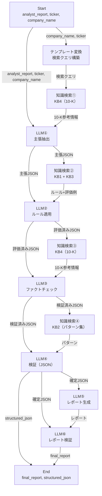
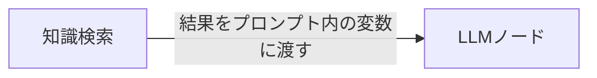
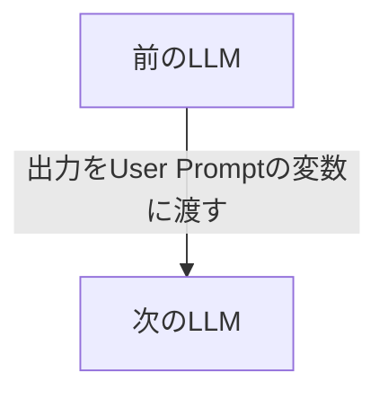
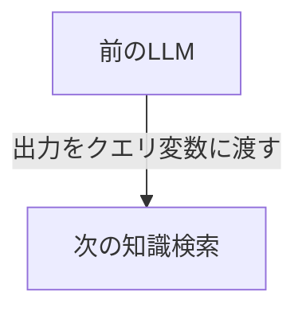
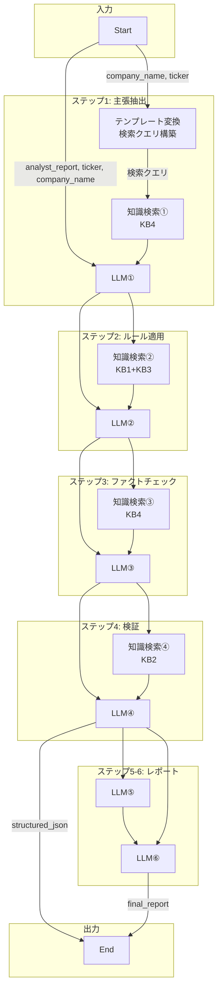

# Dify操作ガイド: KY投資判断ワークフロー構築手順

> 作成日: 2026-02-13
> 前提: [ワークフロー設計書](../memo/dify_workflow_design.md)

---

## 目次

1. [事前準備](#1-事前準備)
2. [ナレッジベース作成](#2-ナレッジベース作成)
3. [ワークフロー構築](#3-ワークフロー構築)
4. [ノード接続](#4-ノード接続)
5. [テスト実行](#5-テスト実行)
6. [トラブルシューティング](#6-トラブルシューティング)

---

## 1. 事前準備

### 1.1 必要なファイル一覧

| カテゴリ | ファイル | パス | 用途 |
|---------|---------|------|------|
| KB1 ルール集 | 8ファイル | `analyst/dify/kb1_rules/` | ナレッジベース1 |
| KB2 パターン集 | 12ファイル | `analyst/dify/kb2_patterns/` | ナレッジベース2 |
| KB3 few-shot集 | 5ファイル | `analyst/dify/kb3_fewshot/` | ナレッジベース3 |
| KB4 10-K/10-Q | 銘柄ごとに準備 | 別途SEC EDGARから取得 | ナレッジベース4 |
| システムプロンプト | 1ファイル | `analyst/dify/system_prompt.md` | 全LLMノード共通 |

### 1.2 Dify環境

- Dify Cloud（https://cloud.dify.ai/）またはセルフホスト版
- APIキー: Claude（Anthropic）の設定が必要
- 推奨モデル: Claude Sonnet（コスト/品質バランス）

---

## 2. ナレッジベース作成

### 2.1 KB作成の全体手順

Difyでは「ナレッジ」メニューからKBを作成する。KB1〜KB3は以下の共通手順で作成する。

#### チャンクモードの選択（汎用 vs 親子）

Difyのナレッジベース作成時に「汎用」と「親子」の2つのチャンクモードを選択する。**一度選択したモードは後から変更できない**（KBを作り直す必要がある）ため、作成前に適切なモードを選ぶこと。

| モード | 仕組み | 適したコンテンツ |
|--------|--------|------------------|
| **汎用** | 単一階層。チャンクが独立して検索される | 自己完結したコンテンツ（ルール集、FAQ、用語集など） |
| **親子** | 二階層。子チャンクで正確にマッチし、親チャンクで広いコンテキストを返す | 長文で文脈が重要なドキュメント（10-K、技術マニュアルなど） |

**本ワークフローでの推奨:**

| KB | モード | 理由 |
|----|--------|------|
| KB1（ルール集） | **汎用** | 各ファイルが1ルールとして自己完結。ファイル間の文脈依存なし |
| KB2（パターン集） | **汎用** | 同上。各パターンが独立 |
| KB3（few-shot集） | **汎用** | 同上。各評価例が独立 |
| KB4（10-K/10-Q） | **親子** | 10万トークン超の長文。セクション間の文脈参照が重要 |

#### アップロード方法と注意事項

KB1〜KB3では「1ファイル = 1チャンク」を実現する必要がある。

**手順:**
1. 複数ファイルを一括選択してアップロード（Difyが1ファイル = 1ドキュメントとして登録）
2. チャンク設定: カスタム、最大チャンク長を最大値（4000）に設定
3. 区切り文字: ファイル内に出現しない任意の文字列を入力（空欄不可。例: `===SPLIT===`）

> **注意**: Difyのカスタム分割は、区切り文字に該当しなくても改行等で内部的に分割されることがある。アップロード後にチャンク数を確認し、不要な分割がある場合は手動でチャンクを統合すること（§2.7参照）。

### 2.2 KB1: ルール集（8チャンク）

**手順:**

1. Difyの「ナレッジ」→「作成」をクリック
2. ナレッジ名: `KB1_KYルール集` と入力
3. 「テキストファイルからインポート」を選択
4. 以下の8ファイルをアップロード:

| # | ファイル名 | 内容 |
|---|-----------|------|
| 1 | `rule01_capability_not_result.md` | ルール1: 能力 ≠ 結果 + ブランド4類型 |
| 2 | `rule02_noun_attribute.md` | ルール2: 名詞で表現 |
| 3 | `rule04_quantitative_evidence.md` | ルール4: 定量的裏付け |
| 4 | `rule06_structural_vs_complementary.md` | ルール6: 構造的 vs 補完的 |
| 5 | `rule07_pure_competitor_differentiation.md` | ルール7: 純粋競合への差別化 |
| 6 | `rule08_strategy_not_advantage.md` | ルール8: 戦略 ≠ 優位性 |
| 7 | `rule10_negative_case.md` | ルール10: ネガティブケース |
| 8 | `rule11_industry_structure_fit.md` | ルール11: 業界構造合致 |

5. **チャンクモード**: **「汎用」を選択**
6. **チャンク設定**:
   - セグメンテーション: **カスタム**
   - 区切り文字: `===SPLIT===`（ファイル内に出現しない文字列）
   - 最大チャンク長: **4000**（単位は文字数。各ファイルは最大1,587文字）
   - 重複なし（Overlap: 0）
7. **インデックス方式**: **高品質**
8. 「保存して処理」をクリック
9. **チャンク確認**: 各ドキュメントが1チャンクになっていることを確認。不要な分割がある場合は手動でチャンクを統合する（§2.7参照）

### 2.3 KB2: パターン集（12チャンク）

**手順:**

1. 「ナレッジ」→「作成」→ ナレッジ名: `KB2_KYパターン集`
2. 以下の12ファイルをアップロード:

**却下パターン（7ファイル）:**

| # | ファイル名 | 内容 |
|---|-----------|------|
| 1 | `pattern_A_result_as_cause.md` | 結果を原因と取り違え |
| 2 | `pattern_B_industry_common.md` | 業界共通 |
| 3 | `pattern_C_causal_leap.md` | 因果関係の飛躍 |
| 4 | `pattern_D_qualitative_only.md` | 定量的裏付けなし |
| 5 | `pattern_E_factual_error.md` | 事実誤認（即却下） |
| 6 | `pattern_F_strategy_confusion.md` | 戦略と優位性の混同 |
| 7 | `pattern_G_unclear_vs_pure_competitor.md` | 純粋競合への優位性不明 |

**高評価パターン（5ファイル）:**

| # | ファイル名 | 内容 |
|---|-----------|------|
| 8 | `pattern_I_quantitative_differentiation.md` | 定量的差別化（70-90%） |
| 9 | `pattern_II_direct_cagr_mechanism.md` | 直接的CAGR接続（90%） |
| 10 | `pattern_III_capability_over_result.md` | 能力 > 結果（50-70%） |
| 11 | `pattern_IV_structural_market_position.md` | 構造的市場ポジション（90%） |
| 12 | `pattern_V_specific_competitor_comparison.md` | 競合との具体的比較（70%） |

3. チャンクモード: **「汎用」を選択**。チャンク設定はKB1と同じ（カスタム、最大4000文字、Overlap: 0）

### 2.4 KB3: few-shot集（5チャンク）

**手順:**

1. 「ナレッジ」→「作成」→ ナレッジ名: `KB3_KY評価例`
2. 以下の5ファイルをアップロード:

| # | ファイル名 | 銘柄 | 平均スコア | 特徴 |
|---|-----------|------|-----------|------|
| 1 | `fewshot_ORLY.md` | O'Reilly Automotive | 63% | 市場構造合致が最高評価 |
| 2 | `fewshot_COST.md` | Costco | 39% | 一般論を厳しく却下 |
| 3 | `fewshot_MNST.md` | Monster Beverage | 40% | シェア=結果の厳格適用 |
| 4 | `fewshot_CHD.md` | Church & Dwight | 50% | 能力vs結果の区別が明確 |
| 5 | `fewshot_LLY.md` | Eli Lilly | 47% | 業界共通能力を厳しく批判 |

3. チャンクモード: **「汎用」を選択**。チャンク設定はKB1と同じ（カスタム、最大4000文字、Overlap: 0）

### 2.5 KB4: 10-K/10-Q（銘柄ごと）

KB4はPoC対象銘柄ごとに作成する。

**手順:**

1. 「ナレッジ」→「作成」→ ナレッジ名: `KB4_[ティッカー]_10K`（例: `KB4_ANET_10K`）
2. 10-Kのテキストファイルをアップロード
3. **チャンクモード**: **「親子」を選択**（10-Kは長文で文脈が重要なため）
4. チャンク設定:
   - 親チャンク: 段落モード、区切り文字 `\n# ` または `\n## `（10-Kのセクション単位）
   - 親チャンク最大長: 2000〜3000文字
   - 子チャンク: 500〜1000文字
   - インデックス方式: **高品質**（親子モードでは高品質のみ選択可）

> **注意**: 10-Kは10万トークン超のため、親子モードにより子チャンクで正確にマッチしつつ、親チャンクで周辺コンテキスト（同セクション内の情報）を返せる。Item 1, 1A, 7, 8などの主要セクションが適切に分割されているか確認すること。
>
> **補足**: 親子モードは一度選択すると変更できない。最初の1銘柄で精度を検証してからPoC本番に進むこと。

### 2.6 インデックス方式と検索設定

#### インデックス方式

全KBで**高品質**を選択すること（エコノミーはキーワード検索のみで精度が低い）。

#### 検索方式の選択

Difyの高品質モードでは3種類の検索方式が利用可能:

| 検索方式 | 仕組み | 適したKB |
|----------|--------|----------|
| ベクトル検索 | クエリを埋め込みベクトル化し、意味的に類似するチャンクを検出 | チャンク数が少ないKB（KB1〜KB3） |
| 全文検索 | キーワード一致による検索 | 固有名詞・数値の正確な一致が必要な場合 |
| ハイブリッド検索 | ベクトル検索 + 全文検索を同時実行し最適な結果を統合 | チャンク数が多いKB（KB4） |

#### KB別の推奨検索設定

| KB | 検索方式 | Top-K | スコア閾値 | Rerank | 理由 |
|----|----------|-------|-----------|--------|------|
| KB1（ルール集） | ベクトル検索 | 5 | 0.3 | 不要 | チャンク数が少なく、関連ルールの取りこぼしを防ぐため閾値は低めに設定 |
| KB2（パターン集） | ベクトル検索 | 4 | 0.3 | 不要 | 同上 |
| KB3（few-shot集） | ベクトル検索 | 3 | 0.3 | 不要 | 同上 |
| KB4（10-K/10-Q） | ハイブリッド検索 | 10 | 0.5 | **有効** | チャンク数が多く、意味的類似度とキーワード一致の両方が必要。Rerankで上位チャンクの精度を向上 |

> **補足**: KB1〜KB3はチャンク数が少ない（合計25件）ため、Top-Kで大半を取得でき、Rerankの効果は薄い。KB4は数百チャンクになるため、ハイブリッド検索 + Rerankで精度を確保する。

#### ワークフロー内の知識検索ノードとの対応

```
テンプレート変換 → 検索クエリ構築（company_name + ticker + 事業キーワード）
知識検索① → KB4（10-K）  → ハイブリッド検索、Top-K: 10、Rerank有効、クエリ: テンプレート変換の出力
知識検索② → KB1 + KB3    → ベクトル検索、Top-K: 5、Rerankなし
知識検索③ → KB4（10-K）  → ハイブリッド検索、Top-K: 5、Rerank有効
知識検索④ → KB2          → ベクトル検索、Top-K: 4、Rerankなし
```

### 2.7 チャンク分割の確認方法

KB作成後、以下を確認:

1. 「ナレッジ」→ 作成したKBをクリック → 「ドキュメント」タブ
2. 各ドキュメントをクリック → チャンク一覧を表示
3. **確認ポイント**:
   - KB1: 8チャンクになっているか
   - KB2: 12チャンクになっているか
   - KB3: 5チャンクになっているか
   - 各チャンクの先頭に `# ルール1:` や `# パターンA:` が含まれているか
4. 不要な分割がある場合は、同一ドキュメント内のチャンクを選択して手動で統合する

> **注意**: Difyのカスタム分割では、最大チャンク長を十分に大きく設定しても内部的に改行等で分割されることがある。KB1〜KB3ではアップロード後に必ずチャンク数を確認し、分割されていた場合は手動統合すること。

---

## 3. ワークフロー構築

### 3.1 ワークフロー作成

1. Difyの「スタジオ」→「ワークフローアプリを作成」
2. アプリ名: `KY投資判断_競争優位性評価`
3. アプリタイプ: **「ワークフロー」**（Chatflowではない）

### 3.2 入力変数の設定（Startノード）

Startノードに以下の変数を追加:

| 変数名 | 型 | 必須 | 説明 |
|--------|-----|------|------|
| `analyst_report` | ファイル | Yes | アナリストレポート（PDF/Word/Markdown） |
| `ticker` | テキスト入力 | Yes | 銘柄ティッカー（例: `ANET`） |
| `company_name` | テキスト入力 | Yes | 企業名（例: `Arista Networks`） |

### 3.3 ノード一覧（11ノード）

以下の順序でノードを追加する:

```
Start
  ↓
[テンプレート変換: 検索クエリ構築]
  ↓
[知識検索①] → [LLM① ステップ1: 主張抽出]
                    ↓
[知識検索②] → [LLM② ステップ2: ルール適用]
                    ↓
[知識検索③] → [LLM③ ステップ3: ファクトチェック]
                    ↓
[知識検索④] → [LLM④ ステップ4: 検証（JSON）]
                    ↓
               [LLM⑤ ステップ5: レポート生成]
                    ↓
               [LLM⑥ ステップ6: レポート検証]
                    ↓
                  End
```

### 3.4 ワークフロー全体図



---

## 4. ノード接続

### 4.0 接続パターンの概要

各ステップは共通の接続パターンに従う。

#### パターン1: 知識検索 → LLMノード（横の接続）

知識検索の結果をLLMの**コンテキスト変数**として渡す。



| 知識検索 | 渡し先 | プロンプト内の変数 |
|---------|--------|-------------------|
| 知識検索① | LLM① User Prompt | `{{知識検索①の結果}}` |
| 知識検索② | LLM② System Prompt | `{{知識検索②の結果}}` |
| 知識検索③ | LLM③ System Prompt | `{{知識検索③の結果}}` |
| 知識検索④ | LLM④ System Prompt | `{{知識検索④の結果}}` |

#### パターン2: LLM → 次のLLM（縦の接続）

前のLLMの出力を次のLLMの**User Prompt**に変数として渡す。



| 出力元 | 渡し先 | User Prompt内の変数 |
|-------|--------|-------------------|
| LLM① | LLM② | `{{LLM①の出力}}` |
| LLM② | LLM③ | `{{LLM②の出力}}` |
| LLM③ | LLM④ | `{{LLM③の出力}}` |
| LLM④ | LLM⑤ | `{{LLM④の出力}}` |
| LLM④ + LLM⑤ | LLM⑥ | `{{LLM④の出力}}` + `{{LLM⑤の出力}}` |

#### パターン3: LLM → 知識検索のクエリ（縦の接続）

前のLLMの出力を次の知識検索の**クエリ変数**に渡す。



| 出力元 | 渡し先 | クエリ変数 |
|-------|--------|----------|
| LLM① | 知識検索② | 各claimテキスト |
| LLM② | 知識検索③ | factual_claimのテキスト |
| LLM③ | 知識検索④ | 各claimのテキスト |

### 4.1 テンプレート変換＋知識検索①＋LLM①: 主張抽出

#### テンプレート変換ノードの設定（検索クエリ構築）

Start と 知識検索① の間にテンプレート変換ノードを挿入し、10-Kの主要セクション（Item 1: Business, Item 7: MD&A）にヒットしやすい検索クエリを構築する。

> **背景**: 10-Kの本文では企業名の代わりに "the Company"、"we"、"our" と表記されることが多く、`company_name` 単体ではベクトル/全文検索でヒットしにくい。企業の事業内容・競争優位性に関連するキーワードを付加することで、主張抽出に有用なチャンクを上位に取得する。

| 設定項目 | 値 |
|---------|-----|
| ノード名 | `検索クエリ構築` |
| 入力変数 | `company_name`, `ticker` |

**テンプレート（Jinja2）**:

```
{{ company_name }} ({{ ticker }}) business overview competitive advantages market position products services revenue drivers industry structure risks
```

#### 知識検索①の設定

| 設定項目 | 値 |
|---------|-----|
| ナレッジベース | `KB4_[ティッカー]_10K` |
| 検索方式 | ハイブリッド検索 |
| クエリ変数 | `{{検索クエリ構築の出力}}` |
| Top-K | 10（10-Kの主要セクションを広く取得） |
| スコア閾値 | 0.5 |
| Rerank | 有効 |

#### LLM①の設定

| 設定項目 | 値 |
|---------|-----|
| モデル | Claude Sonnet |
| Temperature | 0.3 |

**System Prompt**: `analyst/dify/system_prompt.md` の内容をコピー＆ペースト + 以下を追加:

```
## ステップ1: 主張抽出

アナリストレポートから以下の3種別の主張を抽出してください。

### 抽出する主張の種別
1. competitive_advantage: 競争優位性の主張
2. cagr_connection: CAGR接続の主張（優位性がCAGRにどう寄与するか）
3. factual_claim: 事実の主張（数値・データ）

### 出力フォーマット（JSON）
[設計書 §6 のJSONスキーマをここに貼り付け]

### 抽出ルール
- KYの観点に沿わない主張も削ぎ落とさないこと
- レポート内のページ番号・セクション番号を必ず引用すること
- 1つのレポートから5〜15件程度の主張を抽出すること
```

**User Prompt**:

```
以下のアナリストレポートから主張を抽出してください。

## 銘柄情報
- ティッカー: {{ticker}}
- 企業名: {{company_name}}

## アナリストレポート
{{analyst_report}}

## 10-K/10-Q参考情報
{{知識検索①の結果}}
```

### 4.2 知識検索②＋LLM②: ルール適用

#### 知識検索②の設定

| 設定項目 | 値 |
|---------|-----|
| ナレッジベース | `KB1_KYルール集` + `KB3_KY評価例` |
| 検索方式 | ベクトル検索 |
| クエリ変数 | `{{LLM①の出力}}` の各claimテキスト |
| Top-K | 5 |
| スコア閾値 | 0.3 |
| Rerank | 不要 |

> **注意**: Difyでは複数KBを1つの知識検索ノードに設定できる。KB1とKB3の両方を選択する。

#### LLM②の設定

| 設定項目 | 値 |
|---------|-----|
| モデル | Claude Sonnet |
| Temperature | 0.2 |

**System Prompt**: 共通システムプロンプト + 以下を追加:

```
## ステップ2: ルール適用

ステップ1で抽出された各主張に、KYの12ルールを適用して評価してください。

### 処理手順
1. 各 competitive_advantage にルール1,2,3,6,7,8,10,11を照合
2. 各 cagr_connection にルール5,12を照合
3. ナレッジベースから取得したfew-shot例を参照し、類似の主張に対するKYの評価を参考にする
4. confidence（確信度）を算出

### confidenceのスケール
KYの過去評価に合わせ、以下のスケールを使用:
- 90%: 業界構造との合致がある場合のみ（全体の約6%）
- 70%: おおむね納得（約26%）
- 50%: 最頻値（約35%）。方向性は認めるが裏付け不十分
- 30%: あまり納得しない（約26%）
- 10%: 却下（約6%）

### ナレッジベースの参照結果
{{知識検索②の結果}}

### 出力フォーマット
ステップ1のJSONに rule_evaluation フィールドを追加して出力してください。
```

**User Prompt**:

```
以下の主張にルールを適用して評価してください。

## ステップ1の出力
{{LLM①の出力}}
```

### 4.3 知識検索③＋LLM③: ファクトチェック

#### 知識検索③の設定

| 設定項目 | 値 |
|---------|-----|
| ナレッジベース | `KB4_[ティッカー]_10K` |
| 検索方式 | ハイブリッド検索 |
| クエリ変数 | factual_claimのテキスト |
| Top-K | 5 |
| スコア閾値 | 0.5 |
| Rerank | 有効 |

#### LLM③の設定

| 設定項目 | 値 |
|---------|-----|
| モデル | Claude Sonnet |
| Temperature | 0.1（ファクトチェックは低温推奨） |

**System Prompt**: 共通システムプロンプト + 以下を追加:

```
## ステップ3: ファクトチェック

factual_claimの事実を10-K/10-Qの情報と照合して検証してください。

### verification_statusの判定基準

| ステータス | 条件 | 後続処理 |
|-----------|------|---------|
| verified | 10-K/10-Qの記載と一致 | そのまま通過 |
| contradicted | 10-K/10-Qの記載と矛盾 | ルール9自動適用 → 依存する主張のconfidence → 10% |
| unverifiable | 10-K/10-Qに記載なし | アノテーション付与。依存する主張のconfidenceを-10〜20% |

### 重要ルール
- 主張は絶対に破棄しないこと
- unverifiableの場合は「何があれば検証できるか」を what_would_verify に記述すること
- 検索を試みたセクションは verification_attempted に必ず記録すること

### 10-K/10-Q参考情報
{{知識検索③の結果}}
```

**User Prompt**:

```
以下のJSONのfactual_claimを検証してください。

{{LLM②の出力}}
```

### 4.4 知識検索④＋LLM④: 検証（JSON）

#### 知識検索④の設定

| 設定項目 | 値 |
|---------|-----|
| ナレッジベース | `KB2_KYパターン集` |
| 検索方式 | ベクトル検索 |
| クエリ変数 | 各claimのテキスト |
| Top-K | 4 |
| スコア閾値 | 0.3 |
| Rerank | 不要 |

#### LLM④の設定

| 設定項目 | 値 |
|---------|-----|
| モデル | Claude Sonnet |
| Temperature | 0.2 |

**System Prompt**: 共通システムプロンプト + 以下を追加:

```
## ステップ4: パターン照合による検証

ステップ3までのJSON全体を、ナレッジベースの却下/高評価パターンと照合して検証してください。

### 処理手順
1. 各 competitive_advantage を却下パターンA〜Gと照合
2. 高評価パターンI〜Vとの一致を確認
3. パターン該当の見落としがないか検証
4. ルール適用の漏れがないか検証
5. 必要に応じてconfidenceを調整（confidence_adjustmentsに記録）

### パターン参照結果
{{知識検索④の結果}}
```

**User Prompt**:

```
以下のJSONをパターンと照合して検証してください。

{{LLM③の出力}}
```

### 4.5 LLM⑤: レポート生成

知識検索ノードなし。

#### LLM⑤の設定

| 設定項目 | 値 |
|---------|-----|
| モデル | Claude Sonnet |
| Temperature | 0.3 |

**System Prompt**: 共通システムプロンプト + 以下を追加:

```
## ステップ5: レポート生成

ステップ4の確定JSONから、KYに提示するMarkdownレポートを生成してください。

### レポート構成

[設計書 §5.5 のレポートテンプレートをここに貼り付け]

### 生成ルール
- JSONの内容を忠実にレポートに変換する。好意的な拡大解釈をしない
- confidenceとレポートのトーンを一致させる（confidence 30%の主張を肯定的に書かない）
- unverifiable/contradictedな事実は明示的にレポートに記載する
- フィードバックテンプレートは省略しない
```

**User Prompt**:

```
以下のJSONからレポートを生成してください。

{{LLM④の出力}}
```

### 4.6 LLM⑥: レポート検証

#### LLM⑥の設定

| 設定項目 | 値 |
|---------|-----|
| モデル | Claude Sonnet |
| Temperature | 0.2 |

**System Prompt**: 共通システムプロンプト + 以下を追加:

```
## ステップ6: レポート検証

ステップ5で生成したレポートを、JSONおよびKYのナレッジベースと照合して3層検証してください。

### 検証A: JSON-レポート整合
- 全主張がレポートに含まれているか
- confidenceとトーンが一致しているか
- 数値の転記が正確か

### 検証B: KYルールとの整合
- 12ルールに沿った議論ができているか

### 検証C: パターンとの整合
- confidence 30%の主張が肯定的に書かれていないか
- 却下パターンに該当する主張が適切に記述されているか

### 出力
- 不整合が軽微: 修正版レポートを出力
- 不整合が重大: 指摘のみ行い、修正はステップ5の再実行に委ねる
- 不整合なし: ステップ5のレポートをそのまま出力
```

**User Prompt**:

```
以下のJSONとレポートを照合して検証してください。

## 確定JSON（ステップ4出力）
{{LLM④の出力}}

## 生成レポート（ステップ5出力）
{{LLM⑤の出力}}
```

### 4.7 Endノード

| 出力変数 | ソース | 説明 |
|----------|--------|------|
| `final_report` | LLM⑥の出力 | 検証済み最終レポート |
| `structured_json` | LLM④の出力 | 構造化JSON（アーカイブ用） |

---

## 5. テスト実行

### 5.1 PoC Phase 1: 動作確認

1. テスト銘柄: `analyst/raw/` 配下のレポートを使用
2. Difyの「実行」ボタンをクリック
3. 確認ポイント:
   - [ ] エラーなく最終ノードまで到達するか
   - [ ] 各LLMノードの出力がJSON形式で正しくパースされるか
   - [ ] 最終レポートがMarkdown形式で出力されるか

### 5.2 PoC Phase 2: In-sample検証

既存のKY評価データとの比較:

| テスト銘柄 | 正解データ | 検証内容 |
|-----------|-----------|---------|
| CHD | `analyst/phase2_KY/pattern1_CHD_phase2.md` | AIスコアとKY実スコアの乖離 |
| MNST | `analyst/phase2_KY/pattern1_MNST_phase2.md` | 同上 |
| COST | `analyst/phase2_KY/pattern1_COST_phase2.md` | 同上 |
| LLY | `analyst/phase2_KY/pattern1_LLY_phase2.md` | 同上 |
| ORLY | `analyst/phase2_KY/phase1_ORLY_phase2.md` | 同上 |

**精度目標**:

| 指標 | 目標値 |
|------|--------|
| 平均スコア乖離（優位性） | ±10%以内 |
| 平均スコア乖離（CAGR接続） | ±10%以内 |
| 個別最大乖離 | ±20%以内 |
| 事実誤認の見落とし | 0% |

### 5.3 PoC Phase 3: Out-of-sample検証

Phase 2データのない銘柄でテストし、KYにフィードバックを依頼:

| テスト銘柄 | レポート | 備考 |
|-----------|---------|------|
| ANET | `analyst/raw/ANET_*.md` | Phase 1サンプルあり |
| CPRT | `analyst/raw/CPRT_*.md` | Phase 2なし |
| AME | `analyst/raw/AME_*.md` | Phase 2なし |

---

## 6. トラブルシューティング

### 6.1 よくある問題

| 問題 | 原因 | 解決策 |
|------|------|--------|
| LLMがJSON形式で出力しない | プロンプト指示が不十分 | System Promptに「必ずJSON形式で出力してください。JSON以外のテキストは含めないでください」を追加 |
| 知識検索の結果が少ない | Top-Kが小さい or チャンク分割が不適切 | Top-Kを増やす / チャンクを確認・再分割 |
| チャンクが不要に分割されている | 自動分割がファイル内で分割した | KB設定画面で手動統合 |
| confidenceが全体的に高すぎる | スコア分布の指示が弱い | System Promptにスコア分布の目安を追加（50%が最頻値） |
| ファクトチェックが全てunverifiable | KB4の内容不足 or クエリが不適切 | KB4に10-Kの主要セクションが含まれているか確認 |
| レポートのトーンとconfidenceが不一致 | ステップ5のプロンプト指示不足 | 「confidenceとトーンを一致させること」を明示的に指示 |

### 6.2 デバッグ手順

1. Difyの「ログ」タブで各ノードの入出力を確認
2. 問題のあるノードを特定
3. そのノードの入力（前のノードの出力）が正しいか確認
4. System Promptの指示を調整
5. 必要に応じてTemperatureを下げる（特にJSON出力の安定性）

### 6.3 KB更新時の手順

KYのフィードバックを受けてKBを更新する場合:

1. ローカルの `analyst/dify/` 配下のファイルを編集
2. Difyの「ナレッジ」→ 対象KB → 「ドキュメント」タブ
3. 該当ドキュメントの「...」→「置き換え」で更新ファイルをアップロード
4. チャンク分割が正しいことを確認
5. ワークフローを再実行して動作確認

---

## 補足: ワークフロー変数の接続まとめ



### 変数の流れ一覧

| 出力元 | 渡し先 | 渡すデータ |
|-------|--------|----------|
| Start | テンプレート変換, LLM① | company_name, ticker, analyst_report |
| テンプレート変換 | 知識検索① | 検索クエリ（企業名+事業キーワード） |
| 知識検索① | LLM① | 10-K参考情報 |
| LLM① | 知識検索②, LLM② | 主張JSON |
| 知識検索② | LLM② | ルール+評価例 |
| LLM② | 知識検索③, LLM③ | 評価済みJSON |
| 知識検索③ | LLM③ | 10-K参考情報 |
| LLM③ | 知識検索④, LLM④ | 検証済みJSON |
| 知識検索④ | LLM④ | パターン |
| LLM④ | LLM⑤, LLM⑥, End | 確定JSON / structured_json |
| LLM⑤ | LLM⑥ | 生成レポート |
| LLM⑥ | End | final_report |
