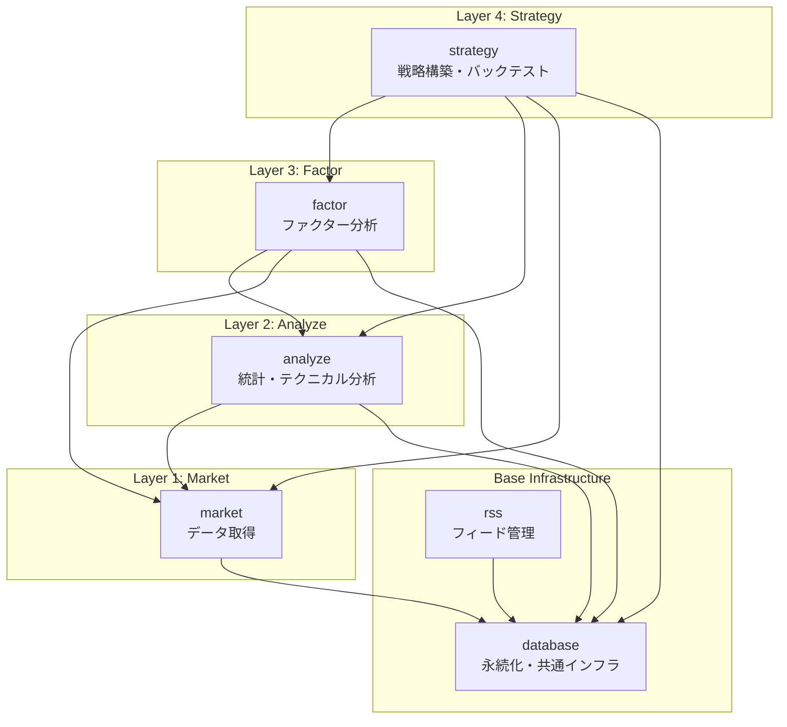

# 4層アーキテクチャ設計書

**作成日**: 2026-01-26
**最終更新**: 2026-01-26
**ステータス**: 確定

## 概要

finance リポジトリは、金融市場データの取得から投資戦略の構築・評価までを一貫して行うための4層アーキテクチャを採用しています。この設計により、責務の分離、再利用性の向上、テストの容易さを実現しています。

## アーキテクチャ概念図

```
┌─────────────────────────────────────────────────────────────────────┐
│                       4. Strategy Layer                             │
│                    (ポートフォリオ構築・バックテスト)                 │
│                                                                     │
│   ┌─────────────┐  ┌─────────────┐  ┌─────────────┐                │
│   │  Portfolio  │  │    Risk     │  │  Rebalance  │                │
│   │ Management  │  │ Calculator  │  │  Strategy   │                │
│   └─────────────┘  └─────────────┘  └─────────────┘                │
└─────────────────────────────────────────────────────────────────────┘
                              │
                              ▼
┌─────────────────────────────────────────────────────────────────────┐
│                       3. Factor Layer                               │
│                    (ファクター分析・アルファ探求)                     │
│                                                                     │
│   ┌───────────┐  ┌───────────┐  ┌───────────┐  ┌───────────┐       │
│   │  Value    │  │ Momentum  │  │ Quality   │  │   Macro   │       │
│   │ Factors   │  │  Factors  │  │ Factors   │  │  Factors  │       │
│   └───────────┘  └───────────┘  └───────────┘  └───────────┘       │
└─────────────────────────────────────────────────────────────────────┘
                              │
                              ▼
┌─────────────────────────────────────────────────────────────────────┐
│                       2. Analyze Layer                              │
│                    (統計分析・テクニカル分析・可視化)                  │
│                                                                     │
│   ┌───────────┐  ┌───────────┐  ┌───────────┐  ┌───────────┐       │
│   │ Technical │  │Statistics │  │  Returns  │  │Visualize  │       │
│   │ Analysis  │  │ Analysis  │  │ Calc      │  │  Charts   │       │
│   └───────────┘  └───────────┘  └───────────┘  └───────────┘       │
└─────────────────────────────────────────────────────────────────────┘
                              │
                              ▼
┌─────────────────────────────────────────────────────────────────────┐
│                       1. Market Layer                               │
│                    (データ取得・データソース統合)                     │
│                                                                     │
│   ┌───────────┐  ┌───────────┐  ┌───────────┐  ┌───────────┐       │
│   │  yfinance │  │   FRED    │  │ Bloomberg │  │  FactSet  │       │
│   │  Fetcher  │  │  Fetcher  │  │ (計画中)  │  │  (計画中) │       │
│   └───────────┘  └───────────┘  └───────────┘  └───────────┘       │
└─────────────────────────────────────────────────────────────────────┘
                              │
                              ▼
┌─────────────────────────────────────────────────────────────────────┐
│                    Base Infrastructure                              │
│                                                                     │
│   ┌───────────────────┐              ┌───────────────────┐         │
│   │     database      │              │       rss         │         │
│   │  (永続化・共通)    │              │  (フィード管理)    │         │
│   └───────────────────┘              └───────────────────┘         │
└─────────────────────────────────────────────────────────────────────┘
```

## 層の詳細説明

### 1. Market Layer (データ取得層)

**パッケージ**: `market`

データソースからの金融データ取得を担当する層です。

| サブモジュール | 説明 | ステータス |
|--------------|------|-----------|
| `yfinance` | Yahoo Finance から株価・為替・指数データを取得 | 実装済み |
| `fred` | FRED から経済指標データを取得 | 実装済み |
| `export` | データをJSON/CSV/SQLite形式でエクスポート | 実装済み |
| `cache` | データのキャッシュ機能 | 実装済み |
| `bloomberg` | Bloomberg Terminal連携 | 計画中 |
| `factset` | FactSet連携 | 計画中 |
| `alternative` | オルタナティブデータ | 計画中 |

**主な責務**:
- 外部データソースとの通信
- データのフェッチ・パース・正規化
- キャッシュ管理
- エラーハンドリング・リトライ

### 2. Analyze Layer (データ分析層)

**パッケージ**: `analyze`

取得したデータの統計分析・テクニカル分析・可視化を担当する層です。

| サブモジュール | 説明 | 主な機能 |
|--------------|------|----------|
| `technical` | テクニカル分析 | SMA, EMA, RSI, MACD, ボリンジャーバンド |
| `statistics` | 統計分析 | 記述統計, 相関分析, ベータ計算 |
| `sector` | セクター分析 | ETFパフォーマンス, セクターランキング |
| `earnings` | 決算分析 | 決算カレンダー, 決算データ取得 |
| `returns` | リターン計算 | MTD, YTD, 複数期間リターン |
| `visualization` | 可視化 | チャート, ヒートマップ, ローソク足 |
| `integration` | market統合 | MarketDataAnalyzer |

**主な責務**:
- テクニカル指標の計算
- 統計分析（記述統計、相関分析）
- リターン計算
- 可視化チャート生成

### 3. Factor Layer (ファクター分析層)

**パッケージ**: `factor`

ファクター投資戦略とマルチファクターモデル分析を担当する層です。

| サブモジュール | 説明 | 含まれるファクター |
|--------------|------|-------------------|
| `factors/value` | バリューファクター | PER, PBR, 配当利回り, EV/EBITDA |
| `factors/price` | 価格ファクター | モメンタム, リバーサル, ボラティリティ |
| `factors/quality` | クオリティファクター | ROE, ROA, ROIC |
| `factors/size` | サイズファクター | 時価総額 |
| `factors/macro` | マクロファクター | 金利, インフレ, Flight-to-Quality |
| `core` | コアアルゴリズム | 正規化, 直交化, PCA |
| `validation` | 検証 | IC分析, 分位ポートフォリオ分析 |

**主な責務**:
- ファクター値の計算
- ファクターの正規化・直交化
- ファクター有効性の検証
- マルチファクターモデル構築

### 4. Strategy Layer (戦略構築層)

**パッケージ**: `strategy`

投資戦略の構築・バックテスト・評価を担当する最上位層です。

| サブモジュール | 説明 | 主な機能 |
|--------------|------|----------|
| `portfolio` | ポートフォリオ管理 | 保有銘柄管理, 資産配分 |
| `risk` | リスク計算 | Sharpe比, Sortino比, VaR, 最大ドローダウン |
| `rebalance` | リバランス | ドリフト検出, リバランス推奨 |
| `visualization` | 可視化 | 資産配分チャート, パフォーマンスグラフ |
| `output` | 出力 | Markdown, HTML, JSON形式出力 |

**主な責務**:
- ポートフォリオ構築・管理
- リスク指標計算
- バックテスト実行
- パフォーマンス評価
- リバランス戦略

### Base Infrastructure (基盤層)

#### database パッケージ

プロジェクト全体で使用される共通インフラストラクチャを提供します。

| 機能 | 説明 |
|------|------|
| SQLiteClient | トランザクション処理 (OLTP) |
| DuckDBClient | 分析クエリ (OLAP)、Parquet直接読み込み |
| 構造化ロギング | structlogベースの統一ログ出力 |
| 日付ユーティリティ | 取引期間計算、日付フォーマット |
| フォーマット変換 | Parquet/JSON相互変換 |

#### rss パッケージ

RSS/Atomフィードの管理機能を提供します（金融ニュース収集用）。

| 機能 | 説明 |
|------|------|
| FeedManager | フィード登録・管理 |
| FeedFetcher | フィード取得・パース・差分検出 |
| FeedReader | エントリー読み込み・検索 |
| BatchScheduler | 日次バッチスケジューリング |
| MCP統合 | Model Context Protocol対応 |

---

## パッケージ間依存関係図



### 依存関係の原則

1. **上位層は下位層にのみ依存**: strategy → factor → analyze → market → database
2. **同一層間の依存は禁止**: 例えば factor ↔ rss は依存しない
3. **循環依存の禁止**: A → B → A のような循環は許可しない
4. **database は全パッケージの基盤**: 全パッケージが database に依存可能

---

## データフロー

### 典型的なデータフロー例

#### 1. 市場データ取得から分析まで

```
┌────────────┐    ┌────────────┐    ┌────────────┐    ┌────────────┐
│  Yahoo     │    │   market   │    │  analyze   │    │   factor   │
│  Finance   │───▶│  .yfinance │───▶│ .technical │───▶│  .factors  │
│   API      │    │            │    │            │    │            │
└────────────┘    └────────────┘    └────────────┘    └────────────┘
                        │                 │                 │
                        ▼                 ▼                 ▼
                  ┌──────────────────────────────────────────────┐
                  │                  database                    │
                  │       (Parquet/SQLite/DuckDB 永続化)         │
                  └──────────────────────────────────────────────┘
```

#### 2. ポートフォリオ構築からリバランスまで

```
┌────────────┐    ┌────────────┐    ┌────────────┐    ┌────────────┐
│  factor    │    │  strategy  │    │  strategy  │    │  strategy  │
│ .factors   │───▶│ .portfolio │───▶│   .risk    │───▶│ .rebalance │
│ (スコア)    │    │ (構築)      │    │ (計測)      │    │ (最適化)    │
└────────────┘    └────────────┘    └────────────┘    └────────────┘
```

#### 3. ニュース収集から分析まで

```
┌────────────┐    ┌────────────┐    ┌────────────┐
│ RSS Feed   │    │    rss     │    │  analyze   │
│  (外部)     │───▶│ .services  │───▶│ .sentiment │
│            │    │ (取得)      │    │ (分析)      │
└────────────┘    └────────────┘    └────────────┘
```

---

## 各パッケージの詳細仕様

### パッケージ統計

| パッケージ | ファイル数 | 行数 | モジュール数 | テスト数 |
|-----------|-----------|------|------------|---------|
| database | 12 | 約1,500 | 4 | - |
| market | 20+ | 約3,000 | 7 | - |
| analyze | 20+ | 約4,000 | 7 | - |
| factor | 41 | 約10,275 | 6 | 33 |
| strategy | 20 | 約4,020 | 8 | 13 |
| rss | 23 | 約5,822 | 9 | 16 |

### 公開API設計原則

1. **明示的なエクスポート**: 各パッケージの `__init__.py` で `__all__` を定義
2. **型安全**: 全APIに型ヒントを付与（Python 3.12+ PEP 695スタイル）
3. **Docstring**: NumPy形式のDocstringを全公開APIに記載
4. **エラーハンドリング**: パッケージ固有の例外クラス階層を定義

---

## 技術スタック

### 言語・ランタイム

- Python 3.12+
- uv (パッケージ管理)

### 品質ツール

| ツール | 用途 |
|--------|------|
| Ruff | リント・フォーマット |
| pyright | 型チェック |
| pytest | テスト |
| Hypothesis | プロパティベーステスト |

### 外部依存関係

| パッケージ | 用途 | 使用パッケージ |
|-----------|------|---------------|
| pandas | DataFrame操作 | 全パッケージ |
| numpy | 数値計算 | 全パッケージ |
| structlog | 構造化ロギング | 全パッケージ |
| yfinance | Yahoo Finance API | market |
| fredapi | FRED API | market |
| duckdb | OLAP分析 | database |
| plotly | 可視化 | analyze, strategy |
| scipy | 統計計算 | analyze, factor, strategy |
| httpx | HTTP通信 | rss |
| feedparser | RSS/Atomパース | rss |

---

## 拡張ガイドライン

### 新規パッケージ追加時

1. 依存関係の原則を遵守（上位層から下位層への一方向依存）
2. `database` パッケージの共通機能（ロギング、型定義）を活用
3. パッケージ固有の例外クラス階層を定義
4. `__init__.py` で明示的にAPIをエクスポート
5. README.md にクイックスタート・API一覧を記載

### 新規モジュール追加時

1. 所属する層の責務に沿った機能のみを実装
2. 型ヒント・Docstringを必ず記載
3. ユニットテスト・プロパティテストを作成
4. パッケージのREADMEを更新

---

## 関連ドキュメント

- [パッケージリファクタリング計画](../project/package-refactoring.md)
- [コーディング規約](../../.claude/rules/coding-standards.md)
- [テスト戦略](../../.claude/rules/testing-strategy.md)
- [開発プロセス](../../.claude/rules/development-process.md)

---

## 更新履歴

| 日付 | 更新内容 |
|------|---------|
| 2026-01-26 | 初版作成 |
