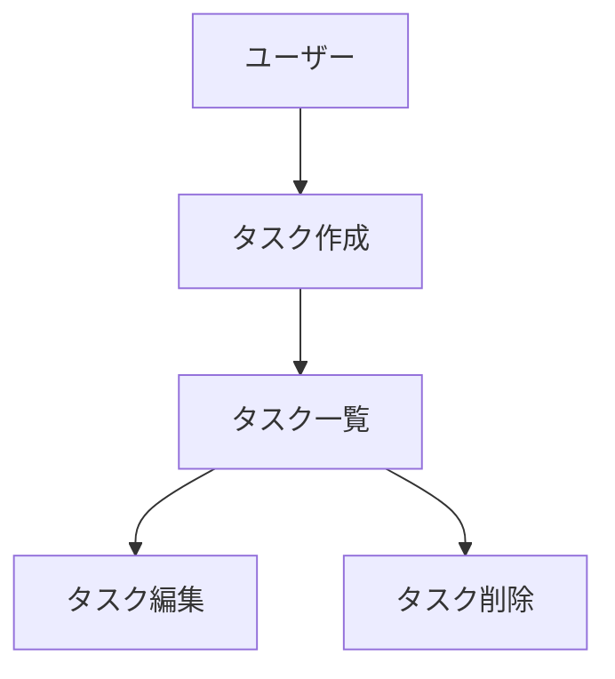
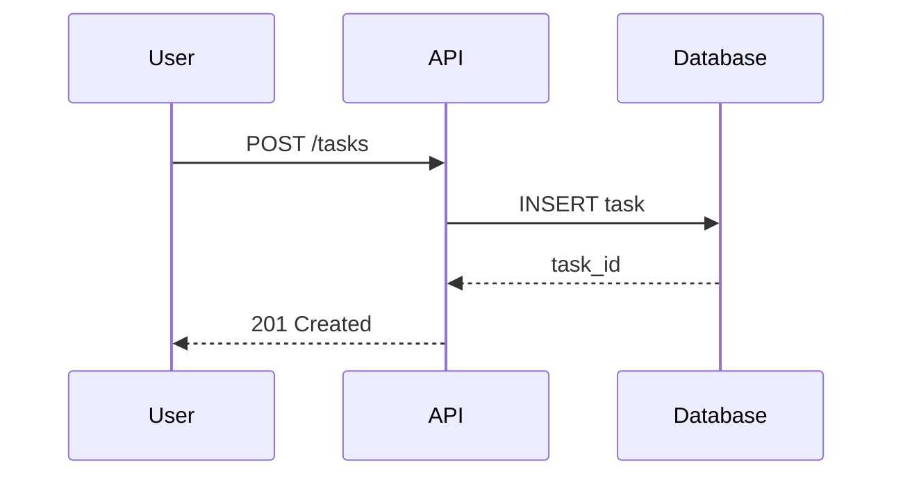
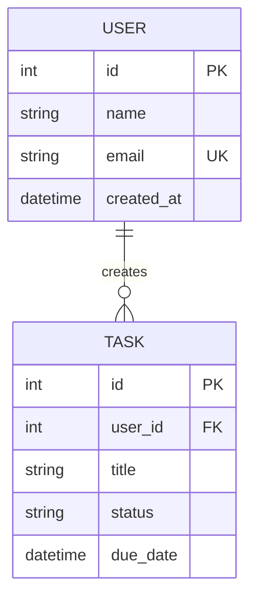
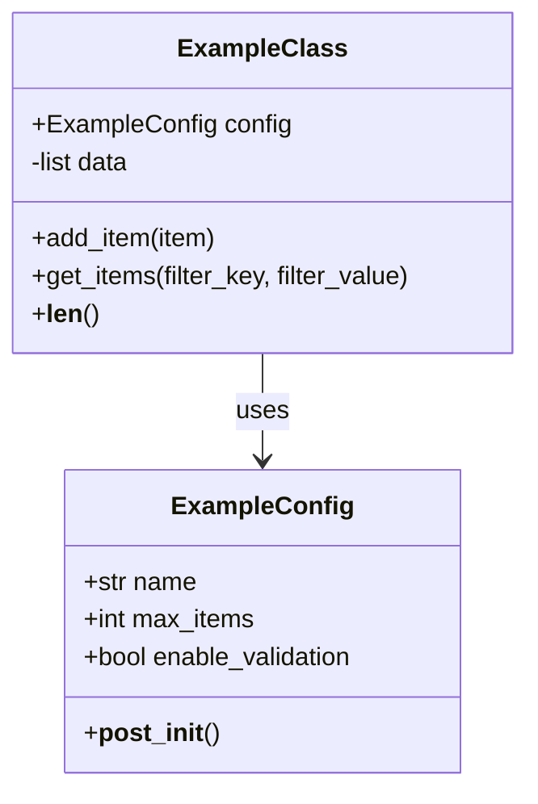
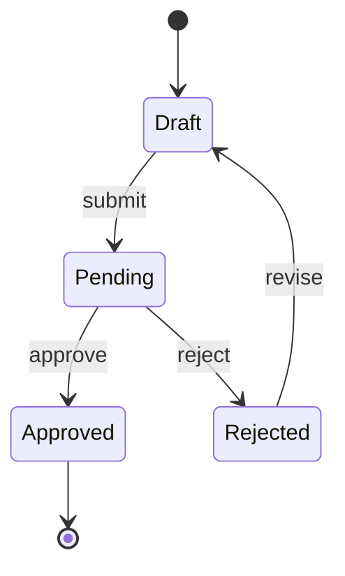

# 図表・ダイアグラム記載ガイドライン

## 基本原則

-   **最小限主義**: 必要な図表のみ作成し、メンテナンスコストを抑える
-   **インライン記載**: 関連ドキュメント内に直接記載（独立フォルダ不要）
-   **テキストベース優先**: Mermaid/ASCII アートを優先し、バージョン管理を容易に

## 配置ルール

| 図表の種類                 | 配置先                                                  |
| -------------------------- | ------------------------------------------------------- |
| ER 図、データモデル図      | `functional-design.md`                                  |
| ユースケース図             | `functional-design.md` または `product-requirements.md` |
| 画面遷移図、ワイヤフレーム | `functional-design.md`                                  |
| システム構成図             | `functional-design.md` または `architecture.md`         |
| シーケンス図               | `functional-design.md`                                  |
| クラス図                   | `architecture.md`                                       |

## 記述形式

### 1. Mermaid 記法（推奨）

Markdown に直接埋め込め、バージョン管理が容易。

#### フローチャート



#### シーケンス図



#### ER 図



#### クラス図



#### 状態遷移図



### 2. ASCII アート

シンプルな図表に使用。テキストエディタで編集可能。

#### レイアウト図

```
┌─────────────────────────────────────┐
│              Header                 │
├─────────────────────────────────────┤
│  Sidebar  │      Main Content       │
│           │                         │
│  - Nav 1  │  ┌─────────────────┐   │
│  - Nav 2  │  │   Task List     │   │
│  - Nav 3  │  │   - Task 1      │   │
│           │  │   - Task 2      │   │
│           │  └─────────────────┘   │
├─────────────────────────────────────┤
│              Footer                 │
└─────────────────────────────────────┘
```

#### フロー図

```
┌──────────┐     ┌──────────┐     ┌──────────┐
│  Input   │ ──> │ Process  │ ──> │  Output  │
└──────────┘     └──────────┘     └──────────┘
                      │
                      v
                ┌──────────┐
                │   Log    │
                └──────────┘
```

#### ディレクトリ構造

```
src/
├── project_name/
│   ├── __init__.py
│   ├── core/
│   │   ├── __init__.py
│   │   └── example.py
│   └── utils/
│       ├── __init__.py
│       ├── helpers.py
│       └── logging_config.py
└── tests/
    └── ...
```

### 3. 画像ファイル（必要な場合のみ）

複雑なワイヤフレームやモックアップなど、テキストでは表現困難な場合のみ使用。

#### 配置ルール

-   保存先: `docs/images/`
-   形式: PNG または SVG（ベクター推奨）
-   命名: `[ドキュメント名]-[図の種類]-[番号].[拡張子]`

例:

```
docs/images/
├── functional-design-wireframe-01.png
├── functional-design-wireframe-02.png
└── architecture-system-overview.svg
```

#### 参照方法

```markdown

```

## 図表作成のベストプラクティス

### DO（推奨）

-   シンプルに保つ（情報過多を避ける）
-   一貫した記法を使用
-   凡例を必要に応じて追加
-   更新日を記載

### DON'T（非推奨）

-   過度に詳細な図を作成
-   複数の記法を混在
-   古い図を放置
-   画像のみで説明（テキストも併記）

## 更新ルール

-   設計変更時は対応する図表も同時に更新
-   図表とコードの乖離を防ぐ
-   不要になった図は削除（コメントアウトではなく）
-   大きな変更は履歴をコミットメッセージに記載

## Mermaid チートシート

### 基本構文

```markdown
# フローチャート

graph TD|TB|BT|LR|RL
A[四角] --> B(丸角)
B --> C{条件}
C -->|Yes| D[結果 1]
C -->|No| E[結果 2]

# シーケンス

sequenceDiagram
participant A
A->>B: 同期呼び出し
A-->>B: 非同期呼び出し
B-->>A: 応答

# クラス図

classDiagram
class ClassName {
+publicMethod()
-privateMethod()
#protectedMethod()
}
```

### よく使う記号

| 記号       | 意味         |
| ---------- | ------------ |
| `-->`      | 矢印（実線） |
| `-.->`     | 矢印（破線） |
| `-->>`     | 非同期矢印   |
| `[text]`   | 四角ノード   |
| `(text)`   | 丸角ノード   |
| `{text}`   | 菱形（条件） |
| `((text))` | 円形         |

---

## ファイル配置サマリー

```
project-root/
├── CLAUDE.md                    # コア規約（~200行）
├── docs/                        # 永続ドキュメント
│   ├── document-management.md   # ドキュメント管理ガイドライン
│   ├── testing-strategy.md      # テスト戦略ガイドライン
│   ├── diagram-guidelines.md    # 図表記載ガイドライン（本ファイル）
│   └── images/                  # 画像ファイル（必要時のみ）
├── .claude/                     # Claude Code設定
│   ├── commands/                # スラッシュコマンド定義
│   ├── skills/                  # スキル定義
│   ├── agents/                  # エージェント定義
│   └── settings.json            # 権限・フック設定
└── template/                    # 実装パターン参照用
```
