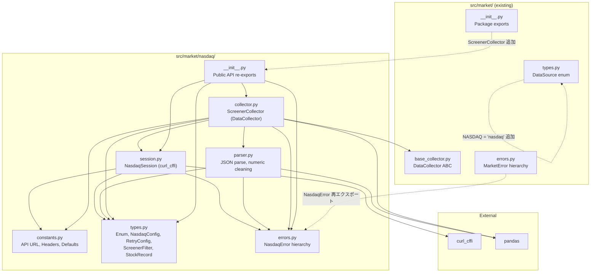

# NASDAQ Stock Screener - 実装計画

## 概要

| 項目 | 値 |
|------|-----|
| プロジェクト名 | NASDAQ Stock Screener |
| プロジェクトタイプ | package |
| 配置先 | `src/market/nasdaq/` |
| テスト先 | `tests/market/nasdaq/` |
| 設計ドキュメント | `docs/plan/2026-02-09_nasdaq-stock-screener.md` |
| ソースコード | 7ファイル / 約1,310 LOC |
| テストコード | 11ファイル / 約1,120 LOC |
| 合計 | 21ファイル / 約2,430 LOC |

## ユーザー決定事項

| 項目 | 決定 |
|------|------|
| CLI (cli.py) | 後続 Issue で対応（初期スコープはコアモジュール7ファイルのみ） |
| フィルター型 | Enum（設計書通り。Exchange, MarketCap, Sector 等を str Enum で定義） |
| RetryConfig | nasdaq/types.py に独自定義（パッケージ間依存を避ける） |
| parser.py | 独立モジュールとして実装（数値クリーニングの単体テストが容易） |
| NasdaqConfig | 独自定義（ScrapingConfig のサブセットではない） |
| レート制限 | polite_delay 1.0s + exponential backoff retry |

## アーキテクチャ

### 依存関係図



### データフロー

```
ScreenerCollector.fetch()
  → NasdaqSession.get_with_retry(SCREENER_ENDPOINT, params)
  → NASDAQ API
  → JSON response
  → parser.parse_screener_response()
  → pd.DataFrame (数値クリーニング済み)
  → DataCollector.validate()
  → DataFrame / CSV file
```

## モジュール設計

### 1. constants.py (120 LOC)

API URL、デフォルトHTTPヘッダー、User-Agentリスト、ブラウザ偽装ターゲット、ポライトディレイ、タイムアウト、出力ディレクトリパス、カラム名マッピングの定数を一元管理する。

- 依存: なし
- 主要定数: `NASDAQ_SCREENER_URL`, `DEFAULT_HEADERS`, `DEFAULT_USER_AGENTS`, `BROWSER_IMPERSONATE_TARGETS`, `DEFAULT_POLITE_DELAY=1.0`, `DEFAULT_TIMEOUT=30.0`, `DEFAULT_DELAY_JITTER=0.5`, `DEFAULT_OUTPUT_DIR`, `COLUMN_NAME_MAP`

### 2. types.py (280 LOC)

NASDAQ Screener 固有の型定義を提供する。フィルターカテゴリを str Enum で定義し、ScreenerFilter (frozen dataclass) でAPIクエリパラメータを構築する。

- 依存: `constants.py`
- クラス: `Exchange(str, Enum)`, `MarketCap(str, Enum)`, `Sector(str, Enum)`, `Recommendation(str, Enum)`, `Region(str, Enum)`, `Country(str, Enum)`, `NasdaqConfig(frozen dataclass)`, `RetryConfig(frozen dataclass)`, `ScreenerFilter(frozen dataclass)`, `StockRecord(frozen dataclass)`

### 3. errors.py (120 LOC)

NASDAQ API 操作に関するエラー階層を定義する。

- 依存: なし
- クラス: `NasdaqError(Exception)`, `NasdaqAPIError(NasdaqError)` (url, status_code, response_body), `NasdaqRateLimitError(NasdaqError)` (url, retry_after), `NasdaqParseError(NasdaqError)` (raw_data, field)

### 4. parser.py (180 LOC)

NASDAQ API の JSON レスポンスを pandas DataFrame に変換する。数値クリーニングとカラム名変換を担当。

- 依存: `types.py`, `errors.py`
- 関数: `parse_screener_response(response: dict) -> pd.DataFrame`, `clean_price(value: str) -> float | None`, `clean_percentage(value: str) -> float | None`, `clean_market_cap(value: str) -> int | None`, `clean_volume(value: str) -> int | None`, `clean_ipo_year(value: str) -> int | None`, `_camel_to_snake(name: str) -> str`

### 5. session.py (250 LOC)

curl_cffi ベースの HTTP セッションを管理する。TLS フィンガープリント偽装、User-Agent ローテーション、ポライトディレイ、ブロック検知 (HTTP 403/429)、指数バックオフリトライ、セッションローテーションを提供する。GET リクエストのみサポート。

- 依存: `constants.py`, `types.py`, `errors.py`
- クラス: `NasdaqSession`
- メソッド: `get()`, `get_with_retry()`, `rotate_session()`, `close()`, `__enter__()/__exit__()`

### 6. collector.py (300 LOC)

DataCollector ABC を継承し、NASDAQ Stock Screener API からデータを取得・検証する。

- 依存: `session.py`, `parser.py`, `types.py`, `constants.py`, `errors.py`, `base_collector.py`
- クラス: `ScreenerCollector(DataCollector)`
- メソッド: `fetch()`, `validate()`, `fetch_by_category()`, `download_csv()`, `download_by_category()`, `_get_session()`

### 7. __init__.py (60 LOC)

パッケージの公開 API を定義する。

- 再エクスポート: `ScreenerCollector`, `NasdaqSession`, `ScreenerFilter`, `NasdaqConfig`, `RetryConfig`, 全Enum, `NasdaqError`群

## 実装順序

| 順序 | ファイル | 説明 | 前提 | LOC |
|------|----------|------|------|-----|
| 1 | `constants.py` | API URL, ヘッダー, デフォルト値 | なし | 120 |
| 2 | `types.py` | Enum群 + frozen dataclass | constants | 280 |
| 3 | `errors.py` | NasdaqError 階層 | なし | 120 |
| 4 | `parser.py` | JSON→DataFrame + 数値クリーニング | types, errors | 180 |
| 5 | `session.py` | curl_cffi セッション管理 | constants, types, errors | 250 |
| 6 | `collector.py` | ScreenerCollector 本体 | 全モジュール | 300 |
| 7 | `__init__.py` | パッケージ公開API | 全モジュール | 60 |
| 8 | `src/market/types.py` | DataSource に NASDAQ 追加 | __init__ | +2 |
| 9 | `src/market/errors.py` | NasdaqError 再エクスポート | errors | +15 |
| 10 | `src/market/__init__.py` | 公開API追加 | __init__ | +10 |

## 実装 Wave

### Wave 1: 基盤ファイル（並行作成可能）

| ファイル | 説明 |
|----------|------|
| `src/market/nasdaq/constants.py` | 定数定義 |
| `src/market/nasdaq/types.py` | 型定義 |
| `src/market/nasdaq/errors.py` | エラー定義 |
| `tests/market/nasdaq/__init__.py` | テストパッケージ初期化 |
| `tests/market/nasdaq/conftest.py` | 共有フィクスチャ |
| `tests/market/nasdaq/unit/__init__.py` | 単体テストパッケージ初期化 |
| `tests/market/nasdaq/unit/test_types.py` | 型定義テスト |
| `tests/market/nasdaq/property/__init__.py` | プロパティテストパッケージ初期化 |
| `tests/market/nasdaq/integration/__init__.py` | 統合テストパッケージ初期化 |

### Wave 2: 中間モジュール（Wave 1 に依存）

| ファイル | 説明 |
|----------|------|
| `src/market/nasdaq/parser.py` | JSONパーサー + 数値クリーニング |
| `src/market/nasdaq/session.py` | curl_cffi セッション管理 |
| `tests/market/nasdaq/unit/test_parser.py` | パーサーテスト |
| `tests/market/nasdaq/unit/test_session.py` | セッションテスト |
| `tests/market/nasdaq/property/test_parser_property.py` | パーサープロパティテスト |

### Wave 3: 統合モジュール（Wave 1-2 に依存）

| ファイル | 説明 |
|----------|------|
| `src/market/nasdaq/collector.py` | ScreenerCollector 本体 |
| `tests/market/nasdaq/unit/test_collector.py` | コレクターテスト |
| `tests/market/nasdaq/integration/test_screener_integration.py` | E2E 統合テスト |

### Wave 4: パッケージ登録・既存ファイル更新

| ファイル | 変更内容 |
|----------|----------|
| `src/market/nasdaq/__init__.py` | 公開API再エクスポート |
| `src/market/types.py` | `DataSource.NASDAQ = 'nasdaq'` 追加 |
| `src/market/errors.py` | NasdaqError 再エクスポート + ErrorCode 追加 |
| `src/market/__init__.py` | ScreenerCollector, ScreenerFilter 公開API追加 |

## テスト戦略

### 単体テスト

#### test_types.py (150 LOC)

| テストケース | モック |
|-------------|--------|
| `test_正常系_Exchange_Enumが正しい値を持つ` | 不要 |
| `test_正常系_MarketCap_Enumが正しい値を持つ` | 不要 |
| `test_正常系_Sector_Enumが正しい値を持つ` | 不要 |
| `test_正常系_Recommendation_Enumが正しい値を持つ` | 不要 |
| `test_正常系_Region_Enumが正しい値を持つ` | 不要 |
| `test_正常系_Country_Enumが正しい値を持つ` | 不要 |
| `test_正常系_ScreenerFilter_to_paramsが正しいパラメータを返す` | 不要 |
| `test_正常系_ScreenerFilter_デフォルト値でlimit0のみ` | 不要 |
| `test_正常系_ScreenerFilter_全フィルター指定で全パラメータ含む` | 不要 |
| `test_正常系_NasdaqConfig_デフォルト値が設定される` | 不要 |
| `test_正常系_NasdaqConfig_frozen属性で変更不可` | 不要 |
| `test_正常系_RetryConfig_デフォルト値が設定される` | 不要 |
| `test_正常系_StockRecord_frozenで変更不可` | 不要 |

#### test_parser.py (250 LOC)

| テストケース | モック |
|-------------|--------|
| `test_正常系_clean_priceがドル記号とカンマを除去してfloat変換` | 不要 |
| `test_正常系_clean_priceが負の値を正しく変換` | 不要 |
| `test_異常系_clean_priceが空文字でNone` | 不要 |
| `test_異常系_clean_priceがNA文字列でNone` | 不要 |
| `test_正常系_clean_percentageがパーセント記号を除去してfloat変換` | 不要 |
| `test_正常系_clean_percentageが負のパーセントを正しく変換` | 不要 |
| `test_異常系_clean_percentageが空文字でNone` | 不要 |
| `test_正常系_clean_market_capがカンマ区切り数値をint変換` | 不要 |
| `test_異常系_clean_market_capが空文字でNone` | 不要 |
| `test_正常系_clean_volumeがカンマ区切り数値をint変換` | 不要 |
| `test_正常系_clean_ipo_yearが年をint変換` | 不要 |
| `test_異常系_clean_ipo_yearが空文字でNone` | 不要 |
| `test_正常系_parse_screener_responseがDataFrameを返す` | 不要 |
| `test_正常系_parse_screener_responseが数値カラムをクリーニング` | 不要 |
| `test_正常系_parse_screener_responseがカラム名をsnake_caseに変換` | 不要 |
| `test_異常系_parse_screener_responseが不正なJSONでNasdaqParseError` | 不要 |
| `test_異常系_parse_screener_responseがemptyrowsで空DataFrame` | 不要 |
| `test_エッジケース_parse_screener_responseがnullフィールドでNone` | 不要 |

#### test_session.py (250 LOC)

| テストケース | モック |
|-------------|--------|
| `test_正常系_初期化でデフォルト設定が適用される` | curl_cffi |
| `test_正常系_初期化でカスタム設定が適用される` | curl_cffi |
| `test_正常系_getリクエストでpolite_delayが適用される` | curl_cffi, time |
| `test_正常系_getリクエストでUser_Agentがローテーション` | curl_cffi, random |
| `test_正常系_getリクエストで正しいURLにリクエスト送信` | curl_cffi |
| `test_異常系_getリクエストでHTTP403でNasdaqRateLimitError` | curl_cffi |
| `test_異常系_getリクエストでHTTP429でNasdaqRateLimitError` | curl_cffi |
| `test_正常系_get_with_retryで成功時にリトライなし` | curl_cffi |
| `test_正常系_get_with_retryでブロック後リトライ成功` | curl_cffi |
| `test_異常系_get_with_retryで全リトライ失敗でNasdaqRateLimitError` | curl_cffi |
| `test_正常系_rotate_sessionで新しいセッション作成` | curl_cffi |
| `test_正常系_context_managerでenterとexit` | curl_cffi |
| `test_正常系_closeでセッション解放` | curl_cffi |

#### test_collector.py (300 LOC)

| テストケース | モック |
|-------------|--------|
| `test_正常系_初期化でデフォルトセッション生成` | NasdaqSession |
| `test_正常系_初期化でDI注入セッション使用` | NasdaqSession |
| `test_正常系_DataCollector継承確認` | なし |
| `test_正常系_fetchで単一フィルター取得` | NasdaqSession |
| `test_正常系_fetchでフィルターなし全件取得` | NasdaqSession |
| `test_正常系_fetchで複数フィルター組み合わせ` | NasdaqSession |
| `test_正常系_validateで必須カラム存在時true` | なし |
| `test_異常系_validateで空DataFrameでfalse` | なし |
| `test_異常系_validateで必須カラム欠損時false` | なし |
| `test_正常系_fetch_by_categoryで全Sector取得` | NasdaqSession |
| `test_正常系_fetch_by_categoryでbase_filter適用` | NasdaqSession |
| `test_正常系_download_csvでCSVファイル保存` | NasdaqSession, tmp_path |
| `test_正常系_download_csvでutf_8_sigエンコーディング` | NasdaqSession, tmp_path |
| `test_正常系_download_by_categoryで全CSV保存` | NasdaqSession, tmp_path |
| `test_正常系_download_by_categoryでファイル名規則準拠` | NasdaqSession, tmp_path |

### プロパティテスト

#### test_parser_property.py (120 LOC)

| テストケース | Strategy |
|-------------|----------|
| `test_プロパティ_clean_priceが常にfloatまたはNoneを返す` | `st.text()` |
| `test_プロパティ_clean_priceで有効なドル文字列は常にNoneでない` | `st.from_regex()` |
| `test_プロパティ_clean_percentageが常にfloatまたはNoneを返す` | `st.text()` |
| `test_プロパティ_clean_market_capが常にintまたはNoneを返す` | `st.text()` |
| `test_プロパティ_clean_market_capで有効な数値文字列は元の数値と一致` | `st.integers()` |
| `test_プロパティ_parse_screener_responseのDataFrameカラム数が一定` | 生成JSON |
| `test_プロパティ_ScreenerFilter_to_paramsが常にlimitキーを含む` | `st.builds()` |

### 統合テスト

#### test_screener_integration.py (150 LOC)

| テストケース | モック |
|-------------|--------|
| `test_統合_ScreenerCollector_fetchからparse完了までのE2Eフロー` | session.get_with_retry のみ |
| `test_統合_ScreenerCollector_fetch_by_categoryで複数カテゴリ取得` | session.get_with_retry のみ |
| `test_統合_ScreenerCollector_download_csvでファイル生成確認` | session.get_with_retry + tmp_path |
| `test_統合_ScreenerCollector_collectでfetch+validate一括実行` | session.get_with_retry のみ |

### テストインフラ

#### conftest.py (150 LOC)

| フィクスチャ | 説明 |
|-------------|------|
| `sample_nasdaq_config` | polite_delay=0.0, delay_jitter=0.0, timeout=5.0 |
| `sample_retry_config` | max_attempts=1, initial_delay=0.0, jitter=False |
| `mock_curl_response` | status_code=200, json=screener_response |
| `mock_nasdaq_session` | NasdaqSession MagicMock |
| `sample_screener_api_response` | NASDAQ API の完全な JSON レスポンスモック（5銘柄分） |

## 既存ファイル修正

### src/market/types.py (+4行)

- `DataSource` enum に `NASDAQ = 'nasdaq'` を追加（ETF_COM の次行）
- Docstring の Attributes セクションに NASDAQ エントリを追加

### src/market/errors.py (+20行)

- import セクションに `from market.nasdaq.errors import (NasdaqError, NasdaqAPIError, NasdaqRateLimitError, NasdaqParseError)` を追加
- `ErrorCode` enum に `NASDAQ_API_ERROR`, `NASDAQ_RATE_LIMIT`, `NASDAQ_PARSE_ERROR` を追加
- `__all__` リストに NasdaqError 群を追加
- Docstring の Exception Hierarchy に NASDAQ セクションを追加

### src/market/__init__.py (+15行)

- import セクションに `from .nasdaq import (ScreenerCollector, ScreenerFilter, NasdaqError, NasdaqAPIError, NasdaqRateLimitError, NasdaqParseError)` を追加
- `__all__` リストに上記6項目を追加
- Docstring の Submodules に `nasdaq: NASDAQ Stock Screener API` を追加

## リスク評価

| リスク | 重要度 | 対策 |
|--------|--------|------|
| NASDAQ API が IP ベースのレート制限を実施しており、fetch_by_category で 11 セクター一括取得時にブロック (HTTP 403/429) される可能性がある | **High** | polite_delay=1.0s + exponential backoff retry (max_attempts=3, initial_delay=1.0s, max_delay=30.0s) + ブロック検知時にセッションローテーション |
| NASDAQ API のエンドポイント仕様変更 (レスポンス構造、フィルターパラメータ名、値の形式) により修正が必要になる可能性がある | Medium | parser.py でレスポンス構造の検証を実装 + NasdaqParseError で検出 + 回帰テストで変更を早期検出 |
| NASDAQ API のレスポンスで数値フィールドの形式が変わる可能性がある | Medium | クリーニング関数を独立モジュールに切り出し + プロパティテスト (Hypothesis) + 未知の形式は None + ログ警告 |
| curl_cffi の impersonate パラメータがブラウザバージョン更新に追従しない場合 | Low | BROWSER_IMPERSONATE_TARGETS を constants.py に集約 + NasdaqConfig 経由で外部注入可能 |
| Country Enum の値が 40+ 国あり、NASDAQ API の値と完全一致しない場合がある | Low | 主要国のみ Enum 定義 + ScreenerFilter.country は str | None で自由入力許容 |
| 既存ファイルへの変更が他パッケージに影響する可能性 | Low | 変更は追加のみ（削除・変更なし）+ make check-all で全テスト通過確認 |

## 参照実装

最重要参照: `src/market/etfcom/collectors.py` の `HistoricalFundFlowsCollector`

| 共通点 | NASDAQ 固有 |
|--------|------------|
| REST API からの JSON データ取得 | GET リクエストのみ（POST 不要） |
| camelCase -> snake_case 変換 | Playwright fallback 不要 |
| DataFrame 変換 + バリデーション | CSV ファイル出力機能 |
| DI パターン（session 注入） | ScreenerFilter でクエリパラメータ構築 |
| DataCollector ABC 継承 | parser.py 独立モジュール |

## 後続タスク（スコープ外）

- [ ] `cli.py` - CLI エントリーポイント（`uv run python -m market.nasdaq`）
- [ ] RetryConfig の market/ レベルへの共通化リファクタリング
- [ ] キャッシュ統合（既存の `cache/SQLiteCache` との連携）
