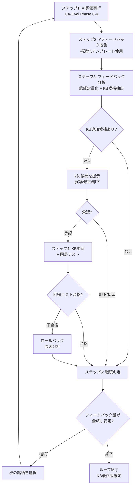

# CA-Eval 暗黙知拡充ループ設計書

> 作成日: 2026-02-17
> 前提: [CA-Evalワークフロー詳細設計書](../../analyst/claude_code/workflow_design.md)
> 上位文書: [Dogma](../../analyst/Competitive_Advantage/analyst_YK/dogma.md)

---

## 1. 概要

本文書は、CA-Evalワークフロー（Phase 0-4: 競争優位性の評価レポート自動生成）を土台として、**アナリストYの暗黙知を継続的に拡充するループ**を設計する。

### 1.1 プロジェクト全体の位置づけ

```
Phase 1-2（完了）: Yの暗黙知を抽出・体系化（12ルール, 12パターン, 5 few-shot）
    ↓
Phase 0-4（設計済）: AIでYの判断をレプリケート（CA-Eval自動評価）
    ↓
本設計書 → 暗黙知拡充ループ: AI評価 → Yフィードバック → KB更新 → 反復
```

### 1.2 目的

1. AIが生成した評価レポートを**Yのフィードバックの触媒**として使う
2. Yのフィードバックから**これまで明文化されていなかった判断基準**を引き出す
3. 新しい判断基準をKB（ナレッジベース）に追加し、AIの評価精度を向上させる
4. このサイクルを反復し、Yのフィードバック量が漸減するまで継続する

### 1.3 設計原則

| 原則 | 内容 |
|------|------|
| **Yの判断が正** | AIの評価とYの評価が乖離した場合、Yが正しい前提で分析する |
| **フィードバック駆動** | AIの自動分析は補助。KB更新の根拠はYのフィードバックのみ |
| **汎用性の検証** | 1銘柄固有の指摘はKBに追加しない。2銘柄以上で再現した指摘のみ追加候補とする |
| **回帰テスト必須** | KB更新後、過去銘柄の評価精度が劣化しないことを確認する |
| **バージョン管理** | KB更新履歴を追跡し、いつでも以前のバージョンに戻せるようにする |

---

## 2. 用語定義

| 用語 | 定義 |
|------|------|
| **期初投資仮説レポート** | 投資前提の設定。投資判断の根幹となる仮説を記述したアナリストレポート |
| **四半期継続評価レポート** | 期初仮説の妥当性を追跡検証するフォローアップレポート |
| **AI評価** | CA-Evalワークフロー（Phase 0-4）で生成されたconfidenceスコア（10-90%） |
| **Y評価** | Yが実際にフィードバックで付与したconfidenceスコア |
| **乖離** | AI評価とY評価の差分（deviation = AI評価 - Y評価） |
| **KB（ナレッジベース）** | KB1（ルール集）、KB2（パターン集）、KB3（few-shot集）、dogma.md の総称 |
| **拡充サイクル** | ステップ1〜4の1回分の実行単位 |

---

## 3. 暗黙知拡充ループ

### 3.1 ループ全体像

```
┌──────────────────────────────────────────────────────────┐
│                   暗黙知拡充ループ                         │
│                                                          │
│  [ステップ1] AI評価実行                                    │
│       入力: アナリストレポート + KB（現行版）                 │
│       処理: CA-Eval Phase 0-4                             │
│       出力: 評価レポート（report.md + structured.json）      │
│            │                                              │
│            ▼                                              │
│  [ステップ2] Yフィードバック収集                             │
│       入力: 評価レポート + フィードバックテンプレート          │
│       処理: Yが各主張に対して納得度とコメントを記入            │
│       出力: feedback.json                                  │
│            │                                              │
│            ▼                                              │
│  [ステップ3] フィードバック分析・KB更新判定                   │
│       入力: feedback.json + structured.json                │
│       処理: 乖離定量化 → KB追加候補抽出 → 汎用性判定          │
│       出力: kb-candidates.json                             │
│            │                                              │
│            ▼                                              │
│  [ステップ4] KB更新・回帰テスト                              │
│       入力: kb-candidates.json（Yが承認した候補のみ）         │
│       処理: KB1/KB2/KB3更新 → 過去銘柄の再評価               │
│       出力: 更新されたKB + kb-version.json                  │
│            │                                              │
│            ▼                                              │
│  [ステップ5] 継続判定                                       │
│       Yのフィードバック量が漸減 → 人間が終了を判断            │
│       継続する場合 → 次の銘柄でステップ1に戻る                │
│                                                          │
└──────────────────────────────────────────────────────────┘
```

### 3.2 ステップ1: AI評価実行

CA-Eval Phase 0-4（workflow_design.md §3〜§4）をそのまま実行する。

**入力**:
- アナリストレポート（期初投資仮説レポート、四半期継続評価レポート、またはその両方）
- KB（現行バージョン）

**出力**:
- `{research_dir}/04_output/report.md`（Markdownレポート）
- `{research_dir}/04_output/structured.json`（構造化JSON）

このステップに変更はない。Phase 0-4の設計書を参照。

### 3.3 ステップ2: Yフィードバック収集

Yに評価レポートを読んでもらい、構造化フィードバックを収集する。

#### フィードバックテンプレート（各主張ごと）

```markdown
### #1: [主張テキスト]

**AI確信度**: [X]%

**納得度:**  10% / 30% / 50% / 70% / 90%  ← 丸をつける

**該当する質問に一言お願いします（1文で十分です）:**

- 納得しない場合 → 一番引っかかる点は？
- どちらとも言えない場合 → 何があれば納得度が上がる？
- 納得する場合 → 他の企業でも同じことが言えない理由は？

回答:


**この指摘は他の銘柄にも当てはまりますか？（任意）**
□ はい → KB追加候補として記録
□ いいえ → この銘柄固有の判断
□ わからない
```

#### フィードバックの構造化（feedback.json）

```json
{
  "ticker": "ORLY",
  "cycle": 3,
  "kb_version": "v1.0.0",
  "date": "2026-02-17",
  "evaluations": [
    {
      "claim_id": 1,
      "ai_confidence": 90,
      "y_confidence": 50,
      "deviation": 40,
      "y_comment": "業界構造の分析は正しいが、競合も同様の戦略を取りつつある点が考慮されていない",
      "generalizable": true,
      "generalizable_comment": "「競合の追随可能性」は他銘柄でも見落としやすい"
    },
    {
      "claim_id": 2,
      "ai_confidence": 70,
      "y_confidence": 70,
      "deviation": 0,
      "y_comment": "",
      "generalizable": null
    }
  ],
  "overall_feedback": "全体として業界構造の分析に偏りすぎ。競合動向の視点が弱い",
  "feedback_volume": "medium"
}
```

**フィードバック量の定義**:

| 量 | 定義 | ループ継続判断への影響 |
|------|------|---------------------|
| **high** | 半数以上の主張にコメントあり | 拡充余地が大きい。継続 |
| **medium** | 1/4〜1/2の主張にコメントあり | 標準的。継続 |
| **low** | 1/4未満の主張にコメントあり | 収束傾向。あと1-2サイクルで終了検討 |
| **none** | コメントなし | 終了 |

### 3.4 ステップ3: フィードバック分析・KB更新判定

Yのフィードバックを分析し、KB追加候補を抽出する。

#### 3.4.1 乖離の定量化

```python
for eval in feedback["evaluations"]:
    eval["deviation"] = eval["ai_confidence"] - eval["y_confidence"]
    if abs(eval["deviation"]) > 20:
        eval["significant"] = True
```

#### 3.4.2 KB追加候補の抽出

フィードバックの中からKBに追加すべき指摘を抽出する。

**判定基準**:

| 条件 | KB追加の妥当性 | 追加先 |
|------|--------------|--------|
| Yが「他の銘柄にも当てはまる」と回答 + 過去サイクルで類似指摘あり（2銘柄以上） | **KB1に追加**（新ルール） | `kb1_rules/` |
| Yが繰り返し指摘する「AIの誤りパターン」（2サイクル以上） | **KB2に追加**（新パターン） | `kb2_patterns/` |
| 新業界の銘柄で、スコア分布が既存few-shotと大きく異なる | **KB3に追加**（新few-shot） | `kb3_fewshot/` |
| 既存ルールの適用基準が曖昧で乖離が発生 | **既存KB更新**（閾値調整等） | 該当ファイル |
| 1銘柄固有の指摘 | **追加しない** | - |
| 表現・文体の好み | **追加しない** | - |

#### 3.4.3 KB追加候補の出力

```json
{
  "cycle": 3,
  "ticker": "ORLY",
  "kb_version": "v1.0.0",
  "candidates": [
    {
      "id": "candidate_001",
      "type": "new_rule",
      "target_kb": "KB1",
      "name": "競合の追随可能性の評価",
      "description": "構造的優位性を評価する際、競合が同様の戦略を採用しつつあるかを検討する",
      "source_feedback": [
        {"ticker": "ORLY", "cycle": 3, "claim_id": 1},
        {"ticker": "COST", "cycle": 2, "claim_id": 4}
      ],
      "reproduction_count": 2,
      "y_approval_status": "pending"
    },
    {
      "id": "candidate_002",
      "type": "threshold_adjustment",
      "target_kb": "KB1",
      "rule": "rule_11",
      "current_threshold": "業界構造×企業ポジション合致 → 90%",
      "proposed_threshold": "業界構造×企業ポジション合致 + 競合追随困難 → 90%、追随可能 → 70%",
      "source_feedback": [
        {"ticker": "ORLY", "cycle": 3, "claim_id": 1}
      ],
      "reproduction_count": 1,
      "y_approval_status": "pending",
      "note": "再現1件のみ。次サイクルで追加事例を確認後に判定"
    }
  ]
}
```

#### 3.4.4 支援ツール

ステップ3を人間が手作業で行うことも可能だが、以下のAI支援ツールで効率化できる。

| ツール | 役割 | 実行タイミング |
|--------|------|-------------|
| **乖離定量化** | feedback.jsonの各主張のdeviationを算出し、significant gapを検出 | ステップ3開始時 |
| **パターン検出** | 過去サイクルのフィードバック履歴と突合し、2回以上再現した指摘を自動検出 | ステップ3の中間 |
| **一貫性チェック** | 銘柄間でのルール適用の揺れを検出 | ステップ3の補助（KB蓄積後に有効） |

これらのツールは判定を自動化するものではなく、**Yとの対話素材を整理する支援ツール**である。

### 3.5 ステップ4: KB更新・回帰テスト

#### 3.5.1 Yの承認

KB追加候補をYに提示し、承認を得る。

```markdown
## KB更新候補: 「競合の追随可能性の評価」

### 発見経緯
- ORLY（サイクル3）: 業界構造90%評価に対しY=50%。「競合も同様の戦略を取りつつある」
- COST（サイクル2）: ベンダー交渉力70%評価に対しY=50%。「SAMS CLUBも同水準」

### 提案
ルール11に条件を追加: 「構造的優位性の評価時に、競合が同様の戦略を採用・追随する可能性を検討すること」

### 承認
□ 承認（ルール11に追記）
□ 修正が必要 → コメント:
□ 却下 → 理由:
□ 保留（次サイクルで追加事例を確認）
```

#### 3.5.2 KB更新の実行

承認された候補のみKBに反映する。

**更新対象の判定**:

| 候補タイプ | 更新先 | ファイル操作 |
|----------|--------|------------|
| 新ルール | `analyst/Competitive_Advantage/analyst_YK/kb1_rules/rule{N}_{name}.md` | 新規作成 |
| 新パターン | `analyst/Competitive_Advantage/analyst_YK/kb2_patterns/pattern_{ID}_{name}.md` | 新規作成 |
| 新few-shot | `analyst/Competitive_Advantage/analyst_YK/kb3_fewshot/fewshot_{TICKER}.md` | 新規作成 |
| 既存ルール修正 | 該当する既存ファイル | 編集 |
| dogma.md修正 | `analyst/Competitive_Advantage/analyst_YK/dogma.md` | 編集 |

**KBファイルの構造**（新規作成時の共通テンプレート）:

```markdown
# [ルール/パターン名]

## 定義
[明確な基準]

## 良い例
- [実銘柄での適用例。スコア付き]

## 悪い例
- [実銘柄での適用例。スコア付き]

## Yのフィードバック（原文）
「[feedback.mdからの直接引用]」

## メタデータ
- 追加日: [YYYY-MM-DD]
- KBバージョン: [vX.Y.Z]
- ソース: [どのサイクル・銘柄のフィードバックから抽出されたか]
- 再現銘柄: [2銘柄以上のリスト]
```

#### 3.5.3 バージョン管理

```json
{
  "current_version": "v1.1.0",
  "history": [
    {
      "version": "v1.0.0",
      "date": "2026-01-15",
      "description": "Phase 2完了時点のベースライン",
      "kb1_rules": 12,
      "kb2_patterns": 12,
      "kb3_fewshots": 5,
      "source": "Phase 2（CHD, COST, LLY, MNST, ORLY）"
    },
    {
      "version": "v1.1.0",
      "date": "2026-02-17",
      "description": "サイクル3: ルール11修正 + パターンH追加",
      "kb1_rules": 12,
      "kb2_patterns": 13,
      "kb3_fewshots": 5,
      "changes": [
        {
          "type": "rule_modified",
          "target": "rule_11",
          "change": "競合追随可能性の条件追加",
          "approved_by": "Y"
        },
        {
          "type": "pattern_added",
          "target": "pattern_H_competitor_replication.md",
          "approved_by": "Y"
        }
      ],
      "source": "サイクル3（ORLY, COST）"
    }
  ]
}
```

#### 3.5.4 回帰テスト

KB更新後、Phase 2の5銘柄（CHD, COST, LLY, MNST, ORLY）をCA-Evalで再評価し、精度が劣化しないことを確認する。

```
回帰テスト手順:
1. 更新後のKBでPhase 2の5銘柄を再評価（CA-Eval Phase 0-4）
2. 各主張のAI評価を、Phase 2のY評価と比較
3. 平均乖離・最大乖離を算出
4. ベースライン（v1.0.0）と比較し、劣化がないことを確認
```

**回帰テスト合格基準**:

| メトリクス | 基準 |
|----------|------|
| 平均乖離 | ベースラインから悪化しない（±2%の許容範囲） |
| 最大乖離 | 30%を超える主張が増加しない |
| 特定銘柄への偏り | 1銘柄のみで大幅悪化していないこと |

**回帰テスト不合格時の対応**:
- KB更新をロールバック（前バージョンに戻す）
- 不合格の原因を分析し、次サイクルで修正版を再提案

### 3.6 ステップ5: 継続判定

ループの終了は人間が定性的に判断する。以下の指標を参考とする。

| 指標 | 測定方法 | 終了の目安 |
|------|---------|----------|
| **フィードバック量** | feedback.jsonの`feedback_volume` | 2サイクル連続で `low` |
| **乖離の減少傾向** | サイクルごとの平均乖離 | 平均乖離が±10%以内で安定 |
| **KB追加候補数** | kb-candidates.jsonの`candidates`数 | 2サイクル連続で0件 |
| **Yの全体評価** | 「概ね沿っている」の回答 | 3サイクル連続 |

**終了は「フィードバックゼロ」を意味しない**。完全にフィードバックがなくなることは実務上不可能であるため、上記指標が安定的に推移した時点で人間が判断する。

---

## 4. 銘柄選択戦略

ループの効率はどの銘柄で回すかに依存する。

### 4.1 選択方針

| フェーズ | 銘柄の特徴 | 目的 | 例 |
|---------|----------|------|-----|
| **初期**（サイクル1-3） | Phase 2の既知銘柄 | ベースラインの確立、ワークフロー検証 | CHD, COST, ORLY |
| **中期**（サイクル4-6） | 既存業界の別銘柄 | 既存ルールの精緻化、一貫性検証 | AZO（自動車部品）, BJ（倉庫型小売） |
| **後期**（サイクル7-） | 新業界の銘柄 | 既存ルールの適用限界の発見、新ルール抽出 | VEEV（ヘルスケアIT）, CDNS（半導体EDA） |

### 4.2 1サイクルあたりの銘柄数

- **推奨: 1銘柄/サイクル**
- 理由: フィードバックの分析と KB更新を丁寧に行うため
- 同一サイクルで複数銘柄を処理すると、KB追加候補の汎用性判定が困難になる

---

## 5. ディレクトリ構造

```
research/CA_eval_{YYYYMMDD}_{TICKER}/
├── 00_meta/
│   └── research-meta.json
├── 01_data_collection/         # Phase 1
├── 02_claims/                  # Phase 2
├── 03_verification/            # Phase 3
├── 04_output/                  # Phase 4
│   ├── report.md
│   ├── structured.json
│   ├── verified-report.md
│   └── verification-results.json
└── 05_feedback/                # 暗黙知拡充ループ
    ├── feedback.json           # ステップ2: Yのフィードバック
    ├── gap-analysis.json       # ステップ3: 乖離分析（支援ツール出力）
    ├── kb-candidates.json      # ステップ3: KB追加候補
    └── kb-update-log.json      # ステップ4: KB更新ログ
```

KB関連:
```
analyst/claude_code/
├── kb1_rules/                  # ルール集（更新対象）
├── kb2_patterns/               # パターン集（更新対象）
├── kb3_fewshot/                # few-shot集（更新対象）
├── kb_version.json             # バージョン管理
└── kb_snapshots/               # 各バージョンのスナップショット
    ├── v1.0.0/
    └── v1.1.0/
```

---

## 6. 全体フロー図



---

## 7. メトリクス

### 7.1 サイクルごとの追跡指標

| メトリクス | 測定方法 | 目標 |
|----------|---------|------|
| **平均乖離** | mean(abs(AI評価 - Y評価)) | サイクルごとに減少し、±10%以内で安定 |
| **significant gap数** | count(abs(deviation) > 20%) | サイクルごとに減少 |
| **フィードバック量** | 主張に対するコメント率 | 漸減傾向 |
| **KB追加候補数** | candidates.length | 漸減傾向 |
| **回帰テスト合格率** | 合格/不合格 | 常に合格 |

### 7.2 KB拡充の履歴

| バージョン | 日付 | KB1 | KB2 | KB3 | 平均乖離 | ソース |
|----------|------|-----|-----|-----|---------|--------|
| v1.0.0 | 2026-01-15 | 12ルール | 12パターン | 5銘柄 | ベースライン | Phase 2 |
| v1.1.0 | (予定) | +0〜2 | +0〜2 | +0〜1 | 改善目標 | サイクル1-3 |
| v1.2.0 | (予定) | +0〜2 | +0〜2 | +0〜1 | 改善目標 | サイクル4-6 |

---

## 8. 関連ファイル

| ファイル | パス |
|---------|------|
| CA-Eval Phase 0-4設計書 | `analyst/claude_code/workflow_design.md` |
| Dogma（Yの判断軸） | `analyst/Competitive_Advantage/analyst_YK/dogma.md` |
| KB1（ルール集） | `analyst/Competitive_Advantage/analyst_YK/kb1_rules/*.md` |
| KB2（パターン集） | `analyst/Competitive_Advantage/analyst_YK/kb2_patterns/*.md` |
| KB3（few-shot集） | `analyst/Competitive_Advantage/analyst_YK/kb3_fewshot/*.md` |
| Phase 2検証データ | `analyst/phase2_KY/*.md` |

---

## 9. 次のステップ

1. **Phase 0-4（CA-Eval）の実装を完了する**
   - 暗黙知拡充ループのステップ1に相当
   - これが動かなければループを開始できない

2. **フィードバックテンプレート（§3.3）の確定**
   - Yに使いやすい形式かを事前確認

3. **サイクル1の実行**（Phase 2既知銘柄で検証）
   - 対象: ORLY（Phase 2で最も評価事例が豊富）
   - 目的: ループの動作確認、所要時間の計測

4. **KB バージョン管理の初期化**
   - v1.0.0 のスナップショット作成
   - `kb_version.json` の初期化
