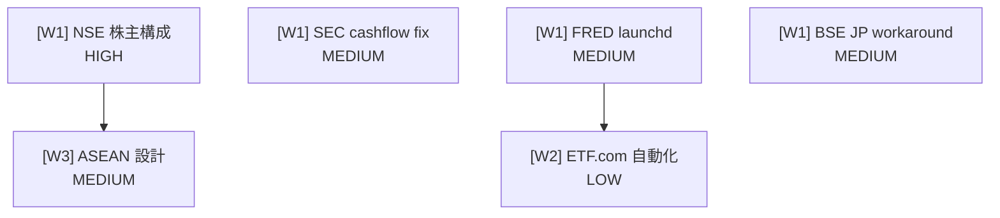

# Project-105: NSE/Pipeline 改善タスク統合

## Context

PR #3878（NSE実装）以降、5件のコミットがPRなしでmainに直接プッシュされた。
これらは既にorigin/mainに同期済みで巻き戻し不要だが、今後は適切なPRワークフローで進める。

未完了の ActionItem 7件を1つの GitHub Project に統合し、worktree で開発する。

## プロジェクト情報

| 項目 | 値 |
|------|-----|
| Project番号 | 105 |
| GitHub Project | 次番号（`gh project create` で自動採番） |
| ブランチ | `feature/prj105` |
| worktree | `../.worktrees/quants/feature-prj105` |
| 計画書 | `docs/project/project-105/project.md` |

## Wave 構成

### Wave 1（並行開発可能 — 依存なし）

#### task-1: [Wave1] NSE 株主構成エンドポイント追加
- **種別**: enhancement | **優先度**: 高
- **ActionItem**: act-2026-04-02-013
- **概要**: `CorporateCollector` に `get_shareholding_pattern()` を追加。NSE API のみ使用（yfinance補完禁止）

| 操作 | ファイル |
|------|---------|
| modify | `src/market/nse/constants.py` — エンドポイント定数 + `SHAREHOLDING_FIELD_MAP` |
| modify | `src/market/nse/types.py` — `ShareholdingPattern` frozen dataclass |
| modify | `src/market/nse/parsers.py` — `parse_shareholding_pattern()` |
| modify | `src/market/nse/collectors/corporate.py` — `get_shareholding_pattern()` メソッド |
| modify | `src/market/nse/__init__.py` — エクスポート追加 |
| create | `tests/market/nse/unit/test_shareholding.py` — パーサー + コレクター単体テスト |

**実装方針**:
1. `/site-investigator` で NSE shareholding API エンドポイントを特定（推定: `/api/corporates-shareholding?symbol=XXX`）
2. `parse_financial_results()` (`parsers.py`) と `get_financial_results()` (`corporate.py:117-179`) のパターンを踏襲
3. dataclass は `FinancialResult` パターン（frozen、NumPy docstring）

**受け入れ条件**:
- [ ] `CorporateCollector().get_shareholding_pattern("RELIANCE")` が `list[ShareholdingPattern]` を返す
- [ ] パーサーが空/不正レスポンスで空リストを返す
- [ ] 単体テスト + プロパティテスト通過
- [ ] `make check-all` 成功

---

#### task-2: [Wave1] SEC operating_cashflow None フォールバック
- **種別**: bug | **優先度**: 中
- **ActionItem**: act-2026-04-04-001
- **概要**: `financials.get_operating_cash_flow()` が None を返す場合、XBRL 生データから代替抽出

| 操作 | ファイル |
|------|---------|
| modify | `src/market/pipeline/collector_sec.py` — `_extract_operating_cashflow_fallback()` 追加 (L438付近) |
| modify | `tests/market/pipeline/unit/test_collector_sec.py` — フォールバックテスト追加 |

**実装方針**:
1. `collector_sec.py:438-440` の `get_operating_cash_flow()` が None の場合にフォールバック呼び出し
2. `CF_LABEL_FALLBACK` dict（L65-84）の概念名で `cash_flow_statement` の行を検索
3. 既存の `_safe_float()` ラッピングは維持

**受け入れ条件**:
- [ ] プライマリ抽出成功時は既存動作と同一
- [ ] フォールバック成功時にログ出力（`logger.info`）
- [ ] フォールバックも None の場合はそのまま None
- [ ] テスト3パターン: プライマリ成功 / フォールバック成功 / 両方None

---

#### task-3: [Wave1] FRED launchd 定期同期 plist
- **種別**: enhancement | **優先度**: 中
- **ActionItem**: act-2026-03-25-001
- **概要**: `scripts/sync_historical.py --auto --stale-hours 24` を launchd で日次実行

| 操作 | ファイル |
|------|---------|
| create | `scripts/com.quants.fred-sync.plist` — 06:00 実行 |

**実装方針**:
- `scripts/com.quants.pipeline-yfinance.plist` をテンプレートに作成
- **注意**: plist内パスは Mac Mini (`/Users/yuki/`)。定期実行は yukimac-mini で行う方針（dec-2026-03-21-006）
- `ProgramArguments`: `uv run --env-file .env python -u -m market.fred.scripts.sync_historical --auto --stale-hours 24`
- `StartCalendarInterval`: 06:00（米国市場終了後、FRED更新後）

**受け入れ条件**:
- [ ] `plutil -lint` で valid XML
- [ ] `com.quants.fred-sync` ラベル
- [ ] ログ: `~/Library/Logs/quants/fred-sync.log`

---

#### task-4: [Wave1] BSE 日本IPワークアラウンド
- **種別**: bug | **優先度**: 中
- **ActionItem**: act-2026-04-02-010
- **概要**: BSE API が日本IPからブロックされる問題。NSE cookie fallback パターンを BSE session に適用

| 操作 | ファイル |
|------|---------|
| modify | `src/market/bse/session.py` — タイムアウト/403 のグレースフルハンドリング追加 |
| modify | `tests/market/bse/unit/test_session.py` — 403/タイムアウト フォールバックテスト |

**実装方針**:
1. NSE `session.py:468-486` パターンを参考に、BSE session のリクエストメソッドに `httpx.TimeoutException` キャッチ追加
2. 403/タイムアウト時は警告ログ + Cookie なしで続行（BhavcopyCollector の CSV ダウンロードは別ホストなので通る可能性あり）
3. BSE API 自体が使えない場合は CSV ダウンロードパスにフォールバック

**受け入れ条件**:
- [ ] 403/タイムアウトでクラッシュしない
- [ ] 構造化ログで geo-block 検出を記録
- [ ] 既存の正常パスに影響なし
- [ ] テスト2パターン: 403フォールバック / タイムアウトフォールバック

---

### Wave 2（Wave 1 完了後）

#### task-5: [Wave2] ETF.com 自動化 launchd 統合
- **種別**: enhancement | **優先度**: 低
- **ActionItem**: act-2026-03-24-007
- **依存**: task-3（plist パターン確認後）
- **概要**: ETF.com データ収集の CLI + launchd plist（日次/週次/月次）

| 操作 | ファイル |
|------|---------|
| create | `src/market/etfcom/cli.py` — argparse CLI（`--frequency daily\|weekly\|monthly\|all`） |
| create | `src/market/etfcom/__main__.py` — エントリポイント |
| create | `scripts/com.quants.etfcom-daily.plist` — 03:00 daily |
| create | `scripts/com.quants.etfcom-weekly.plist` — 日曜 04:00 |
| create | `scripts/com.quants.etfcom-monthly.plist` — 毎月1日 05:00 |
| create | `data/config/etfcom_tickers.json` — ティッカーリスト設定 |

**実装方針**:
- `market.pipeline.cli` (323行) のパターンを踏襲
- 既存の `ETFComCollector.collect_daily()` / `collect_weekly()` / `collect_monthly()` に委譲
- ティッカーリストは JSON 設定ファイルで管理

**受け入れ条件**:
- [ ] `python -m market.etfcom --frequency daily --tickers SPY,QQQ` 動作
- [ ] 3 plist が `plutil -lint` 通過
- [ ] 部分失敗でプロセスがクラッシュしない

---

### Wave 3（Wave 1 完了後）

#### task-6: [Wave3] ASEAN カバレッジ統合設計
- **種別**: enhancement（設計ドキュメントのみ） | **優先度**: 中
- **ActionItem**: act-2026-04-02-011
- **依存**: task-1（NSE が India 主要ソースとして機能することの確認）
- **概要**: NSE を ASEAN カバレッジの India データソースとして位置づける設計書

| 操作 | ファイル |
|------|---------|
| create | `docs/design/asean-india-integration.md` — アーキテクチャ設計書 |

**設計書の内容**:
- `AseanMarket` enum（`src/market/asean_common/constants.py`）への NSE/BSE 追加方針
- NSE `StockQuote` / `IndexConstituent` → ASEAN `TickerRecord` 型マッピング
- yfinance サフィックス `.NS`（NSE）/ `.BO`（BSE）
- BSE は補助ソース（bhavcopy CSV で価格データ補完）
- tradingview-screener 統合設計

**受け入れ条件**:
- [ ] 型マッピング表を含む設計書
- [ ] enum 拡張戦略が文書化されている
- [ ] コード変更なし（設計のみ）

---

## 依存関係図



## リスク評価

| リスク | 影響 | 対策 |
|--------|------|------|
| NSE shareholding API エンドポイントが推定と異なる | 高 | `/site-investigator` で事前調査。Playwright MCP でネットワーク監視 |
| BSE geo-block が CSV ダウンロード URL にも影響 | 高 | 日本IPから早期テスト。ダメなら制限として文書化 |
| edgartools API 変更で cashflow フォールバックが効かない | 中 | edgartools バージョン固定。XBRL 生データ直接パースの最終手段を準備 |
| ETF.com レートリミット | 中 | 既存の polite delay + ティッカー間 jitter |

## 実行手順

```
1. /plan-project で GitHub Project + Issues 登録
   → project-105 / Issue 6件（Wave分類済み）

2. /worktree feature/prj105 で worktree 作成
   → ../.worktrees/quants/feature-prj105

3. Wave 1: task-1〜4 を並行実装
   → 各タスク完了ごとに commit

4. Wave 2: task-5 実装

5. Wave 3: task-6 設計書作成

6. /commit-and-pr で PR 作成
   → main へマージ

7. /worktree-done feature/prj105 でクリーンアップ
```

## 検証方法

- 各タスク完了時: `make check-all`（format + lint + typecheck + test）
- task-1: 日本IPからの NSE API 実機テスト（`CorporateCollector().get_shareholding_pattern("RELIANCE")`）
- task-2: SEC EDGAR の cashflow None 銘柄を特定し、フォールバック適用前後を比較
- task-3: `plutil -lint scripts/com.quants.fred-sync.plist`
- task-4: 日本IPからの BSE session 実機テスト
- task-5: `python -m market.etfcom --frequency daily --tickers SPY` 動作確認
- task-6: 設計書レビュー（コード変更なし）
- 最終: PR 作成後 CI（GitHub Actions）通過確認
