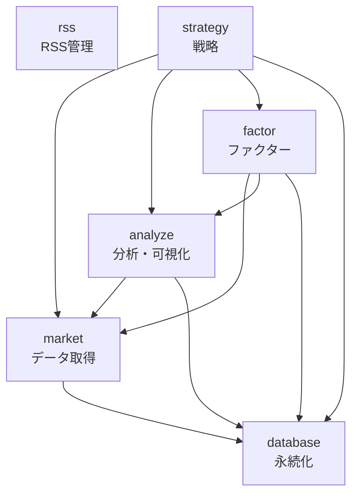

# Pythonパッケージリファクタリング計画

## 目的
既存パッケージの構成を、金融市場分析・クオンツ分析・データ分析プロジェクトに適合した形に作り替える。

## 現状分析

### 既存パッケージ構成
| パッケージ | 行数 | 主な機能 | 課題 |
|-----------|------|---------|------|
| `market_analysis` | 16,444 | データ取得・分析・可視化 | 責務が混在、テストが分散 |
| `finance` | 649 | コアインフラ（DB、ロギング） | 名称が汎用的すぎる |
| `rss` | 5,822 | RSSフィード管理 | 問題なし |
| `factor` | 10,275 | ファクター投資・分析 | 問題なし |
| `strategy` | 4,020 | 投資戦略・バックテスト | 問題なし |
| `bloomberg` | N/A | Bloomberg連携 | 独立パッケージとして孤立 |

**主な課題**:
1. `market_analysis` がデータ取得と分析の両方を担当し、責務が不明確
2. `finance` が汎用的な名称でありながらDB特化の機能のみ
3. `bloomberg` が独立しており、他のデータソースと統合されていない

## 目標アーキテクチャ

### 4層アーキテクチャ

```
┌─────────────────────────────────────────┐
│  4. ストラテジー作成層 (strategy)        │  ← ポートフォリオ構築・バックテスト
├─────────────────────────────────────────┤
│  3. ファクター作成層 (factor)            │  ← アルファ探求・ファクター分析
├─────────────────────────────────────────┤
│  2. データ分析とプロット層 (analyze)     │  ← 統計分析・テクニカル分析・可視化
├─────────────────────────────────────────┤
│  1. データ取得層 (market, database, rss) │  ← データソース統合・永続化
└─────────────────────────────────────────┘
```

### レイヤー1: データ取得層

#### `market` パッケージ
**責務**: 市場データの取得・エクスポート（分析機能は含まない）

**モジュール構成**:
```
market/
├── yfinance/          # Yahoo Finance連携
├── fred/              # FRED経済指標連携
├── bloomberg/         # Bloomberg Terminal連携（既存bloombergパッケージを統合）
├── factset/           # FactSetデータローダー（箱のみ、今後開発）
├── alternative/       # オルタナティブデータ（箱のみ、今後開発）
├── export/            # データエクスポート
└── cache/             # キャッシュ管理
```

**移行元**: `market_analysis` のデータ取得部分（`core/`, `export/`, `utils/cache.py`）+ `bloomberg` パッケージ全体

#### `database` パッケージ
**責務**: データベース管理・永続化

**モジュール構成**:
```
database/
├── sqlite_client.py   # SQLiteクライアント（OLTP）
├── duckdb_client.py   # DuckDBクライアント（OLAP）
├── migrations/        # マイグレーション管理
└── connection.py      # 接続管理
```

**移行元**: `finance` パッケージ全体を `database` にリネーム

#### `rss` パッケージ
**責務**: RSSフィード取得・管理

**変更**: なし（既存のまま維持）

### レイヤー2: データ分析とプロット層

#### `analyze` パッケージ
**責務**: データ分析・テクニカル分析・可視化

**モジュール構成**:
```
analyze/
├── statistics/        # 基本統計分析（要約統計量、相関分析）
├── technical/         # テクニカル分析（SMA, EMA, RSI等）
├── sector/            # セクター分析
├── earnings/          # 決算カレンダー
├── returns/           # 多期間騰落率計算
└── visualization/     # チャート生成（Plotly）
```

**移行元**: `market_analysis` の分析部分（`analysis/`, `visualization/`, `api/analysis.py`, `api/chart.py`）

**スコープ**:
- ✅ 基本統計分析（要約統計量、記述統計、相関分析）
- ✅ テクニカル分析（移動平均、RSI、MACD、ボリンジャーバンド等）
- ✅ セクター・個別株分析（セクター分析、決算カレンダー、多期間騰落率）
- ✅ チャート生成・可視化（Plotly による各種チャート）

### レイヤー3: ファクター作成層

#### `factor` パッケージ
**変更**: なし（既存のまま維持）

### レイヤー4: ストラテジー作成層

#### `strategy` パッケージ
**変更**: なし（既存のまま維持）

## リファクタリング戦略

### 実施方針
- **分割方針**: データ取得のみを `market`、全分析を `analyze` に
- **実施戦略**: 段階的移行（3フェーズ）
- **互換性戦略**: 破壊的変更（全コード修正）
- **テスト戦略**: TDDで新機能を実装
- **データ互換性**: 共通のデータフォーマット定義（Parquet/JSON）
- **優先順位**: データ取得層から順番に（market → database → analyze）

### 3フェーズ移行計画

#### Phase 1: 新パッケージ作成とコア機能移植

**目標**: 新パッケージの基盤構築とコア機能の移植

**タスク**:
1. `market` パッケージ作成
   - [ ] yfinance モジュール移植（`market_analysis/core/yfinance_fetcher.py` → `market/yfinance/`）
   - [ ] fred モジュール移植（`market_analysis/core/fred_fetcher.py` → `market/fred/`）
   - [ ] bloomberg モジュール統合（`bloomberg/` → `market/bloomberg/`）
   - [ ] export モジュール移植（`market_analysis/export/` → `market/export/`）
   - [ ] cache モジュール移植（`market_analysis/utils/cache.py` → `market/cache/`）
   - [ ] factset モジュール作成（空の箱のみ、実装は今後）
   - [ ] alternative モジュール作成（空の箱のみ、実装は今後）

2. `database` パッケージ作成
   - [ ] `finance` を `database` にリネーム
   - [ ] 全インポート文を更新
   - [ ] テストを更新

3. 共通データフォーマット定義
   - [ ] Parquet スキーマ定義（株価、為替、指数、経済指標）
   - [ ] JSON スキーマ定義（メタデータ、設定）
   - [ ] フォーマット変換ユーティリティ作成

**完了条件**:
- [ ] `market` パッケージの基本機能が動作
- [ ] `database` パッケージのリネームが完了
- [ ] 全テストが通過（カバレッジ80%以上）
- [ ] データフォーマット定義が文書化

**期間**: 2-3週間

#### Phase 2: 全機能移植と互換性検証

**目標**: 残りの機能を移植し、新旧パッケージの互換性を検証

**タスク**:
1. `analyze` パッケージ作成
   - [ ] statistics モジュール移植（TDD）
   - [ ] technical モジュール移植（TDD）
   - [ ] sector モジュール移植（`market_analysis/analysis/sector.py`）
   - [ ] earnings モジュール移植（`market_analysis/analysis/earnings.py`）
   - [ ] returns モジュール移植（`market_analysis/analysis/returns.py`）
   - [ ] visualization モジュール移植（`market_analysis/visualization/`）

2. パッケージ間連携の実装
   - [ ] `analyze` → `market` の依存関係を確立
   - [ ] `factor` → `market` + `analyze` の依存関係を確立
   - [ ] `strategy` → `market` + `analyze` + `factor` の依存関係を確立

3. 既存コードの全面更新
   - [ ] 全インポート文を新パッケージに更新
   - [ ] `market_analysis` への参照を削除
   - [ ] テストを新パッケージ構造に移行

**完了条件**:
- [ ] `analyze` パッケージの全機能が動作
- [ ] 新旧パッケージが同じ結果を返すことを統合テストで検証
- [ ] 全パッケージ間の依存関係が正しく機能
- [ ] 全テストが通過（カバレッジ80%以上）

**期間**: 3-4週間

#### Phase 3: 旧パッケージ削除とクリーンアップ

**目標**: 旧パッケージを削除し、ドキュメントを整備

**タスク**:
1. 旧パッケージの削除
   - [ ] `market_analysis` パッケージ削除
   - [ ] `bloomberg` パッケージ削除
   - [ ] 旧パッケージへの参照がないか最終確認

2. ドキュメント整備
   - [ ] 各パッケージの README.md を更新
   - [ ] アーキテクチャドキュメント作成
   - [ ] マイグレーションガイド作成

3. 品質確認
   - [ ] `make check-all` が全て通過
   - [ ] パフォーマンス回帰がないか確認
   - [ ] 依存関係の循環参照がないか確認

**完了条件**:
- [ ] 旧パッケージが完全に削除
- [ ] 全ドキュメントが更新済み
- [ ] 品質チェックが全て通過
- [ ] プロジェクト健全性チェック（循環依存検出）が通過

**期間**: 1-2週間

## データ互換性の確保

### 共通データフォーマット

#### Parquet スキーマ
```python
# 株価データ
StockPriceSchema = {
    "symbol": str,
    "date": datetime,
    "open": float,
    "high": float,
    "low": float,
    "close": float,
    "volume": int,
    "adjusted_close": float,
}

# 経済指標データ
EconomicIndicatorSchema = {
    "series_id": str,
    "date": datetime,
    "value": float,
    "unit": str,
}
```

#### データマイグレーション
- 既存データは `data/raw/` 配下にそのまま保持
- 新規データのみ新フォーマットで保存
- 必要に応じてマイグレーションスクリプトで旧データを変換

## 依存関係図



## リスクと対策

| リスク | 影響 | 対策 |
|--------|------|------|
| 移行中のバグ混入 | 高 | TDD + 統合テストで品質確保 |
| データ互換性の破損 | 高 | 共通スキーマ定義 + マイグレーションスクリプト |
| 移行期間の長期化 | 中 | フェーズごとに完了条件を明確化、週次レビュー |
| パフォーマンス劣化 | 中 | ベンチマーク測定、プロファイリング |
| 依存関係の循環参照 | 中 | プロジェクト健全性チェック（pre-push hook）で検出 |

## 成功指標

- [ ] 全パッケージのテストカバレッジ80%以上
- [ ] `make check-all` が全て通過
- [ ] パフォーマンス劣化が10%以内
- [ ] 循環依存がゼロ
- [ ] 全ドキュメントが最新

## 次のステップ

### 即座に実行可能なアクション

1. **Phase 1 の GitHub Issue 作成**
   ```bash
   # Issueを作成
   /issue @docs/plan/2026-1-25-refactor-packages.md
   ```

2. **並行開発計画の立案**
   ```bash
   # GitHub Project を参照して worktree 計画を立てる
   /plan-worktrees <project_number>
   ```

3. **最初のタスクを開始**
   ```bash
   # market パッケージ作成の worktree を作成
   /worktree feature/refactor-create-market-package
   ```

### 推奨作業フロー

```
1. Phase 1 Issue 作成 → 2. worktree 作成 → 3. TDD実装 → 4. PR作成 → 5. マージ
   ↓
6. Phase 2 Issue 作成 → 7. worktree 作成 → 8. TDD実装 → 9. PR作成 → 10. マージ
   ↓
11. Phase 3 Issue 作成 → 12. worktree 作成 → 13. クリーンアップ → 14. PR作成 → 15. マージ
```

### 参考コマンド

| タスク | コマンド |
|--------|---------|
| Issue作成 | `/issue @docs/plan/2026-1-25-refactor-packages.md` |
| Issue詳細化 | `/issue-refine <番号>` |
| 並行開発計画 | `/plan-worktrees <project_number>` |
| worktree作成 | `/worktree <branch_name>` |
| テスト作成 | `/write-tests` |
| 品質確認 | `/ensure-quality` |
| PR作成 | `/commit-and-pr` |
| PRマージ | `/merge-pr <番号>` |
| worktreeクリーンアップ | `/worktree-done <branch_name>` |

### 注意事項

- **破壊的変更**: 後方互換性を維持しないため、全コードを一気に更新する必要があります
- **TDD必須**: 新機能は必ずTDDで実装してください
- **品質チェック**: 各PRマージ前に `make check-all` を実行してください
- **週次レビュー**: 進捗を週次で確認し、必要に応じて計画を調整してください