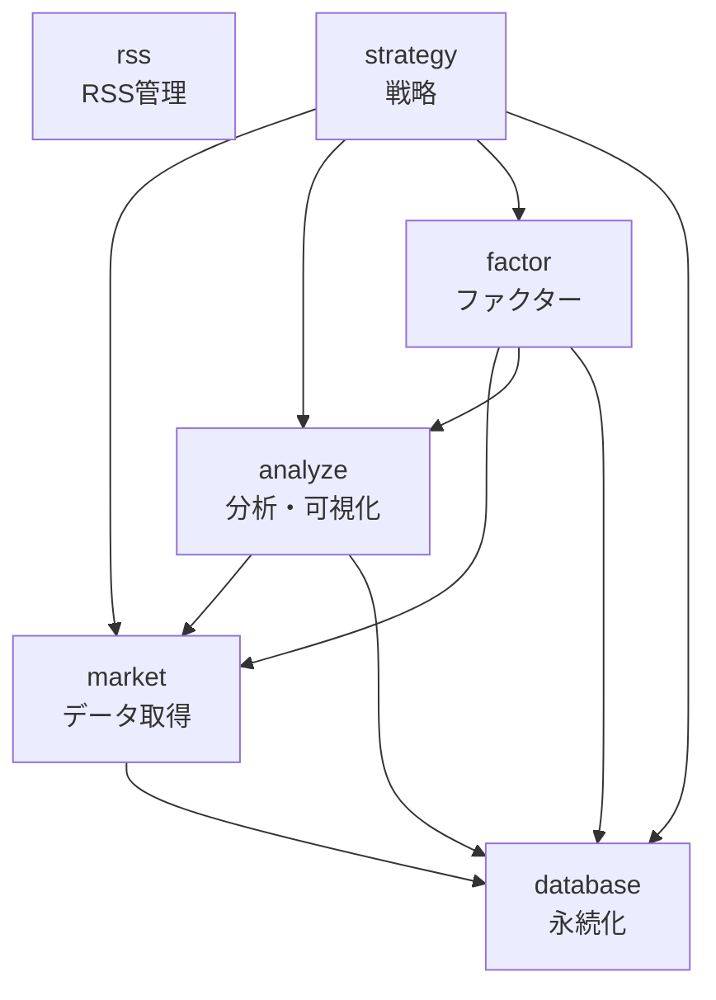

# Pythonパッケージリファクタリング - プロジェクト管理

**ステータス**: 計画中
**GitHub Project**: 未作成
**作成日**: 2026-01-25
**計画書**: `docs/plan/2026-1-25-refactor-packages.md`

## 概要

既存パッケージの構成を、金融市場分析・クオンツ分析・データ分析プロジェクトに適合した4層アーキテクチャに再編成する大規模リファクタリングプロジェクト。

**主な目的:**

- `market_analysis` をデータ取得層（`market`）と分析層（`analyze`）に分割
- `finance` を `database` にリネームして役割を明確化
- `bloomberg` を `market` パッケージに統合
- 責務の明確化とテスト品質の向上

## 目標アーキテクチャ

```
4. strategy    (ストラテジー作成層) ← ポートフォリオ構築・バックテスト
3. factor      (ファクター作成層)   ← アルファ探求・ファクター分析
2. analyze     (データ分析層)       ← 統計分析・テクニカル分析・可視化
1. market      (データ取得層)       ← データソース統合・永続化
   database    (永続化層)           ← データベース管理
   rss         (RSS管理層)          ← RSSフィード取得・管理
```

## 実施方針

- **分割方針**: データ取得のみを `market`、全分析を `analyze` に
- **実施戦略**: 段階的移行（3フェーズ）
- **互換性戦略**: 破壊的変更（全コード修正）
- **テスト戦略**: TDDで新機能を実装
- **データ互換性**: 共通のデータフォーマット定義（Parquet/JSON）
- **優先順位**: データ取得層から順番に（market → database → analyze）

## Phase 1: 新パッケージ作成とコア機能移植

**期間**: 2-3週間

### market パッケージ作成

- [ ] yfinance モジュール移植
- [ ] fred モジュール移植
- [ ] bloomberg モジュール統合
- [ ] export モジュール移植
- [ ] cache モジュール移植
- [ ] factset モジュール作成（空の箱）
- [ ] alternative モジュール作成（空の箱）

### database パッケージ作成

- [ ] finance を database にリネーム
- [ ] 全インポート文を更新
- [ ] テストを更新

### 共通データフォーマット定義

- [ ] Parquet スキーマ定義（株価、為替、指数、経済指標）
- [ ] JSON スキーマ定義（メタデータ、設定）
- [ ] フォーマット変換ユーティリティ作成

### 完了条件

- [ ] market パッケージの基本機能が動作
- [ ] database パッケージのリネームが完了
- [ ] 全テストが通過（カバレッジ80%以上）
- [ ] データフォーマット定義が文書化

## Phase 2: 全機能移植と互換性検証

**期間**: 3-4週間

### analyze パッケージ作成

- [ ] statistics モジュール移植（TDD）
- [ ] technical モジュール移植（TDD）
- [ ] sector モジュール移植
- [ ] earnings モジュール移植
- [ ] returns モジュール移植
- [ ] visualization モジュール移植

### パッケージ間連携の実装

- [ ] analyze → market の依存関係を確立
- [ ] factor → market + analyze の依存関係を確立
- [ ] strategy → market + analyze + factor の依存関係を確立

### 既存コードの全面更新

- [ ] 全インポート文を新パッケージに更新
- [ ] market_analysis への参照を削除
- [ ] テストを新パッケージ構造に移行

### 完了条件

- [ ] analyze パッケージの全機能が動作
- [ ] 新旧パッケージが同じ結果を返すことを統合テストで検証
- [ ] 全パッケージ間の依存関係が正しく機能
- [ ] 全テストが通過（カバレッジ80%以上）

## Phase 3: 旧パッケージ削除とクリーンアップ

**期間**: 1-2週間

### 旧パッケージの削除

- [ ] market_analysis パッケージ削除
- [ ] bloomberg パッケージ削除
- [ ] 旧パッケージへの参照がないか最終確認

### ドキュメント整備

- [ ] 各パッケージの README.md を更新
- [ ] アーキテクチャドキュメント作成
- [ ] マイグレーションガイド作成

### 品質確認

- [ ] make check-all が全て通過
- [ ] パフォーマンス回帰がないか確認
- [ ] 依存関係の循環参照がないか確認

### 完了条件

- [ ] 旧パッケージが完全に削除
- [ ] 全ドキュメントが更新済み
- [ ] 品質チェックが全て通過
- [ ] プロジェクト健全性チェック（循環依存検出）が通過

## 技術的考慮事項

### リスクと対策

| リスク | 影響 | 対策 |
|--------|------|------|
| 移行中のバグ混入 | 高 | TDD + 統合テストで品質確保 |
| データ互換性の破損 | 高 | 共通スキーマ定義 + マイグレーションスクリプト |
| 移行期間の長期化 | 中 | フェーズごとに完了条件を明確化、週次レビュー |
| パフォーマンス劣化 | 中 | ベンチマーク測定、プロファイリング |
| 依存関係の循環参照 | 中 | プロジェクト健全性チェック（pre-push hook）で検出 |

### データフォーマット

#### Parquet スキーマ
```python
# 株価データ
StockPriceSchema = {
    "symbol": str,
    "date": datetime,
    "open": float,
    "high": float,
    "low": float,
    "close": float,
    "volume": int,
    "adjusted_close": float,
}

# 経済指標データ
EconomicIndicatorSchema = {
    "series_id": str,
    "date": datetime,
    "value": float,
    "unit": str,
}
```

## 成功基準

1. **機能完成度**
    - 全パッケージのテストカバレッジ80%以上
    - make check-all が全て通過
    - パフォーマンス劣化が10%以内

2. **品質基準**
    - 循環依存がゼロ
    - 全ドキュメントが最新
    - 型チェック（pyright）エラーなし

3. **運用性**
    - 既存機能が全て新パッケージで動作
    - データマイグレーションが完了
    - CI/CDが正常に動作

---

## 依存関係図



---

## GitHub Issues

| # | タイトル | フェーズ | ステータス |
|---|---------|---------|-----------|
| [#932](https://github.com/YH-05/finance/issues/932) | [Phase 1] market パッケージ作成 | Phase 1 | Todo |
| [#933](https://github.com/YH-05/finance/issues/933) | [Phase 1] database パッケージ作成（finance リネーム） | Phase 1 | Todo |
| [#934](https://github.com/YH-05/finance/issues/934) | [Phase 1] 共通データフォーマット定義 | Phase 1 | Todo |
| [#935](https://github.com/YH-05/finance/issues/935) | [Phase 2] analyze パッケージ作成 | Phase 2 | Todo |
| [#936](https://github.com/YH-05/finance/issues/936) | [Phase 2] パッケージ間依存関係の確立 | Phase 2 | Todo |
| [#937](https://github.com/YH-05/finance/issues/937) | [Phase 2] 既存コードの全面更新 | Phase 2 | Todo |
| [#938](https://github.com/YH-05/finance/issues/938) | [Phase 3] 旧パッケージの削除 | Phase 3 | Todo |
| [#939](https://github.com/YH-05/finance/issues/939) | [Phase 3] ドキュメント整備 | Phase 3 | Todo |
| [#940](https://github.com/YH-05/finance/issues/940) | [Phase 3] 品質確認と最終検証 | Phase 3 | Todo |

**9件作成 / 0件完了** (2026-01-25)

---

**最終更新**: 2026-01-25
**更新内容**: プロジェクト作成、Issue登録完了
