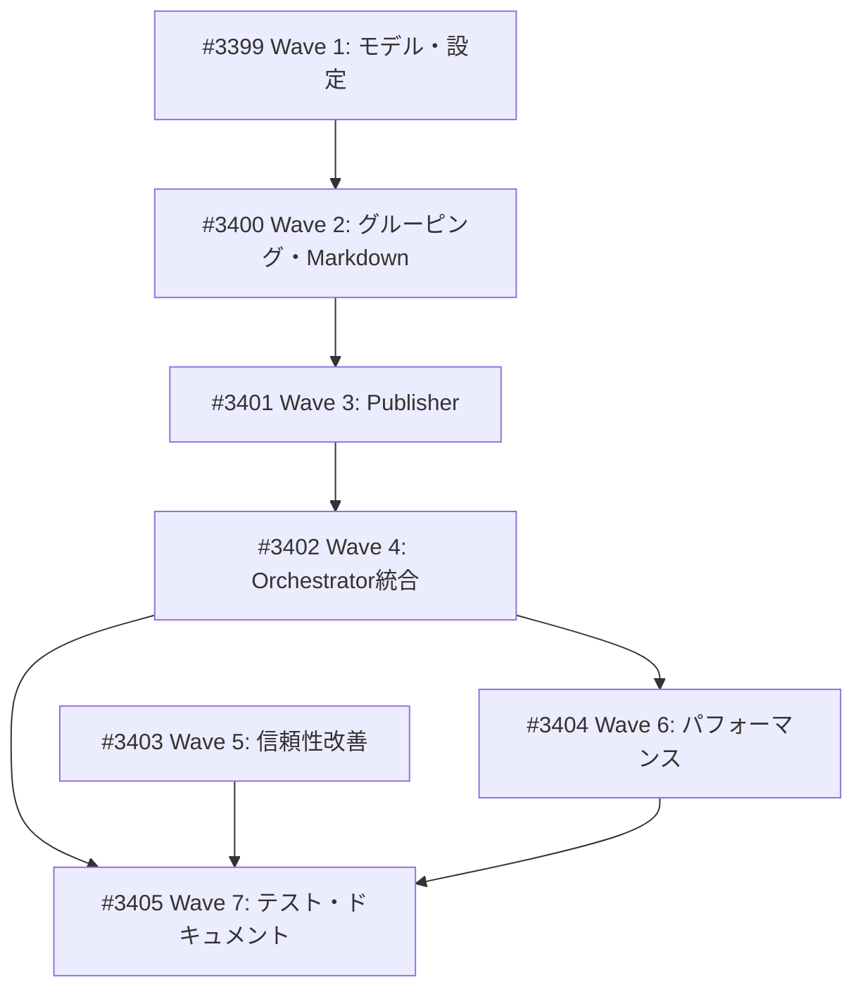

# Finance News Workflow 改善 (Phase 2)

**作成日**: 2026-02-09
**ステータス**: 計画中
**タイプ**: package
**GitHub Project**: [#26](https://github.com/users/YH-05/projects/26)

## 背景と目的

### 背景

`finance_news_workflow.py` (Python CLI版パイプライン) には以下の課題がある:

1. **信頼性**: 抽出成功率が56% (273/490)。CNBC anti-scraping で216件失敗、壊れたフィード4件
2. **パフォーマンス**: 抽出30s/記事、要約60s/記事、公開5s/記事
3. **GitHub API レート制限**: 記事ごとに1 Issue × 4 API コール = 100記事で400コール

### 目的

1. カテゴリ別Issue方式に移行してGitHub APIコールを98%削減
2. 抽出成功率を56%→70%以上に改善
3. 11テーマ→6カテゴリに統合して管理を簡素化

### 成功基準

- [ ] 6カテゴリ × 1 Issue/日 でGitHub APIコール98%削減
- [ ] 抽出成功率 56% → 70%以上
- [ ] `make check-all` パス
- [ ] 既存テスト全パス + 新規テスト追加

## リサーチ結果

### 既存パターン

- `Publisher` クラス (`publisher.py`) が Issue 作成・Project 追加・フィールド設定を一元管理
- `status_mapping` / `github_status_ids` で RSS カテゴリ → GitHub Status への変換が実装済み
- `orchestrator.py` が 4 ステージパイプライン (Collect→Extract→Summarize→Publish) を制御

### 参考実装

| ファイル | 説明 |
|---------|------|
| `src/news/publisher.py` | 既存 Issue 作成ロジック。`_add_to_project()`, `_generate_issue_body()` を流用可能 |
| `src/news/orchestrator.py` | パイプライン制御。新ステージ (Group, Export) を追加する場所 |
| `src/news/models.py` | Pydantic モデル定義。CategoryGroup, CategoryPublishResult を追加 |
| `data/config/news-collection-config.yaml` | status_mapping, github_status_ids の既存マッピング |

### 技術的考慮事項

- 既存の `publish_batch()` は後方互換のため残す (`--format per-article`)
- カテゴリ別重複チェックはタイトルベース (`[カテゴリ名] ニュースまとめ - YYYY-MM-DD`)
- Markdown エクスポートは `data/exports/news-workflow/YYYY-MM-DD/` に保存

## 実装計画

### アーキテクチャ概要

```
# 新パイプライン:
Collect → Extract → Summarize → Group → Export(md) → Publish (per category)
                                  ↑新規    ↑新規       ↑新規
```

### ファイルマップ

| 操作 | ファイルパス | 説明 |
|------|------------|------|
| 変更 | `src/news/models.py` | CategoryGroup, CategoryPublishResult 追加 |
| 変更 | `src/news/config/models.py` | PublishingConfig, CategoryLabelsConfig 追加 |
| 変更 | `data/config/news-collection-config.yaml` | publishing, category_labels セクション追加 |
| 新規 | `src/news/grouper.py` | ArticleGrouper |
| 新規 | `src/news/markdown_generator.py` | CategoryMarkdownGenerator, MarkdownExporter |
| 変更 | `src/news/publisher.py` | publish_category_batch() 追加 |
| 変更 | `src/news/orchestrator.py` | Group/Export/CategoryPublish ステージ追加 |
| 変更 | `src/news/scripts/finance_news_workflow.py` | --format, --export-only オプション追加 |
| 変更 | `data/config/rss-presets.json` | 壊れたフィード修正/削除 |
| 新規 | `src/news/extractors/rate_limiter.py` | DomainRateLimiter |
| 変更 | `src/news/extractors/trafilatura.py` | UA改善、ヘッダーランダム化 |

### リスク評価

| リスク | 影響度 | 対策 |
|--------|--------|------|
| 既存テストの破壊 | 高 | 後方互換維持、`--format per-article` で旧方式も維持 |
| GitHub API 仕様変更 | 低 | `gh` CLI 経由なので影響限定的 |
| カテゴリ分類の精度 | 中 | 既存 status_mapping を活用、未分類は "finance" にフォールバック |

## タスク一覧

### Wave 1（基盤）

- [ ] カテゴリ別データモデル・設定追加
  - Issue: [#3399](https://github.com/YH-05/finance/issues/3399)
  - ステータス: todo

### Wave 2（Wave 1 完了後）

- [ ] ArticleGrouper・Markdown 生成の実装
  - Issue: [#3400](https://github.com/YH-05/finance/issues/3400)
  - ステータス: todo
  - 依存: #3399

### Wave 3（Wave 2 完了後）

- [ ] Publisher カテゴリ別 Issue 作成の実装
  - Issue: [#3401](https://github.com/YH-05/finance/issues/3401)
  - ステータス: todo
  - 依存: #3400

### Wave 4（Wave 3 完了後）

- [ ] Orchestrator 統合・CLI オプション追加
  - Issue: [#3402](https://github.com/YH-05/finance/issues/3402)
  - ステータス: todo
  - 依存: #3401

### Wave 5（独立 / Wave 1-4 と並行可能）

- [ ] 信頼性改善（フィード修正・レート制限・UA 改善）
  - Issue: [#3403](https://github.com/YH-05/finance/issues/3403)
  - ステータス: todo

### Wave 6（Wave 4 完了後）

- [ ] パフォーマンス改善・メトリクス追加
  - Issue: [#3404](https://github.com/YH-05/finance/issues/3404)
  - ステータス: todo
  - 依存: #3402

### Wave 7（全 Wave 完了後）

- [ ] E2E 統合テスト・ドキュメント更新
  - Issue: [#3405](https://github.com/YH-05/finance/issues/3405)
  - ステータス: todo
  - 依存: #3402, #3403, #3404

## 依存関係図



---

**詳細計画**: [docs/plan/humming-launching-meerkat.md](../plan/humming-launching-meerkat.md)
**最終更新**: 2026-02-09
