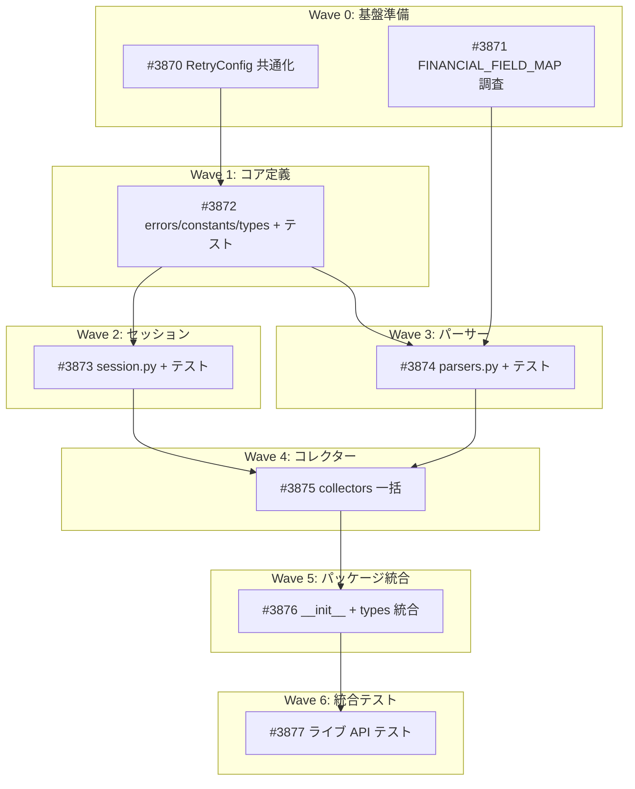

# NSE（国立証券取引所）データ取得モジュール

**作成日**: 2026-04-02
**ステータス**: 計画中
**タイプ**: package
**GitHub Project**: [#106](https://github.com/users/YH-05/projects/106)

## 背景と目的

### 背景

インド株式市場の BSE（Bombay Stock Exchange）API は日本 IP から Akamai WAF にブロックされている。一方、NSE（National Stock Exchange of India）API は日本からアクセス可能であることが検証済み。NSE はインド最大の証券取引所であり、NIFTY 50/500 等の主要インデックスを提供し、企業データ・決算情報も API 経由で取得可能。

### 目的

`src/market/nse/` に BSE モジュール（`src/market/bse/`）と同一パターンの NSE データ取得モジュールを新規作成し、インド市場データへのアクセスを確立する。

### 成功基準

- [ ] NSE の 12 API エンドポイント + 1 CSV ダウンロードを 4 コレクターでカバー
- [ ] Cookie ライフサイクル管理（5分 TTL + 403 自動リフレッシュ）が透過的に動作
- [ ] 全単体テスト・プロパティテスト・統合テストが通過
- [ ] `make check-all` が成功

## リサーチ結果

### 既存パターン

BSE モジュールの 6 層構造（session/types/errors/constants/parsers/collectors）を踏襲。CollectorMixin + DataCollector ABC 多重継承パターン、frozen dataclass + `__post_init__` バリデーション、httpx セッション + bot-blocking countermeasures を全て再利用。

### 参考実装

| ファイル | 参考にすべき点 |
|---------|---------------|
| `src/market/bse/session.py` | NseSession のベースパターン（UA ローテーション、ポライトディレイ、SSRF 防止、リトライ） |
| `src/market/bse/types.py` | Enum/Config/データレコードの定義パターン |
| `src/market/bse/errors.py` | 例外階層パターン |
| `src/market/bse/constants.py` | 定数定義パターン（typing.Final） |
| `src/market/bse/parsers.py` | パーサー関数パターン（clean_price/clean_volume） |
| `src/market/bse/collectors/_base.py` | セッション DI パターン |
| `src/market/base_collector.py` | DataCollector ABC |
| `tests/market/bse/conftest.py` | テストフィクスチャパターン |

### 技術的考慮事項

- **Cookie 管理**: NSE API は全リクエストに有効な Cookie が必要（BSE との最大の差分）
- **403 戦略**: `_handle_response()` で `NseCookieError` raise → `get_with_retry()` でキャッチ → Cookie リフレッシュ → リトライ
- **RetryConfig**: `market/retry.py` に共通化（BSE/NSE 両方から参照）
- **ポライトディレイ**: 0.5 秒（BSE の 0.15 秒の 3 倍以上）
- **リダイレクト**: `follow_redirects=True`

## 実装計画

### アーキテクチャ概要

BSE モジュールの 6 層構造を踏襲し、NSE 固有の Cookie ライフサイクル管理（300秒 TTL + monotonic-clock + 403 自動リフレッシュ）を追加。RetryConfig は `src/market/retry.py` に共通化。4 コレクターが 12 API エンドポイント + 1 CSV ダウンロードをカバー。

### ファイルマップ

| 操作 | ファイルパス | 説明 |
|------|------------|------|
| 新規作成 | `src/market/retry.py` | RetryConfig 共通化 |
| 変更 | `src/market/bse/types.py` | RetryConfig import 変更 |
| 新規作成 | `src/market/nse/errors.py` | 6 例外クラス（NseCookieError 含む） |
| 新規作成 | `src/market/nse/constants.py` | URL, ヘッダー, カラムマップ |
| 新規作成 | `src/market/nse/types.py` | Enum, Config, データレコード |
| 新規作成 | `src/market/nse/session.py` | Cookie 管理付き HTTP セッション |
| 新規作成 | `src/market/nse/parsers.py` | JSON/CSV パーサー群 |
| 新規作成 | `src/market/nse/collectors/_base.py` | NseCollectorMixin |
| 新規作成 | `src/market/nse/collectors/quote.py` | QuoteCollector |
| 新規作成 | `src/market/nse/collectors/indices.py` | IndicesCollector |
| 新規作成 | `src/market/nse/collectors/corporate.py` | CorporateCollector |
| 新規作成 | `src/market/nse/collectors/stock_list.py` | StockListCollector |
| 新規作成 | `src/market/nse/collectors/__init__.py` | コレクター再エクスポート |
| 新規作成 | `src/market/nse/__init__.py` | パブリック API エクスポート |
| 変更 | `src/market/types.py` | DataSource に NSE 追加 |
| 変更 | `src/market/__init__.py` | NSE エクスポート追加 |

### リスク評価

| リスク | 影響度 | 対策 |
|--------|--------|------|
| RetryConfig 移動で BSE import 壊れ | 中 | re-export 維持で後方互換性確保 |
| NSE ジオブロック変更 | 中 | 統合テストで早期検出 |
| FINANCIAL_FIELD_MAP 不完全 | 中 | Wave 0 で事前調査 |
| BSE/NSE 同名クラス衝突 | 低 | エイリアスで回避 |
| Cookie 管理の複雑性 | 低 | 固定値 TTL で単純化 |

## タスク一覧

### Wave 0（並行開発可能）

- [ ] RetryConfig の market/retry.py への共通化移動
  - Issue: [#3870](https://github.com/YH-05/quants/issues/3870)
  - ステータス: todo
  - 見積もり: 1h

- [ ] FINANCIAL_FIELD_MAP 事前調査
  - Issue: [#3871](https://github.com/YH-05/quants/issues/3871)
  - ステータス: todo
  - 見積もり: 1.5h

### Wave 1（Wave 0 完了後）

- [ ] errors.py, constants.py, types.py + テスト + conftest.py
  - Issue: [#3872](https://github.com/YH-05/quants/issues/3872)
  - ステータス: todo
  - 依存: #3870
  - 見積もり: 3h

### Wave 2（Wave 1 完了後、Wave 3 と並行可能）

- [ ] NseSession の実装 + テスト
  - Issue: [#3873](https://github.com/YH-05/quants/issues/3873)
  - ステータス: todo
  - 依存: #3872
  - 見積もり: 3h

### Wave 3（Wave 1 完了後、Wave 2 と並行可能）

- [ ] parsers.py + 単体テスト + プロパティテスト
  - Issue: [#3874](https://github.com/YH-05/quants/issues/3874)
  - ステータス: todo
  - 依存: #3872, #3871
  - 見積もり: 3h

### Wave 4（Wave 2, 3 完了後）

- [ ] collectors 一括実装
  - Issue: [#3875](https://github.com/YH-05/quants/issues/3875)
  - ステータス: todo
  - 依存: #3873, #3874
  - 見積もり: 4h

### Wave 5（Wave 4 完了後）

- [ ] パッケージ統合
  - Issue: [#3876](https://github.com/YH-05/quants/issues/3876)
  - ステータス: todo
  - 依存: #3875
  - 見積もり: 2h

### Wave 6（全 Wave 完了後）

- [ ] NSE ライブ API 統合テスト
  - Issue: [#3877](https://github.com/YH-05/quants/issues/3877)
  - ステータス: todo
  - 依存: #3876
  - 見積もり: 1.5h

## 依存関係図

---

**最終更新**: 2026-04-02
