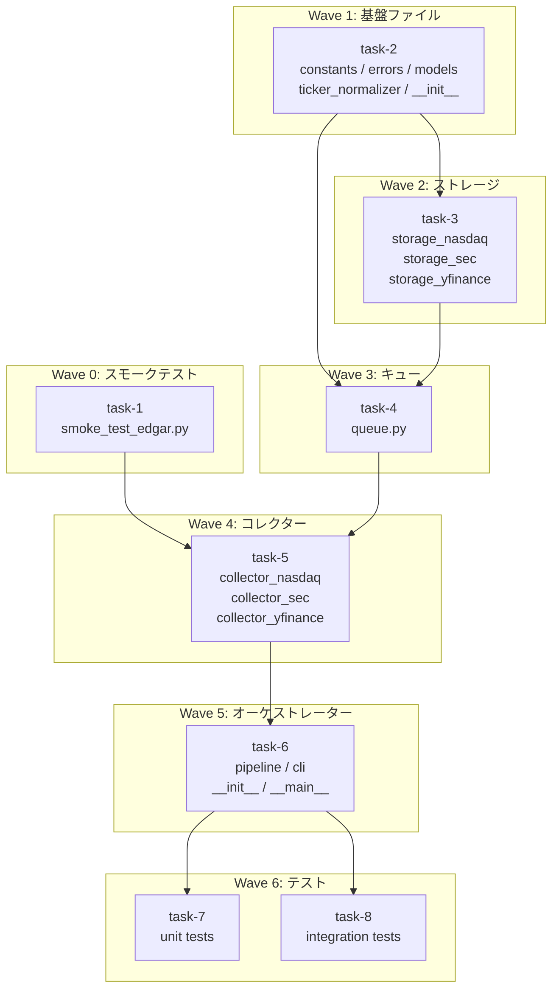

# Earnings Data Pipeline

**作成日**: 2026-04-03
**ステータス**: 計画中
**タイプ**: package
**GitHub Project**: [#108](https://github.com/users/YH-05/projects/108)

## 背景と目的

### 背景

米国株の財務データをヒストリカルで収集・蓄積する仕組みが未整備。NASDAQカレンダーで決算銘柄を特定し、Alpha Vantage・SEC EDGAR・yfinance からデータを自動収集するパイプラインが必要。Alpha Vantage の Free プランは 25 req/日の制限があるため、CollectionQueue でキューイングし翌日以降に繰り越す設計が必要。

### 目的

`src/market/pipeline/` に新規 Python パッケージを作成し、以下を実現する：
- Phase 1: NASDAQ Earnings Calendar で決算銘柄を特定 → `nasdaq_calendar.db`
- Phase 2: Alpha Vantage で EPS/サプライズ・Company Overview を取得（既存 AV Collector 再利用）
- Phase 3: SEC EDGAR (edgartools) で 10-K/10-Q の IS/BS/CF を取得 → `sec_edgar.db`
- Phase 4: yfinance で日次株価 OHLCV を取得 → `yfinance.db`

### 成功基準

- [ ] `python -m market.pipeline --status` が正常終了する
- [ ] `python -m market.pipeline --phase 1 --days-forward 7` で NASDAQ カレンダーが取得できる
- [ ] `make check-all` が成功する
- [ ] ユニットテストが全モック（外部 API 呼び出しなし）で Pass する
- [ ] `sqlite3 data/sqlite/nasdaq_calendar.db` で nc_earnings_calendar / nc_collection_queue が確認できる

## リサーチ結果

### 既存パターン

- **Storage クラス**: `AlphaVantageStorage` の `_TABLE_DDL` dict / `INSERT OR REPLACE` / `_migrate_add_missing_columns` を全 Storage に適用
- **Collector DI**: `__init__(client=None, storage=None)` で DI またはデフォルト生成
- **edgartools import**: `src/edgar/fetcher.py` の `_import_edgartools_company()` (importlib.machinery.PathFinder 経由) を必須踏襲
- **DB パス**: `get_db_path('sqlite', 'nasdaq_calendar')` で `data/sqlite/nasdaq_calendar.db` を解決

### 参考実装

| ファイル | 説明 |
|---------|------|
| `src/market/alphavantage/storage.py` | Storage クラスの参照実装（DDL dict, INSERT OR REPLACE） |
| `src/market/alphavantage/collector.py` | Collector DI パターン、CollectionResult frozen dataclass |
| `src/edgar/fetcher.py` | edgartools importlib 経由インポートパターン（必須） |
| `src/market/nasdaq/client.py` | `get_earnings_calendar(date: str) -> list[EarningsRecord]` |
| `src/market/yfinance/fetcher.py` | `YFinanceFetcher.fetch(options: FetchOptions)` |
| `src/database/db/sqlite_client.py` | `SQLiteClient(db_path)`, `connection()`, `execute()` |
| `tests/market/nasdaq/conftest.py` | MagicMock DI テストパターン |

### 技術的考慮事項

- **edgartools 名前衝突**: `src/edgar` と `site-packages/edgar` が衝突するため `import edgar` 直接は禁止
- **SEC EDGAR Identity**: `SEC_EDGAR_IDENTITY` 環境変数または `set_identity()` が未設定時は警告ログ
- **CF standard_concept 欠落**: `CF_LABEL_FALLBACK` 辞書でカバー（Wave 0 のスモークテストで実データを確認してから定義）
- **AV 25 req/日制限**: `CollectionQueue` で翌日以降に自動繰り越し
- **yfinance インクリメンタル取得**: `YFinanceStorage.get_latest_date(symbol)` で差分取得

## 実装計画

### アーキテクチャ概要

`src/market/pipeline/` に新規パッケージを作成。`nc_collection_queue` テーブルを中央キューとして、Phase 1 → 2 → 3 → 4 を順次実行。AlphaVantage の既存 collector/storage は変更なしで利用。Wave 0 のスモークテストで edgartools の financials API 形状を確認してから Wave 4 を実装。

### ファイルマップ

| 操作 | ファイルパス | Wave |
|------|------------|------|
| 新規作成 | `scripts/smoke_test_edgar.py` | 0 |
| 新規作成 | `src/market/pipeline/__init__.py` | 1 |
| 新規作成 | `src/market/pipeline/constants.py` | 1 |
| 新規作成 | `src/market/pipeline/errors.py` | 1 |
| 新規作成 | `src/market/pipeline/models.py` | 1 |
| 新規作成 | `src/market/pipeline/ticker_normalizer.py` | 1 |
| 新規作成 | `src/market/pipeline/storage_nasdaq.py` | 2 |
| 新規作成 | `src/market/pipeline/storage_sec.py` | 2 |
| 新規作成 | `src/market/pipeline/storage_yfinance.py` | 2 |
| 新規作成 | `src/market/pipeline/queue.py` | 3 |
| 新規作成 | `src/market/pipeline/collector_nasdaq.py` | 4 |
| 新規作成 | `src/market/pipeline/collector_sec.py` | 4 |
| 新規作成 | `src/market/pipeline/collector_yfinance.py` | 4 |
| 新規作成 | `src/market/pipeline/pipeline.py` | 5 |
| 新規作成 | `src/market/pipeline/cli.py` | 5 |
| 変更 | `src/market/pipeline/__init__.py` | 5 |
| 新規作成 | `src/market/pipeline/__main__.py` | 5 |
| 新規作成 | `tests/market/pipeline/` (16ファイル) | 6 |

### リスク評価

| リスク | 影響度 | 対策 |
|--------|--------|------|
| edgartools financials API 形状が未確認 | 高 | Wave 0 スモークテスト必須 |
| src/edgar との名前衝突 | 高 | importlib.machinery.PathFinder 経由のみ |
| AV 25 req/日の予算制限 | 中 | CollectionQueue で翌日繰り越し |
| SEC 10-Q × 400銘柄の初回取得（~48分） | 中 | 差分取得で次回以降を高速化 |

## タスク一覧

### Wave 0（即時実行可能）

- [ ] [Wave0] edgartools スモークテストスクリプトの作成
  - Issue: [#3879](https://github.com/YH-05/quants/issues/3879)
  - ステータス: todo
  - 見積もり: 0.5h

### Wave 1（Wave 0 と並行可能）

- [ ] [Wave1] pipeline パッケージ基盤ファイルの作成（constants / errors / models / ticker_normalizer / __init__）
  - Issue: [#3880](https://github.com/YH-05/quants/issues/3880)
  - ステータス: todo
  - 見積もり: 2h

### Wave 2（Wave 1 完了後）

- [ ] [Wave2] ストレージ 3クラスの実装（storage_nasdaq / storage_sec / storage_yfinance）
  - Issue: [#3881](https://github.com/YH-05/quants/issues/3881)
  - ステータス: todo
  - 依存: Wave 1
  - 見積もり: 2.5h

### Wave 3（Wave 2 完了後）

- [ ] [Wave3] CollectionQueue の実装（queue.py）
  - Issue: [#3882](https://github.com/YH-05/quants/issues/3882)
  - ステータス: todo
  - 依存: Wave 1, 2
  - 見積もり: 1.5h

### Wave 4（Wave 0 + Wave 3 完了後）

- [ ] [Wave4] コレクター 3クラスの実装（collector_nasdaq / collector_sec / collector_yfinance）
  - Issue: [#3883](https://github.com/YH-05/quants/issues/3883)
  - ステータス: todo
  - 依存: Wave 0（スモークテスト）, Wave 3
  - 見積もり: 4h

### Wave 5（Wave 4 完了後）

- [ ] [Wave5] オーケストレーター・CLI・パッケージ完成（pipeline / cli / __init__ / __main__）
  - Issue: [#3884](https://github.com/YH-05/quants/issues/3884)
  - ステータス: todo
  - 依存: Wave 4
  - 見積もり: 2.5h

### Wave 6（Wave 5 完了後 · 並行可）

- [ ] [Wave6] ユニットテスト一式（conftest + 全 unit テスト）
  - Issue: [#3885](https://github.com/YH-05/quants/issues/3885)
  - ステータス: todo
  - 依存: Wave 5
  - 見積もり: 3h

- [ ] [Wave6] 統合テスト（全Phase, `@pytest.mark.integration`）
  - Issue: [#3886](https://github.com/YH-05/quants/issues/3886)
  - ステータス: todo
  - 依存: Wave 5
  - 見積もり: 1h

## 依存関係図

---

**元プラン**: [original-plan.md](./original-plan.md)
**最終更新**: 2026-04-03
