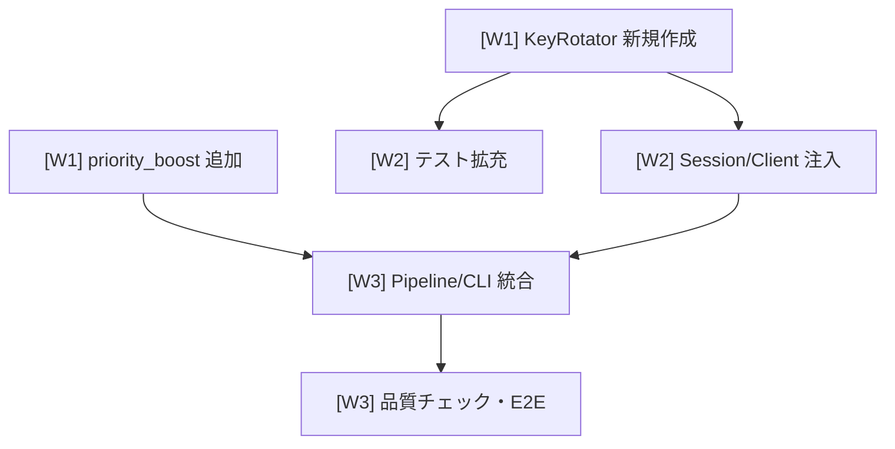

# AV APIキーローテーション + 優先キュー

## 概要

EarningsPipeline Phase 2 の Alpha Vantage API に複数キーローテーション（使い切り方式、4キー×25=100リクエスト/日）と失敗銘柄の優先度ブーストを追加する。

## GitHub Project

- **Project**: [#110](https://github.com/users/YH-05/projects/110)
- **元プラン**: [original-plan.md](./original-plan.md)

## タスク一覧

### Wave 1（並行開発可能）

| # | タイトル | Issue |
|---|---------|-------|
| task-1 | KeyRotator クラスの新規作成 | [#3888](https://github.com/YH-05/quants/issues/3888) |
| task-2 | CollectionQueue に priority_boost 追加 | [#3889](https://github.com/YH-05/quants/issues/3889) |

### Wave 2（Wave 1 完了後）

| # | タイトル | Issue | 依存 |
|---|---------|-------|------|
| task-3 | Session/Client に KeyRotator 注入 | [#3890](https://github.com/YH-05/quants/issues/3890) | task-1 |
| task-4 | KeyRotator テスト拡充 | [#3891](https://github.com/YH-05/quants/issues/3891) | task-1 |

### Wave 3（Wave 2 完了後）

| # | タイトル | Issue | 依存 |
|---|---------|-------|------|
| task-5 | EarningsPipeline と CLI の統合 | [#3892](https://github.com/YH-05/quants/issues/3892) | task-2, task-3 |
| task-6 | 品質チェックと E2E 検証 | [#3893](https://github.com/YH-05/quants/issues/3893) | task-5 |

## 依存関係図

## 対象パッケージ

- `src/market/alphavantage/` — KeyRotator 新規、Session/Client/constants 修正
- `src/market/pipeline/` — queue/pipeline/cli 修正
