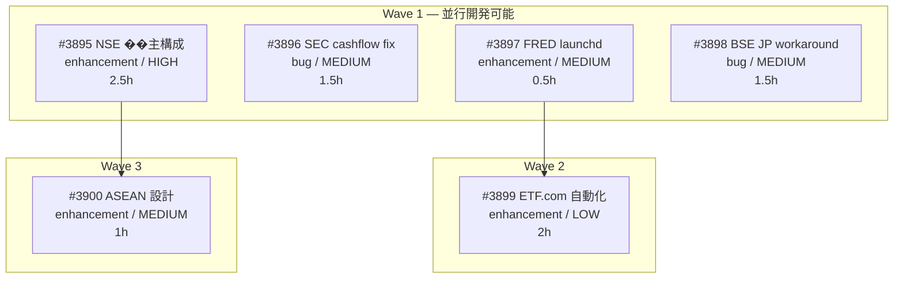

# Project-105: NSE/Pipeline 改善タスク統合

**Created**: 2026-04-08
**Status**: 計画中
**Type**: general
**GitHub Project**: [#111](https://github.com/users/YH-05/projects/111)

## Background and Purpose

### Background

PR #3878（NSE実装）以降、5件のコミットがPRなしでmainに直接プッシュされた。
今後は適切なPRワークフローで進めるため、未完了の改善タスク6件を1つのProjectに統合し、worktreeで開発する。

### Purpose

NSE/BSE/Pipeline/FRED/ETF.com の未完了改善タスクを統合管理し、worktree + PRワークフローで品質を担保しながら実装する。

### Success Criteria

- [ ] 全6 Issue が Done になっている
- [ ] PR経由でmainにマージされている
- [ ] `make check-all` が成功している

## Task List

### Wave 1（並行開発可能）

- [ ] NSE 株主構成エンドポイント追加
  - Issue: [#3895](https://github.com/YH-05/quants/issues/3895)
  - Status: todo
  - Estimate: 2.5h
  - Label: enhancement / HIGH

- [ ] SEC operating_cashflow None フォールバック
  - Issue: [#3896](https://github.com/YH-05/quants/issues/3896)
  - Status: todo
  - Estimate: 1.5h
  - Label: bug / MEDIUM

- [ ] FRED launchd 定期同期 plist
  - Issue: [#3897](https://github.com/YH-05/quants/issues/3897)
  - Status: todo
  - Estimate: 0.5h
  - Label: enhancement / MEDIUM

- [ ] BSE 日本IP ワークアラウンド
  - Issue: [#3898](https://github.com/YH-05/quants/issues/3898)
  - Status: todo
  - Estimate: 1.5h
  - Label: bug / MEDIUM

### Wave 2（Wave 1 完了後）

- [ ] ETF.com 自動化 launchd 統合
  - Issue: [#3899](https://github.com/YH-05/quants/issues/3899)
  - Status: todo
  - Estimate: 2h
  - Depends: #3897
  - Label: enhancement / LOW

### Wave 3（Wave 1 完了後）

- [ ] ASEAN カバレッジ統合設計
  - Issue: [#3900](https://github.com/YH-05/quants/issues/3900)
  - Status: todo
  - Estimate: 1h
  - Depends: #3895
  - Label: enhancement / MEDIUM

## Dependency Graph

## Risk Assessment

| Risk | Impact | Mitigation |
|------|--------|------------|
| NSE shareholding API エンドポイント未確定 | 高 | `/site-investigator` で事前調査 |
| BSE geo-block が CSV にも影響 | 高 | 日本IPから早期テスト |
| edgartools cash_flow_statement 型未確認 | 中 | edgartools ソースコードで確認 |
| ETF.com レートリミット | 中 | polite delay + jitter |

## Estimates

- 逐次実行: 9h
- 並行実行: 5.5h (Wave1 2.5h + Wave2 2h + Wave3 1h)

## Development

- **Branch**: `feature/prj105`
- **Worktree**: `../.worktrees/quants/feature-prj105`
