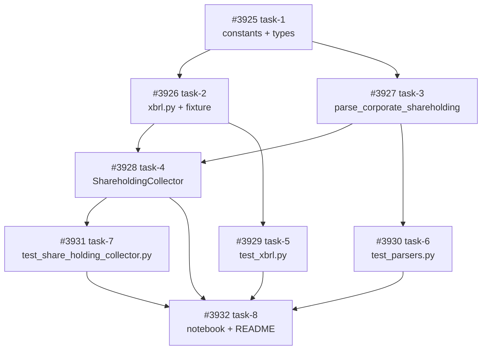

# NSE 全銘柄データ取得ノートブック & market.nse パッケージ拡張

**作成日**: 2026-04-13
**ステータス**: 計画中
**タイプ**: package 拡張 + notebook 作成
**GitHub Project**: [#113](https://github.com/users/YH-05/projects/113)

## 背景と目的

### 背景

NSE（National Stock Exchange of India）の全上場株（~2,263 銘柄）の基本情報と詳細な株主構成データを取得するワークフローは、現状 2 つのスタンドアロンスクリプト（`scripts/nse_index_shareholding.py`, `scripts/nse_parse_xbrl.py`）としてのみ存在する。

`src/market/nse/` パッケージは基本 API（`quote-equity`, `equity-stockIndices`, `EQUITY_L.csv`, `getShareholdingPattern` (NextApi) 等）のみ実装済みで、詳細株主データ取得に必要な以下 2 機能は未統合:

- `/api/corporate-share-holdings-master`（XBRL URL 取得に必須）
- XBRL ファイルのパース（40+ カテゴリ別の詳細株主内訳）

### 目的

1. `market.nse` パッケージに上記 2 機能を統合し、テスト可能・再利用可能に
2. パッケージを使った対話的ノートブックを作成し、全 2,263 銘柄のデータ取得パイプラインを実行できるようにする
3. デフォルトで全銘柄を対象とし、既存 SQLite DB (`data/cache/nse/nse_index.db`) と完全互換を維持

### 成功基準

- [ ] `ShareholdingCollector.fetch_shareholding()` + `fetch_xbrl_detail()` が `market.nse` から import 可能
- [ ] ノートブックが `LIMIT_SYMBOLS=10` で Phase 1-4 全通し実行に成功
- [ ] ユニットテスト 25-30 件が追加され、`make check-all` がパス
- [ ] 既存 SQLite DB スキーマ（`promoter_pct REAL` 等）と互換

## リサーチ結果

### 既存パターン

- **NseCollectorMixin**: 全 Collector 共通 session DI + `_get_session()` try/finally
- **frozen dataclass + str 型**: NSE API 値は str で保持、変換は `clean_*` ヘルパ
- **parse_* キーワード専用引数**: `def parse_X(data, *, symbol: str = "") -> list[T]`
- **input validation 3 段階**: empty → length(20) → regex `^[A-Z0-9\-&]+$`
- **日本語テスト命名**: `test_正常系_XX` / `test_異常系_XX`

### 参考実装

| ファイル | 説明 |
|---------|------|
| `src/market/nse/collectors/corporate.py` | `ShareholdingCollector` の雛形（validation + session lifecycle） |
| `src/market/nse/parsers.py:1186` | `parse_corporate_shareholding` の 95% テンプレート |
| `scripts/nse_parse_xbrl.py` | `xbrl.py` への移植元（`_MEMBER_CATEGORY` 88件, `_AXIS_TO_SUBCATEGORY` 47件） |
| `scripts/nse_index_shareholding.py` | ノートブック SQLite DDL の参照元 |
| `tests/market/nse/unit/test_corporate_collector.py` | テストテンプレート |

### 技術的考慮事項

- **float/str 両対応**: `CorporateShareHolding` は str 保持、`to_float_*()` アクセサで変換（HF1）
- **XBRL マッピング定数**: `xbrl.py` 内 module-private（`_MEMBER_CATEGORY`, `_AXIS_TO_SUBCATEGORY`）
- **SQLite DB**: 既存 `data/cache/nse/nse_index.db` と互換（promoter_pct REAL 型に float 変換して INSERT）
- **SSRF**: 既存 `ALLOWED_HOSTS` (nsearchives.nseindia.com) のまま。拡張不要

## 実装計画

### アーキテクチャ概要

```
NSE API (corporate-share-holdings-master)
  → NseSession.get_with_retry (既存 SSRF/リトライ/ポライト遅延)
  → parse_corporate_shareholding
  → list[CorporateShareHolding]
  → (xbrl_url 抽出)
  → NseSession.get_with_retry (nsearchives.nseindia.com)
  → xml bytes
  → xbrl.parse_xbrl
  → ParseResult(rows: list[ShareholderRow])
  → notebook
  → SQLite (4 テーブル: stocks / index_members / shareholdings / shareholding_detail)
```

### ファイルマップ

| 操作 | ファイルパス | 説明 |
|------|------------|------|
| 修正 | `src/market/nse/constants.py` | エンドポイント URL + XBRL 名前空間定数 |
| 修正 | `src/market/nse/types.py` | `CorporateShareHolding` dataclass + `to_float_*()` アクセサ |
| 修正 | `src/market/nse/parsers.py` | `parse_corporate_shareholding` 関数 |
| 新規 | `src/market/nse/xbrl.py` | XBRL パーサ（~550 LOC） |
| 新規 | `src/market/nse/collectors/share_holding.py` | `ShareholdingCollector` クラス |
| 修正 | `src/market/nse/collectors/__init__.py` | エクスポート |
| 修正 | `src/market/nse/__init__.py` | エクスポート |
| 新規 | `tests/market/nse/fixtures/xbrl_sample.xml` | テスト用 XBRL サンプル |
| 新規 | `tests/market/nse/unit/test_xbrl.py` | XBRL パーサテスト (13-15 tests) |
| 修正 | `tests/market/nse/unit/test_parsers.py` | `TestParseCorporateShareholding` (6-8 tests) |
| 新規 | `tests/market/nse/unit/test_share_holding_collector.py` | Collector テスト (12-14 tests) |
| 新規 | `notebook/NSE/nse_full_download.ipynb` | 15 セルの取得パイプライン |
| 新規 | `notebook/NSE/README.md` | 使い方・出力テーブル定義 |

### リスク評価

| リスク | 影響度 | 対策 |
|--------|--------|------|
| DB スキーマ (REAL) と str 保持の境界 | 中 | `to_float_*()` アクセサ + None フォールバック |
| XBRL スキーマ変動 | 中 | 未マップ時 `("Unknown", key)` フォールバック |
| fixture リアリティ | 中 | 実 XBRL を匿名化縮小（3カテゴリ+複数 context） |
| scripts 二重保守 | 低 | `DEPRECATED` アンカーコメント追加 |
| 30-40 分実行の中断 | 低 | SKIP_PHASE_N フラグ + 冪等 INSERT |

## タスク一覧

### Wave 1（基盤型定義・定数）

- [ ] constants.py / types.py に corporate-share-holdings 基盤を追加
  - Issue: [#3925](https://github.com/YH-05/quants/issues/3925)
  - ステータス: todo
  - 見積もり: 1h

### Wave 2（パーサ + XBRL、並行開発可能）

- [ ] xbrl.py モジュールと XBRL サンプル fixture を新設
  - Issue: [#3926](https://github.com/YH-05/quants/issues/3926)
  - ステータス: todo
  - 依存: #3925
  - 見積もり: 2.5h

- [ ] parsers.py に parse_corporate_shareholding を追加
  - Issue: [#3927](https://github.com/YH-05/quants/issues/3927)
  - ステータス: todo
  - 依存: #3925
  - 見積もり: 1h

### Wave 3（Collector + テスト、部分並行可能）

- [ ] ShareholdingCollector 実装とパッケージエクスポート
  - Issue: [#3928](https://github.com/YH-05/quants/issues/3928)
  - ステータス: todo
  - 依存: #3926, #3927
  - 見積もり: 2h

- [ ] test_xbrl.py ユニットテスト追加
  - Issue: [#3929](https://github.com/YH-05/quants/issues/3929)
  - ステータス: todo
  - 依存: #3926
  - 見積もり: 1.5h

- [ ] test_parsers.py に TestParseCorporateShareholding 追加
  - Issue: [#3930](https://github.com/YH-05/quants/issues/3930)
  - ステータス: todo
  - 依存: #3927
  - 見積もり: 1h

- [ ] test_share_holding_collector.py ユニットテスト追加
  - Issue: [#3931](https://github.com/YH-05/quants/issues/3931)
  - ステータス: todo
  - 依存: #3928
  - 見積もり: 2h

### Wave 4（ノートブック + 実機検証）

- [ ] nse_full_download.ipynb + README + 実機検証
  - Issue: [#3932](https://github.com/YH-05/quants/issues/3932)
  - ステータス: todo
  - 依存: #3928, #3929, #3930, #3931
  - 見積もり: 2.5h

## 依存関係図



**クリティカルパス**: #3925 → #3926 → #3928 → #3931 → #3932

## 見積もり

- **合計**: 10-14 時間
- **Wave 数**: 4
- **タスク数**: 8

---

**最終更新**: 2026-04-13
