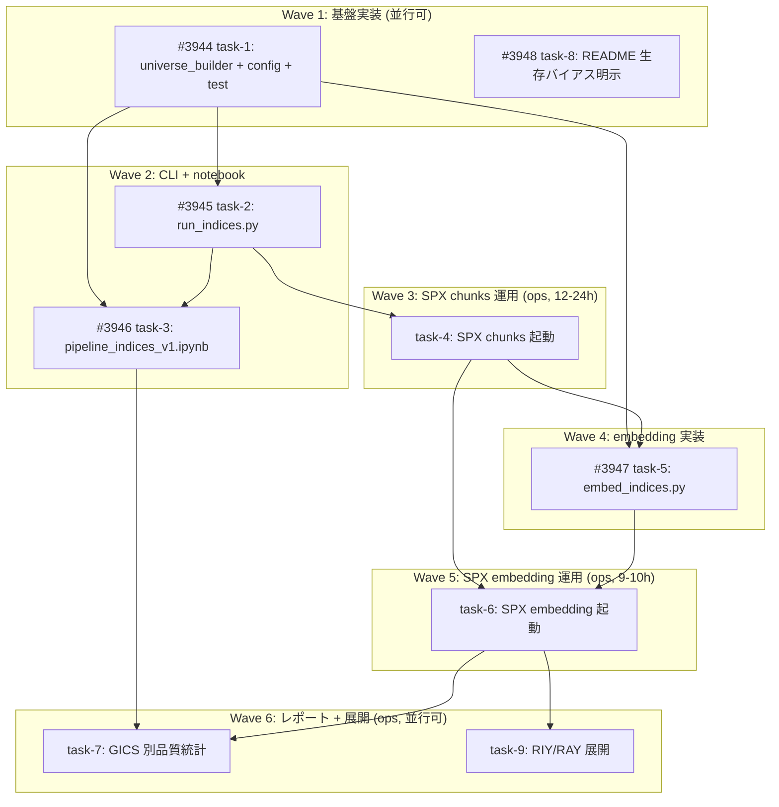

# FILING_NLP indices_v1 パイプライン構築

**作成日**: 2026-05-25
**ステータス**: 計画中
**タイプ**: 軽量プロジェクト（既存パッケージ拡張）
**GitHub Project**: [#114](https://github.com/users/YH-05/projects/114)
**元議論**: [original-plan.md](./original-plan.md) (`disc-2026-05-25-indices-v1-pipeline`)

## 背景と目的

### 背景

2026/5/25 の議論 (`disc-2026-05-25-filing-nlp-v2-strategy-c`) で構築した FILING_NLP v2 パイプライン（NYSE+Nasdaq 6,000 CIK の universe_v2）で pilot100（ランダム 100 銘柄）を実行したところ、44 銘柄が chunks ゼロになるなどランダムサンプリング由来の品質バラツキが大きく、分析対象として扱いにくいことが判明した。

そこで universe 戦略を「事前定義された米国インデックス構成銘柄」ベース（SPX/SOX/RIY/RAY 4 米国インデックス）に転換し、まず **SPX 503 銘柄** から chunks + embedding を完走させて品質を実証する。

### 目的

2026/5/22 時点の 4 米国インデックス（SPX 503 / SOX 30 / RIY 1001 / RAY 2906）の union universe を構築し、SPX 先行で 10-K/10-Q の chunks 生成 + gte-Qwen2-1.5B embedding 生成までを CLI 中心で実装する。`pilot100` は NAS に残置し、`run_id=indices_v1` として並列設置。

### 成功基準

- [ ] universe_builder.py で SPX 503 銘柄全件の CIK 解決を達成（3 段フォールバック）
- [ ] SPX 503 銘柄の chunks 生成完走（DOM 取得率が pilot100 比で改善）
- [ ] SPX 503 銘柄の gte-Qwen2 embedding 生成完走（.npy + meta parquet）
- [ ] GICS セクター別 chunks/embedding 分布の品質統計レポート完成
- [ ] 生存バイアスが README/notebook に明示されている

## リサーチ結果

### 既存パターン

- **CLI スクリプト構造**: `notebook/FILING_NLP/pipeline/run_pilot.py` の `.env` 手動パース + `edgar.set_identity` + `_setup_logging` + `argparse` + `summary.json` 保存パターンを `run_indices.py` でほぼそのまま流用可能
- **per-CIK parquet**: 既存 `ShardWriter`（runner.py）が thread-safe + kill 耐性を実現
- **Checkpoint atomic write**: `Checkpoint` クラス（threading.Lock + `.tmp.json` → rename）で CIK 単位 resume
- **TokenBucket rate limiter**: SEC EDGAR ~10 req/sec 上限に対し 5 req/sec で安全運用
- **gte-Qwen2-1.5B MPS embedding**: `05_embedding.ipynb` に `last_token_pool` + `encode_texts` + NaN マーカー resume が完成形で存在
- **CLI ラッパー型 notebook**: `pipeline_pilot.ipynb` の 9 セル構成（imports → universe ロード → tokenizer → パラメータ → RESET → run_pipeline → per-CIK 集約 → DOM 成功率 → ticker × year pivot）

### 参考実装

| ファイル | 説明 |
|---------|------|
| `notebook/FILING_NLP/pipeline/run_pilot.py` | CLI スクリプトの参照実装 (`run_indices.py` のベース) |
| `notebook/FILING_NLP/pipeline/runner.py` | `run_pipeline` / `Checkpoint` / `ShardWriter` 本体 (再利用) |
| `notebook/FILING_NLP/pipeline/config.py` | 定数・パス（`indices_v1` 定数を追記） |
| `notebook/FILING_NLP/05_embedding.ipynb` | gte-Qwen2 MPS bfloat16 + NaN マーカー resume |
| `notebook/FILING_NLP/pipeline_pilot.ipynb` | notebook ラッパー 9 セル構成 |
| `src/edgar/fetcher.py:42-76` | edgartools 遅延 import パターン |
| `tests/notebook/regime_switching/test_helpers.py` | notebook 配下テスト前例 |

### 技術的考慮事項

- `universe_v2.parquet` の `all_tickers` 列の dtype（list / string / NaN）が未確定 → 両対応する
- SPX 実測値: Step 1 ticker 完全一致 493 / Step 2 `'/' → '-'` 正規化 + all_tickers 501 / Step 3 SEC EDGAR lookup 503
- pilot100 と並列保持で NAS 容量 ~18GB 増分（SPX 単独）、RIY/RAY 含め ~50GB 級
- M3 16GB MPS bfloat16 で長時間（~10h）embedding の安定性は未検証

## 実装計画

### アーキテクチャ概要

既存パッケージ `notebook/FILING_NLP/pipeline/` を拡張。Strategy C 抽出ロジック（`extractor.py`）、並列実行 + checkpoint（`runner.py`）、TokenBucket（`rate_limiter.py`）はそのまま再利用。新規 CLI 3 本（`universe_builder.py` / `run_indices.py` / `embed_indices.py`）と notebook ラッパー（`pipeline_indices_v1.ipynb`）、単体テスト 1 本（`test_universe_builder.py`）、`config.py` の定数追記、パッケージ README を追加する。

### データフロー

```
Bloomberg JSON (notebook/US Index/2026-05-22_*.json)
    ↓ universe_builder.py (3 段フォールバック CIK 解決)
universe_indices_v1.parquet + membership_indices_v1.parquet + unresolved_tickers.json
    ↓ run_indices.py (--index-filter in_spx 等)
sections/indices_v1/sections_cik*.parquet + chunks/indices_v1/chunks_cik*.parquet
    ↓ embed_indices.py (gte-Qwen2-1.5B MPS bfloat16, per-CIK shard)
embeddings/indices_v1/embeddings_cik*.npy + chunks_meta_cik*.parquet
    ↓ pipeline_indices_v1.ipynb (Cell 7-9)
GICS セクター別品質統計レポート
```

### ファイルマップ

| 操作 | ファイルパス | 説明 |
|------|------------|------|
| modify | `notebook/FILING_NLP/pipeline/config.py` | indices_v1 用定数 11 個追記 (UNIVERSE_INDICES_V1_PARQUET 等) |
| create | `notebook/FILING_NLP/pipeline/universe_builder.py` | 3 段フォールバック CIK 解決 CLI |
| create | `notebook/FILING_NLP/pipeline/run_indices.py` | run_pilot.py 汎用化 CLI |
| create | `notebook/FILING_NLP/pipeline/embed_indices.py` | gte-Qwen2 per-CIK shard embedding CLI |
| create | `notebook/FILING_NLP/pipeline_indices_v1.ipynb` | CLI ラッパー + 進捗 poll + 品質統計 (9 セル) |
| create | `notebook/FILING_NLP/README.md` | 生存バイアス + NAS 構成 + CLI テンプレート |
| create | `tests/notebook/FILING_NLP/__init__.py` | pytest discovery |
| create | `tests/notebook/FILING_NLP/test_universe_builder.py` | 3 段フォールバック + ticker 正規化 + membership 単体テスト |

### リスク評価

| リスク | 影響度 | 対策 |
|--------|--------|------|
| gte-Qwen2-1.5B の MPS bfloat16 ~10h 連続動作の安定性未検証 | 中 | CIK 単位 Checkpoint + `--checkpoint-every-n-batches 10` で部分結果永続化、`--batch-size 8` への引き下げで対応 |
| `all_tickers` 列の dtype 不確定 (list / string / NaN) | 中 | test fixture で両ケース、`isinstance(x, list)` 分岐 |
| NAS マウント (/Volumes/personal_folder) 断 | 中 | `caffeinate -i` でスリープ抑止、Checkpoint で resume、起動時 `Path.exists()` で fail-fast |
| 直列クリティカルパス (task-1→2→4→5→6→7) で運用待ち時間長い | 中 | embed_indices を pilot100 chunks で先行検証する Wave 4 並行化オプション |
| edgar.find_company_by_ticker の Network/Not Found | 低 | tenacity 3 回 retry + Not Found は unresolved_tickers.json |
| pilot100 並列保持で NAS 容量圧迫 (~18GB 増分) | 低 | 起動前 `df -h` チェック、RIY/RAY 含め ~50GB 級まで |
| ticker rename / merger / spinoff | 低 | Stage 2 の all_tickers 列で過去履歴カバー、残りは Stage 3 |
| SEC EDGAR への e2e 統合テスト困難 | 低 | universe_builder 純粋ロジックのみ unit、e2e は notebook 品質統計セルで担保 |

## タスク一覧

### Wave 1（並行開発可、合計 5-6h）

- [ ] **[task-1] universe_builder.py 実装 + config.py 定数追記 + 単体テスト** (act-101)
  - Issue: [#3944](https://github.com/YH-05/quants/issues/3944)
  - ステータス: todo
  - 見積もり: 5-6h
  - ファイル: `notebook/FILING_NLP/pipeline/{config.py(M), universe_builder.py(C)}`, `tests/notebook/FILING_NLP/{__init__.py(C), test_universe_builder.py(C)}`

- [ ] **[task-8] notebook/FILING_NLP/README.md 作成（生存バイアス明示）** (act-108)
  - Issue: [#3948](https://github.com/YH-05/quants/issues/3948)
  - ステータス: todo
  - 見積もり: 1h
  - ファイル: `notebook/FILING_NLP/README.md(C)`

### Wave 2（task-1 依存、合計 4-5h）

- [ ] **[task-2] run_indices.py 実装（run_pilot.py 汎用化）** (act-102)
  - Issue: [#3945](https://github.com/YH-05/quants/issues/3945)
  - ステータス: todo
  - 依存: #3944
  - 見積もり: 1.5-2h
  - ファイル: `notebook/FILING_NLP/pipeline/run_indices.py(C)`

- [ ] **[task-3] pipeline_indices_v1.ipynb 作成（CLI ラッパー + 進捗 poll + 品質統計）** (act-103)
  - Issue: [#3946](https://github.com/YH-05/quants/issues/3946)
  - ステータス: todo
  - 依存: #3944, #3945
  - 見積もり: 2.5-3h
  - ファイル: `notebook/FILING_NLP/pipeline_indices_v1.ipynb(C)`

### Wave 3（task-2 依存、運用 12-24h 経過）

- [ ] **[task-4] SPX フィルタで run_indices nohup 起動 + 完走確認** (act-104) — *Issue 化対象外、運用タスク*
  - 依存: #3945（task-2）
  - 経過時間: 12-24h + 確認 0.5h
  - 起動コマンド: `caffeinate -i nohup python -m notebook.FILING_NLP.pipeline.run_indices --run-id indices_v1 --index-filter in_spx --workers 8 --rate-rps 5 ...`
  - 完走確認: `indices_v1_progress.json` で 503 CIK のうち >= 95% completed

### Wave 4（task-4 完了後、もしくは pilot100 で先行検証, 3-4h）

- [ ] **[task-5] embed_indices.py 実装（gte-Qwen2 per-CIK shard）** (act-105)
  - Issue: [#3947](https://github.com/YH-05/quants/issues/3947)
  - ステータス: todo
  - 依存: #3944, [task-4 完了後]
  - 見積もり: 3-4h
  - ファイル: `notebook/FILING_NLP/pipeline/embed_indices.py(C)`
  - 補足: pilot100 chunks で先行検証する場合は Wave 2 と並行化可能

### Wave 5（task-5 依存、運用 9-10h 経過）

- [ ] **[task-6] SPX フィルタで embed_indices nohup 起動 + 完走確認** (act-106) — *Issue 化対象外、運用タスク*
  - 依存: #3947（task-5）, [task-4 完了]
  - 経過時間: 9-10h + 確認 0.5h
  - 起動コマンド: `caffeinate -i nohup python -m notebook.FILING_NLP.pipeline.embed_indices --run-id indices_v1 --index-filter in_spx --batch-size 16 --device mps --dtype bfloat16 ...`

### Wave 6（並行可、運用タスク）

- [ ] **[task-7] 品質統計レポート: notebook Cell 7-9 実行** (act-107) — *Issue 化対象外、運用タスク*
  - 依存: #3946（task-3）, [task-6 完了]
  - 見積もり: 1h
  - `pipeline_indices_v1.ipynb` Cell 7-9 を実行し GICS セクター別 chunks/embedding 分布、ゼロ CIK 分析、pilot100 比較を notebook 内に集約

- [ ] **[task-9] RIY/RAY 展開: --index-filter 切替で再実行** (act-109) — *Issue 化対象外、運用タスク*
  - 依存: [task-6 完了 + task-7 判断]
  - 経過時間: RIY ~24h + RAY ~48h + 確認 0.5h
  - 同 universe + membership、`--index-filter in_riy` / `in_ray` 切替のみ。Checkpoint で SPX 重複 fetch なし

## 依存関係図



## クリティカルパス

`task-1 → task-2 → task-4 (ops) → task-5 → task-6 (ops) → task-7`

## 見積もり

| 区分 | 工数 |
|------|------|
| 実装 (task-1, 2, 3, 5, 8) | 11-15h |
| 確認・レビュー | 1.5h |
| SPX 運用経過 (chunks + embedding) | 21-34h |
| **SPX 完走まで合計** | **約 32-49h** |
| RIY 展開 (任意, ops) | 約 48h |
| RAY 展開 (任意, ops) | 約 96h |
| **全展開合計** | **約 4-7 日** |

## Issue 化方針

| Wave | Issue 化 | 理由 |
|------|---------|------|
| Wave 1 (task-1, 8) | ✅ | 実装作業 |
| Wave 2 (task-2, 3) | ✅ | 実装作業 |
| Wave 3 (task-4) | ❌ | 運用タスク（コード変更なし、CLI 起動 + 待機 12-24h） |
| Wave 4 (task-5) | ✅ | 実装作業 |
| Wave 5 (task-6) | ❌ | 運用タスク（コード変更なし、CLI 起動 + 待機 9-10h） |
| Wave 6 (task-7, 9) | ❌ | 運用タスク（notebook 実行 + 判断） |

実装系 5 タスク（task-1, 2, 3, 5, 8）のみ GitHub Issue 化。運用系 4 タスク（task-4, 6, 7, 9）は本 project.md のチェックリストで管理。

## 関連リソース

- **Neo4j Discussion**: `disc-2026-05-25-indices-v1-pipeline`
- **元議論メモ**: [original-plan.md](./original-plan.md) (旧 `docs/plan/2026-05-25_discussion-indices-v1-pipeline.md`)
- **前回議論**: `docs/plan/2026-05-25_discussion-filing-nlp-v2-strategy-c.md`
- **既存パッケージ**: `notebook/FILING_NLP/pipeline/`
- **NAS ベース**: `/Volumes/personal_folder/Quants/FILING_NLP_v2/`
- **インデックスソース**: `notebook/US Index/2026-05-22_{SPX|SOX|RIY|RAY} Index.json`

---

**最終更新**: 2026-05-25
