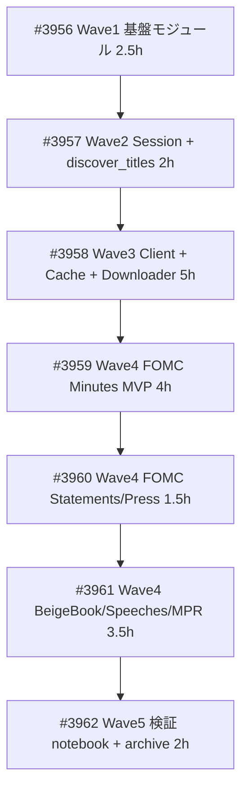

# market.fraser - FRASER REST API サブパッケージ

**作成日**: 2026-05-25
**ステータス**: 計画中
**タイプ**: package（src/market/fraser/）
**GitHub Project**: [#115](https://github.com/users/YH-05/projects/115)
**元プラン**: [original-plan.md](./original-plan.md)

## 背景と目的

### 背景

FRB/FOMC 関連の一次テキスト資料（FOMC 議事録・声明文・記者会見、Beige Book、各種金融政策報告、Powell/Volcker 等の歴史的スピーチ）をマクロクオンツ分析・レジーム判定 (`notebook/REGIME_SWITCHING/`) や NLP パイプライン (`notebook/FILING_NLP/`) に応用したい。これらの一次資料は St. Louis Fed の FRASER API から構造化メタデータ + フルテキスト(TXT) + PDF として取得可能。

現状、`notebook/FRASER/fraser_test.ipynb` でユーザーが API key 取得・`title_id=677`（FOMC Minutes）の `/items` 動作確認まで完了済みだが、`requests` 直叩きで再利用性なし。一方 `src/market/` 配下には `fred/`・`alphavantage/` 等の成熟した API クライアント実装パターンが既にある。

### 目的

`src/market/fraser/` として FRASER API クライアントを実装し、テキスト取得 + 構造化メタデータまでをライブラリ責務とする（NLP は notebook 側で `src/embedding/` や FinBERT パイプラインに委譲）。これにより SEC Filings (`src/edgar/`) と並ぶ「政策テキスト」一次データ層が確立する。

### 成功基準

- [ ] `from market.fraser import FOMCMinutesFetcher` で動作（PR3 MVP）
- [ ] `FOMCMinutesFetcher.list_minutes((2024,2024))` で 6 件以上の FOMCMeeting を取得（実 API E2E）
- [ ] `fetcher.fetch_text(item_id, prefer='txt')` で `data/raw/fraser/fomc/minutes/<date>_<id>.txt` を atomic 保存（>1KB）+ meta.json 併存
- [ ] 4 種カテゴリ（FOMC/Beige Book/Speeches/MPR）の全 6 fetcher 実装（PR4）
- [ ] unit テストカバレッジ 85% 以上、`make check-all` 通過
- [ ] `notebook/FRASER/fraser_demo.ipynb` で thin demo + FILING_NLP/research idea.md への接続点提示（PR5）

## リサーチ結果

### 既存パターン

- **httpx Session wrapper**（SSRF guard + RateLimiter + Retry + Auth injection）: `src/market/alphavantage/session.py` を 1:1 複製（auth → X-API-Key ヘッダ、200 body エラー検知削除、429 Retry-After 尊重の 3 点修正）
- **DualWindowRateLimiter**: `src/market/alphavantage/rate_limiter.py` を `requests_per_minute=30` で直接再エクスポート
- **共有 SQLite キャッシュ**: `src/market/cache/cache.py:SQLiteCache` を `prefix=fraser:` で `market_data.db` に同居（`fred/cache.py` の独自実装の轍を踏まない）
- **Pydantic V2 + ConfigDict(extra='ignore')**: `src/market/polymarket/models.py` パターンで MODS XML 由来 JSON を構造化
- **scripts/ サブディレクトリ CLI**: `src/market/fred/scripts/sync_historical.py` パターンで `discover_titles.py` を実装
- **data/config/<pkg>_titles.json**: `fred_series.json` パターンで `fraser_titles.json` を配置

### 参考実装

| ファイル | 説明 |
|---------|------|
| `src/market/alphavantage/session.py` | 1:1 複製元（httpx Session + SSRF + RateLimiter + Retry） |
| `src/market/alphavantage/rate_limiter.py` | DualWindowRateLimiter 本体（直接再利用） |
| `src/market/cache/cache.py` | SQLiteCache + create_persistent_cache（再利用先） |
| `src/market/polymarket/models.py` | Pydantic V2 + ConfigDict(extra='ignore') パターン |
| `src/market/fred/scripts/sync_historical.py` | scripts/ サブディレクトリ CLI のテンプレ |
| `src/market/fred/README.md` | README 18KB 構造（Features / Quick Start / API Reference / Troubleshooting）|
| `src/edgar/batch.py` | ThreadPoolExecutor + 部分障害許容（Beige Book 並列 DL に流用） |
| `src/news_scraper/retry.py` | tenacity ベース指数バックオフ（session 内で統合） |
| `tests/market/alphavantage/conftest.py` | MagicMock(spec=httpx.Response) + フィクスチャ群（テストテンプレ） |

### 技術的考慮事項

- **30 req/min レート制約**: FRASER API key 単位の厳しい制約。integration テスト・並列 DL 全体に影響、`scope='module'` fixture で rate limiter 状態共有が必須
- **データモデル**: MODS XML 由来 JSON で深くネスト、optional 多発。Pydantic V2 + `ConfigDict(extra='ignore')` + `Field(default=None)` で寛容化、必須フィールドは `item_id`/`title`/`date` の 3 個に絞り将来仕様変更耐性を確保
- **title_id discover の不確実性**: `/api/subjects` はフルリスト返却型で、5 ドキュメント種別の subject 命名が想定通りでない可能性。`discover_titles.py --interactive` で人手確認しつつ確定、未確定値は `dict[str, int | None]` で表現
- **API key ハードコード**: `notebook/FRASER/fraser_test.ipynb` Cell 2 に `6da0308c620b2308091cb2c902a0f5db` が露出。PR5 で revoke + 新規発行 + .env 移行
- **テストモック**: プロジェクト全体で `pytest-httpx` 未使用。`MagicMock(spec=httpx.Response) + patch` パターンを採用（HF1 訂正）
- **エラー階層**: `Exception` 直接継承（`market.errors.MarketError` 継承は循環インポート回避のため避ける、AlphaVantage/JQuants 流）
- **ストレージ**: Beige Book 全期間で 0.5-2GB 想定、`year_range` 必須化で誤って全期間 DL を防止

## 実装計画

### アーキテクチャ概要

```
ユーザーコード
  ↓
FOMCMinutesFetcher.list_minutes(year_range) (BaseFraserFetcher)
  ↓ _resolve_title_id() → KNOWN_TITLE_IDS / fraser_titles.json
FraserClient.list_items(title_id=677, limit, page)
  ↓ cache.get(key='fraser:items:title_id=677:...')
  ├ HIT → 即返却（SQLite market_data.db 共有）
  └ MISS ↓
FraserSession.get_with_retry('/items', params)
  ↓ DualWindowRateLimiter.acquire() (30 req/min)
  ↓ httpx.Client.get() (X-API-Key header + SSRF guard + HTTPS only)
  ↓ 429 なら Retry-After 尊重 + tenacity retry
  ↓ httpx.Response.json()
parser.parse_items(data) → Pydantic V2 model_validate
  ↓ ValidationError → FraserParseError(raw_data, field, cause)
list[FraserItem]
  ↓ _filter_by_year_range(items, year_range)
list[FOMCMeeting]

fetch_text(item_id):
  ↓
FraserClient.get_item(item_id)
  ↓
FraserDownloader.download_with_meta(item, doc_subdir='fomc/minutes', prefer='txt')
  ↓ tempfile.NamedTemporaryFile(dir=target_dir, suffix='.tmp')
  ↓ httpx.stream() chunked write
  ↓ Path.replace() atomic rename
data/raw/fraser/fomc/minutes/<YYYY-MM-DD>_<itemId>.txt + .meta.json
```

### ファイルマップ（51ファイル、約6,000行）

| 操作 | パス | 説明 | Wave |
|------|------|------|------|
| 新規 | `src/market/fraser/constants.py` | BASE_URL / ALLOWED_HOSTS / KNOWN_TITLE_IDS / DOC_TYPE_SUBDIRS / TTL 定数 | 1 |
| 新規 | `src/market/fraser/types.py` | FraserConfig / FetchOptions / RetryConfig / DocType | 1 |
| 新規 | `src/market/fraser/errors.py` | 7 例外クラス（Exception 直接継承） | 1 |
| 新規 | `src/market/fraser/rate_limiter.py` | DualWindowRateLimiter 再エクスポート + factory | 1 |
| 新規 | `src/market/fraser/models.py` | Pydantic V2: FraserTitle/FraserItem/FraserLocation + ドメインモデル | 1 |
| 変更 | `.env.example` | `FRASER_API_KEY=your_api_key_here` 追加 | 1 |
| 新規 | `src/market/fraser/session.py` | httpx Session + X-API-Key + Retry-After + tenacity | 2 |
| 新規 | `src/market/fraser/cache.py` | SQLiteCache 再利用 + TTL 定数（独自実装禁止） | 2 |
| 新規 | `src/market/fraser/parser.py` | JSON → Pydantic、ValidationError → FraserParseError wrap | 2 |
| 新規 | `src/market/fraser/downloader.py` | tempfile + Path.replace() atomic DL + Lock dict | 2 |
| 新規 | `src/market/fraser/scripts/discover_titles.py` | argparse CLI で title_id 発見 → fraser_titles.json | 2 |
| 新規 | `data/config/fraser_titles.json` | 6 種 title_id 確定値 | 2 |
| 変更 | `src/market/fraser/constants.py` | KNOWN_TITLE_IDS に 5 件反映（手動） | 2 |
| 新規 | `src/market/fraser/client.py` | FraserClient 全 8 エンドポイント wrap | 3 |
| 新規 | `src/market/fraser/fetchers/base.py` | BaseFraserFetcher 抽象基底 | 3 |
| 新規 | `src/market/fraser/fetchers/fomc.py` | FOMCMinutesFetcher（task-4 MVP）/ Statements/Press Conf（task-5 拡張） | 4 |
| 新規 | `src/market/fraser/fetchers/beige_book.py` | BeigeBookFetcher + 並列 fetch_all | 4 |
| 新規 | `src/market/fraser/fetchers/speeches.py` | FRBSpeechFetcher（speaker フィルタ） | 4 |
| 新規 | `src/market/fraser/fetchers/monetary_policy.py` | MonetaryPolicyReportFetcher | 4 |
| 新規 | `src/market/fraser/__init__.py` | 公開 8 シンボル → 15+ に拡張 | 4 |
| 新規 | `src/market/fraser/README.md` | Features / Quick Start / API / Troubleshooting | 4 |
| 新規 | `tests/market/fraser/*` | conftest + unit 13 + property 3 + integration 1（24 ファイル） | 5 |
| 新規 | `notebook/FRASER/fraser_demo.ipynb` | thin demo + research idea.md 接続 | 5 |
| 変更 | `notebook/FRASER/fraser_test.ipynb` | API key を os.getenv に書き換え | 5 |
| 移動 | `notebook/FRASER/archive/fraser_test.ipynb` | アーカイブ退避 | 5 |

### リスク評価

| リスク | 影響度 | 対策 |
|--------|--------|------|
| 30 req/min レート制約で integration テスト・並列 DL が長時間化 | 🔴 高 | `scope='module'` fixture / max_workers=4 自動スロットル / integration デフォルト除外 / README に注意喚起 |
| title_id discover 一発確定の不確実性 | 🔴 高 | `--interactive` モード / dict[str, int \| None] で未確定表現 / fetcher 側で FraserValidationError |
| Pydantic V2 部分パース失敗時のリカバリ複雑性 | 🟡 中 | ConfigDict(extra='ignore') / optional は Field(default=None) / 必須フィールド最小限 / property test |
| ストレージ容量見積（Beige Book 全期間で 0.5-2GB） | 🟡 中 | `year_range` 必須化 / max_items パラメータ / README に容量表 / `.gitignore` 必須 |
| API key ハードコード（fraser_test.ipynb）の git 履歴漏洩 | 🟡 中 | PR1 で旧 key を FRASER 側で revoke + 新規発行 / .env 移行 / PR5 で書き換え + archive |
| MagicMock パターン採用変更による chunk stream モック構築の煩雑さ | 🟢 低 | conftest.py に `mock_httpx_response_factory(chunks=[...])` ヘルパー設置 |
| CI で integration テスト skip の環境変数規約 | 🟢 低 | pytestmark = integration / _has_api_key() / `make test` は unit + property のみ |

## タスク一覧

タスク詳細・依存・受け入れ条件は各 Issue を参照。

### Wave 1（PR1 前半）

- [ ] task-1: [Wave1] PR1 前半: 基盤モジュール（constants/types/errors/rate_limiter/models）+ .env.example + 対応 unit テスト
  - Issue: [#3956](https://github.com/YH-05/quants/issues/3956)
  - ステータス: todo
  - 見積もり: 2.5h

### Wave 2（PR1 後半）

- [ ] task-2: [Wave2] PR1 後半: FraserSession + scripts/discover_titles.py CLI + fraser_titles.json 生成 + KNOWN_TITLE_IDS 反映
  - Issue: [#3957](https://github.com/YH-05/quants/issues/3957)
  - ステータス: todo
  - 依存: [#3956](https://github.com/YH-05/quants/issues/3956)
  - 見積もり: 2h

### Wave 3（PR2）

- [ ] task-3: [Wave3] PR2: FraserClient + FraserCache + FraserDownloader + parser
  - Issue: [#3958](https://github.com/YH-05/quants/issues/3958)
  - ステータス: todo
  - 依存: [#3957](https://github.com/YH-05/quants/issues/3957)
  - 見積もり: 5h

### Wave 4（PR3 + PR4）

- [ ] task-4: [Wave4] PR3: FOMC Minutes MVP（BaseFraserFetcher + FOMCMinutesFetcher + __init__ + README + E2E スモーク）
  - Issue: [#3959](https://github.com/YH-05/quants/issues/3959)
  - 依存: [#3958](https://github.com/YH-05/quants/issues/3958)
  - 見積もり: 4h
- [ ] task-5: [Wave4] PR4 前半: FOMC Statements + Press Conferences fetcher 拡張
  - Issue: [#3960](https://github.com/YH-05/quants/issues/3960)
  - 依存: [#3959](https://github.com/YH-05/quants/issues/3959)
  - 見積もり: 1.5h
- [ ] task-6: [Wave4] PR4 後半: BeigeBook + Speeches + MPR fetcher + property tests
  - Issue: [#3961](https://github.com/YH-05/quants/issues/3961)
  - 依存: [#3960](https://github.com/YH-05/quants/issues/3960)
  - 見積もり: 3.5h

### Wave 5（PR5）

- [ ] task-7: [Wave5] PR5: 検証 notebook + アーカイブ + API key revoke 運用文書化
  - Issue: [#3962](https://github.com/YH-05/quants/issues/3962)
  - 依存: [#3961](https://github.com/YH-05/quants/issues/3961)
  - 見積もり: 2h

## 依存関係図



---

**最終更新**: 2026-05-25
