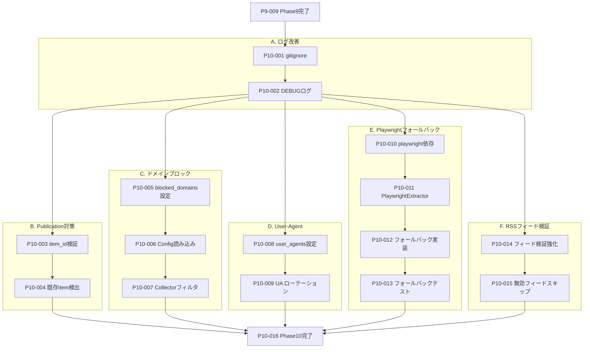

# 金融ニュース収集ワークフロー Python化

## 概要

現在の `/finance-news-workflow` の問題点（WebFetch不安定、要約品質、処理時間）を解決するため、Python CLIベースの新しいニュース収集ワークフローを実装する。

**主目的**: Claude Agent SDKを使った構造化要約の生成

**設計方針**:

- 情報源を抽象化し、将来的にRSS以外（yfinanceニュース、Webスクレイピング）にも対応
- 収集（Collector）と本文抽出（Extractor）を分離した単一責務設計
- パイプライン型データモデルで型安全性を確保
- 統一カテゴリマッピングでRSS/yfinance両方に対応

## 現状の問題点

| 問題                 | 原因                              | 解決策                        |
| -------------------- | --------------------------------- | ----------------------------- |
| 記事本文取得が不安定 | WebFetch/Playwrightのタイムアウト | trafilatura（既存実装）を使用 |
| 要約品質にばらつき   | エージェント依存                  | Claude Agent SDKで構造化要約  |
| 処理時間が長い       | 逐次処理・3段階フォールバック     | asyncioで並列処理             |

## アーキテクチャ

```
CLI: uv run python -m news.scripts.finance_news_workflow
         │
         ▼
┌─────────────────────────────────────────────────────────┐
│                    Orchestrator                          │
│              src/news/orchestrator.py                    │
└─────────────────────────────────────────────────────────┘
         │
    ┌────┴────┬────────────┬────────────┐
    ▼         ▼            ▼            ▼
┌────────┐ ┌──────────┐ ┌──────────┐ ┌──────────┐
│Collector│ │Extractor │ │Summarizer│ │Publisher │
│(情報源) │ │(本文抽出)│ │(AI要約)  │ │(Issue)   │
└────────┘ └──────────┘ └──────────┘ └──────────┘
     │           │            │            │
     ▼           ▼            ▼            ▼
 Collected   Extracted    Summarized   Published
  Article     Article      Article      Article
```

## モジュール構成

```
src/news/
├── collectors/              # 情報源別コレクター
│   ├── __init__.py
│   ├── base.py             # BaseCollector 抽象クラス
│   └── rss.py              # RSSCollector（既存FeedParser使用）
│   # (将来) yfinance.py    # yfinanceニュース取得
│
├── extractors/              # 本文抽出
│   ├── __init__.py
│   ├── base.py             # BaseExtractor 抽象クラス
│   └── trafilatura.py      # TrafilaturaExtractor（既存ArticleExtractor使用）
│
├── summarizer.py           # Claude Agent SDK要約（主機能）
├── publisher.py            # GitHub Issue作成
├── orchestrator.py         # 全体オーケストレーション
├── models.py               # データモデル（パイプライン型）
├── config.py               # 設定読み込み
│
├── scripts/
│   └── finance_news_workflow.py  # CLIエントリーポイント
│
└── (既存ファイルは変更なし)
```

## データモデル（パイプライン型）

### ArticleSource（情報源メタデータ）

```python
class SourceType(StrEnum):
    RSS = "rss"
    YFINANCE = "yfinance"
    SCRAPE = "scrape"

class ArticleSource(BaseModel):
    source_type: SourceType
    source_name: str       # "CNBC Markets", "NVDA" 等
    category: str          # "market", "yf_ai_stock" 等（マッピング用）
    feed_id: str | None = None  # RSSの場合のフィードID
```

### CollectedArticle（収集直後）

```python
class CollectedArticle(BaseModel):
    """Collectorから出力される記事"""
    url: HttpUrl
    title: str
    published: datetime | None
    raw_summary: str | None  # 情報源の要約（RSSのsummary等）
    source: ArticleSource
    collected_at: datetime
```

### ExtractedArticle（本文抽出後）

```python
class ExtractionStatus(StrEnum):
    SUCCESS = "success"
    FAILED = "failed"
    PAYWALL = "paywall"
    TIMEOUT = "timeout"

class ExtractedArticle(BaseModel):
    """Extractorから出力される記事"""
    collected: CollectedArticle
    body_text: str | None
    extraction_status: ExtractionStatus
    extraction_method: str  # "trafilatura", "fallback" 等
    error_message: str | None = None
```

### SummarizedArticle（AI要約後）

```python
class StructuredSummary(BaseModel):
    """4セクション構造化要約"""
    overview: str           # 概要: 記事の主旨
    key_points: list[str]   # キーポイント: 重要事実
    market_impact: str      # 市場影響: 投資家への示唆
    related_info: str | None = None  # 関連情報: 背景

class SummarizationStatus(StrEnum):
    SUCCESS = "success"
    FAILED = "failed"
    TIMEOUT = "timeout"
    SKIPPED = "skipped"  # 本文抽出失敗時

class SummarizedArticle(BaseModel):
    """Summarizerから出力される記事"""
    extracted: ExtractedArticle
    summary: StructuredSummary | None
    summarization_status: SummarizationStatus
    error_message: str | None = None
```

### PublishedArticle（Issue作成後）

```python
class PublicationStatus(StrEnum):
    SUCCESS = "success"
    FAILED = "failed"
    SKIPPED = "skipped"    # 要約失敗時
    DUPLICATE = "duplicate"  # 重複検出時

class PublishedArticle(BaseModel):
    """Publisherから出力される記事"""
    summarized: SummarizedArticle
    issue_number: int | None
    issue_url: str | None
    publication_status: PublicationStatus
    error_message: str | None = None
```

### WorkflowResult（実行結果）

```python
class FailureRecord(BaseModel):
    """失敗記録"""
    url: str
    title: str
    stage: str  # "extraction", "summarization", "publication"
    error: str

class WorkflowResult(BaseModel):
    """ワークフロー実行結果"""
    # 件数
    total_collected: int
    total_extracted: int
    total_summarized: int
    total_published: int
    total_duplicates: int

    # エラー詳細
    extraction_failures: list[FailureRecord]
    summarization_failures: list[FailureRecord]
    publication_failures: list[FailureRecord]

    # 処理時間
    started_at: datetime
    finished_at: datetime
    elapsed_seconds: float

    # 成功した記事
    published_articles: list[PublishedArticle]
```

## インターフェース設計

### BaseCollector

```python
class BaseCollector(ABC):
    """情報源からの記事収集を担当"""

    @property
    @abstractmethod
    def source_type(self) -> SourceType:
        """情報源タイプを返す"""

    @abstractmethod
    async def collect(
        self,
        max_age_hours: int = 168,
    ) -> list[CollectedArticle]:
        """
        記事メタデータを収集

        Parameters
        ----------
        max_age_hours
            収集対象の最大経過時間

        Returns
        -------
        list[CollectedArticle]
            収集された記事リスト
        """
```

### BaseExtractor

```python
class BaseExtractor(ABC):
    """記事本文の抽出を担当"""

    @property
    @abstractmethod
    def extractor_name(self) -> str:
        """抽出器名を返す"""

    @abstractmethod
    async def extract(self, article: CollectedArticle) -> ExtractedArticle:
        """
        単一記事の本文を抽出

        Parameters
        ----------
        article
            収集された記事

        Returns
        -------
        ExtractedArticle
            本文抽出結果
        """

    async def extract_batch(
        self,
        articles: list[CollectedArticle],
        concurrency: int = 5,
    ) -> list[ExtractedArticle]:
        """
        複数記事の本文を並列抽出（リトライ3回）

        Parameters
        ----------
        articles
            収集された記事リスト
        concurrency
            並列処理数

        Returns
        -------
        list[ExtractedArticle]
            本文抽出結果リスト
        """
```

### Summarizer

```python
class Summarizer:
    """Claude Agent SDKを使用した構造化要約"""

    async def summarize(self, article: ExtractedArticle) -> SummarizedArticle:
        """
        単一記事を要約（リトライ3回）

        Parameters
        ----------
        article
            本文抽出済み記事

        Returns
        -------
        SummarizedArticle
            要約結果
        """

    async def summarize_batch(
        self,
        articles: list[ExtractedArticle],
        concurrency: int = 3,
    ) -> list[SummarizedArticle]:
        """
        複数記事を並列要約

        Parameters
        ----------
        articles
            本文抽出済み記事リスト
        concurrency
            並列処理数

        Returns
        -------
        list[SummarizedArticle]
            要約結果リスト
        """
```

### Publisher

```python
class Publisher:
    """GitHub Issue作成とProject追加"""

    async def publish(self, article: SummarizedArticle) -> PublishedArticle:
        """
        単一記事をIssueとして公開

        Parameters
        ----------
        article
            要約済み記事

        Returns
        -------
        PublishedArticle
            公開結果
        """

    async def publish_batch(
        self,
        articles: list[SummarizedArticle],
        dry_run: bool = False,
    ) -> list[PublishedArticle]:
        """
        複数記事を公開（重複チェック含む）

        Parameters
        ----------
        articles
            要約済み記事リスト
        dry_run
            Trueの場合、Issue作成をスキップ

        Returns
        -------
        list[PublishedArticle]
            公開結果リスト
        """
```

## 設定ファイル

`data/config/news-collection-config.yaml`:

```yaml
version: "1.0"

# ===========================================
# カテゴリ → GitHub Status マッピング（共通）
# ===========================================
# RSSのcategoryフィールド、yfinanceのティッカーカテゴリ
# いずれも同じマッピングを使用

status_mapping:
    # GitHub Project Status一覧
    # index: 3925acc3, stock: f762022e, sector: 48762504
    # macro: 730034a5, ai: 6fbb43d0, finance: ac4a91b1

    # RSSカテゴリ（rss-presets.json の category フィールド）
    tech: "ai"
    market: "index"
    finance: "finance"

    # yfinanceカテゴリ
    yf_index: "index" # ^GSPC, ^DJI 等の指数
    yf_stock: "stock" # 一般的な個別株
    yf_ai_stock: "ai" # NVDA, AMD 等のAI関連株
    yf_sector_etf: "sector" # XLF, XLK 等のセクターETF
    yf_macro: "macro" # マクロ経済関連

# GitHub Status ID（自動解決用）
github_status_ids:
    index: "3925acc3"
    stock: "f762022e"
    sector: "48762504"
    macro: "730034a5"
    ai: "6fbb43d0"
    finance: "ac4a91b1"

# ===========================================
# 情報源設定
# ===========================================

# RSS設定
rss:
    presets_file: "data/config/rss-presets.json"
    # rss-presets.json の category フィールドを status_mapping で解決

# yfinance設定（将来用）
yfinance:
    enabled: false
    tickers:
        # 指数
        - symbol: "^GSPC"
          category: "yf_index"
        - symbol: "^DJI"
          category: "yf_index"
        - symbol: "^IXIC"
          category: "yf_index"

        # AI関連株
        - symbol: "NVDA"
          category: "yf_ai_stock"
        - symbol: "AMD"
          category: "yf_ai_stock"
        - symbol: "GOOGL"
          category: "yf_ai_stock"
        - symbol: "MSFT"
          category: "yf_ai_stock"

        # 一般個別株
        - symbol: "AAPL"
          category: "yf_stock"
        - symbol: "AMZN"
          category: "yf_stock"
        - symbol: "TSLA"
          category: "yf_stock"

        # セクターETF
        - symbol: "XLF"
          category: "yf_sector_etf"
        - symbol: "XLK"
          category: "yf_sector_etf"

# ===========================================
# 処理設定
# ===========================================

# 本文抽出設定
extraction:
    concurrency: 5
    timeout_seconds: 30
    min_body_length: 200
    max_retries: 3

# 要約設定
summarization:
    concurrency: 3
    timeout_seconds: 60
    max_retries: 3
    prompt_template: |
        以下の金融ニュース記事を分析し、日本語で構造化された要約を作成してください。

        ## 記事情報
        **タイトル**: {title}
        **ソース**: {source}
        **公開日**: {published}

        **本文**:
        {body}

        ## 出力形式 (JSON)
        {{
          "overview": "記事の主旨を1-2文で要約",
          "key_points": ["重要なポイント1", "重要なポイント2"],
          "market_impact": "投資家・市場への影響",
          "related_info": "関連する背景情報（なければnull）"
        }}

# GitHub設定
github:
    project_number: 15
    project_id: "PVT_kwHOBoK6AM4BMpw_"
    status_field_id: "PVTSSF_lAHOBoK6AM4BMpw_zg739ZE"
    published_date_field_id: "PVTF_lAHOBoK6AM4BMpw_zg8BzrI"
    repository: "YH-05/finance"
    duplicate_check_days: 7 # 重複チェック対象期間
    dry_run: false

# フィルタリング
filtering:
    max_age_hours: 168 # 7日

# 出力設定
output:
    # 結果JSONの出力先（デフォルト）
    result_dir: "data/exports/news-workflow"
    # ファイル名パターン: workflow-result-{timestamp}.json
```

## CLI使用方法

```bash
# 基本実行
uv run python -m news.scripts.finance_news_workflow

# 特定Statusのみ（マッピング後のStatus）
uv run python -m news.scripts.finance_news_workflow --status index,stock

# ドライラン（Issue作成なし）
uv run python -m news.scripts.finance_news_workflow --dry-run

# カスタム設定
uv run python -m news.scripts.finance_news_workflow --config path/to/config.yaml

# 記事数制限
uv run python -m news.scripts.finance_news_workflow --max-articles 50

# 詳細ログ
uv run python -m news.scripts.finance_news_workflow --verbose
```

## 出力ファイル

実行結果は自動的にJSONファイルとして保存される:

```
data/exports/news-workflow/
└── workflow-result-2026-01-29T12-00-00.json
```

```json
{
  "total_collected": 100,
  "total_extracted": 85,
  "total_summarized": 80,
  "total_published": 75,
  "total_duplicates": 5,
  "extraction_failures": [...],
  "summarization_failures": [...],
  "publication_failures": [...],
  "started_at": "2026-01-29T12:00:00",
  "finished_at": "2026-01-29T12:15:00",
  "elapsed_seconds": 900.5,
  "published_articles": [...]
}
```

## ログ出力

utils_coreのログ機能を使用し、ファイル保存とコンソール出力を両立:

```
logs/
└── news-workflow-2026-01-29.log
```

```
2026-01-29 12:00:00 INFO  [orchestrator] Workflow started
2026-01-29 12:00:01 INFO  [rss_collector] Collecting from 29 feeds...
2026-01-29 12:00:05 INFO  [rss_collector] Collected 100 articles
2026-01-29 12:00:05 INFO  [trafilatura] Extracting body text (concurrency=5)...
2026-01-29 12:02:00 INFO  [trafilatura] Extracted 85/100 articles
2026-01-29 12:02:00 WARN  [trafilatura] Failed: 15 articles (paywall: 10, timeout: 5)
2026-01-29 12:02:00 INFO  [summarizer] Summarizing 85 articles (concurrency=3)...
2026-01-29 12:10:00 INFO  [summarizer] Summarized 80/85 articles
2026-01-29 12:10:00 INFO  [publisher] Publishing 80 articles...
2026-01-29 12:15:00 INFO  [publisher] Published 75 issues, skipped 5 duplicates
2026-01-29 12:15:00 INFO  [orchestrator] Workflow completed in 900.5s
```

## データフロー

```
1. RSSCollector.collect(max_age_hours)
   │ rss-presets.json から全フィード取得
   │ category フィールドを ArticleSource.category に設定
   ▼
2. list[CollectedArticle] (url, title, raw_summary, source)
   │ 重複チェック（直近7日のIssue URL照合）
   ▼
3. TrafilaturaExtractor.extract_batch(articles, concurrency=5)
   │ trafilatura.extract() [並列処理、リトライ3回]
   ▼
4. list[ExtractedArticle] (+ body_text, extraction_status)
   │ 本文抽出成功のみフィルタ
   ▼
5. Summarizer.summarize_batch(articles, concurrency=3)
   │ Claude Agent SDK [並列処理、リトライ3回]
   ▼
6. list[SummarizedArticle] (+ summary, summarization_status)
   │ 要約成功のみフィルタ
   ▼
7. Publisher.publish_batch(articles, dry_run)
   │ status_mapping で category → GitHub Status を解決
   │ gh issue create + gh project item-add
   ▼
8. list[PublishedArticle] (+ issue_number, issue_url)
   │
   ▼
9. WorkflowResult → JSON出力
```

## Issue本文フォーマット

```markdown
# {title}

## 概要

{overview}

## キーポイント

- {key_point_1}
- {key_point_2}
- {key_point_3}

## 市場への影響

{market_impact}

## 関連情報

{related_info}

---

**ソース**: {source_name}
**公開日**: {published}
**URL**: {url}
```

## 再利用する既存コード

| コンポーネント   | ファイル                                | 用途                       |
| ---------------- | --------------------------------------- | -------------------------- |
| FeedParser       | `src/rss/core/parser.py`                | RSSCollectorで使用         |
| ArticleExtractor | `src/rss/services/article_extractor.py` | TrafilaturaExtractorで使用 |
| AgentProcessor   | `src/news/processors/agent_base.py`     | Summarizerの参考           |
| GitHubSink       | `src/news/sinks/github.py`              | Publisherの参考            |
| get_logger       | `src/utils_core/logging_config.py`      | ログ出力                   |

## 実装タスク

### Phase 1: 基盤（モデル・設定・インターフェース）

- [ ] `src/news/models.py` 作成（パイプライン型データモデル + WorkflowResult）
- [ ] `src/news/config.py` 作成（設定読み込み + カテゴリマッピング）
- [ ] `data/config/news-collection-config.yaml` 作成
- [ ] `src/news/collectors/base.py` 作成（BaseCollector）
- [ ] `src/news/extractors/base.py` 作成（BaseExtractor）
- [ ] 単体テスト作成

### Phase 2: RSS収集

- [ ] `src/news/collectors/__init__.py` 作成
- [ ] `src/news/collectors/rss.py` 作成（RSSCollector）
- [ ] 既存 `rss.core.parser.FeedParser` との統合
- [ ] rss-presets.json の category フィールド対応
- [ ] 日時フィルタリング実装
- [ ] 単体テスト作成

### Phase 3: 本文抽出

- [ ] `src/news/extractors/__init__.py` 作成
- [ ] `src/news/extractors/trafilatura.py` 作成（TrafilaturaExtractor）
- [ ] 既存 `rss.services.article_extractor.ArticleExtractor` のラップ
- [ ] セマフォベース並列処理
- [ ] リトライロジック（3回）
- [ ] 単体テスト作成

### Phase 4: AI要約

- [ ] `src/news/summarizer.py` 作成
- [ ] Claude Agent SDK統合
- [ ] JSON出力パース・バリデーション（StructuredSummary）
- [ ] セマフォベース並列処理
- [ ] リトライロジック（3回）
- [ ] 単体テスト作成

### Phase 5: GitHub Publisher

- [ ] `src/news/publisher.py` 作成
- [ ] Issue本文生成（4セクション構造）
- [ ] カテゴリ → GitHub Status 解決
- [ ] Project フィールド更新（Status, PublishedDate）
- [ ] 重複チェック（直近7日、URL照合）
- [ ] ドライランモード
- [ ] 単体テスト作成

### Phase 6: オーケストレーター

- [ ] `src/news/orchestrator.py` 作成
- [ ] 全コンポーネント統合
- [ ] WorkflowResult（統計情報 + エラー詳細 + 処理時間）生成
- [ ] 結果JSON出力
- [ ] 進捗ログ（utils_core使用）
- [ ] 統合テスト作成

### Phase 7: CLI

- [ ] `src/news/scripts/finance_news_workflow.py` 作成
- [ ] 引数パース（argparse）
- [ ] ログ設定（ファイル + コンソール）
- [ ] CLIテスト作成

### Phase 8: ドキュメント・移行

- [ ] `src/news/README.md` 更新
- [ ] CLAUDE.md 更新（新コマンド追加）
- [ ] 既存ワークフローとの並行運用確認

## 主要ファイル

| ファイル                                | 説明                       |
| --------------------------------------- | -------------------------- |
| `src/rss/core/parser.py`                | FeedParser（再利用）       |
| `src/rss/services/article_extractor.py` | ArticleExtractor（再利用） |
| `src/news/processors/agent_base.py`     | Claude Agent SDKパターン   |
| `src/news/sinks/github.py`              | GitHub Issue作成パターン   |
| `data/config/rss-presets.json`          | RSSフィード設定            |
| `data/config/finance-news-themes.json`  | テーマ設定（参考）         |
| `notebook/claude-agent-test.ipynb`      | Claude Agent SDK使用例     |

## 検証方法

1. **ドライラン**: `--dry-run` でIssue作成なしで全フロー確認
2. **単体テスト**: 各モジュールのテスト実行 `make test`
3. **統合テスト**: 特定Statusで実際にIssue作成まで確認
4. **全Status実行**: 全Statusで実行し、処理時間・成功率を確認

## 並行運用について

- 既存の `/finance-news-workflow`（エージェントベース）は維持
- 新ワークフローが安定稼働するまで並行運用
- 手動で削除指示があるまで既存ワークフローは残す

---

## Phase 9: claude-agent-sdk 移行（追加計画）

### 背景

現在の `src/news/summarizer.py` は Anthropic Python SDK（`from anthropic import Anthropic`）を使用しており、API キーによる従量課金が必要。Claude Code サブスクリプション（Pro/Max）を活用するには `claude-agent-sdk` への移行が必要。

### 現状と問題点

| 項目              | 現状                                      | 問題                                 |
| ----------------- | ----------------------------------------- | ------------------------------------ |
| AI呼び出し        | `anthropic.Anthropic().messages.create()` | API キーが必要（従量課金）           |
| 認証              | 環境変数 `ANTHROPIC_API_KEY`              | Claude Code サブスクリプション未活用 |
| project.md の計画 | Claude Agent SDK 使用と記載               | 実装と乖離                           |

### 解決策: claude-agent-sdk への移行

#### インストール

```bash
uv add claude-agent-sdk
```

#### 前提条件

- Python 3.10 以上
- Node.js 18 以上
- Claude Pro/Max サブスクリプション

#### 認証方法

| 環境 | 認証方式 | 設定 | 課金 |
|---|---|---|---|
| **ローカル** | サブスクリプション認証 | `claude auth login` | サブスクリプション料金に含まれる |
| CI/CD | API キー認証 | `ANTHROPIC_API_KEY` 環境変数 | 従量課金 |

**重要**: ローカル環境では `ANTHROPIC_API_KEY` を設定しないこと。設定するとサブスクリプションではなく API キーが優先され、従量課金が発生する。

参照: [Using Claude Code with your Pro or Max plan](https://support.claude.com/en/articles/11145838-using-claude-code-with-your-pro-or-max-plan)

### 実装計画

#### 変更対象ファイル

| ファイル                             | 変更内容                                |
| ------------------------------------ | --------------------------------------- |
| `pyproject.toml`                     | `claude-agent-sdk` 依存関係追加         |
| `src/news/summarizer.py`             | claude-agent-sdk を使用するよう書き換え |
| `tests/news/unit/test_summarizer.py` | テスト更新（SDK モック対応）            |

#### 新しい Summarizer 実装

```python
"""Summarizer using Claude Agent SDK."""

from __future__ import annotations

import asyncio
import json
import re
from typing import TYPE_CHECKING

from pydantic import ValidationError

from news.models import (
    ExtractedArticle,
    StructuredSummary,
    SummarizationStatus,
    SummarizedArticle,
)
from news.utils.logging_config import get_logger

if TYPE_CHECKING:
    from news.config.workflow import NewsWorkflowConfig

logger = get_logger(__name__, module="summarizer")


class Summarizer:
    """Claude Agent SDK を使用した構造化要約。

    Claude Code サブスクリプション（Pro/Max）を活用して
    記事本文を分析し、4セクション構造の日本語要約を生成する。

    Parameters
    ----------
    config : NewsWorkflowConfig
        ワークフロー設定。

    Notes
    -----
    - 事前に `claude` コマンドで認証が必要
    - CI/CD では環境変数 ANTHROPIC_API_KEY を設定
    """

    def __init__(self, config: NewsWorkflowConfig) -> None:
        self._config = config
        self._prompt_template = config.summarization.prompt_template
        self._max_retries = config.summarization.max_retries
        self._timeout_seconds = config.summarization.timeout_seconds

    async def _call_claude_sdk(self, prompt: str) -> str:
        """Claude Agent SDK を使用して要約を取得。

        Parameters
        ----------
        prompt : str
            要約プロンプト。

        Returns
        -------
        str
            Claude からのレスポンステキスト。

        Raises
        ------
        RuntimeError
            claude-agent-sdk がインストールされていない場合。
        """
        try:
            from claude_agent_sdk import (
                query,
                ClaudeAgentOptions,
                AssistantMessage,
                TextBlock,
            )
        except ImportError as e:
            raise RuntimeError(
                "claude-agent-sdk is not installed. "
                "Install with: uv add claude-agent-sdk"
            ) from e

        options = ClaudeAgentOptions(
            allowed_tools=[],  # ツール不要（テキスト生成のみ）
            permission_mode="default",
        )

        response_parts: list[str] = []
        async for message in query(prompt=prompt, options=options):
            if isinstance(message, AssistantMessage):
                for block in message.content:
                    if isinstance(block, TextBlock):
                        response_parts.append(block.text)

        return "".join(response_parts)

    async def summarize(self, article: ExtractedArticle) -> SummarizedArticle:
        """単一記事を要約する。

        Parameters
        ----------
        article : ExtractedArticle
            本文抽出済み記事。

        Returns
        -------
        SummarizedArticle
            要約結果を含む記事オブジェクト。
        """
        if article.body_text is None:
            return SummarizedArticle(
                extracted=article,
                summary=None,
                summarization_status=SummarizationStatus.SKIPPED,
                error_message="No body text available",
            )

        prompt = self._build_prompt(article)

        for attempt in range(self._max_retries):
            try:
                async with asyncio.timeout(self._timeout_seconds):
                    response_text = await self._call_claude_sdk(prompt)

                summary = self._parse_response(response_text)
                return SummarizedArticle(
                    extracted=article,
                    summary=summary,
                    summarization_status=SummarizationStatus.SUCCESS,
                    error_message=None,
                )

            except asyncio.TimeoutError:
                logger.warning(
                    "Summarization timeout",
                    attempt=attempt + 1,
                    max_retries=self._max_retries,
                )
                if attempt == self._max_retries - 1:
                    return SummarizedArticle(
                        extracted=article,
                        summary=None,
                        summarization_status=SummarizationStatus.TIMEOUT,
                        error_message=f"Timeout after {self._timeout_seconds}s",
                    )

            except Exception as e:
                logger.warning(
                    "Summarization failed",
                    attempt=attempt + 1,
                    error=str(e),
                )
                if attempt == self._max_retries - 1:
                    return SummarizedArticle(
                        extracted=article,
                        summary=None,
                        summarization_status=SummarizationStatus.FAILED,
                        error_message=str(e),
                    )

            await asyncio.sleep(2 ** attempt)  # 指数バックオフ

    def _build_prompt(self, article: ExtractedArticle) -> str:
        """要約プロンプトを構築する。"""
        collected = article.collected
        published_str = (
            collected.published.isoformat() if collected.published else "不明"
        )

        return f"""以下のニュース記事を日本語で要約してください。

## 記事情報
- タイトル: {collected.title}
- ソース: {collected.source.source_name}
- 公開日: {published_str}

## 本文
{article.body_text}

## 出力形式
以下のJSON形式で回答してください：
{{
    "overview": "記事の概要（1-2文）",
    "key_points": ["キーポイント1", "キーポイント2", ...],
    "market_impact": "市場への影響",
    "related_info": "関連情報（任意、なければnull）"
}}

JSONのみを出力し、他のテキストは含めないでください。"""

    def _parse_response(self, response_text: str) -> StructuredSummary:
        """レスポンスをパースする。"""
        # 既存の実装と同様
        ...

    async def summarize_batch(
        self,
        articles: list[ExtractedArticle],
        concurrency: int = 3,
    ) -> list[SummarizedArticle]:
        """複数記事を並列要約する。"""
        # 既存の実装と同様
        ...
```

### タスクリスト（9タスク）

| ID | タスク | 依存 | ファイル |
|----|--------|------|----------|
| P9-001 | claude-agent-sdk インポート変更 | P4-005 | [P9-001](tasks/P9-001-sdk-imports.md) |
| P9-002 | _call_claude_sdk メソッド実装 | P9-001 | [P9-002](tasks/P9-002-call-claude-sdk-method.md) |
| P9-003 | summarize メソッドの更新 | P9-002 | [P9-003](tasks/P9-003-summarize-method-update.md) |
| P9-004 | SDK エラーハンドリング実装 | P9-003 | [P9-004](tasks/P9-004-error-handling.md) |
| P9-005 | Anthropic クライアント削除 | P9-004 | [P9-005](tasks/P9-005-remove-anthropic-client.md) |
| P9-006 | テストのモック更新 | P9-005 | [P9-006](tasks/P9-006-test-mock-update.md) |
| P9-007 | ローカル統合テスト | P9-006 | [P9-007](tasks/P9-007-local-integration-test.md) |
| P9-008 | CI/CD 設定確認と更新 | P9-007 | [P9-008](tasks/P9-008-cicd-config.md) |
| P9-009 | Phase 9 テスト完了確認 | P9-006,P9-007,P9-008 | [P9-009](tasks/P9-009-phase9-tests.md) |

### 参考資料

- [Claude Agent SDK Python リファレンス](https://platform.claude.com/docs/en/agent-sdk/python)
- [GitHub: anthropics/claude-agent-sdk-python](https://github.com/anthropics/claude-agent-sdk-python)
- [PyPI: claude-agent-sdk](https://pypi.org/project/claude-agent-sdk/)
- 既存実装: `src/news/processors/agent_base.py`

---

## Phase 10: ワークフロー信頼性向上

### 背景

2026-01-31 のワークフロー実行ログ分析により、以下の失敗パターンを特定:

| カテゴリ | 件数 | 根本原因 |
|---------|------|----------|
| Body text too short | 225件 | CNBC等のJS動的レンダリング |
| Publication failed | 154件 | gh project item-add のitem_id空 |
| HTTP 403 | 14件 | SeekingAlpha等のボット検出 |
| HTTP 401 | 2件 | WSJ/Reuters ペイウォール |
| Invalid feed format | 2件 | RSSフィード形式エラー |

### 解決策

#### A. ログ改善
- `logs/` ディレクトリをGit管理対象に追加
- ファイル出力ログレベルをDEBUGに変更（詳細な障害分析用）

#### B. Publication failed 対策
- `gh project item-add` 戻り値の空チェック
- 既存Project Item検出とスキップ

#### C. ドメインブロックリスト
- ペイウォール/ボット検出サイトを除外
- 設定ファイルで管理

#### D. User-Agent ローテーション
- 複数User-Agentの設定
- リクエスト毎にランダム選択

#### E. Playwright フォールバック
- trafilatura失敗時にPlaywrightで再取得
- JS動的レンダリング対応

#### F. RSSフィード検証
- 無効フィードのスキップ
- 詳細なエラーログ

### タスクリスト（16タスク）

| ID | タスク | 依存 | ファイル |
|----|--------|------|----------|
| **A. ログ改善** | | | |
| P10-001 | .gitignoreからlogs/*.log除外 | P9-009 | [P10-001](tasks/P10-001-gitignore-logs.md) |
| P10-002 | ファイルログをDEBUGレベルに変更 | P10-001 | [P10-002](tasks/P10-002-debug-log-level.md) |
| **B. Publication failed対策** | | | |
| P10-003 | item_id空チェック追加 | P10-002 | [P10-003](tasks/P10-003-item-id-validation.md) |
| P10-004 | 既存Project Item検出 | P10-003 | [P10-004](tasks/P10-004-existing-item-check.md) |
| **C. ドメインブロックリスト** | | | |
| P10-005 | config.yamlにblocked_domains追加 | P10-002 | [P10-005](tasks/P10-005-blocked-domains-config.md) |
| P10-006 | NewsWorkflowConfigにブロックリスト読み込み | P10-005 | [P10-006](tasks/P10-006-config-blocked-domains.md) |
| P10-007 | RSSCollectorにドメインフィルタリング | P10-006 | [P10-007](tasks/P10-007-domain-filter-collector.md) |
| **D. User-Agentローテーション** | | | |
| P10-008 | config.yamlにuser_agents追加 | P10-002 | [P10-008](tasks/P10-008-user-agents-config.md) |
| P10-009 | TrafilaturaExtractorにUser-Agent設定 | P10-008 | [P10-009](tasks/P10-009-user-agent-rotation.md) |
| **E. Playwrightフォールバック** | | | |
| P10-010 | playwright依存関係追加 | P10-002 | [P10-010](tasks/P10-010-playwright-dependency.md) |
| P10-011 | PlaywrightExtractor基盤クラス | P10-010 | [P10-011](tasks/P10-011-playwright-extractor.md) |
| P10-012 | trafilatura→Playwrightフォールバック | P10-011 | [P10-012](tasks/P10-012-fallback-extractor.md) |
| P10-013 | フォールバックテスト | P10-012 | [P10-013](tasks/P10-013-fallback-tests.md) |
| **F. RSSフィード検証** | | | |
| P10-014 | フィード形式検証強化 | P10-002 | [P10-014](tasks/P10-014-feed-validation.md) |
| P10-015 | 無効フィードスキップとログ | P10-014 | [P10-015](tasks/P10-015-invalid-feed-skip.md) |
| **G. Phase 10完了** | | | |
| P10-016 | Phase 10テスト・ドキュメント | P10-004,P10-007,P10-009,P10-013,P10-015 | [P10-016](tasks/P10-016-phase10-complete.md) |

### 依存関係図



### 変更対象ファイル

| ファイル | 変更内容 |
|----------|----------|
| `.gitignore` | `*.log` → `logs/` ディレクトリ以外のログを除外 |
| `src/news/scripts/finance_news_workflow.py` | ログレベル設定変更 |
| `src/news/publisher.py` | item_id空チェック、既存Item検出 |
| `data/config/news-collection-config.yaml` | blocked_domains, user_agents追加 |
| `src/news/config/workflow.py` | 新設定項目の読み込み |
| `src/news/collectors/rss.py` | ドメインフィルタリング |
| `src/news/extractors/trafilatura.py` | User-Agent設定、フォールバック呼び出し |
| `src/news/extractors/playwright.py` | 新規作成 |
| `src/rss/core/parser.py` | フィード検証強化 |
| `pyproject.toml` | playwright依存関係追加 |
