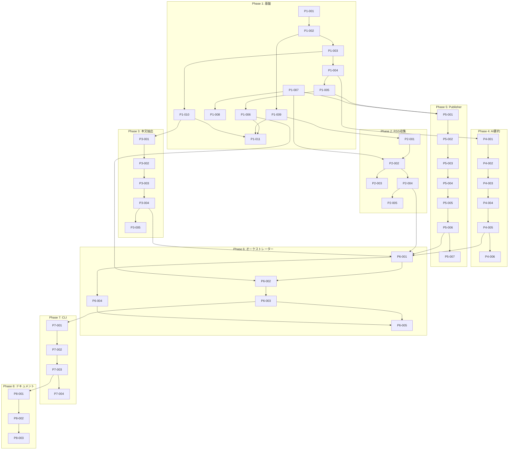

# タスク一覧

金融ニュース収集ワークフロー Python化プロジェクトのタスク分解結果。

## サマリー

- **総タスク数**: 32
- **フェーズ数**: 8

## Phase 1: 基盤（11タスク）

| ID | タスク | 依存 | ファイル |
|----|--------|------|----------|
| P1-001 | SourceType, ArticleSource モデル作成 | - | [P1-001](P1-001-source-type-article-source.md) |
| P1-002 | CollectedArticle モデル作成 | P1-001 | [P1-002](P1-002-collected-article.md) |
| P1-003 | ExtractionStatus, ExtractedArticle モデル作成 | P1-002 | [P1-003](P1-003-extracted-article.md) |
| P1-004 | StructuredSummary, SummarizedArticle モデル作成 | P1-003 | [P1-004](P1-004-summarized-article.md) |
| P1-005 | PublicationStatus, PublishedArticle モデル作成 | P1-004 | [P1-005](P1-005-published-article.md) |
| P1-006 | FailureRecord, WorkflowResult モデル作成 | P1-005 | [P1-006](P1-006-workflow-result.md) |
| P1-007 | config.py 設定ファイル読み込み機能 | - | [P1-007](P1-007-config.md) |
| P1-008 | news-collection-config.yaml 作成 | P1-007 | [P1-008](P1-008-config-yaml.md) |
| P1-009 | BaseCollector 抽象クラス作成 | P1-002 | [P1-009](P1-009-base-collector.md) |
| P1-010 | BaseExtractor 抽象クラス作成 | P1-003 | [P1-010](P1-010-base-extractor.md) |
| P1-011 | Phase 1 単体テスト作成 | P1-006,P1-009,P1-010 | [P1-011](P1-011-phase1-tests.md) |

## Phase 2: RSS収集（5タスク）

| ID | タスク | 依存 | ファイル |
|----|--------|------|----------|
| P2-001 | collectors/__init__.py 作成 | P1-009 | [P2-001](P2-001-collectors-init.md) |
| P2-002 | RSSCollector 基本実装 | P2-001,P1-007 | [P2-002](P2-002-rss-collector-basic.md) |
| P2-003 | RSSCollector category フィールド対応 | P2-002 | [P2-003](P2-003-rss-category.md) |
| P2-004 | RSSCollector 日時フィルタリング | P2-002 | [P2-004](P2-004-rss-date-filter.md) |
| P2-005 | Phase 2 単体テスト作成 | P2-004 | [P2-005](P2-005-phase2-tests.md) |

## Phase 3: 本文抽出（5タスク）

| ID | タスク | 依存 | ファイル |
|----|--------|------|----------|
| P3-001 | extractors/__init__.py 作成 | P1-010 | [P3-001](P3-001-extractors-init.md) |
| P3-002 | TrafilaturaExtractor 基本実装 | P3-001 | [P3-002](P3-002-trafilatura-basic.md) |
| P3-003 | TrafilaturaExtractor 並列処理 | P3-002 | [P3-003](P3-003-trafilatura-concurrent.md) |
| P3-004 | TrafilaturaExtractor リトライ | P3-003 | [P3-004](P3-004-trafilatura-retry.md) |
| P3-005 | Phase 3 単体テスト作成 | P3-004 | [P3-005](P3-005-phase3-tests.md) |

## Phase 4: AI要約（6タスク）

| ID | タスク | 依存 | ファイル |
|----|--------|------|----------|
| P4-001 | Summarizer 基本クラス構造 | P1-004 | [P4-001](P4-001-summarizer-basic.md) |
| P4-002 | Summarizer Claude SDK 統合 | P4-001 | [P4-002](P4-002-summarizer-claude-sdk.md) |
| P4-003 | Summarizer JSON パース | P4-002 | [P4-003](P4-003-summarizer-json-parse.md) |
| P4-004 | Summarizer 並列処理 | P4-003 | [P4-004](P4-004-summarizer-concurrent.md) |
| P4-005 | Summarizer リトライ | P4-004 | [P4-005](P4-005-summarizer-retry.md) |
| P4-006 | Phase 4 単体テスト作成 | P4-005 | [P4-006](P4-006-phase4-tests.md) |

## Phase 5: GitHub Publisher（7タスク）

| ID | タスク | 依存 | ファイル |
|----|--------|------|----------|
| P5-001 | Publisher 基本クラス構造 | P1-005,P1-007 | [P5-001](P5-001-publisher-basic.md) |
| P5-002 | Publisher Issue 本文生成 | P5-001 | [P5-002](P5-002-publisher-issue-body.md) |
| P5-003 | Publisher カテゴリ→Status 解決 | P5-002 | [P5-003](P5-003-publisher-status.md) |
| P5-004 | Publisher Project フィールド更新 | P5-003 | [P5-004](P5-004-publisher-project.md) |
| P5-005 | Publisher 重複チェック | P5-004 | [P5-005](P5-005-publisher-duplicate.md) |
| P5-006 | Publisher ドライランモード | P5-005 | [P5-006](P5-006-publisher-dryrun.md) |
| P5-007 | Phase 5 単体テスト作成 | P5-006 | [P5-007](P5-007-phase5-tests.md) |

## Phase 6: オーケストレーター（5タスク）

| ID | タスク | 依存 | ファイル |
|----|--------|------|----------|
| P6-001 | Orchestrator 全コンポーネント統合 | P2-004,P3-004,P4-005,P5-006 | [P6-001](P6-001-orchestrator-integration.md) |
| P6-002 | Orchestrator WorkflowResult 生成 | P6-001,P1-006 | [P6-002](P6-002-orchestrator-result.md) |
| P6-003 | Orchestrator 結果 JSON 出力 | P6-002 | [P6-003](P6-003-orchestrator-json.md) |
| P6-004 | Orchestrator 進捗ログ | P6-001 | [P6-004](P6-004-orchestrator-logging.md) |
| P6-005 | Phase 6 統合テスト作成 | P6-003,P6-004 | [P6-005](P6-005-phase6-tests.md) |

## Phase 7: CLI（4タスク）

| ID | タスク | 依存 | ファイル |
|----|--------|------|----------|
| P7-001 | CLI エントリーポイント作成 | P6-003 | [P7-001](P7-001-cli-entrypoint.md) |
| P7-002 | CLI 引数パース | P7-001 | [P7-002](P7-002-cli-argparse.md) |
| P7-003 | CLI ログ設定 | P7-002 | [P7-003](P7-003-cli-logging.md) |
| P7-004 | Phase 7 CLI テスト作成 | P7-003 | [P7-004](P7-004-phase7-tests.md) |

## Phase 8: ドキュメント・移行（3タスク）

| ID | タスク | 依存 | ファイル |
|----|--------|------|----------|
| P8-001 | src/news/README.md 更新 | P7-003 | [P8-001](P8-001-news-readme.md) |
| P8-002 | CLAUDE.md 更新 | P8-001 | [P8-002](P8-002-claude-md.md) |
| P8-003 | 既存ワークフローとの並行運用確認 | P8-002 | [P8-003](P8-003-parallel-operation.md) |

## 依存関係グラフ

## 並行開発可能なタスク

Phase 1 完了後、以下のタスクグループは並行開発可能：

- **グループA**: Phase 2（RSS収集）
- **グループB**: Phase 3（本文抽出）
- **グループC**: Phase 4（AI要約）
- **グループD**: Phase 5（Publisher）

Phase 6 以降は順次実行が必要。
