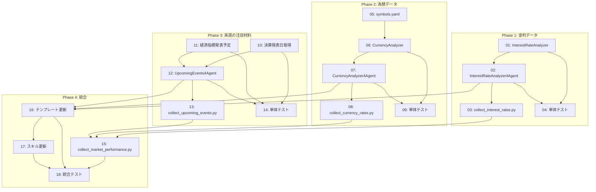

# 週次マーケットレポート機能拡張計画

**Project**: #28
**GitHub Project**: https://github.com/users/YH-05/projects/28
**Status**: Todo
**Created**: 2026-01-29

## 概要

`/generate-market-report` で生成されるレポートを以下の4点で拡張する：

1. **説明文の拡充** - 各セクションの説明文を1.5倍に増量
2. **金利データの追加** - FREDから米国債利回り・FF金利を取得
3. **来週の注目材料** - 主要企業決算とマクロ経済指標発表予定を追加
4. **為替データの追加** - 日本円ベースの主要6通貨データを取得

---

## 1. 説明文の拡充

### 対象
- `weekly-comment-generation` スキル
- テンプレート: `template/market_report/weekly_market_report_template.md`

### 変更内容
- 各セクションの目標文字数を1.5倍に変更

| セクション | 現行 | 変更後 |
|-----------|------|--------|
| ハイライト | 200字 | 300字 |
| 指数コメント | 500字 | **750字** |
| MAG7コメント | 800字 | **1200字** |
| 上位セクターコメント | 400字 | **600字** |
| 下位セクターコメント | 400字 | **600字** |
| マクロ経済コメント | 400字 | **600字** |
| 投資テーマコメント | 300字 | **450字** |
| 来週の材料 | 200字 | 300字 |
| **合計** | **3200字** | **4800字以上** |

### 追加するセクション（テンプレート変更）
```markdown
## 金利・債券市場

### 米国債利回り

{interest_rates_table}

{interest_rates_comment}

---

## 為替市場

### 円クロス主要通貨

{currencies_table}

{currencies_comment}
```

---

## 2. 金利データの追加

### 取得対象（FRED）

| シリーズID | 名称 | 用途 |
|-----------|------|------|
| DGS2 | 2年国債利回り | 短期金利 |
| DGS10 | 10年国債利回り | 長期金利 |
| DGS30 | 30年国債利回り | 超長期金利 |
| FEDFUNDS | FF金利 | 政策金利 |
| T10Y2Y | 10年-2年スプレッド | イールドカーブ |

### 実装方針

#### 新規ファイル
```
src/analyze/reporting/interest_rate.py      # 金利データ取得・分析
src/analyze/reporting/interest_rate_agent.py # エージェント向けJSON出力
scripts/collect_interest_rates.py           # データ収集スクリプト
```

#### 出力形式（JSON）
```json
{
  "group": "interest_rates",
  "generated_at": "2026-01-29T10:00:00",
  "data": {
    "DGS2": {
      "name_ja": "2年国債利回り",
      "latest_value": 4.25,
      "latest_date": "2026-01-28",
      "changes": {
        "1D": -0.02,
        "1W": 0.08,
        "MTD": 0.15,
        "YTD": 0.25
      }
    }
  },
  "yield_curve": {
    "2y_10y_spread": 0.45,
    "is_inverted": false
  }
}
```

---

## 3. 来週の注目材料

### 3.1 決算発表日（yfinance）

#### 対象銘柄（S&P500時価総額上位20社）
```python
TOP20_SYMBOLS = [
    "AAPL", "MSFT", "GOOGL", "AMZN", "NVDA", "META", "TSLA",  # MAG7
    "BRK-B", "LLY", "V", "UNH", "JPM", "XOM", "JNJ", "MA",    # Top 8-15
    "PG", "HD", "AVGO", "CVX", "MRK"                           # Top 16-20
]
```

#### 実装
```python
# yfinance.Ticker.calendar で取得
ticker = yf.Ticker("AAPL")
calendar = ticker.calendar  # 次回決算日、配当日等を含む辞書
```

### 3.2 経済指標発表予定（FRED API）

#### APIエンドポイント
- `fred/releases/dates`: 今後のリリース日一覧
- パラメータ: `include_release_dates_with_no_data=true`, `sort_order=asc`

#### 対象リリース
```python
MAJOR_RELEASES = [
    ("10", "雇用統計"),
    ("50", "GDP速報"),
    ("21", "消費者物価指数"),
    ("53", "FOMC声明"),
]
```

### 新規ファイル
```
src/analyze/reporting/upcoming_events.py       # イベント取得・統合
src/analyze/reporting/upcoming_events_agent.py # エージェント向けJSON出力
scripts/collect_upcoming_events.py             # データ収集スクリプト
```

#### 出力形式（JSON）
```json
{
  "group": "upcoming_events",
  "generated_at": "2026-01-29T10:00:00",
  "period": {
    "start": "2026-01-30",
    "end": "2026-02-05"
  },
  "earnings": [
    {
      "symbol": "AAPL",
      "name": "Apple",
      "date": "2026-02-01",
      "timing": "After Market Close"
    }
  ],
  "economic_releases": [
    {
      "release_id": "10",
      "name": "Employment Situation",
      "name_ja": "雇用統計",
      "date": "2026-02-07"
    }
  ]
}
```

---

## 4. 為替データの追加

### 取得対象（yfinance）

| ティッカー | 通貨ペア | 説明 |
|-----------|---------|------|
| USDJPY=X | USD/JPY | 米ドル/円 |
| EURJPY=X | EUR/JPY | ユーロ/円 |
| GBPJPY=X | GBP/JPY | 英ポンド/円 |
| AUDJPY=X | AUD/JPY | 豪ドル/円 |
| CADJPY=X | CAD/JPY | カナダドル/円 |
| CHFJPY=X | CHF/JPY | スイスフラン/円 |

### 実装方針

#### 設定追加（symbols.yaml）
```yaml
currencies:
  jpy_crosses:
    - symbol: "USDJPY=X"
      name: "米ドル/円"
    - symbol: "EURJPY=X"
      name: "ユーロ/円"
    # ...
```

#### 新規ファイル
```
src/analyze/reporting/currency.py       # 為替データ取得
src/analyze/reporting/currency_agent.py # エージェント向けJSON出力
scripts/collect_currency_rates.py       # データ収集スクリプト
```

#### 出力形式（JSON）
```json
{
  "group": "currencies",
  "subgroup": "jpy_crosses",
  "generated_at": "2026-01-29T10:00:00",
  "base_currency": "JPY",
  "periods": ["1D", "1W", "MTD", "YTD"],
  "symbols": {
    "USDJPY=X": {
      "name": "米ドル/円",
      "latest_rate": 155.50,
      "latest_date": "2026-01-28",
      "changes": {
        "1D": 0.35,
        "1W": -0.82,
        "MTD": 1.25,
        "YTD": 2.50
      }
    }
  }
}
```

---

## 実装ステップ

### Phase 1: 金利データ
1. `src/analyze/reporting/interest_rate.py` 作成
2. `src/analyze/reporting/interest_rate_agent.py` 作成
3. `scripts/collect_interest_rates.py` 作成
4. 単体テスト追加

### Phase 2: 為替データ
1. `symbols.yaml` に currencies セクション追加
2. `src/analyze/reporting/currency.py` 作成
3. `src/analyze/reporting/currency_agent.py` 作成
4. `scripts/collect_currency_rates.py` 作成
5. 単体テスト追加

### Phase 3: 来週の注目材料
1. `src/analyze/reporting/upcoming_events.py` 作成
2. `src/analyze/reporting/upcoming_events_agent.py` 作成
3. `scripts/collect_upcoming_events.py` 作成
4. 単体テスト追加

### Phase 4: 統合
1. `scripts/collect_market_performance.py` 拡張
2. テンプレート更新
3. `weekly-comment-generation` スキル調整
4. 統合テスト

---

## 検証方法

1. **個別スクリプト実行**
   ```bash
   uv run python scripts/collect_interest_rates.py --output .tmp/test
   uv run python scripts/collect_currency_rates.py --output .tmp/test
   uv run python scripts/collect_upcoming_events.py --output .tmp/test
   ```

2. **統合テスト**
   ```bash
   /generate-market-report --date 2026-01-29
   ```

3. **品質確認**
   - JSON出力の構造検証
   - 文字数カウント（4800字以上）
   - データ整合性チェック

---

## 変更対象ファイル一覧

### 新規作成
- `src/analyze/reporting/interest_rate.py`
- `src/analyze/reporting/interest_rate_agent.py`
- `src/analyze/reporting/currency.py`
- `src/analyze/reporting/currency_agent.py`
- `src/analyze/reporting/upcoming_events.py`
- `src/analyze/reporting/upcoming_events_agent.py`
- `scripts/collect_interest_rates.py`
- `scripts/collect_currency_rates.py`
- `scripts/collect_upcoming_events.py`

### 変更
- `src/analyze/config/symbols.yaml` - currencies セクション追加
- `scripts/collect_market_performance.py` - 新カテゴリ追加
- `template/market_report/weekly_market_report_template.md` - セクション追加
- `.claude/skills/generate-market-report/SKILL.md` - ドキュメント更新
- `.claude/skills/weekly-comment-generation/` - 文字数目標変更

### テスト追加
- `tests/analyze/reporting/unit/test_interest_rate.py`
- `tests/analyze/reporting/unit/test_currency.py`
- `tests/analyze/reporting/unit/test_upcoming_events.py`

---

## 技術的考慮事項

### yfinance 決算日取得の注意点

[yfinance.Ticker.get_earnings_dates](https://ranaroussi.github.io/yfinance/reference/api/yfinance.Ticker.get_earnings_dates.html) を使用するが、過去に [KeyError のバグ](https://github.com/ranaroussi/yfinance/issues/2143) が報告されている。代替として `ticker.calendar` プロパティも検討。

### FRED API 経済カレンダー

[FRED releases/dates API](https://fred.stlouisfed.org/docs/api/fred/releases_dates.html) を使用して今後のリリース日を取得。主要リリースIDをフィルタリングして表示。

### データ更新頻度

| データ | 更新頻度 | ソース |
|--------|----------|--------|
| 金利 | 日次 | FRED |
| 為替 | 日次 | yfinance |
| 決算日 | 随時 | yfinance |
| 経済指標発表予定 | 随時 | FRED API |

---

## 期待される効果

1. **情報の充実**: 金利・為替データでマクロ環境の把握が容易に
2. **実用性向上**: 来週の注目材料で投資判断に役立つ情報を提供
3. **読み応え**: 説明文1.5倍で深い分析を提供
4. **データ一貫性**: 既存パターンに沿ったJSON出力で統合が容易

---

## タスク一覧

### Phase 1: 金利データ

| # | Issue | タスク | 依存 | ファイル |
|---|-------|--------|------|----------|
| 01 | [#2410](https://github.com/YH-05/finance/issues/2410) | InterestRateAnalyzer クラス作成 | - | `src/analyze/reporting/interest_rate.py` |
| 02 | [#2411](https://github.com/YH-05/finance/issues/2411) | InterestRateAnalyzer4Agent クラス作成 | 01 | `src/analyze/reporting/interest_rate_agent.py` |
| 03 | [#2412](https://github.com/YH-05/finance/issues/2412) | collect_interest_rates.py スクリプト作成 | 02 | `scripts/collect_interest_rates.py` |
| 04 | [#2413](https://github.com/YH-05/finance/issues/2413) | 金利データ取得の単体テスト作成 | 01,02 | `tests/analyze/reporting/unit/test_interest_rate.py` |

### Phase 2: 為替データ

| # | Issue | タスク | 依存 | ファイル |
|---|-------|--------|------|----------|
| 05 | [#2414](https://github.com/YH-05/finance/issues/2414) | symbols.yaml に currencies セクション追加 | - | `src/analyze/config/symbols.yaml` |
| 06 | [#2415](https://github.com/YH-05/finance/issues/2415) | CurrencyAnalyzer クラス作成 | 05 | `src/analyze/reporting/currency.py` |
| 07 | [#2416](https://github.com/YH-05/finance/issues/2416) | CurrencyAnalyzer4Agent クラス作成 | 06 | `src/analyze/reporting/currency_agent.py` |
| 08 | [#2417](https://github.com/YH-05/finance/issues/2417) | collect_currency_rates.py スクリプト作成 | 07 | `scripts/collect_currency_rates.py` |
| 09 | [#2418](https://github.com/YH-05/finance/issues/2418) | 為替データ取得の単体テスト作成 | 06,07 | `tests/analyze/reporting/unit/test_currency.py` |

### Phase 3: 来週の注目材料

| # | Issue | タスク | 依存 | ファイル |
|---|-------|--------|------|----------|
| 10 | [#2419](https://github.com/YH-05/finance/issues/2419) | 決算発表日取得機能の実装 | - | `src/analyze/reporting/upcoming_events.py` |
| 11 | [#2420](https://github.com/YH-05/finance/issues/2420) | 経済指標発表予定取得機能の実装 | - | `src/analyze/reporting/upcoming_events.py` |
| 12 | [#2421](https://github.com/YH-05/finance/issues/2421) | UpcomingEvents4Agent クラス作成 | 10,11 | `src/analyze/reporting/upcoming_events_agent.py` |
| 13 | [#2422](https://github.com/YH-05/finance/issues/2422) | collect_upcoming_events.py スクリプト作成 | 12 | `scripts/collect_upcoming_events.py` |
| 14 | [#2423](https://github.com/YH-05/finance/issues/2423) | 来週の注目材料の単体テスト作成 | 10,11,12 | `tests/analyze/reporting/unit/test_upcoming_events.py` |

### Phase 4: 統合

| # | Issue | タスク | 依存 | ファイル |
|---|-------|--------|------|----------|
| 15 | [#2424](https://github.com/YH-05/finance/issues/2424) | collect_market_performance.py の拡張 | 03,08,13 | `scripts/collect_market_performance.py` |
| 16 | [#2425](https://github.com/YH-05/finance/issues/2425) | 週次レポートテンプレートの更新 | 02,07,12 | `template/market_report/weekly_market_report_template.md` |
| 17 | [#2426](https://github.com/YH-05/finance/issues/2426) | weekly-comment-generation スキルの更新 | 16 | `.claude/skills/weekly-comment-generation/SKILL.md` |
| 18 | [#2427](https://github.com/YH-05/finance/issues/2427) | 統合テスト・動作確認 | 15,16,17 | - |

---

## 依存関係図


