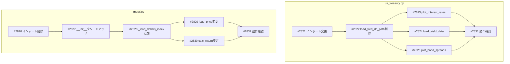

# FRED Cache移行タスク一覧

## 概要

SQLiteからHistoricalCache(JSON)へのFREDデータソース移行タスク。

## タスク一覧

| # | タスク | ファイル | Issue | 依存 | 見積 |
|---|--------|----------|-------|------|------|
| 1 | インポート変更 | us_treasury.py | [#2821](https://github.com/YH-05/finance/issues/2821) | - | 15分 |
| 2 | load_fred_db_path削除 | us_treasury.py | [#2822](https://github.com/YH-05/finance/issues/2822) | #1 | 10分 |
| 3 | plot_us_interest_rates_and_spread変更 | us_treasury.py | [#2823](https://github.com/YH-05/finance/issues/2823) | #1, #2 | 30分 |
| 4 | load_yield_data変更・リネーム | us_treasury.py | [#2824](https://github.com/YH-05/finance/issues/2824) | #1, #2 | 30分 |
| 5 | plot_us_corporate_bond_spreads変更 | us_treasury.py | [#2825](https://github.com/YH-05/finance/issues/2825) | #1, #2 | 30分 |
| 6 | インポート削除 | metal.py | [#2826](https://github.com/YH-05/finance/issues/2826) | - | 10分 |
| 7 | __init__クリーンアップ | metal.py | [#2827](https://github.com/YH-05/finance/issues/2827) | #6 | 15分 |
| 8 | _load_dollars_indexヘルパー追加 | metal.py | [#2828](https://github.com/YH-05/finance/issues/2828) | #7 | 20分 |
| 9 | load_price変更 | metal.py | [#2829](https://github.com/YH-05/finance/issues/2829) | #8 | 20分 |
| 10 | calc_return変更 | metal.py | [#2830](https://github.com/YH-05/finance/issues/2830) | #8 | 20分 |
| 11 | us_treasury.py動作確認 | - | [#2831](https://github.com/YH-05/finance/issues/2831) | #3, #4, #5 | 30分 |
| 12 | metal.py動作確認 | - | [#2832](https://github.com/YH-05/finance/issues/2832) | #9, #10 | 30分 |

**合計見積もり時間**: 約4時間10分

## 依存関係グラフ



## 並行開発グループ（Wave分析）

### Wave 1（並行開発可能）
- #2821: us_treasury.py インポート変更
- #2826: metal.py インポート削除

### Wave 2（Wave 1完了後）
- #2822: load_fred_db_path削除
- #2827: __init__クリーンアップ

### Wave 3（Wave 2完了後）
- #2823, #2824, #2825: us_treasury.py関数変更（並行可能）
- #2828: _load_dollars_indexヘルパー追加

### Wave 4（Wave 3完了後）
- #2829, #2830: metal.pyメソッド変更（並行可能）

### Wave 5（Wave 4完了後）
- #2831: us_treasury.py動作確認
- #2832: metal.py動作確認

## 前提条件

以下のシリーズがキャッシュされている必要があります：

| シリーズID | 用途 |
|------------|------|
| DFF, DGS1MO〜DGS30 | 金利・イールドカーブ |
| T10Y3M, T10Y2Y | イールドスプレッド |
| BAMLC0A*, BAMLH0A* | 社債スプレッド |
| DTWEXAFEGS | ドル指数 |

キャッシュ同期コマンド：
```bash
uv run python -m market.fred.scripts.sync_historical --all
```

## 関連ドキュメント

- [実装計画](../fred-cache-migration-plan.md)
