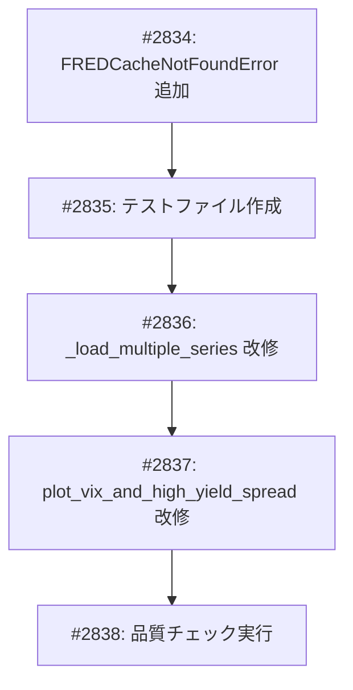

# VIXプロットエラーハンドリング強化 - タスク一覧

**GitHub Project**: [#30](https://github.com/users/YH-05/projects/30)
**Project ID**: PVT_kwHOBoK6AM4BOEfv

## タスク依存関係グラフ



## タスク一覧

### タスク 1: FREDCacheNotFoundError エラークラス追加
- Issue: [#2834](https://github.com/YH-05/finance/issues/2834)
- ファイル: `src/market/errors.py`
- 優先度: high
- ステータス: todo
- 依存関係: なし
- 見積もり: 30分
- 説明: FREDキャッシュにデータがない場合に発生するエラークラスを追加
- 受け入れ条件:
  - [ ] `FREDCacheNotFoundError` クラスが `FREDFetchError` を継承
  - [ ] `series_ids` パラメータで欠損シリーズIDを保持
  - [ ] エラーメッセージにシリーズIDと復旧方法（sync_series コマンド）を含む
  - [ ] `__all__` に追加してエクスポート

### タスク 2: テストファイル作成（TDD: Red）
- Issue: [#2835](https://github.com/YH-05/finance/issues/2835)
- ファイル: `tests/analyze/unit/reporting/test_vix.py`
- 優先度: high
- ステータス: todo
- 依存関係: [#2834](https://github.com/YH-05/finance/issues/2834)
- 見積もり: 45分
- 説明: TDDのRedフェーズとしてテストを先に作成
- 受け入れ条件:
  - [ ] `TestLoadMultipleSeries` クラス作成
  - [ ] `test_正常系_複数シリーズを結合できる` テスト
  - [ ] `test_異常系_全シリーズ失敗でエラー` テスト
  - [ ] `test_エッジケース_部分欠損で警告つき成功` テスト
  - [ ] HistoricalCache をモック化
  - [ ] テストが失敗することを確認（Red）

### タスク 3: _load_multiple_series 関数改修（TDD: Green）
- Issue: [#2836](https://github.com/YH-05/finance/issues/2836)
- ファイル: `src/analyze/reporting/vix.py`
- 優先度: high
- ステータス: todo
- 依存関係: [#2835](https://github.com/YH-05/finance/issues/2835)
- 見積もり: 45分
- 説明: TDDのGreenフェーズとして実装を修正しテストを通す
- 受け入れ条件:
  - [ ] `FREDCacheNotFoundError` インポート追加
  - [ ] `get_logger` によるロガー設定
  - [ ] 各シリーズ取得時のデバッグログ
  - [ ] 欠損シリーズの警告ログ
  - [ ] 全シリーズ失敗時に `FREDCacheNotFoundError` を送出
  - [ ] カラム名を明示的に設定（`date`, `value`）
  - [ ] タスク 2 のテストが全て通ること（Green）

### タスク 4: plot_vix_and_high_yield_spread 関数改修
- Issue: [#2837](https://github.com/YH-05/finance/issues/2837)
- ファイル: `src/analyze/reporting/vix.py`
- 優先度: medium
- ステータス: todo
- 依存関係: [#2836](https://github.com/YH-05/finance/issues/2836)
- 見積もり: 30分
- 説明: プロット関数にバリデーションとエラーハンドリングを追加
- 受け入れ条件:
  - [ ] 関数開始時の情報ログ
  - [ ] `FREDCacheNotFoundError` の catch & re-raise
  - [ ] pivot 前のカラム検証（`date`, `variable`, `value`）
  - [ ] pivot 後のシリーズ検証
  - [ ] 戻り値の型ヒントを `go.Figure | None` に変更
  - [ ] Docstring に `Raises` セクション追加

### タスク 5: 品質チェック実行
- Issue: [#2838](https://github.com/YH-05/finance/issues/2838)
- ファイル: 全体
- 優先度: medium
- ステータス: todo
- 依存関係: [#2837](https://github.com/YH-05/finance/issues/2837)
- 見積もり: 15分
- 説明: `make check-all` で品質確認を実施
- 受け入れ条件:
  - [ ] `make format` が成功
  - [ ] `make lint` が成功（エラー・警告なし）
  - [ ] `make typecheck` が成功
  - [ ] `make test` が成功（新規テスト含む）
  - [ ] 手動検証: キャッシュなし状態で適切なエラーメッセージ表示

## 実装順序

1. [#2834](https://github.com/YH-05/finance/issues/2834): エラークラス追加（基盤）
2. [#2835](https://github.com/YH-05/finance/issues/2835): テスト作成（TDD: Red）
3. [#2836](https://github.com/YH-05/finance/issues/2836): `_load_multiple_series` 改修（TDD: Green）
4. [#2837](https://github.com/YH-05/finance/issues/2837): `plot_vix_and_high_yield_spread` 改修
5. [#2838](https://github.com/YH-05/finance/issues/2838): 品質チェック

## 検証コマンド

```bash
# 個別テスト実行
uv run pytest tests/analyze/unit/reporting/test_vix.py -v

# 全体品質チェック
make check-all

# 手動検証（キャッシュなしの状態で）
python -c "from analyze.reporting.vix import plot_vix_and_high_yield_spread; plot_vix_and_high_yield_spread()"
# → FREDCacheNotFoundError が適切なメッセージで発生することを確認
```

## 見積もり合計

| タスク | 見積もり |
|--------|----------|
| #2834 | 30分 |
| #2835 | 45分 |
| #2836 | 45分 |
| #2837 | 30分 |
| #2838 | 15分 |
| **合計** | **2時間45分** |
