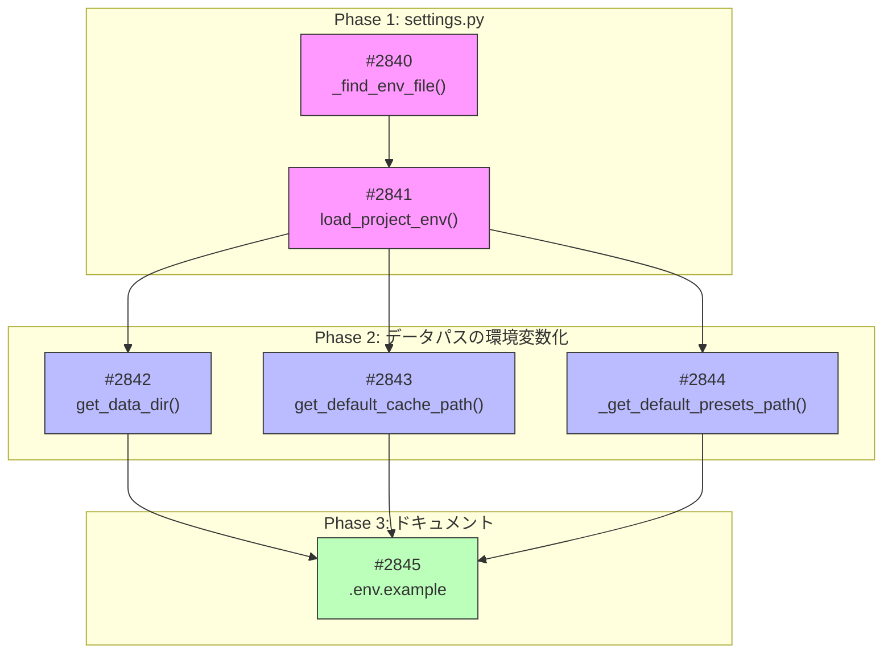

# Project #31: 環境変数読み込み問題の修正 - タスク一覧

**GitHub Project**: [#31](https://github.com/users/YH-05/projects/31)

## 概要

`utils_core/settings.py` で `__file__` ベースのパス解決を使用しているため、パッケージを site-packages にインストールすると `.env` ファイルが見つからない問題を修正する。

## タスク一覧

| # | Issue | タイトル | ステータス | 見積もり |
|---|-------|----------|------------|----------|
| 01 | [#2840](https://github.com/YH-05/finance/issues/2840) | settings.py に _find_env_file() 関数を追加 | Todo | 1時間 |
| 02 | [#2841](https://github.com/YH-05/finance/issues/2841) | settings.py の load_project_env() を修正 | Todo | 30分 |
| 03 | [#2842](https://github.com/YH-05/finance/issues/2842) | connection.py に get_data_dir() 関数を追加 | Todo | 1時間 |
| 04 | [#2843](https://github.com/YH-05/finance/issues/2843) | historical_cache.py の get_default_cache_path() を修正 | Todo | 30分 |
| 05 | [#2844](https://github.com/YH-05/finance/issues/2844) | fetcher.py に _get_default_presets_path() 関数を追加 | Todo | 30分 |
| 06 | [#2845](https://github.com/YH-05/finance/issues/2845) | .env.example にパス設定オプションを追加 | Todo | 15分 |

**合計見積もり**: 3時間45分

## 依存関係グラフ

## 実装順序

### Wave 1（開始可能）
- [#2840](https://github.com/YH-05/finance/issues/2840): settings.py に _find_env_file() 関数を追加

### Wave 2（Wave 1 完了後）
- [#2841](https://github.com/YH-05/finance/issues/2841): settings.py の load_project_env() を修正

### Wave 3（Wave 2 完了後、並行開発可能）
- [#2842](https://github.com/YH-05/finance/issues/2842): connection.py に get_data_dir() 関数を追加
- [#2843](https://github.com/YH-05/finance/issues/2843): historical_cache.py の get_default_cache_path() を修正
- [#2844](https://github.com/YH-05/finance/issues/2844): fetcher.py に _get_default_presets_path() 関数を追加

### Wave 4（Wave 3 完了後）
- [#2845](https://github.com/YH-05/finance/issues/2845): .env.example にパス設定オプションを追加

## 修正対象ファイル

| ファイル | タスク | 変更内容 |
|----------|--------|----------|
| `src/utils_core/settings.py` | #2840, #2841 | `_find_env_file()` 追加、`load_project_env()` 修正 |
| `src/database/db/connection.py` | #2842 | `get_data_dir()` 追加 |
| `src/market/fred/historical_cache.py` | #2843 | `get_default_cache_path()` 修正 |
| `src/market/fred/fetcher.py` | #2844 | `_get_default_presets_path()` 追加 |
| `.env.example` | #2845 | パス設定オプション追加 |

## タスクファイル

- [task-01-find-env-file.md](./task-01-find-env-file.md)
- [task-02-load-project-env.md](./task-02-load-project-env.md)
- [task-03-get-data-dir.md](./task-03-get-data-dir.md)
- [task-04-cache-path.md](./task-04-cache-path.md)
- [task-05-presets-path.md](./task-05-presets-path.md)
- [task-06-env-example.md](./task-06-env-example.md)
