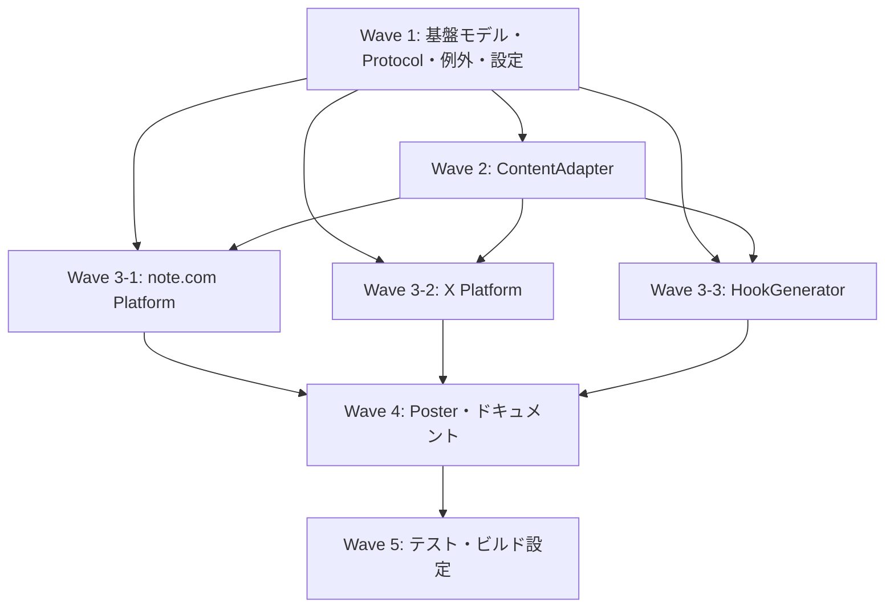

# sns パッケージ — SNS投稿・発信自動化

**作成日**: 2026-02-08
**ステータス**: 計画中
**タイプ**: package
**GitHub Project**: （未作成）

## 背景と目的

### 背景

現状、金融記事作成ワークフロー（`/finance-full`）の出力は GitHub Issues への投稿のみであり、note.com や X(Twitter) への投稿機能は存在しない。記事の完成後、手動で各 SNS プラットフォームにコピペしている状態。

既存の `news` パッケージの SinkProtocol パターンと `rss` パッケージの HTTP クライアントパターンが確立されており、これらを再利用してプラグイン方式のプラットフォーム抽象化を実現できる基盤がある。

### 目的

`src/sns` パッケージを新規作成し、金融記事・週次レポート・ニュース速報を note.com と X(Twitter) に投稿する機能を提供する。

### 成功基準

- [ ] CLI コマンド（`/sns-post`）で金融記事を note.com と X に投稿できる
- [ ] note.com への Playwright 自動投稿と、失敗時の Markdown フォールバックが動作する
- [ ] X API v2 経由でフック文 + URL + ハッシュタグのツイートを投稿できる
- [ ] Claude Agent SDK でプラットフォーム別のフック文を自動生成できる
- [ ] `make check-all` が全て成功する

## リサーチ結果

### 既存パターン

- **SinkProtocol パターン** (`src/news/core/sink.py`): 出力先の抽象化。`@runtime_checkable` Protocol で GitHubSink, FileSink が実装済み
- **httpx AsyncClient パターン** (`src/rss/core/http_client.py`): 指数バックオフリトライ（1s, 2s, 4s、最大3回）、4xx は即座に失敗
- **article-meta.json メタデータ駆動**: 記事のタイトル・カテゴリ・タグ・ステータスを JSON で管理
- **Claude Agent SDK による AI 生成** (`src/news/summarizer.py`): 要約生成パターン。フック文生成に応用可能
- **snippets テンプレート** (`snippets/sns-announcement.md`): SNS 告知テンプレートが既に存在

### 参考実装

| ファイル | 参考にすべき点 |
|---------|---------------|
| `src/news/core/sink.py` | PlatformProtocol の設計パターン（SinkProtocol, SinkType） |
| `src/news/core/article.py` | SnsPost モデルの Pydantic 構造（フィールド設計、ロギング） |
| `src/news/core/result.py` | PostResult の構造 |
| `src/news/summarizer.py` | HookGenerator の Claude Agent SDK パターン |
| `src/rss/core/http_client.py` | X API v2 の httpx リトライパターン |
| `src/rss/exceptions.py` | 例外階層パターン（7種類のカスタム例外） |
| `src/news/__init__.py` | パッケージ公開 API パターン（`__all__`, `get_logger`） |
| `snippets/sns-announcement.md` | SNS 告知テンプレート |

### 技術的考慮事項

- note.com には公式 API が存在しない（2025年時点）。Playwright ブラウザ自動化が必要だが、UI 変更に脆弱
- X API v2 にはレート制限あり（300 posts/3h）。指数バックオフとインターバル設定が必要
- Playwright は optional dependency として既に pyproject.toml に設定済み

## 実装計画

### アーキテクチャ概要

```
入力データソース                     変換層                        出力層
─────────────────────────────────────────────────────────────────────────────
articles/{id}/article-meta.json  ─┐
articles/{id}/02_edit/revised_draft.md ─→ ContentAdapter ─→ SnsPost ─→ HookGenerator ─→ SnsPost(with hook)
weekly_report/{date}/...         ─┘                                       │
                                                                          ├─→ NotePlatform (Playwright/Markdown)
                                                                          └─→ XPlatform (X API v2)
```

**コアコンセプト:**
1. **PlatformProtocol** — `news/core/sink.py` の SinkProtocol に相当。投稿先の抽象化
2. **ContentAdapter** — 各コンテンツタイプ（記事/レポート/速報）→ 統一 `SnsPost` への変換
3. **HookGenerator** — Claude Agent SDK でプラットフォーム別フック文を自動生成

### ディレクトリ構造

```
src/sns/
├── __init__.py           # 公開API
├── py.typed              # PEP 561
├── README.md             # ドキュメント
├── types.py              # 型定義
├── errors.py             # 例外階層
├── config.py             # 設定（Pydantic）
├── core/
│   ├── __init__.py
│   ├── platform.py       # PlatformProtocol
│   ├── post.py           # SnsPost 統一モデル
│   └── result.py         # PostResult
├── adapters/
│   ├── __init__.py
│   ├── article.py        # 金融記事 → SnsPost
│   ├── weekly_report.py  # 週次レポート → SnsPost
│   └── news_flash.py     # ニュース速報 → SnsPost
├── platforms/
│   ├── __init__.py
│   ├── note.py           # note.com（Playwright + Markdown フォールバック）
│   └── x.py              # X API v2
├── hook_generator.py     # Claude Agent SDK フック文生成
└── poster.py             # 投稿オーケストレーター
```

### ファイルマップ

| 操作 | ファイルパス | 説明 |
|------|------------|------|
| 新規作成 | `src/sns/__init__.py` | パッケージ公開 API |
| 新規作成 | `src/sns/py.typed` | PEP 561 マーカー |
| 新規作成 | `src/sns/types.py` | 型定義（Enum, type alias） |
| 新規作成 | `src/sns/errors.py` | 例外階層 |
| 新規作成 | `src/sns/config.py` | SnsConfig, NoteConfig, XConfig |
| 新規作成 | `src/sns/core/platform.py` | PlatformProtocol |
| 新規作成 | `src/sns/core/post.py` | SnsPost モデル |
| 新規作成 | `src/sns/core/result.py` | PostResult モデル |
| 新規作成 | `src/sns/adapters/article.py` | 金融記事アダプター |
| 新規作成 | `src/sns/adapters/weekly_report.py` | 週次レポートアダプター |
| 新規作成 | `src/sns/adapters/news_flash.py` | ニュース速報アダプター |
| 新規作成 | `src/sns/platforms/note.py` | note.com 投稿 |
| 新規作成 | `src/sns/platforms/x.py` | X API v2 投稿 |
| 新規作成 | `src/sns/hook_generator.py` | フック文生成 |
| 新規作成 | `src/sns/poster.py` | 投稿オーケストレーター |
| 新規作成 | `src/sns/README.md` | ドキュメント |
| 変更 | `pyproject.toml` | packages に `src/sns` 追加 |

### リスク評価

| リスク | 影響度 | 対策 |
|--------|--------|------|
| note.com UI 変更で Playwright 破綻 | 高 | Markdown フォールバックを常に提供。セレクタを config 化 |
| X API v2 レート制限（300 posts/3h） | 中 | 投稿間隔設定可能化。指数バックオフ |
| note.com ログインセッション管理 | 中 | Cookie ベースのセッション永続化。切れ検知+フォールバック |
| Playwright 依存が重い | 低 | optional dependency として管理（既に設定済み） |

## タスク一覧

### Wave 1（並行開発可能）

- [ ] 基盤モデル・Protocol・例外・設定の実装
  - Issue: （未作成）
  - ステータス: todo
  - ファイル: `core/post.py`, `core/result.py`, `core/platform.py`, `types.py`, `errors.py`, `config.py`, `__init__.py`, `py.typed`

### Wave 2（Wave 1 完了後）

- [ ] ContentAdapter（金融記事・週次レポート・ニュース速報）の実装
  - Issue: （未作成）
  - ステータス: todo
  - 依存: Wave 1
  - ファイル: `adapters/article.py`, `adapters/weekly_report.py`, `adapters/news_flash.py`

### Wave 3（Wave 1, 2 完了後）

- [ ] note.com プラットフォーム実装（Playwright + Markdown フォールバック）
  - Issue: （未作成）
  - ステータス: todo
  - 依存: Wave 1, 2

- [ ] X(Twitter) プラットフォーム実装（X API v2）
  - Issue: （未作成）
  - ステータス: todo
  - 依存: Wave 1, 2

- [ ] HookGenerator（Claude Agent SDK フック文生成）の実装
  - Issue: （未作成）
  - ステータス: todo
  - 依存: Wave 1, 2

### Wave 4（Wave 1-3 完了後）

- [ ] Poster オーケストレーター・ドキュメント
  - Issue: （未作成）
  - ステータス: todo
  - 依存: Wave 1-3

### Wave 5（Wave 1-4 完了後）

- [ ] テストスイート（単体・プロパティ・統合）+ pyproject.toml 修正
  - Issue: （未作成）
  - ステータス: todo
  - 依存: Wave 1-4

## 依存関係図



---

**最終更新**: 2026-02-08
