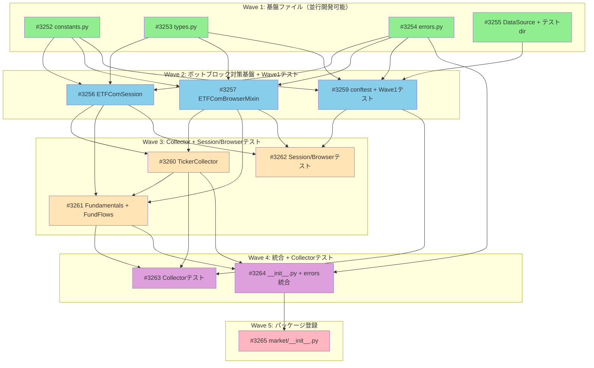

# ETF.com スクレイピングモジュール（market.etfcom）

**作成日**: 2026-02-08
**ステータス**: 計画中
**タイプ**: package
**GitHub Project**: [#36](https://github.com/users/YH-05/projects/36)

## 背景と目的

### 背景

ETF.com は ETF のティッカー一覧、ファンダメンタルデータ、ファンドフローデータを提供する主要な情報源である。既存の実験コード（`src_sample/etf_dot_com.py`、`notebook_sample/etf-dot-com.ipynb`）では Selenium WebDriver と SQLite 直接接続を使用しているが、以下の課題がある:

1. **Selenium 依存**: pyproject.toml に selenium / webdriver-manager が含まれておらず、プロジェクト標準外
2. **SQLite 直接接続**: market パッケージの既存インフラ（cache / export）を使用していない
3. **コード品質**: 実験コードのため、型ヒント・テスト・ロギングが不足
4. **ボットブロック対策**: loading... 問題やデータ安定性チェックが不十分

market パッケージには既に Playwright が optional-dependency として存在し（`src/news/extractors/playwright.py`）、async 対応・headless 設定・エラーハンドリングのパターンが確立済み。また、`src/market/yfinance/session.py` に curl_cffi ベースの TLS フィンガープリント偽装パターンも存在する。

### 目的

ETF.com から全 ETF のティッカー一覧、ファンダメンタルデータ、ファンドフローデータを取得するモジュールを `src/market/etfcom/` に新規作成する。market パッケージの既存パターン（DataCollector 継承、サブモジュール構成、structlog ロギング）に準拠し、ボットブロック対策としてマルチレイヤー戦略を採用する。

### 成功基準

- [ ] `from market.etfcom import TickerCollector, FundamentalsCollector, FundFlowsCollector` が動作すること
- [ ] 3 つの Collector 全てが `DataCollector` 基底クラスを継承し、`fetch()` / `validate()` / `collect()` インターフェースに準拠すること
- [ ] curl_cffi による TLS フィンガープリント偽装 + Playwright stealth によるボットブロック対策が実装されていること
- [ ] 全コードに structlog ロギング・型ヒント・NumPy Docstring が付与されていること
- [ ] `make check-all` が成功すること（format, lint, typecheck, test）
- [ ] 単体テストが全件パスすること

## ユーザー決定事項

| 質問 | 決定 | 詳細 |
|------|------|------|
| ブラウザ自動化技術 | **Playwright** | 既に pyproject.toml に含まれており、`src/news/extractors/playwright.py` に先行実装あり。Selenium は不採用 |
| クラス設計 | **3クラス分割** | TickerCollector / FundamentalsCollector / FundFlowsCollector それぞれ DataCollector 継承 |
| データ保存 | **呼び出し側に委譲** | モジュールは DataFrame 返却のみ。保存ロジックはモジュール外で実装 |
| ボットブロック対策 | **curl_cffi + Playwright stealth** | curl_cffi を第一選択、JS レンダリング必要時のみ Playwright にフォールバック |

## リサーチ結果

### 既存パターン

| パターン | 説明 | 適用 |
|---------|------|------|
| DataCollector 基底クラス継承 | ABC の DataCollector を継承し、`fetch()` / `validate()` / `collect()` を実装 | 3 つの Collector 全てに適用 |
| サブモジュールディレクトリ構成 | `__init__.py` + `fetcher.py` + `types.py` の 3 ファイル構成 | etfcom ディレクトリ構成に適用 |
| FetchOptions dataclass パターン | `@dataclass(frozen=True)` ベースの設定クラス | ScrapingConfig / RetryConfig に適用 |
| エラー階層パターン | `MarketError > DataFetchError / ValidationError` の継承構造 | ETFCom エラー階層に適用 |
| Playwright optional import パターン | `try/except ImportError` で lazy import | ETFComBrowserMixin に適用 |
| structlog ロギングパターン | `get_logger(__name__)` + キーワード引数コンテキスト | 全モジュールに適用 |
| curl_cffi TLS 偽装パターン | CurlCffiSession + impersonate パラメータ | ETFComSession に適用 |
| セッションローテーションパターン | 失敗時に偽装ターゲット切り替え | ETFComSession.rotate_session() に適用 |

### 参考実装

| ファイル | 参考にすべき点 |
|---------|---------------|
| `src/market/base_collector.py` | DataCollector ABC。fetch/validate/collect インターフェース |
| `src/market/tsa.py` | DataCollector 継承の Web スクレイピング実装例。structlog ロギング |
| `src/market/yfinance/types.py` | FetchOptions dataclass パターン（frozen=True） |
| `src/market/yfinance/session.py` | CurlCffiSession パターン（TLS フィンガープリント偽装） |
| `src/market/yfinance/fetcher.py` | セッションローテーション（_rotate_session）パターン |
| `src/market/fred/constants.py` | 定数定義パターン（typing.Final + __all__） |
| `src/market/errors.py` | エラー階層パターン（ErrorCode enum、to_dict()） |
| `src/news/extractors/playwright.py` | Playwright async context manager、optional import、CSS selector fallback |
| `tests/market/unit/tsa/test_tsa.py` | HTTP モックテストパターン（日本語テスト名） |
| `tests/market/unit/test_base_collector.py` | DataCollector テストパターン |

### 技術的考慮事項

1. **同期/非同期の混在**: DataCollector.fetch() は同期インターフェースだが、Playwright は async API。TickerCollector では `asyncio.run()` でブリッジする。Jupyter Notebook 等で nested event loop 問題が発生する可能性あり
2. **CSS セレクタの脆弱性**: ETF.com の HTML 構造はサイト更新で変わる可能性がある。CSS セレクタを constants.py に集約し、複数セレクタの fallback 機構で対応
3. **loading... 問題**: 移植元コードでも一部ティッカーで loading... が残る問題あり。安定性チェック + リトライで改善

## 実装計画

### アーキテクチャ概要

ETF.com からデータを取得するために、5 層のボットブロック対策を備えたマルチレイヤー設計を採用する。

```
呼び出し側
  |
  v
Collector.collect(**kwargs)
  |
  v
Collector.fetch(**kwargs)
  |
  +---> [curl_cffi (ETFComSession)]
  |       TLS フィンガープリント偽装
  |       User-Agent ローテーション
  |       ポライトディレイ + ジッター
  |       |
  |       +---> 成功: HTML レスポンス
  |       +---> 失敗(403/429/空): フォールバック
  |
  +---> [Playwright (ETFComBrowserMixin)]
          stealth context (viewport/UA/init_script)
          navigator.webdriver=false
          networkidle 待機
          |
          +---> HTML レスポンス
  |
  v
BeautifulSoup/CSS セレクタでパース
  |
  v
pd.DataFrame 生成
  |
  v
Collector.validate(df)
  |
  v
呼び出し側に DataFrame 返却
```

### コンポーネント構成

| コンポーネント | 種別 | 説明 |
|---------------|------|------|
| **ETFComSession** | HTTP セッション | curl_cffi ベースの HTTP セッション。TLS 偽装、User-Agent ローテーション、ポライトディレイ、リトライ |
| **ETFComBrowserMixin** | ブラウザ操作 | Playwright stealth 設定、ナビゲーション、クッキー同意処理、ページネーション |
| **TickerCollector** | Collector | スクリーナーページから ETF 一覧取得。JS 必須のため Playwright 使用 |
| **FundamentalsCollector** | Collector | プロファイルページからファンダメンタルデータ取得。curl_cffi 優先 |
| **FundFlowsCollector** | Collector | Fund Flows ページからフローデータ取得。curl_cffi 優先 |
| **types** | 型定義 | ScrapingConfig, RetryConfig, FundamentalsRecord, FundFlowRecord, ETFRecord |
| **constants** | 定数 | URL パターン、CSS セレクタ、User-Agent リスト、stealth 設定 |
| **errors** | エラー | ETFComError, ETFComScrapingError, ETFComTimeoutError, ETFComBlockedError |

### ボットブロック対策（5 層構造）

| 層 | 対策 | 説明 |
|----|------|------|
| 1 | **TLS フィンガープリント偽装** | curl_cffi の `impersonate` パラメータで Chrome/Edge/Safari の TLS 接続を模倣 |
| 2 | **Playwright stealth** | `navigator.webdriver=false`、WebGL vendor/renderer 偽装、chrome.runtime 偽装の JS 注入 |
| 3 | **User-Agent ローテーション** | 10 種類以上のリアルブラウザ UA 文字列からランダム選択 |
| 4 | **セッション/コンテキストローテーション** | 失敗時に偽装ターゲット切り替え（curl_cffi）またはブラウザコンテキスト再生成（Playwright） |
| 5 | **ポライトディレイ + ジッター** | リクエスト間隔 2.0 秒 + ランダムジッター 0-1.0 秒 |

### ファイルマップ

| 操作 | ファイルパス | Wave | 説明 |
|------|------------|------|------|
| 新規作成 | `src/market/etfcom/constants.py` | 1 | 定数定義（URL、CSS セレクタ、User-Agent、stealth 設定） |
| 新規作成 | `src/market/etfcom/errors.py` | 1 | エラークラス（ETFComError 階層） |
| 新規作成 | `src/market/etfcom/types.py` | 1 | 型定義（ScrapingConfig, RetryConfig, Record 類） |
| 変更 | `src/market/types.py` | 1 | DataSource enum に ETF_COM 追加 |
| 新規作成 | `tests/market/etfcom/__init__.py` | 1 | テストパッケージ初期化（空ファイル） |
| 新規作成 | `tests/market/etfcom/unit/__init__.py` | 1 | 単体テストパッケージ初期化（空ファイル） |
| 新規作成 | `src/market/etfcom/session.py` | 2 | curl_cffi HTTP セッション（TLS 偽装、ローテーション、リトライ） |
| 新規作成 | `src/market/etfcom/browser.py` | 2 | Playwright ブラウザ Mixin（stealth、ナビゲーション、ページネーション） |
| 新規作成 | `tests/market/etfcom/conftest.py` | 2 | テストフィクスチャ（モック HTML、ScrapingConfig、モックセッション） |
| 新規作成 | `tests/market/etfcom/unit/test_types.py` | 2 | types.py の単体テスト |
| 新規作成 | `tests/market/etfcom/unit/test_errors.py` | 2 | errors.py の単体テスト |
| 新規作成 | `tests/market/etfcom/unit/test_constants.py` | 2 | constants.py の単体テスト |
| 新規作成 | `src/market/etfcom/collectors.py` | 3 | 3 つの Collector クラス（TickerCollector, FundamentalsCollector, FundFlowsCollector） |
| 新規作成 | `tests/market/etfcom/unit/test_session.py` | 3 | ETFComSession の単体テスト |
| 新規作成 | `tests/market/etfcom/unit/test_browser.py` | 3 | ETFComBrowserMixin の単体テスト |
| 新規作成 | `tests/market/etfcom/unit/test_collectors.py` | 4 | Collector 群の単体テスト |
| 新規作成 | `src/market/etfcom/__init__.py` | 4 | etfcom パッケージ公開 API |
| 変更 | `src/market/errors.py` | 4 | ETFCom エラーの re-export 統合（ErrorCode 追加） |
| 変更 | `src/market/__init__.py` | 5 | etfcom モジュールの公開 API 登録 |

### リスク評価

| リスク | カテゴリ | 影響度 | 対策 |
|--------|---------|--------|------|
| CSS セレクタがサイト更新で変更される | dependency | 高 | CSS セレクタを constants.py に集約し変更箇所を 1 ファイルに限定。複数セレクタの fallback 機構を実装。テストではリアルページから取得したモック HTML を conftest.py に保持 |
| curl_cffi + Playwright stealth でボットブロック突破できない | dependency | 高 | 5 層のマルチレイヤー対策を全て実装。ETFComBlockedError で明確にブロック検出を通知。ScrapingConfig で将来的に Proxy ローテーション等の拡張が可能な設計 |
| asyncio.run() と既存イベントループの競合（Jupyter 等） | compatibility | 中 | nest_asyncio の適用を検討。async 版 _async_fetch() も公開。FundamentalsCollector/FundFlowsCollector は curl_cffi（同期）を第一選択で asyncio.run() を回避 |
| 同期/非同期コードの混在による複雑性 | complexity | 中 | ETFComSession（同期）と ETFComBrowserMixin（非同期）を明確に分離。_get_html() で使い分ける共通パターンを確立 |
| curl_cffi + Playwright の混在テスト構築 | testing | 中 | conftest.py に mock_session（MagicMock）と mock_browser（AsyncMock）を定義し、コンストラクタ注入でテスト |
| ETF.com ページ構造調査の不確実性 | schedule | 中 | Wave 1-2 を先に完成させ、Wave 3 で実際のページ調査と並行開発。TickerCollector を最初に完成させてパターン確立 |

## タスク一覧

| ISSUE ID | Issue | Wave | タイトル | 種別 | 工数 | 依存 |
|----------|-------|------|---------|------|------|------|
| ISSUE-001 | [#3252](https://github.com/YH-05/finance/issues/3252) | 1 | ETF.com モジュールの定数定義（constants.py）の作成 | feature | 1h | なし |
| ISSUE-002 | [#3253](https://github.com/YH-05/finance/issues/3253) | 1 | ETF.com モジュールの型定義（types.py）の作成 | feature | 1h | なし |
| ISSUE-003 | [#3254](https://github.com/YH-05/finance/issues/3254) | 1 | ETF.com モジュールのエラークラス（errors.py）の作成 | feature | 0.5h | なし |
| ISSUE-004 | [#3255](https://github.com/YH-05/finance/issues/3255) | 1 | DataSource enum への ETF_COM 追加とテストディレクトリ構造の作成 | feature | 0.5h | なし |
| ISSUE-005 | [#3256](https://github.com/YH-05/finance/issues/3256) | 2 | ETFComSession（curl_cffi HTTP セッション）の実装 | feature | 1.5h | #3252, #3253, #3254 |
| ISSUE-006 | [#3257](https://github.com/YH-05/finance/issues/3257) | 2 | ETFComBrowserMixin（Playwright ブラウザ操作 Mixin）の実装 | feature | 2h | #3252, #3253, #3254 |
| ISSUE-007 | [#3259](https://github.com/YH-05/finance/issues/3259) | 2 | テストフィクスチャ（conftest.py）と Wave1 ファイルの単体テスト作成 | test | 2h | #3252, #3253, #3254, #3255 |
| ISSUE-008 | [#3260](https://github.com/YH-05/finance/issues/3260) | 3 | TickerCollector の実装（ETF ティッカー一覧取得） | feature | 2h | #3256, #3257 |
| ISSUE-009 | [#3261](https://github.com/YH-05/finance/issues/3261) | 3 | FundamentalsCollector + FundFlowsCollector の実装 | feature | 2h | #3256, #3257, #3260 |
| ISSUE-010 | [#3262](https://github.com/YH-05/finance/issues/3262) | 3 | ETFComSession と ETFComBrowserMixin の単体テスト作成 | test | 2h | #3256, #3257, #3259 |
| ISSUE-011 | [#3263](https://github.com/YH-05/finance/issues/3263) | 4 | Collector 群の単体テスト作成（test_collectors.py） | test | 2h | #3259, #3260, #3261 |
| ISSUE-012 | [#3264](https://github.com/YH-05/finance/issues/3264) | 4 | etfcom パッケージ __init__.py の作成と market/errors.py へのエラー統合 | feature | 1h | #3254, #3260, #3261 |
| ISSUE-013 | [#3265](https://github.com/YH-05/finance/issues/3265) | 5 | market パッケージへの etfcom モジュール登録 | feature | 0.5h | #3264 |

### Wave 1（並行開発可能）

- [ ] ETF.com モジュールの定数定義（constants.py）の作成
  - Issue: [#3252](https://github.com/YH-05/finance/issues/3252)
  - ステータス: todo
  - 見積もり: 1h

- [ ] ETF.com モジュールの型定義（types.py）の作成
  - Issue: [#3253](https://github.com/YH-05/finance/issues/3253)
  - ステータス: todo
  - 見積もり: 1h

- [ ] ETF.com モジュールのエラークラス（errors.py）の作成
  - Issue: [#3254](https://github.com/YH-05/finance/issues/3254)
  - ステータス: todo
  - 見積もり: 0.5h

- [ ] DataSource enum への ETF_COM 追加とテストディレクトリ構造の作成
  - Issue: [#3255](https://github.com/YH-05/finance/issues/3255)
  - ステータス: todo
  - 見積もり: 0.5h

### Wave 2（Wave 1 完了後）

- [ ] ETFComSession（curl_cffi HTTP セッション）の実装
  - Issue: [#3256](https://github.com/YH-05/finance/issues/3256)
  - ステータス: todo
  - 依存: #3252, #3253, #3254
  - 見積もり: 1.5h

- [ ] ETFComBrowserMixin（Playwright ブラウザ操作 Mixin）の実装
  - Issue: [#3257](https://github.com/YH-05/finance/issues/3257)
  - ステータス: todo
  - 依存: #3252, #3253, #3254
  - 見積もり: 2h

- [ ] テストフィクスチャ（conftest.py）と Wave1 ファイルの単体テスト作成
  - Issue: [#3259](https://github.com/YH-05/finance/issues/3259)
  - ステータス: todo
  - 依存: #3252, #3253, #3254, #3255
  - 見積もり: 2h

### Wave 3（Wave 2 完了後）

- [ ] TickerCollector の実装（ETF ティッカー一覧取得）
  - Issue: [#3260](https://github.com/YH-05/finance/issues/3260)
  - ステータス: todo
  - 依存: #3256, #3257
  - 見積もり: 2h

- [ ] FundamentalsCollector + FundFlowsCollector の実装
  - Issue: [#3261](https://github.com/YH-05/finance/issues/3261)
  - ステータス: todo
  - 依存: #3256, #3257, #3260
  - 見積もり: 2h

- [ ] ETFComSession と ETFComBrowserMixin の単体テスト作成
  - Issue: [#3262](https://github.com/YH-05/finance/issues/3262)
  - ステータス: todo
  - 依存: #3256, #3257, #3259
  - 見積もり: 2h

### Wave 4（Wave 3 完了後）

- [ ] Collector 群の単体テスト作成（test_collectors.py）
  - Issue: [#3263](https://github.com/YH-05/finance/issues/3263)
  - ステータス: todo
  - 依存: #3259, #3260, #3261
  - 見積もり: 2h

- [ ] etfcom パッケージ __init__.py の作成と market/errors.py へのエラー統合
  - Issue: [#3264](https://github.com/YH-05/finance/issues/3264)
  - ステータス: todo
  - 依存: #3254, #3260, #3261
  - 見積もり: 1h

### Wave 5（Wave 4 完了後）

- [ ] market パッケージへの etfcom モジュール登録
  - Issue: [#3265](https://github.com/YH-05/finance/issues/3265)
  - ステータス: todo
  - 依存: #3264
  - 見積もり: 0.5h

## 依存関係図



### クリティカルパス

```
#3252 (constants.py) --> #3256 (ETFComSession) --> #3260 (TickerCollector) --> #3261 (Fundamentals+FundFlows) --> #3264 (__init__.py+errors) --> #3265 (market登録)
```

## 見積もり

| Wave | 説明 | 工数 |
|------|------|------|
| Wave 1 | 基盤ファイル（定数・型・エラー・DataSource・テストdir） | 3h |
| Wave 2 | ボットブロック対策基盤 + Wave1 テスト | 5.5h |
| Wave 3 | Collector 実装 + Session/Browser テスト | 6h |
| Wave 4 | 統合・公開 API + Collector テスト | 3h |
| Wave 5 | パッケージ登録 | 0.5h |
| **合計** | | **17h** |

---

**最終更新**: 2026-02-08
