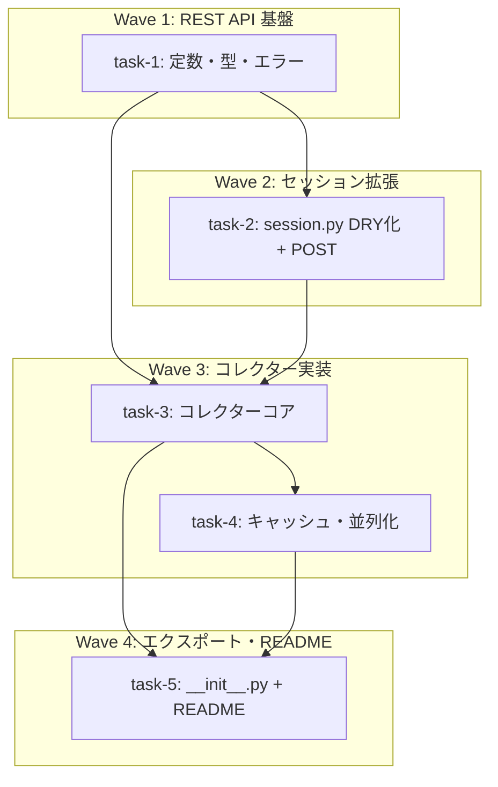

# ETF.com ヒストリカルファンドフロー API

**作成日**: 2026-02-09
**ステータス**: 計画中
**タイプ**: package
**GitHub Project**: [#39](https://github.com/users/YH-05/projects/39)

## 背景と目的

### 背景

現在の `market.etfcom.FundFlowsCollector` は HTML スクレイピングで日次ファンドフローを取得しているが、**3フィールド（date, ticker, net_flows）のみ**で、**ヒストリカル範囲指定も不可**。

調査の結果、ETF.com の内部 REST API（`api-prod.etf.com`）を発見。curl_cffi の TLS fingerprint impersonation で直接アクセス可能であることを28銘柄（大型/セクター/債券/国際/コモディティ/テーマ）で検証済み（成功率100%）。

### 目的

この API を活用し、**約5,000 ETF の設定日〜直近の日次データ（8フィールド）**を取得する `HistoricalFundFlowsCollector` を追加する。

### 成功基準

- [ ] `HistoricalFundFlowsCollector` が単一/複数ティッカーのヒストリカルファンドフローを取得できる
- [ ] 8フィールド（navDate, nav, navChange, navChangePercent, premiumDiscount, fundFlows, sharesOutstanding, aum）を含む DataFrame を返す
- [ ] ファイルキャッシュ付きティッカー解決（TTL 24時間）が動作する
- [ ] asyncio.Semaphore による並列度制限付き並列取得（fetch_multiple）が動作する
- [ ] 既存テスト106ケースに影響がない
- [ ] 新規テスト約65ケースが全てパスする
- [ ] `make check-all` が成功する

## リサーチ結果

### 既存パターン

- **DataCollector ABC 継承**: fetch() + validate() + collect() テンプレートメソッド
- **DI パターン**: session/config をコンストラクタ注入、テスト時にモック差し替え
- **frozen dataclass**: 全レコード型・設定型が `@dataclass(frozen=True)`
- **ETFComSession HTTP フロー**: polite delay → UA rotation → request → block detection
- **エラー階層**: ETFComError → contextual 属性付きサブクラス
- **typing.Final 定数**: カテゴリ別セクション + `__all__`
- **テスト命名**: 日本語 (`test_正常系_条件で結果`) + クラスベースグルーピング

### 参考実装

| ファイル | 参考にすべき点 |
|---------|--------------|
| `src/market/etfcom/collectors.py` | DataCollector 継承、DI パターン、_get_html()、BeautifulSoup パース |
| `src/market/etfcom/session.py` | curl_cffi ベース、TLS impersonation、リトライ、block 検出 |
| `src/market/etfcom/types.py` | frozen dataclass、Optional フィールド |
| `src/market/etfcom/errors.py` | ETFComError 継承、contextual 属性 |
| `src/market/base_collector.py` | DataCollector ABC 定義 |
| `tests/market/etfcom/conftest.py` | delay=0, jitter=0 フィクスチャ |

### 技術的考慮事項

- REST API は Playwright 不要（curl_cffi のみ）
- API にサーバーサイド日付フィルタなし → クライアントサイドフィルタ
- ティッカーリスト5,013件は初回GETが高コスト → ファイルキャッシュで対応
- ヘッダー戦略: caller（post()）が API_HEADERS を kwargs で渡し、`_request()` は共通処理のみ
- API ブロック時: リトライのみ（Playwright フォールバックなし）

## 実装計画

### アーキテクチャ概要

market.etfcom パッケージに REST API ベースの `HistoricalFundFlowsCollector` を追加。既存 `FundFlowsCollector`（HTML スクレイピング）は変更なしで並存。session.py を `_request()` DRY 化リファクタリングし GET/POST の共通処理を統一。

### ファイルマップ

| 操作 | ファイルパス | 説明 |
|------|------------|------|
| modify | `src/market/etfcom/constants.py` | API URL、ヘッダー、キャッシュ TTL、並列度定数追加 (+40行) |
| modify | `src/market/etfcom/types.py` | HistoricalFundFlowRecord(9), TickerInfo(6) 追加 (+80行) |
| modify | `src/market/etfcom/errors.py` | ETFComAPIError(6属性) 追加 (+45行) |
| modify | `src/market/etfcom/session.py` | `_request()` DRY化 + post()/post_with_retry() (+80行) |
| modify | `src/market/etfcom/collectors.py` | HistoricalFundFlowsCollector (+300行) |
| modify | `src/market/etfcom/__init__.py` | 4クラスのエクスポート追加 (+15行) |
| modify | `tests/market/etfcom/unit/test_constants.py` | API定数テスト (~6ケース) |
| modify | `tests/market/etfcom/unit/test_types.py` | 新型テスト (~6ケース) |
| modify | `tests/market/etfcom/unit/test_errors.py` | APIエラーテスト (~4ケース) |
| modify | `tests/market/etfcom/unit/test_session.py` | POST + 後方互換テスト (~15ケース) |
| modify | `tests/market/etfcom/conftest.py` | APIレスポンスフィクスチャ (+80行) |
| create | `tests/market/etfcom/unit/test_historical_fund_flows.py` | コレクター全テスト (~34ケース) |
| modify | `src/market/README.md` | 使用例・API仕様追記 (+60行) |

### リスク評価

| リスク | 影響度 | 対策 |
|--------|--------|------|
| session.py リファクタリングの後方互換性 | 中 | 既存106テスト回帰 + 後方互換テストクラス |
| ETF.com 内部 API の安定性 | 中 | リトライ + エラー属性充実 + レスポンス構造検証 |
| asyncio 並列化のパターン差異 | 中 | 公開IFは同期、内部のみ非同期。既存TickerCollectorと同パターン |
| ファイルキャッシュの複雑性 | 低 | JSON + タイムスタンプ比較、フォールバックあり |
| API モックの正確性 | 低 | 実データ(28銘柄検証済み)ベースのフィクスチャ |

## タスク一覧

### Wave 1（依存なし、即時着手可能）

- [ ] [Wave1] REST API 基盤の追加（定数・型・エラー）
  - Issue: [#3394](https://github.com/YH-05/finance/issues/3394)
  - ステータス: todo
  - 見積もり: 1-1.5h

### Wave 2（Wave 1 完了後）

- [ ] [Wave2] session.py の _request() DRY 化リファクタリングと POST 対応
  - Issue: [#3395](https://github.com/YH-05/finance/issues/3395)
  - ステータス: todo
  - 依存: #3394
  - 見積もり: 1.5-2h

### Wave 3（Wave 2 完了後）

- [ ] [Wave3] HistoricalFundFlowsCollector コア実装
  - Issue: [#3396](https://github.com/YH-05/finance/issues/3396)
  - ステータス: todo
  - 依存: #3394, #3395
  - 見積もり: 2-2.5h

- [ ] [Wave3] HistoricalFundFlowsCollector ファイルキャッシュと fetch_multiple 並列化
  - Issue: [#3397](https://github.com/YH-05/finance/issues/3397)
  - ステータス: todo
  - 依存: #3396
  - 見積もり: 1.5-2h

### Wave 4（Wave 3 完了後）

- [ ] [Wave4] パッケージエクスポート追加と README 更新
  - Issue: [#3398](https://github.com/YH-05/finance/issues/3398)
  - ステータス: todo
  - 依存: #3396, #3397
  - 見積もり: 0.5-1h

## 依存関係図

---

**最終更新**: 2026-02-09
