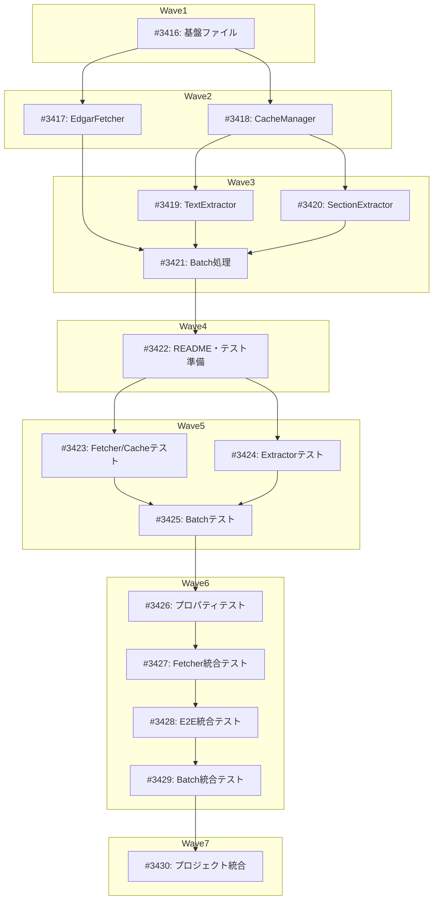

# edgar - SEC Filings抽出パッケージ

**作成日**: 2026-02-10
**ステータス**: 計画中
**タイプ**: package
**GitHub Project**: [#41](https://github.com/users/YH-05/projects/41)

## 背景と目的

### 背景

SEC FilingsからテキストやXBRL財務データを抽出する需要があるが、既存パッケージ（market, news）では対応していない。edgartoolsライブラリを活用することで、10-K, 10-Q, 13-F等の企業開示情報を効率的に取得・解析できる。

### 目的

- edgartoolsをラップした使いやすいインターフェースの提供
- クリーンなテキスト抽出（filing.text()）
- セクション別抽出（Item 1, Item 1A等）
- 複数銘柄の並列抽出機能
- ハイブリッドキャッシュ（edgartools内蔵 + SQLite）

### 成功基準

- [ ] 10-K, 10-Q, 13-FからテキストをクリーンLy抽出できる
- [ ] セクション別抽出が正常に動作する
- [ ] 複数銘柄の並列抽出が実装されている
- [ ] テストカバレッジ 80%以上
- [ ] make check-all が成功する

## リサーチ結果

### 既存パターン

1. **Fetcherパターン**（market パッケージ）
   - 参照: `src/market/yfinance/fetcher.py`, `src/market/fred/fetcher.py`
   - パターン: `fetch()` メソッドで統一インターフェース、リトライ・キャッシュ統合

2. **型定義集約パターン**
   - 参照: `src/market/types.py`
   - パターン: enum・dataclass を types.py に集約

3. **SQLiteキャッシュ実装**
   - 参照: `src/market/fred/cache.py`
   - パターン: TTL対応、UPSERT、ファイルロック管理

4. **テスト3層構造**
   - 参照: `tests/market/unit/`, `tests/market/property/`, `tests/market/integration/`
   - パターン: unit/property/integration の3層構造

### 参考実装

| ファイル | 参考にすべき点 |
|---------|---------------|
| `src/market/yfinance/fetcher.py` | Fetcherパターン、リトライ・エラーハンドリング |
| `src/market/types.py` | enum・dataclassの集約パターン |
| `src/market/fred/cache.py` | SQLiteキャッシュ、TTL、ファイルロック |
| `src/news/extractors/trafilatura.py` | テキスト抽出パターン |

### 技術的考慮事項

- **SEC EDGARレート制限**: edgartoolsの`set_identity()`必須
- **XBRLデータ複雑性**: Wave 3（将来）に延期
- **HTML構造の多様性**: edgartoolsのparse_html()に依存

## 実装計画

### アーキテクチャ概要

新規パッケージ `src/edgar/` を作成。edgartoolsをラップしてSEC Filingsからテキストを抽出。

**データフロー**:
```
CIK/Ticker → EdgarFetcher.fetch() → Filing
→ TextExtractor.extract_text() → クリーンテキスト
→ SectionExtractor.extract_section() → セクション別データ
→ CacheManager → SQLite
```

**並列処理フロー**:
```
CIK/Tickerリスト → BatchFetcher.fetch_batch() → Filingリスト
→ BatchExtractor.extract_text_batch() → 集約結果
```

### ファイルマップ

| Wave | 操作 | ファイルパス | 説明 |
|------|------|------------|------|
| 1 | 新規作成 | `src/edgar/__init__.py` | パッケージ初期化 |
| 1 | 新規作成 | `src/edgar/types.py` | 型定義集約 |
| 1 | 新規作成 | `src/edgar/errors.py` | エラークラス定義 |
| 1 | 新規作成 | `src/edgar/config.py` | 設定管理 |
| 1 | 変更 | `pyproject.toml` | edgartools依存関係追加 |
| 2 | 新規作成 | `src/edgar/fetcher.py` | EdgarFetcher実装 |
| 2 | 新規作成 | `src/edgar/cache/manager.py` | CacheManager実装 |
| 2 | 新規作成 | `src/edgar/cache/__init__.py` | cacheサブパッケージ初期化 |
| 3 | 新規作成 | `src/edgar/extractors/text.py` | TextExtractor実装 |
| 3 | 新規作成 | `src/edgar/extractors/section.py` | SectionExtractor実装 |
| 3 | 新規作成 | `src/edgar/batch.py` | BatchFetcher/BatchExtractor実装 |
| 3 | 新規作成 | `src/edgar/extractors/__init__.py` | extractorsサブパッケージ初期化 |
| 4-6 | 新規作成 | `tests/edgar/*` | テスト（unit/property/integration） |
| 7 | 変更 | `CLAUDE.md` | パッケージ一覧に追加 |
| 7 | 変更 | `README.md` | 依存関係図に追加 |

**合計**: 28ファイル（新規25、修正3）

### リスク評価

| リスク | 影響度 | 対策 |
|--------|--------|------|
| edgartools API変更 | Medium | バージョン固定（^3.0）、アダプターレイヤー |
| SEC EDGARレート制限 | High | set_identity()必須、レート制限遵守 |
| セクション抽出精度 | Medium | edgartools依存、統合テストで検証 |
| 並列処理リソース枯渇 | Medium | max_workers制限、統合テストで検証 |

## タスク一覧

### Wave 1（並行開発可能）

- [ ] [Wave1] 基盤ファイル（型定義・エラークラス・設定）の作成
  - Issue: [#3416](https://github.com/YH-05/finance/issues/3416)
  - ステータス: todo
  - 見積もり: 3〜4時間

### Wave 2（Wave 1 完了後）

- [ ] [Wave2] EdgarFetcher 実装（Filing取得）
  - Issue: [#3417](https://github.com/YH-05/finance/issues/3417)
  - ステータス: todo
  - 依存: #3416
  - 見積もり: 3〜4時間

- [ ] [Wave2] CacheManager 実装（SQLiteキャッシュ）
  - Issue: [#3418](https://github.com/YH-05/finance/issues/3418)
  - ステータス: todo
  - 依存: #3416
  - 見積もり: 4〜5時間

### Wave 3（Wave 2 完了後）

- [ ] [Wave3] TextExtractor 実装（テキスト抽出）
  - Issue: [#3419](https://github.com/YH-05/finance/issues/3419)
  - ステータス: todo
  - 依存: #3418
  - 見積もり: 2.5〜3時間

- [ ] [Wave3] SectionExtractor 実装（セクション抽出）
  - Issue: [#3420](https://github.com/YH-05/finance/issues/3420)
  - ステータス: todo
  - 依存: #3418
  - 見積もり: 3〜4時間

- [ ] [Wave3] Batch処理実装（並列抽出）
  - Issue: [#3421](https://github.com/YH-05/finance/issues/3421)
  - ステータス: todo
  - 依存: #3417, #3419, #3420
  - 見積もり: 6〜7時間

### Wave 4（Wave 3 完了後）

- [ ] [Wave4] README作成とテスト準備
  - Issue: [#3422](https://github.com/YH-05/finance/issues/3422)
  - ステータス: todo
  - 依存: #3421
  - 見積もり: 4〜5時間

### Wave 5（Wave 4 完了後）

- [ ] [Wave5] Fetcher/Cache単体テスト
  - Issue: [#3423](https://github.com/YH-05/finance/issues/3423)
  - ステータス: todo
  - 依存: #3422
  - 見積もり: 5〜6時間

- [ ] [Wave5] Extractor単体テスト
  - Issue: [#3424](https://github.com/YH-05/finance/issues/3424)
  - ステータス: todo
  - 依存: #3422
  - 見積もり: 4〜5時間

- [ ] [Wave5] Batch処理単体テスト
  - Issue: [#3425](https://github.com/YH-05/finance/issues/3425)
  - ステータス: todo
  - 依存: #3423, #3424
  - 見積もり: 4〜5時間

### Wave 6（Wave 5 完了後、逐次実行）

- [ ] [Wave6] プロパティテスト
  - Issue: [#3426](https://github.com/YH-05/finance/issues/3426)
  - ステータス: todo
  - 依存: #3425
  - 見積もり: 2〜3時間

- [ ] [Wave6] 統合テスト（Fetcher実API呼び出し）
  - Issue: [#3427](https://github.com/YH-05/finance/issues/3427)
  - ステータス: todo
  - 依存: #3426
  - 見積もり: 2.5〜3時間

- [ ] [Wave6] エンドツーエンド統合テスト
  - Issue: [#3428](https://github.com/YH-05/finance/issues/3428)
  - ステータス: todo
  - 依存: #3427
  - 見積もり: 3〜4時間

- [ ] [Wave6] Batch処理統合テスト
  - Issue: [#3429](https://github.com/YH-05/finance/issues/3429)
  - ステータス: todo
  - 依存: #3428
  - 見積もり: 3.5〜4時間

### Wave 7（Wave 6 完了後）

- [ ] [Wave7] プロジェクト統合（CLAUDE.md等更新）
  - Issue: [#3430](https://github.com/YH-05/finance/issues/3430)
  - ステータス: todo
  - 依存: #3429
  - 見積もり: 2〜3時間

## 依存関係図



---

**最終更新**: 2026-02-10
