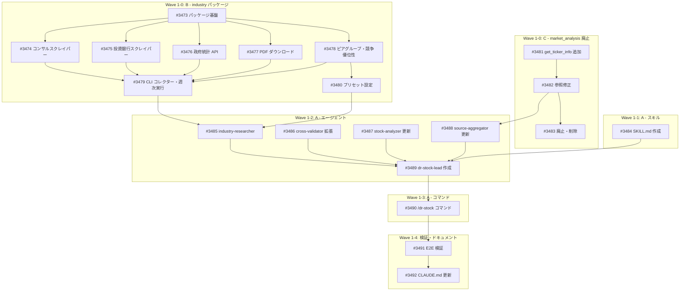

# Project #43: research-restructure: dr-stock 実装

> GitHub Project: https://github.com/users/YH-05/projects/43
> 作成日: 2026-02-11
> 設計書: [dr-stock-lead-design.md](../research-restructure/dr-stock-lead-design.md)
> 統合計画書: [integrated-plan.md](../research-restructure/integrated-plan.md)

## 概要

ディープリサーチエコシステムの再構成における Wave 1（dr-stock）の実装プロジェクト。以下の3つのワークストリームで構成される:

| ストリーム | 親 Issue | 内容 | Issue 数 |
|-----------|---------|------|---------|
| B: industry パッケージ | #3471 | `src/market/industry/` 業界レポート収集パッケージ新規作成 | 8 |
| C: market_analysis 廃止 | #3472 | MarketAnalysisProvider 廃止・MarketDataAnalyzer 統合 | 3 |
| A: dr-stock-lead | - | dr-stock-lead エージェント・スキル・コマンド作成 | 8 |
| D: ドキュメント | - | CLAUDE.md・README.md 更新 | 1 |
| **合計** | | | **20 + 2 親 = 22** |

## Wave 構成

### Wave 1-0: 前提パッケージ（B + C 並列）

B（industry パッケージ）と C（market_analysis 廃止）は独立しており並列実行可能。

### Wave 1-1: スキル定義（A）

dr-stock スキル定義。Wave 1-0 と並列実行可能。

### Wave 1-2: エージェント定義（A）

Wave 1-0 完了後に実行。industry パッケージと参照修正が前提。

### Wave 1-3: コマンド作成（A）

Wave 1-2 完了後に実行。

### Wave 1-4: 検証・ドキュメント

E2E 検証と CLAUDE.md 更新。

## 依存関係図



## Issue 一覧

### B: industry パッケージ (#3471)

| # | Issue | ラベル | 依存 | 状態 |
|---|-------|--------|------|------|
| #3473 | [industry] パッケージ基盤: types, config, BaseScraper | enhancement | - | Todo |
| #3474 | [industry] コンサルスクレイパー (McKinsey, BCG, Deloitte, PwC) | enhancement | #3473 | Todo |
| #3475 | [industry] 投資銀行スクレイパー (Goldman, Morgan Stanley, JP Morgan) | enhancement | #3473 | Todo |
| #3476 | [industry] 政府統計 API クライアント (BLS, Census) | enhancement | #3473 | Todo |
| #3477 | [industry] PDF ダウンロード + テキスト抽出 | enhancement | #3473 | Todo |
| #3478 | [industry] ピアグループ定義 + 競争優位性分析ロジック | enhancement | #3473 | Todo |
| #3479 | [industry] CLI コレクター + APScheduler 週次実行 | enhancement | #3474, #3475, #3476, #3477, #3478 | Todo |
| #3480 | [industry] プリセット設定ファイル (5セクター分) | enhancement | #3478 | Todo |

### C: market_analysis 廃止 (#3472)

| # | Issue | ラベル | 依存 | 状態 |
|---|-------|--------|------|------|
| #3481 | [analyze] MarketDataAnalyzer に get_ticker_info() 追加 | refactor | - | Todo |
| #3482 | [analyze] エージェント/スキル内の market_analysis 参照修正 | refactor | #3481 | Todo |
| #3483 | [analyze] MarketAnalysisProvider 廃止・削除 | refactor | #3481, #3482 | Todo |

### A: dr-stock-lead 実装

| # | Issue | ラベル | 依存 | 状態 |
|---|-------|--------|------|------|
| #3484 | [dr-stock] SKILL.md スキル定義作成 | enhancement | - | Todo |
| #3485 | [dr-stock] industry-researcher エージェント定義作成 | enhancement | #3479, #3480 | Todo |
| #3486 | [dr-stock] dr-cross-validator 拡張（信頼度スコアリング統合） | enhancement | - | Todo |
| #3487 | [dr-stock] dr-stock-analyzer 更新（depth モード削除） | refactor | - | Todo |
| #3488 | [dr-stock] dr-source-aggregator 更新（参照修正 + industry 対応） | refactor | #3482 | Todo |
| #3489 | [dr-stock] dr-stock-lead エージェント定義作成 | enhancement | #3484, #3485, #3486, #3487, #3488 | Todo |
| #3490 | [dr-stock] /dr-stock コマンド作成 | enhancement | #3489 | Todo |
| #3491 | [dr-stock] E2E 検証 | test | #3490 | Todo |

### D: ドキュメント

| # | Issue | ラベル | 依存 | 状態 |
|---|-------|--------|------|------|
| #3492 | [docs] CLAUDE.md・README.md 更新（dr-stock 関連） | documentation | #3491 | Todo |

## クリティカルパス

```
#3473 → #3474/#3475/#3476/#3477/#3478 → #3479 → #3485 → #3489 → #3490 → #3491 → #3492
```

最長パス: 8 ステップ（industry 基盤 → スクレイパー群 → CLI → industry-researcher → Lead → コマンド → E2E → docs）

## 並列実行可能グループ

| グループ | Issues | 前提 |
|---------|--------|------|
| G1: 基盤 | #3473, #3481, #3484 | なし |
| G2: スクレイパー + 参照修正 | #3474, #3475, #3476, #3477, #3478, #3482 | G1 完了 |
| G3: 統合 + エージェント | #3479, #3480, #3483, #3486, #3487, #3488 | G2 完了（部分） |
| G4: Lead + コマンド | #3485, #3489, #3490 | G3 完了 |
| G5: 検証 + Docs | #3491, #3492 | G4 完了 |

## 設計上の重要決定

| 決定事項 | 内容 |
|---------|------|
| 深度モード廃止 | Quick/Standard/Comprehensive を廃止、常にフルパイプライン |
| confidence-scorer 統合 | dr-confidence-scorer を廃止し、dr-cross-validator に統合 |
| visualizer 廃止 | dr-visualizer エージェントを廃止、Bash で Python チャートスクリプト実行 |
| Wikipedia 廃止 | 情報精度不足のため廃止、コンサル/IB レポートスクレイピングに置換 |
| market_analysis 廃止 | MarketAnalysisProvider（0本番import）を廃止、MarketDataAnalyzer に統合 |

## 関連ファイル

| ファイル | 説明 |
|---------|------|
| `docs/project/research-restructure/dr-stock-lead-design.md` | dr-stock-lead 詳細設計書 |
| `docs/project/research-restructure/integrated-plan.md` | リサーチ再構成統合計画書 |
| `src/strategy/providers/market_analysis.py` | 廃止対象: MarketAnalysisProvider |
| `src/analyze/integration/market_integration.py` | 統合先: MarketDataAnalyzer |
| `src/market/etfcom/` | スクレイピングパターン参照元 |
| `src/rss/services/batch_scheduler.py` | APScheduler パターン参照元 |
| `analyst/Competitive_Advantage/analyst_YK/dogma.md` | 競争優位性 12 判断ルール |
