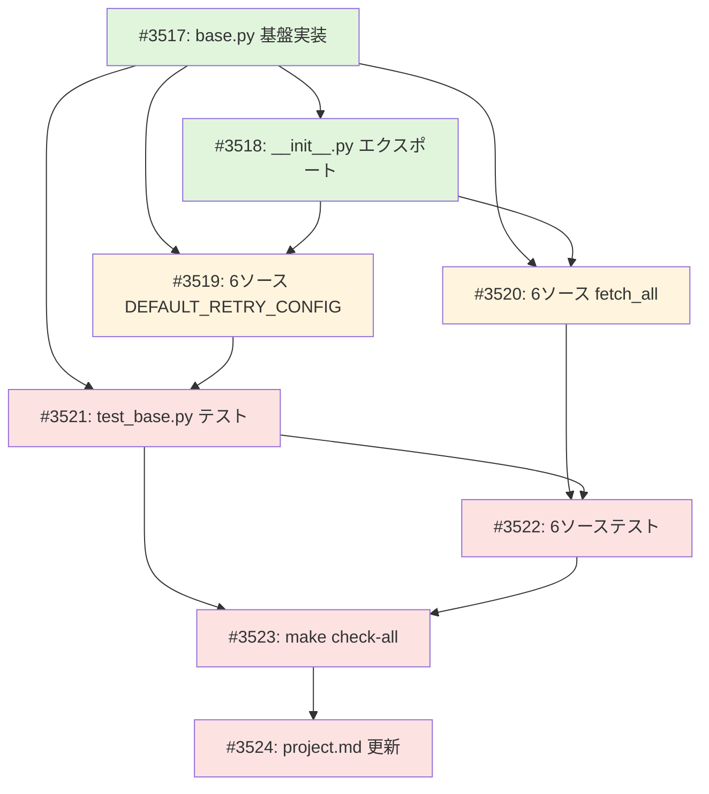

# yfinance ニュース収集のレートリミット対策

## Context

news パッケージの yfinance ソース（6クラス）で Yahoo Finance API に連続リクエストを送り、429 (Too Many Requests) エラーが発生している。原因は2つ:

1. `fetch_all` がディレイなしでループ（数十リクエストを即座に連打）
2. yfinance の `YFRateLimitError` がリトライ対象外（1回で失敗扱い）

## 変更方針

### 変更1: `apply_polite_delay` 共通関数を追加

**ファイル**: `src/news/sources/yfinance/base.py`

リクエスト間のポライトディレイを適用する共通関数を追加。NasdaqSession のパターンに倣う。

```python
DEFAULT_POLITE_DELAY: float = 1.0  # 基本ディレイ（秒）
DEFAULT_DELAY_JITTER: float = 0.5  # ランダムジッター（秒）

def apply_polite_delay(
    polite_delay: float = DEFAULT_POLITE_DELAY,
    jitter: float = DEFAULT_DELAY_JITTER,
) -> float:
    """polite_delay + random(0, jitter) 秒待機する。"""
    actual_delay = polite_delay + random.uniform(0, jitter)
    time.sleep(actual_delay)
    return actual_delay
```

`__all__` と `__init__.py` にもエクスポート追加。

### 変更2: `fetch_with_retry` で RateLimitError を適切に raise

**ファイル**: `src/news/sources/yfinance/base.py`

全リトライ失敗後、最後の例外が `YFRateLimitError` の場合は既存の `RateLimitError`（`news.core.errors`、未使用だった）を raise する。

```python
# 全リトライ失敗時の分岐追加
from yfinance.exceptions import YFRateLimitError
from ...core.errors import RateLimitError

if isinstance(last_exception, YFRateLimitError):
    raise RateLimitError(source="yfinance") from last_exception
```

### 変更3: 全6ソースの `DEFAULT_RETRY_CONFIG` に `YFRateLimitError` を追加

**ファイル**: stock.py, search.py, index.py, sector.py, commodity.py, macro.py

```python
from yfinance.exceptions import YFRateLimitError

DEFAULT_RETRY_CONFIG = RetryConfig(
    max_attempts=3,
    initial_delay=2.0,  # 1.0 → 2.0 に変更（429回復のため）
    max_delay=60.0,
    exponential_base=2.0,
    jitter=True,
    retryable_exceptions=(
        ConnectionError,
        TimeoutError,
        YFRateLimitError,
    ),
)
```

### 変更4: 全6ソースの `fetch_all` にポライトディレイを追加

**ファイル**: 同上6ファイル

```python
from .base import apply_polite_delay

# Before:
for ticker in identifiers:
    result = self.fetch(ticker, count)

# After:
for i, ticker in enumerate(identifiers):
    if i > 0:
        apply_polite_delay()
    result = self.fetch(ticker, count)
```

最初のリクエスト前はディレイ不要（`if i > 0`）。

## 変更しないもの

| ファイル | 理由 |
|---------|------|
| `src/news/core/result.py` | RetryConfig デフォルトはソース非依存のまま維持 |
| `src/news/core/errors.py` | RateLimitError は変更不要（既に定義済み） |
| `src/news/core/source.py` | SourceProtocol インターフェース変更不要 |

## ファイル変更一覧

| ファイル | 種別 | 内容 |
|---------|------|------|
| `src/news/sources/yfinance/base.py` | 修正 | `apply_polite_delay` 追加、`fetch_with_retry` に RateLimitError 分岐追加 |
| `src/news/sources/yfinance/__init__.py` | 修正 | 新シンボルのエクスポート追加 |
| `src/news/sources/yfinance/stock.py` | 修正 | DEFAULT_RETRY_CONFIG + fetch_all 修正 |
| `src/news/sources/yfinance/search.py` | 修正 | 同上 |
| `src/news/sources/yfinance/index.py` | 修正 | 同上 |
| `src/news/sources/yfinance/sector.py` | 修正 | 同上 |
| `src/news/sources/yfinance/commodity.py` | 修正 | 同上 |
| `src/news/sources/yfinance/macro.py` | 修正 | 同上 |
| `tests/news/unit/sources/yfinance/test_base.py` | 修正 | apply_polite_delay + YFRateLimitError リトライのテスト追加 |
| `tests/news/unit/sources/yfinance/test_stock.py` | 修正 | fetch_all ポライトディレイのテスト追加 |
| `tests/news/unit/sources/yfinance/test_search.py` | 修正 | 同上 |
| `tests/news/unit/sources/yfinance/test_index.py` | 修正 | 同上 |
| `tests/news/unit/sources/yfinance/test_sector.py` | 修正 | 同上 |
| `tests/news/unit/sources/yfinance/test_commodity.py` | 修正 | 同上 |
| `tests/news/unit/sources/yfinance/test_macro.py` | 修正 | 同上 |

## 実装順序

1. `base.py` に `apply_polite_delay` 関数を追加
2. `base.py` の `fetch_with_retry` に RateLimitError 分岐を追加
3. 6ソースの `DEFAULT_RETRY_CONFIG` に `YFRateLimitError` を追加
4. 6ソースの `fetch_all` にポライトディレイを挿入
5. `__init__.py` のエクスポート更新
6. テスト追加・実行
7. `make check-all` で全体検証

## 検証方法

```bash
# 単体テスト実行
uv run pytest tests/news/unit/sources/yfinance/ -v

# 全チェック
make check-all
```

テスト内では `time.sleep` と `apply_polite_delay` をモックし、実行速度に影響しないようにする。

## GitHub Project

- **Project #45**: [yfinance ニュース収集のレートリミット対策](https://github.com/users/YH-05/projects/45)
- **見積もり**: 3-4時間（Wave1: 1時間、Wave2: 1時間、Wave3: 1.5-2時間、検証: 0.5時間）

## タスク一覧

| Wave | # | タイトル | 見積もり | ステータス |
|------|---|---------|---------|-----------|
| 1 | [#3517](https://github.com/YH-05/finance/issues/3517) | base.py に apply_polite_delay 関数と RateLimitError 処理を追加 | 0.5h | Todo |
| 1 | [#3518](https://github.com/YH-05/finance/issues/3518) | __init__.py に新シンボルをエクスポート | 0.1h | Todo |
| 2 | [#3519](https://github.com/YH-05/finance/issues/3519) | 6ソースの DEFAULT_RETRY_CONFIG に YFRateLimitError を追加 | 0.5h | Todo |
| 2 | [#3520](https://github.com/YH-05/finance/issues/3520) | 6ソースの fetch_all にポライトディレイを挿入 | 0.5h | Todo |
| 3 | [#3521](https://github.com/YH-05/finance/issues/3521) | test_base.py に apply_polite_delay と YFRateLimitError リトライのテストを追加 | 0.5h | Todo |
| 3 | [#3522](https://github.com/YH-05/finance/issues/3522) | 6ソーステストに fetch_all ポライトディレイのテストを追加 | 1.0h | Todo |
| 3 | [#3523](https://github.com/YH-05/finance/issues/3523) | 全体検証: make check-all 実行 | 0.5h | Todo |
| 3 | [#3524](https://github.com/YH-05/finance/issues/3524) | project.md に Issue リンクを反映 | 0.1h | Todo |

## 依存関係図



## 次のステップ

1. 並列開発計画を確認: `/plan-worktrees 45`
2. タスクを実装: `/issue-implement 3517`（または順次実装）
3. 実装完了後、Issue #3524 で project.md のステータスを更新
