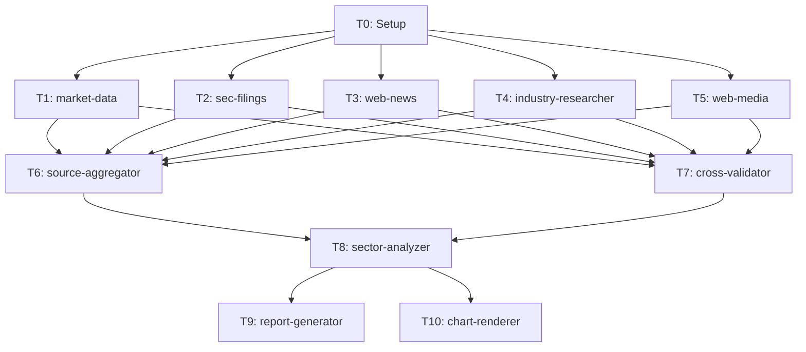

# dr-industry-lead 詳細設計書

## 概要

業界・セクター分析を行う Agent Teams リーダーエージェント。
`/dr-industry` コマンドから呼び出され、11タスク・5フェーズのワークフローを制御する。

### 設計方針

| 項目 | 方針 |
|------|------|
| 深度モード | **なし**（常にフルパイプライン実行、dr-stock と統一） |
| 信頼度スコアリング | cross-validator に統合（専用エージェント不要） |
| 可視化 | Python チャートテンプレートの Bash 実行（エージェント不要） |
| 業界分析 | industry-researcher（プリセット + dogma.md）が核心 |
| SEC 取得 | finance-sec-filings を `type=="industry"` 分岐で複数シンボル対応に拡張 |

### dr-stock-lead との主要な差異

| 項目 | dr-stock-lead | dr-industry-lead |
|------|-------------|------------------|
| タスク数 | 10 | **11** |
| Phase 1 並列数 | 4 | **5** |
| チームメイト数 | 8 | **9** |
| データ優先度 | SEC > market > industry > Web | **industry > market > SEC(top N) > Web** |
| Phase 3 アナライザー | dr-stock-analyzer | **dr-sector-analyzer** |
| research-meta.json | ticker 中心 | **sector/subsector/companies[]/sector_etf 中心** |
| T2 sec-filings | 単一シンボル（致命的） | **複数シンボル（非致命的）** |
| T4 industry-researcher | 非致命的 | **致命的（業界分析の核心）** |
| T5 追加 | なし | **業界メディア専用 Web 検索（新設）** |
| チャート | 銘柄固有5種 | **業界分析5種（全て新設）** |

---

## タスク構成（11タスク）

```
Phase 0: Setup
  T0: research-meta.json 生成 + ディレクトリ作成

Phase 1: Data Collection（5並列）
  T1: finance-market-data     セクターETF + 構成銘柄の株価・財務指標
  T2: finance-sec-filings     上位N社の10-K/10-Q（複数シンボル対応拡張）
  T3: finance-web              セクターニュース・アナリストレポート
  T4: industry-researcher      業界ポジション・競争優位性 ★核心
  T5: finance-web (2nd)        業界メディア専用 Web 検索 ★新設

Phase 2: Integration + Validation（2並列）
  T6: dr-source-aggregator    raw-data.json 統合（5ファイル）
  T7: dr-cross-validator      データ照合 + 信頼度付与

Phase 3: Analysis
  T8: dr-sector-analyzer       5ピラーのセクター分析

Phase 4: Output（2並列）
  T9: dr-report-generator     レポート生成 + チャートスクリプト出力
  T10: chart-renderer          チャート出力（Bash でPython実行）

Phase 5: Cleanup
  TeamDelete + 完了通知
```

### 依存関係グラフ



---

## Phase 0: Setup

### T0: research-meta.json 生成

**実行者**: Lead 自身（エージェント不要）

1. リサーチID生成: `DR_industry_{YYYYMMDD}_{Sector}_{Subsector}`
2. ディレクトリ作成:
   ```
   research/{research_id}/
   ├── 00_meta/
   │   └── research-meta.json
   ├── 01_data_collection/
   ├── 02_validation/
   ├── 03_analysis/
   └── 04_output/
       └── charts/
   ```
3. research-meta.json 出力:
   ```json
   {
     "research_id": "DR_industry_20260215_Technology_Semiconductors",
     "type": "industry",
     "created_at": "2026-02-15T10:00:00Z",
     "parameters": {
       "sector": "Technology",
       "subsector": "Semiconductors",
       "companies": ["NVDA", "AVGO", "AMD", "INTC", "QCOM"],
       "sector_etf": "XLK",
       "analysis_period": "5y",
       "industry_preset": "Technology/Semiconductors"
     },
     "status": "in_progress"
   }
   ```
4. **[HF0]** パラメータ確認: セクター、サブセクター、構成銘柄、セクターETFをユーザーに提示

### セクター ETF マッピング

| セクター | ETF | プリセットキー |
|---------|-----|--------------|
| Technology | XLK | Technology/* |
| Healthcare | XLV | Healthcare/* |
| Financials | XLF | Financials/* |
| Consumer Discretionary | XLY | Consumer_Discretionary/* |
| Energy | XLE | Energy/* |

---

## Phase 1: Data Collection（5並列）

### T1: finance-market-data

**エージェント**: `finance-market-data`
**入力**: research-meta.json
**出力**: `01_data_collection/market-data.json`

| データ | ソース | 内容 |
|--------|--------|------|
| セクターETF株価（日足） | `src/market/yfinance/` | 5年分 OHLCV（例: XLK） |
| 構成銘柄株価 | `src/market/yfinance/` | companies[] 全銘柄の OHLCV |
| セクターETF vs S&P 500 | `src/market/yfinance/` | SPY との相対パフォーマンス |
| 構成銘柄の財務指標 | yfinance.Ticker.info | P/E, P/B, EV/EBITDA, ROE, ROA 等 |
| 時価総額 | yfinance.Ticker.info | marketCap（セクター集中度計算用） |
| 配当利回り | yfinance.Ticker.info | dividendYield |

**dr-stock との差異**: ticker 1銘柄 → セクターETF + 構成銘柄の複数銘柄取得

### T2: finance-sec-filings（★拡張必要）

**エージェント**: `finance-sec-filings`
**入力**: research-meta.json
**出力**: `01_data_collection/sec-filings.json`

**現状の制約**: `finance-sec-filings.md` L80「複数シンボルが指定されている場合は最初のシンボルのみを処理します」

**拡張方針**: research-meta.json の `type` フィールドで分岐

```
type == "stock"    → 現行動作（symbols[0] のみ処理）
type == "industry" → companies[] をループ処理し、全銘柄の SEC データを取得
```

| データ | MCP ツール | 内容 |
|--------|-----------|------|
| 各社の財務データ | `mcp__sec-edgar-mcp__get_financials` | 3年分の損益/BS/CF |
| 最近の 10-K | `mcp__sec-edgar-mcp__get_recent_filings` | 直近1年 |
| キーメトリクス | `mcp__sec-edgar-mcp__get_key_metrics` | 主要指標（比較用） |
| 10-K セクション | `mcp__sec-edgar-mcp__get_filing_sections` | Competition, Risk Factors |

**注意**: 銘柄数 × MCP呼び出し回数のため、データ量が大きくなる。上位5社に制限。

**出力スキーマ（複数シンボル対応）**:

```json
{
  "research_id": "DR_industry_20260215_Technology_Semiconductors",
  "type": "industry",
  "companies_data": {
    "NVDA": {
      "financials": { "revenue": [...], "operating_income": [...] },
      "filings": { "recent_10k": [...] },
      "key_metrics": { "gross_margin": 0.75, "r_and_d_intensity": 0.27 },
      "filing_sections": { "competition": "...", "risk_factors": "..." }
    },
    "AMD": { ... },
    "INTC": { ... }
  },
  "failed_companies": ["AVGO"],
  "summary": {
    "total": 5,
    "success": 4,
    "failed": 1,
    "failed_reasons": { "AVGO": "CIK not found" }
  }
}
```

### T3: finance-web

**エージェント**: `finance-web`
**入力**: research-meta.json
**出力**: `01_data_collection/web-data.json`

| データ | ツール | 検索クエリ例 |
|--------|--------|-------------|
| セクターニュース | WebSearch | `"{sector}" sector outlook 2026` |
| アナリスト評価 | WebSearch | `"{sector}" sector rating overweight underweight` |
| 業界トレンド | WebSearch | `"{subsector}" industry trends 2026` |
| 規制動向 | WebSearch | `"{sector}" regulation policy impact 2026` |
| M&A動向 | WebSearch | `"{sector}" M&A deals acquisitions 2026` |

最大15件の記事を WebFetch で本文取得。

### T4: industry-researcher ★核心（致命的）

**エージェント**: `industry-researcher`（dr-stock と共通エージェント）
**入力**: research-meta.json + `data/config/industry-research-presets.json`
**出力**: `01_data_collection/industry-data.json`

**dr-stock との差異**:
- dr-stock では「1銘柄の業界内ポジション」を分析
- dr-industry では「業界全体の構造と競争環境」を分析（スコープが広い）

**収集データ（7カテゴリ）**:

| 優先度 | カテゴリ | ソース | 取得方法 | ペイウォール |
|--------|---------|--------|---------|-------------|
| 1 | 戦略コンサル | McKinsey, BCG, Deloitte, PwC, **Bain, Accenture, EY, KPMG** | Bash: `uv run python -m market.industry.collect` | 公開 Insights |
| 2 | 市場調査会社 | **Gartner, IDC, Forrester** | WebSearch（プレスリリース・要約） | 有料（PR は公開） |
| 3 | 投資銀行レポート | Goldman, Morgan Stanley, JP Morgan | Bash: 同上 | 公開部分 |
| 4 | 専門リサーチ会社 | **CB Insights, PitchBook** | WebSearch（無料レポート・ブログ） | 一部有料 |
| 5 | 業界団体 | **セクター固有**（下表参照） | WebSearch + WebFetch | 公開/一部有料 |
| 6 | 政府統計 API | BLS, Census | Bash: 同上 | 公開 |
| 7 | 業界専門メディア | プリセットの industry_media | WebSearch + WebFetch | 公開 |

**ペイウォール対応戦略**:

| ソース種別 | 戦略 | 取得可能なデータ |
|-----------|------|----------------|
| Gartner | プレスリリース検索 `site:gartner.com/en/newsroom` | Magic Quadrant 要約、市場予測ヘッドライン |
| IDC | プレスリリース検索 `site:idc.com/getdoc.jsp` | 市場シェアデータ、成長率予測 |
| Forrester | ブログ検索 `site:forrester.com/blogs` | Wave 評価要約、トレンド分析 |
| CB Insights | 無料レポート + ブログ `site:cbinsights.com/research` | 業界マップ、スタートアップ動向 |
| PitchBook | ニュース検索 `site:pitchbook.com/news` | M&A・VC 統計、業界レポート要約 |

**セクター別 業界団体マッピング**:

| セクター | 業界団体 | URL | 主な公開データ |
|---------|---------|-----|--------------|
| Technology/Semiconductors | SIA, SEMI | semiconductors.org, semi.org | 出荷統計、市場予測 |
| Technology/Software | BSA, CompTIA | bsa.org, comptia.org | 市場規模、人材統計 |
| Healthcare/Pharma | PhRMA, BIO | phrma.org, bio.org | パイプライン統計、承認数 |
| Healthcare/Devices | AdvaMed | advamed.org | 規制動向、市場レポート |
| Financials | ABA, SIFMA | aba.com, sifma.org | 融資統計、資本市場データ |
| Energy | API, IRENA | api.org, irena.org | 生産統計、再エネ投資 |
| Consumer | NRF, FMI | nrf.com, fmi.org | 消費支出、小売統計 |

**出力スキーマ**: 既存の `industry-researcher.md` のスキーマに準拠（industry_position, competitive_landscape, industry_trends, competitive_advantage_evaluation, government_data, data_freshness）+ **market_research_data**（市場調査会社・業界団体のデータを格納する新フィールド）

### T5: finance-web (2nd) ★新設

**エージェント**: `finance-web`（T3 と同じエージェントタイプ、別インスタンス）
**入力**: research-meta.json
**出力**: `01_data_collection/web-media-data.json`

**目的**: T3 の汎用ニュース検索とは別に、プリセット設定の `industry_media` に基づく専門メディア記事を収集。

**T3 との差異**:

| 項目 | T3 (web-news) | T5 (web-media) |
|------|---------------|----------------|
| 検索スコープ | 汎用ニュース・アナリスト | 業界専門メディア |
| 検索クエリ | セクター名ベース | プリセットの industry_media URL ベース |
| WebFetch 対象 | 検索結果上位15件 | 専門サイトの最新記事 |
| 出力ファイル | web-data.json | web-media-data.json |

**検索クエリ例**（Technology/Semiconductors の場合）:

```
# 業界専門メディア
site:semiconductors.org latest news 2026
site:semiwiki.com semiconductor industry 2026

# 市場調査会社プレスリリース（ペイウォール回避）
"{subsector}" market forecast site:gartner.com/en/newsroom 2026
"{subsector}" market share site:idc.com 2026
"{subsector}" wave site:forrester.com/blogs 2026

# 専門リサーチ会社
"{subsector}" industry map site:cbinsights.com/research 2026
"{subsector}" M&A deals site:pitchbook.com/news 2026

# 業界団体
site:semiconductors.org market data statistics 2026
site:semi.org industry report 2026

# 戦略コンサル（T4 スクレイピング補完）
"{subsector}" industry report site:bain.com/insights 2026
"{subsector}" outlook site:accenture.com/insights 2026
"{subsector}" trends site:ey.com/insights 2026
"{subsector}" analysis site:kpmg.com/insights 2026
```

---

## Phase 2: Integration + Validation（2並列）

### T6: dr-source-aggregator（★拡張: 5ファイル統合）

**エージェント**: `dr-source-aggregator`
**入力**: `01_data_collection/*.json`（5ファイル）
**出力**: `01_data_collection/raw-data.json`

**dr-stock との差異**: 4ファイル → 5ファイル統合

```json
{
  "research_id": "DR_industry_20260215_Technology_Semiconductors",
  "type": "industry",
  "sources": {
    "market_data":   {"status": "success", "tier": 2, "data": {...}},
    "sec_filings":   {"status": "partial", "tier": 1, "data": {...}, "note": "3/5 companies succeeded"},
    "web_news":      {"status": "success", "tier": 3, "data": {...}},
    "industry":      {"status": "success", "tier": 1, "data": {...}},
    "web_media":     {"status": "success", "tier": 2, "data": {...}}
  },
  "summary": {
    "total_sources": 5,
    "successful": 4,
    "partial": 1,
    "failed": 0,
    "tier_distribution": {"tier1": 2, "tier2": 2, "tier3": 1}
  }
}
```

**変更必要箇所**: `dr-source-aggregator.md` に `web-media-data.json` を5番目のソースとして追加。`type=="industry"` 時のみ 5ファイル統合、`type=="stock"` 時は従来の4ファイル統合を維持。

### T7: dr-cross-validator

**エージェント**: `dr-cross-validator`
**入力**: `01_data_collection/*.json`（5ファイル）
**出力**: `02_validation/cross-validation.json`

dr-stock と同じ信頼度スコアリングルール:

```
high:   Tier 1 ソースで確認 + 他ソースと矛盾なし
medium: Tier 2 ソースで確認 or Tier 1 だが他ソースと軽微な差異
low:    Tier 3 のみ or ソース間で矛盾あり
```

**業界分析固有の検証ポイント**:
- 各社の財務データ（SEC vs yfinance）の整合性
- 市場シェアデータの複数ソース間の一致
- 業界成長率の推定値のばらつき

**[HF1]** データ品質レポートをユーザーに提示:
- 収集成功/失敗のサマリー
- SEC データの部分失敗詳細（何社中何社成功か）
- 矛盾が検出されたデータポイント
- 低信頼度データの一覧

---

## Phase 3: Analysis

### T8: dr-sector-analyzer

**エージェント**: `dr-sector-analyzer`
**入力**: `01_data_collection/raw-data.json` + `02_validation/cross-validation.json`
**出力**: `03_analysis/sector-analysis.json`

5つの分析ピラー（既存 `dr-sector-analyzer.md` に準拠）:

1. **セクター概観**: 市場構造（時価総額、集中度）、成長プロファイル、サイクル位置
   - セクター時価総額合計
   - 上位5社の集中度（HHI）
   - セクター売上成長率、利益成長率
   - 景気サイクルとの相関・現在位置

2. **パフォーマンス分析**: 絶対・相対・リスク調整リターン
   - YTD, 1Y, 3Y, 5Y リターン
   - vs S&P 500、vs ラッセル2000、vs 他セクター
   - シャープレシオ、ソルティノレシオ、最大ドローダウン

3. **バリュエーション比較**: セクター指標 + ヒストリカル + 銘柄間
   - P/E（中央値、平均）、P/B、EV/EBITDA、配当利回り
   - 5年平均との乖離、プレミアム/ディスカウント判定
   - 上位銘柄のバリュエーション横並び比較

4. **ローテーション分析**: セクター間の資金フロー
   - 直近3ヶ月のセクター間パフォーマンス差
   - 金利感応度、景気感応度
   - ローテーションシグナル（モメンタム、リバーサル）

5. **銘柄選定**: セクター内のトップピック候補
   - スコアリング（バリュエーション × 成長性 × 品質）
   - industry-researcher の競争優位性評価を統合
   - 割安/割高の判定（ヒストリカルレンジ内の位置）

---

## Phase 4: Output（2並列）

### T9: dr-report-generator

**エージェント**: `dr-report-generator`
**入力**: `03_analysis/sector-analysis.json` + `02_validation/cross-validation.json`
**出力**:
- `04_output/report.md`（Markdown レポート）
- `04_output/render_charts.py`（チャート生成スクリプト）

レポートテンプレートは dr-industry スキルの `output-templates/industry-analysis.md` を使用。

**変更必要箇所**: `dr-report-generator.md` に `type=="industry"` 時のテンプレート分岐を追加。

### T10: chart-renderer ★方式変更

**実行方式**: Lead が Bash で Python スクリプトを実行（エージェント不要）

```bash
uv run python research/{research_id}/04_output/render_charts.py
```

**生成されるチャート（5種）**:

| # | チャート | 説明 | 使用クラス/関数 | ファイル名 |
|---|---------|------|---------------|-----------|
| 1 | セクターパフォーマンス | セクターETF vs S&P 500 の累積リターン推移 | `plot_cumulative_returns()` | `charts/sector_performance.png` |
| 2 | Top N 銘柄比較 | 構成銘柄上位N社の累積リターン比較 | `plot_cumulative_returns()` | `charts/top_n_comparison.png` |
| 3 | バリュエーション分布 | P/E, EV/EBITDA 等の箱ひげ図（銘柄間比較） | `plotly.graph_objects.Box` | `charts/valuation_distribution.png` |
| 4 | 成長トレンド | 売上高・営業利益のYoY成長率（銘柄間横並び） | `plotly.graph_objects.Bar` | `charts/growth_trend.png` |
| 5 | マーケットシェア | 時価総額 or 売上高ベースのシェア | `plotly.graph_objects.Treemap` | `charts/market_share.png` |

**render_charts.py テンプレート構造**:

```python
"""dr-industry チャート生成スクリプト.

dr-report-generator が分析データに基づいて自動生成するスクリプト。
既存の analyze.visualization フレームワークを使用。
"""
import json
from pathlib import Path

import pandas as pd
import plotly.graph_objects as go

from analyze.visualization.performance import plot_cumulative_returns

# パス設定
RESEARCH_DIR = Path(__file__).parent.parent
CHARTS_DIR = Path(__file__).parent / "charts"
CHARTS_DIR.mkdir(exist_ok=True)

# データ読み込み
with open(RESEARCH_DIR / "03_analysis" / "sector-analysis.json") as f:
    analysis = json.load(f)
with open(RESEARCH_DIR / "01_data_collection" / "market-data.json") as f:
    market = json.load(f)

# 1. セクターパフォーマンス（ETF vs S&P 500）
sector_etf = analysis["parameters"]["sector_etf"]
price_df = pd.DataFrame(market["etf_prices"])
fig1 = plot_cumulative_returns(
    price_df=price_df,
    symbols=[sector_etf, "SPY"],
    title=f"{analysis['parameters']['sector']} セクター vs S&P 500（5年）"
)
fig1.write_image(str(CHARTS_DIR / "sector_performance.png"), width=1200, height=600)

# 2. Top N 銘柄比較
companies = analysis["parameters"]["companies"][:5]
company_df = pd.DataFrame(market["company_prices"])
fig2 = plot_cumulative_returns(
    price_df=company_df,
    symbols=companies,
    title=f"Top {len(companies)} 銘柄 - 累積リターン比較"
)
fig2.write_image(str(CHARTS_DIR / "top_n_comparison.png"), width=1200, height=600)

# 3. バリュエーション分布（箱ひげ図）
valuation = analysis["valuation_comparison"]
fig3 = go.Figure()
for metric in ["P/E", "EV/EBITDA", "P/B"]:
    values = [v[metric] for v in valuation["companies"].values() if v.get(metric)]
    fig3.add_trace(go.Box(y=values, name=metric))
fig3.update_layout(title="バリュエーション分布", yaxis_title="倍率")
fig3.write_image(str(CHARTS_DIR / "valuation_distribution.png"), width=1000, height=600)

# 4. 成長トレンド（YoY成長率 横並び棒グラフ）
growth = analysis["growth_metrics"]
fig4 = go.Figure()
fig4.add_trace(go.Bar(
    x=list(growth.keys()),
    y=[g["revenue_growth_yoy"] for g in growth.values()],
    name="売上高成長率"
))
fig4.add_trace(go.Bar(
    x=list(growth.keys()),
    y=[g["operating_income_growth_yoy"] for g in growth.values()],
    name="営業利益成長率"
))
fig4.update_layout(title="銘柄別 成長トレンド（YoY）", barmode="group", yaxis_tickformat=".0%")
fig4.write_image(str(CHARTS_DIR / "growth_trend.png"), width=1200, height=600)

# 5. マーケットシェア（Treemap）
market_cap = analysis["market_structure"]["market_caps"]
fig5 = go.Figure(go.Treemap(
    labels=list(market_cap.keys()),
    parents=[""] * len(market_cap),
    values=list(market_cap.values()),
    textinfo="label+percent root",
))
fig5.update_layout(title="マーケットシェア（時価総額ベース）")
fig5.write_image(str(CHARTS_DIR / "market_share.png"), width=1000, height=800)

print(f"Charts generated in {CHARTS_DIR}")
```

**[HF2]** 最終出力をユーザーに提示:
- レポート概要
- 生成チャート一覧
- 分析の主要な結論（セクターの投資判断の方向性）

---

## チームメイト構成（9エージェント）

| # | 名前 | エージェント | Phase | 備考 |
|---|------|------------|-------|------|
| 1 | market-data | finance-market-data | 1 | |
| 2 | sec-filings | finance-sec-filings | 1 | ★複数シンボル拡張必要 |
| 3 | web-news | finance-web | 1 | |
| 4 | industry | industry-researcher | 1 | dr-stock と共通 |
| 5 | web-media | finance-web | 1 | ★新設（2つ目のインスタンス） |
| 6 | aggregator | dr-source-aggregator | 2 | ★5ファイル統合拡張必要 |
| 7 | validator | dr-cross-validator | 2 | |
| 8 | analyzer | dr-sector-analyzer | 3 | dr-stock-analyzer の代わり |
| 9 | reporter | dr-report-generator | 4 | ★テンプレート分岐追加必要 |

T0（Setup）と T10（chart-renderer）は Lead 自身が実行。

---

## エラーハンドリング

### Phase 1 の部分失敗

| 失敗タスク | 影響 | 対処 | dr-stock との差異 |
|-----------|------|------|-----------------|
| T1 market-data | 致命的 | リトライ → 失敗時は中断 | 同じ |
| T2 sec-filings | **非致命的** | 警告付きで続行（SEC なしでも業界分析は可能） | **変更: dr-stock では致命的** |
| T3 web-news | 非致命的 | 警告付きで続行 | 同じ |
| T4 industry | **致命的** | リトライ → 失敗時は中断 | **変更: dr-stock では非致命的** |
| T5 web-media | 非致命的 | 警告付きで続行（T3 でカバー可能） | 新設 |

**T2 を非致命的に変更した理由**: 業界分析は industry-researcher（T4）と market-data（T1）が核心。SEC データは比較用の補完情報であり、5社中1-2社のデータがあれば十分。

**T4 を致命的に変更した理由**: industry-researcher は業界ポジション・競争優位性・業界トレンドという本分析の核心データを提供。これなしでは業界分析の品質が保証できない。

### Phase 2 の部分失敗

| 失敗タスク | 影響 | 対処 |
|-----------|------|------|
| T6 aggregator | 致命的 | リトライ → 失敗時は中断 |
| T7 validator | 非致命的 | 警告付きで続行（信頼度=unknown） |

### Phase 4 の部分失敗

| 失敗タスク | 影響 | 対処 |
|-----------|------|------|
| T9 reporter | 致命的 | リトライ → 失敗時は中断 |
| T10 chart-renderer | 非致命的 | 警告付きで続行（レポートのみ出力） |

---

## 出力ディレクトリ構造

```
research/DR_industry_20260215_Technology_Semiconductors/
├── 00_meta/
│   └── research-meta.json
├── 01_data_collection/
│   ├── market-data.json        ← T1
│   ├── sec-filings.json        ← T2（複数シンボル形式）
│   ├── web-data.json           ← T3
│   ├── industry-data.json      ← T4
│   ├── web-media-data.json     ← T5 ★新設
│   └── raw-data.json           ← T6（5ファイル統合）
├── 02_validation/
│   └── cross-validation.json   ← T7
├── 03_analysis/
│   └── sector-analysis.json    ← T8
└── 04_output/
    ├── report.md               ← T9
    ├── render_charts.py        ← T9（生成スクリプト）
    └── charts/                 ← T10（生成画像）
        ├── sector_performance.png
        ├── top_n_comparison.png
        ├── valuation_distribution.png
        ├── growth_trend.png
        └── market_share.png
```

---

## finance-sec-filings 拡張設計

### 現状

`.claude/agents/finance-sec-filings.md` L80:
> **注意**: 複数シンボルが指定されている場合は最初のシンボルのみを処理します。

### 拡張方針

research-meta.json の `type` フィールドで処理を分岐:

```
if type == "stock":
    # 現行動作: symbols[0] のみ処理
    process_single_symbol(symbols[0])

elif type == "industry":
    # 新規: companies[] をループ処理
    results = {}
    for company in parameters.companies:
        try:
            results[company] = process_single_symbol(company)
        except Exception as e:
            failed[company] = str(e)
    # 個社の失敗は全体を止めない（部分成功を許容）
```

### 変更が必要なファイル

| ファイル | 変更内容 |
|---------|---------|
| `.claude/agents/finance-sec-filings.md` | `type=="industry"` 分岐追加、複数シンボルループ処理、出力スキーマ拡張 |

### 出力スキーマの変更

**type=="stock" 時（変更なし）**:
```json
{
  "research_id": "DR_stock_20260211_AAPL",
  "ticker": "AAPL",
  "financials": {...},
  "filings": {...},
  "insider": {...}
}
```

**type=="industry" 時（新規）**:
```json
{
  "research_id": "DR_industry_20260215_Technology_Semiconductors",
  "type": "industry",
  "companies_data": {
    "NVDA": { "financials": {...}, "filings": {...}, "key_metrics": {...}, "filing_sections": {...} },
    "AMD":  { "financials": {...}, "filings": {...}, "key_metrics": {...}, "filing_sections": {...} },
    "INTC": { "financials": {...}, "filings": {...}, "key_metrics": {...}, "filing_sections": {...} }
  },
  "failed_companies": ["AVGO"],
  "summary": {
    "total": 5,
    "success": 4,
    "failed": 1,
    "failed_reasons": { "AVGO": "CIK not found" }
  }
}
```

---

## 前提条件

### 必須パッケージ（既存）

| パッケージ | 用途 |
|-----------|------|
| `src/market/yfinance/` | 株価・財務データ取得 |
| `src/edgar/` | SEC EDGAR データ取得 |
| `src/market/industry/` | 業界レポートスクレイピング（dr-stock-lead で作成済み） |
| `src/analyze/visualization/` | チャート生成 |
| `src/analyze/statistics/` | 統計分析 |

### 既存エージェント（共通利用）

| エージェント | パス | 備考 |
|------------|------|------|
| finance-market-data | `.claude/agents/finance-market-data.md` | |
| finance-sec-filings | `.claude/agents/finance-sec-filings.md` | ★拡張必要 |
| finance-web | `.claude/agents/finance-web.md` | |
| industry-researcher | `.claude/agents/deep-research/industry-researcher.md` | ★拡張必要（7カテゴリソース対応） |
| dr-source-aggregator | `.claude/agents/deep-research/dr-source-aggregator.md` | ★拡張必要 |
| dr-cross-validator | `.claude/agents/deep-research/dr-cross-validator.md` | |
| dr-sector-analyzer | `.claude/agents/deep-research/dr-sector-analyzer.md` | |
| dr-report-generator | `.claude/agents/deep-research/dr-report-generator.md` | ★拡張必要 |

### 新規必要ファイル

| ファイル | 用途 |
|---------|------|
| `.claude/agents/deep-research/dr-industry-lead.md` | 本 Lead エージェント |
| `.claude/skills/dr-industry/SKILL.md` | dr-industry スキル（Wave 1-1-2 で作成） |
| `.claude/commands/dr-industry.md` | /dr-industry コマンド（Wave 1-3-2 で作成） |
| `src/market/industry/scrapers/bain.py` | Bain Insights スクレイパー |
| `src/market/industry/scrapers/accenture.py` | Accenture Insights スクレイパー |
| `src/market/industry/scrapers/ey.py` | EY Insights スクレイパー |
| `src/market/industry/scrapers/kpmg.py` | KPMG Insights スクレイパー |

### 変更が必要な既存ファイル

| ファイル | 変更内容 | 影響範囲 |
|---------|---------|---------|
| `.claude/agents/finance-sec-filings.md` | `type=="industry"` 複数シンボル対応分岐追加 | dr-industry のみ |
| `.claude/agents/deep-research/dr-source-aggregator.md` | 5番目のソース（web-media-data.json）追加 | dr-industry のみ（type 条件分岐） |
| `.claude/agents/deep-research/dr-report-generator.md` | `type=="industry"` テンプレート分岐追加 | dr-industry のみ |
| `.claude/agents/deep-research/industry-researcher.md` | 7カテゴリソース対応、ペイウォール対応 WebSearch 戦略追加 | dr-stock + dr-industry |
| `src/market/industry/collector.py` | ソースレジストリに Bain/Accenture/EY/KPMG 追加 | 業界データ収集全般 |
| `data/config/industry-research-presets.json` | 市場調査会社・業界団体・専門リサーチのソース定義追加 | 業界データ収集全般 |
| `CLAUDE.md` | dr-industry 関連のエージェント・スキル・コマンド追加 | 全体 |

### 廃止対象

dr-industry 固有の廃止対象はなし（dr-stock-lead で廃止済みのコンポーネントを引き継ぐ）。

---

## 変更履歴

| 日付 | 変更内容 |
|------|---------|
| 2026-02-15 | 初版作成。ユーザー設計判断4件反映: 深度モード廃止、Phase 1 を5並列に拡張、SEC 複数シンボル対応、業界分析向けチャート5種 |
| 2026-02-15 | データソース拡張。T4 industry-researcher の収集ソースを4→7カテゴリに拡張: 戦略コンサル4社追加（Bain, Accenture, EY, KPMG）、市場調査会社（Gartner, IDC, Forrester）、専門リサーチ（CB Insights, PitchBook）、セクター別業界団体。ペイウォール対応のプレスリリース・ブログ検索戦略を追加 |
