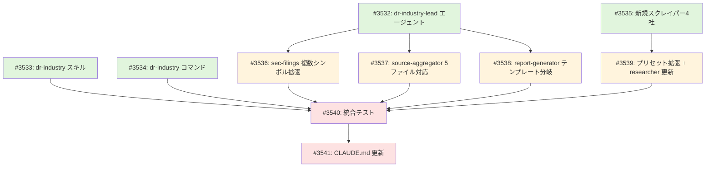

# Project #47: dr-industry（業界・セクター分析ワークフロー）

## 概要

業界・セクター分析を行う Agent Teams ワークフロー。
`/dr-industry` コマンドから `dr-industry-lead` を呼び出し、11タスク・5フェーズのパイプラインで業界全体の構造・競争環境・投資機会を分析する。

## 目的

- セクター単位の包括的な分析を自動化する（パフォーマンス、バリュエーション、ローテーション、銘柄選定）
- dr-stock（個別銘柄分析）と対をなす「業界分析」ワークフローを提供する
- 既存の Deep Research エージェント群を最大限再利用し、業界分析固有の拡張のみ追加する

## アーキテクチャ

```
/dr-industry <sector> [subsector]
    ↓
Command (.claude/commands/dr-industry.md)
    ↓
Skill (.claude/skills/dr-industry/SKILL.md)
    ↓
Agent Teams: dr-industry-lead (9チームメイト)
    ├── Phase 0: Setup（Lead自身）
    │   research-meta.json 生成 + ディレクトリ作成
    ├── Phase 1: Data Collection（5並列）
    │   T1: finance-market-data     セクターETF + 構成銘柄
    │   T2: finance-sec-filings     上位N社の10-K/10-Q ★複数シンボル拡張
    │   T3: finance-web             セクターニュース
    │   T4: industry-researcher     業界構造・競争環境 ★核心
    │   T5: finance-web (2nd)       業界専門メディア ★新設
    ├── Phase 2: Integration + Validation（2並列）
    │   T6: dr-source-aggregator    5ファイル統合
    │   T7: dr-cross-validator      データ照合 + 信頼度付与
    ├── Phase 3: Analysis
    │   T8: dr-sector-analyzer      5ピラーのセクター分析
    ├── Phase 4: Output（2並列）
    │   T9: dr-report-generator     レポート + チャートスクリプト
    │   T10: chart-renderer         Bash でPython実行（Lead自身）
    └── Phase 5: Cleanup
        TeamDelete + 完了通知
    ↓
Output: research/DR_industry_{date}_{sector}_{subsector}/
```

### dr-stock-lead との主要な差異

| 項目 | dr-stock-lead | dr-industry-lead |
|------|-------------|------------------|
| タスク数 | 10 | **11** |
| Phase 1 並列数 | 4 | **5** |
| チームメイト数 | 8 | **9** |
| データ優先度 | SEC > market > industry > Web | **industry > market > SEC(top N) > Web** |
| Phase 3 アナライザー | dr-stock-analyzer | **dr-sector-analyzer** |
| T2 sec-filings | 単一シンボル（致命的） | **複数シンボル（非致命的）** |
| T4 industry-researcher | 非致命的 | **致命的（業界分析の核心）** |

## 成果物

### 新規作成

| # | ファイル | 説明 |
|---|---------|------|
| 1 | `.claude/agents/deep-research/dr-industry-lead.md` | Agent Teams リーダーエージェント |
| 2 | `.claude/skills/dr-industry/SKILL.md` | dr-industry スキル定義 |
| 3 | `.claude/commands/dr-industry.md` | `/dr-industry` スラッシュコマンド |
| 4 | `src/market/industry/scrapers/bain.py` | Bain Insights スクレイパー |
| 5 | `src/market/industry/scrapers/accenture.py` | Accenture Insights スクレイパー |
| 6 | `src/market/industry/scrapers/ey.py` | EY Insights スクレイパー |
| 7 | `src/market/industry/scrapers/kpmg.py` | KPMG Insights スクレイパー |

### 既存ファイルの変更

| # | ファイル | 変更内容 | 影響範囲 |
|---|---------|---------|---------|
| 8 | `.claude/agents/finance-sec-filings.md` | `type=="industry"` 複数シンボル対応分岐追加 | dr-industry のみ |
| 9 | `.claude/agents/deep-research/dr-source-aggregator.md` | 5番目のソース（web-media-data.json）追加 | dr-industry のみ（type 条件分岐） |
| 10 | `.claude/agents/deep-research/dr-report-generator.md` | `type=="industry"` テンプレート分岐追加 | dr-industry のみ |
| 11 | `.claude/agents/deep-research/industry-researcher.md` | 7カテゴリソース対応、ペイウォール対応 WebSearch 戦略追加 | dr-stock + dr-industry |
| 12 | `src/market/industry/collector.py` | ソースレジストリに Bain/Accenture/EY/KPMG 追加 | 業界データ収集全般 |
| 13 | `data/config/industry-research-presets.json` | 市場調査会社・業界団体・専門リサーチのソース定義追加 | 業界データ収集全般 |
| 14 | `CLAUDE.md` | dr-industry 関連のエージェント・スキル・コマンド追記 | 全体 |

## エラーハンドリング

### Phase 1 の致命性判定

| タスク | 致命的? | 理由 |
|--------|---------|------|
| T1 market-data | 致命的 | セクターETF・構成銘柄の株価は分析の基盤 |
| T2 sec-filings | **非致命的** | 業界分析では補完情報。5社中1-2社あれば十分 |
| T3 web-news | 非致命的 | T5 でカバー可能 |
| T4 industry | **致命的** | 業界構造・競争優位性は本分析の核心 |
| T5 web-media | 非致命的 | T3 でカバー可能 |

## 出力ディレクトリ構造

```
research/DR_industry_{date}_{sector}_{subsector}/
├── 00_meta/research-meta.json
├── 01_data_collection/
│   ├── market-data.json, sec-filings.json, web-data.json
│   ├── industry-data.json, web-media-data.json
│   └── raw-data.json（統合）
├── 02_validation/cross-validation.json
├── 03_analysis/sector-analysis.json
└── 04_output/
    ├── report.md, render_charts.py
    └── charts/ (5種: sector_performance, top_n_comparison,
                 valuation_distribution, growth_trend, market_share)
```

## 依存関係

### 既存パッケージ（変更不要）

| パッケージ | 用途 |
|-----------|------|
| `src/market/yfinance/` | 株価・財務データ取得 |
| `src/edgar/` | SEC EDGAR データ取得 |
| `src/market/industry/` | 業界レポートスクレイピング |
| `src/analyze/visualization/` | チャート生成 |
| `src/analyze/statistics/` | 統計分析 |

### 既存エージェント（共通利用）

finance-market-data, finance-web, industry-researcher, dr-cross-validator, dr-sector-analyzer は変更不要で再利用。

## タスク分解

**GitHub Project**: [#47](https://github.com/users/YH-05/projects/47)

### Wave 1: 基盤（依存なし、4並列）

| # | タスク | Issue | 説明 |
|---|--------|-------|------|
| 1-1 | dr-industry-lead エージェント作成 | [#3532](https://github.com/YH-05/finance/issues/3532) | `.claude/agents/deep-research/dr-industry-lead.md` |
| 1-2 | dr-industry スキル作成 | [#3533](https://github.com/YH-05/finance/issues/3533) | `.claude/skills/dr-industry/SKILL.md` |
| 1-3 | dr-industry コマンド作成 | [#3534](https://github.com/YH-05/finance/issues/3534) | `.claude/commands/dr-industry.md` |
| 1-4 | 新規スクレイパー4社追加 | [#3535](https://github.com/YH-05/finance/issues/3535) | Bain, Accenture, EY, KPMG の Insights スクレイパーを `src/market/industry/` に追加 |

### Wave 2: 既存エージェント拡張（Wave 1 に依存、4並列）

| # | タスク | Issue | 説明 |
|---|--------|-------|------|
| 2-1 | finance-sec-filings 複数シンボル対応 | [#3536](https://github.com/YH-05/finance/issues/3536) | `type=="industry"` 分岐追加、出力スキーマ拡張 |
| 2-2 | dr-source-aggregator 5ファイル統合対応 | [#3537](https://github.com/YH-05/finance/issues/3537) | web-media-data.json を5番目のソースとして追加 |
| 2-3 | dr-report-generator テンプレート分岐 | [#3538](https://github.com/YH-05/finance/issues/3538) | `type=="industry"` 時の業界分析テンプレート追加 |
| 2-4 | プリセット拡張 + industry-researcher 更新 | [#3539](https://github.com/YH-05/finance/issues/3539) | 市場調査会社・業界団体・専門リサーチをプリセットに追加、ペイウォール対応 WebSearch 戦略を industry-researcher に反映 |

### Wave 3: 統合・ドキュメント（Wave 2 に依存）

| # | タスク | Issue | 説明 |
|---|--------|-------|------|
| 3-1 | 統合テスト | [#3540](https://github.com/YH-05/finance/issues/3540) | 実際のセクター（Technology/Semiconductors 等）で動作確認 |
| 3-2 | CLAUDE.md 更新 | [#3541](https://github.com/YH-05/finance/issues/3541) | dr-industry 関連のエージェント・スキル・コマンド追記 |

## 依存関係図



## 詳細設計

詳細設計書: [`docs/plan/2026-02-15_dr-industry-lead-design.md`](../plan/2026-02-15_dr-industry-lead-design.md)

## ステータス

- [x] Phase 0: 方向確認
- [x] Phase 1: リサーチ
- [x] Phase 2: 計画策定
- [x] Phase 3: タスク分解・Issue登録
- [ ] Phase 4: 実装
