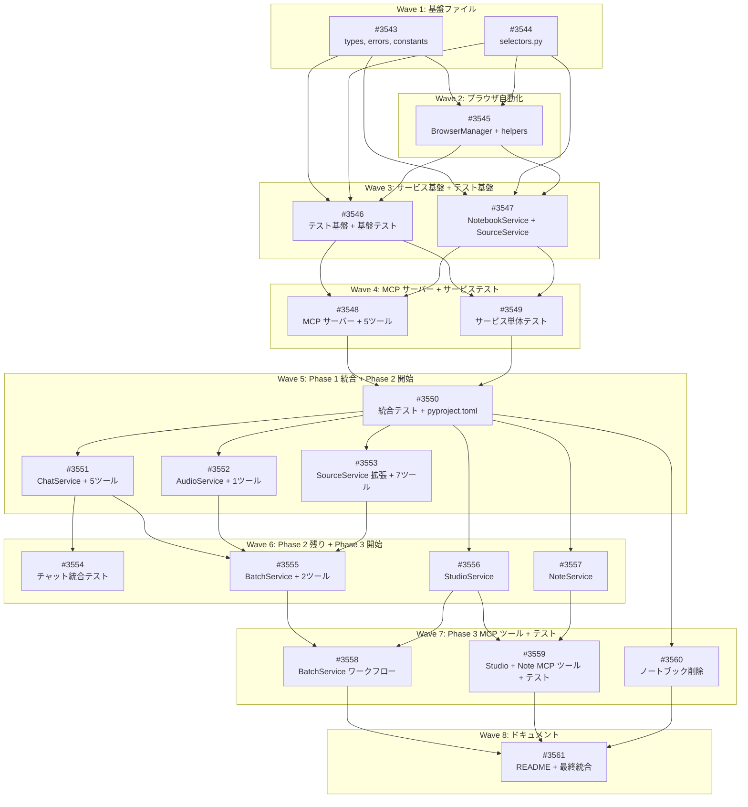

# NotebookLM MCP サーバー（Playwright ベース）

**作成日**: 2026-02-16
**ステータス**: 計画中
**タイプ**: package
**GitHub Project**: [#48](https://github.com/users/YH-05/projects/48)

## 背景と目的

### 背景

Google NotebookLM は AI を活用した強力なリサーチ・コンテンツ生成ツールだが、GUI 操作が必須でプログラマティックな利用ができない。Claude Code のワークフローに統合するためには MCP サーバーを介したブラウザ自動操作が必要。

### 目的

Playwright を使用して NotebookLM の Web UI を自動操作し、27個の MCP ツールを提供する MCP サーバーを構築する。これにより Claude Code から直接 NotebookLM のノートブック管理、ソース管理、AI チャット、Audio Overview、Studio コンテンツ生成、メモ管理、バッチ処理を実行可能にする。

### 成功基準

- [ ] 27個の MCP ツールが全て動作すること
- [ ] Claude Code の MCP 設定で `notebooklm-mcp` として起動できること
- [ ] セッション永続化（Cookie）により2回目以降はヘッドレスで動作すること
- [ ] `make check-all` が成功すること

## リサーチ結果

### 既存パターン

- **MCP サーバー**: `src/rss/mcp/server.py` — FastMCP v2、@mcp.tool() デコレータ、エラー dict 返却
- **Playwright 自動化**: `src/market/etfcom/browser.py` — stealth 設定、async context manager、リトライ
- **例外階層**: `src/edgar/errors.py` — コンテキスト付き例外
- **Pydantic モデル**: `src/database/types.py` — ConfigDict(frozen=True)

### 参考実装

| ファイル | 説明 |
|---------|------|
| `src/rss/mcp/server.py` | FastMCP セットアップ、ツール登録パターン |
| `src/market/etfcom/browser.py` | Playwright stealth 設定、セッション管理 |
| `src/edgar/errors.py` | コンテキスト付き例外階層 |
| `src/database/types.py` | Pydantic v2 frozen モデル |
| `src/news/extractors/playwright.py` | CSS selector fallback パターン |

### 技術的考慮事項

- **FastMCP lifespan**: `mcp = FastMCP('NotebookLM', lifespan=notebooklm_lifespan)` でブラウザライフサイクルを管理
- **セッション管理**: Playwright `storage_state()` による Cookie 永続化。初回は headed、以降は headless
- **セレクター安定性**: SelectorFallback パターン（aria-label > placeholder > role+text > ref属性）
- **長時間操作**: Audio Overview (~数分), Deep Research (~25分) に対し ctx.report_progress() + ポーリング

## 実装計画

### アーキテクチャ概要

3層構造:
1. **MCP ツールレイヤー** (`src/notebooklm/mcp/`) — FastMCP サーバー + 27ツール
2. **ドメインサービスレイヤー** (`src/notebooklm/services/`) — 7サービス
3. **ブラウザ自動化レイヤー** (`src/notebooklm/browser/`) — BrowserManager シングルトン

### ファイルマップ

| 操作 | ファイルパス | 説明 |
|------|------------|------|
| 新規作成 | `src/notebooklm/types.py` | Pydantic v2 データモデル |
| 新規作成 | `src/notebooklm/errors.py` | 例外階層 |
| 新規作成 | `src/notebooklm/constants.py` | 定数定義 |
| 新規作成 | `src/notebooklm/selectors.py` | CSS セレクター + SelectorManager |
| 新規作成 | `src/notebooklm/browser/manager.py` | BrowserManager シングルトン |
| 新規作成 | `src/notebooklm/browser/helpers.py` | ページ操作ヘルパー |
| 新規作成 | `src/notebooklm/services/notebook.py` | NotebookService |
| 新規作成 | `src/notebooklm/services/source.py` | SourceService |
| 新規作成 | `src/notebooklm/services/chat.py` | ChatService |
| 新規作成 | `src/notebooklm/services/audio.py` | AudioService |
| 新規作成 | `src/notebooklm/services/studio.py` | StudioService |
| 新規作成 | `src/notebooklm/services/note.py` | NoteService |
| 新規作成 | `src/notebooklm/services/batch.py` | BatchService |
| 新規作成 | `src/notebooklm/mcp/server.py` | FastMCP サーバー |
| 新規作成 | `src/notebooklm/mcp/tools/*.py` | 機能別ツールモジュール（7ファイル） |
| 変更 | `pyproject.toml` | パッケージ登録、scripts 追加 |
| 変更 | `.gitignore` | セッションファイル除外 |

### リスク評価

| リスク | 影響度 | 対策 |
|--------|--------|------|
| NotebookLM UI 変更によるセレクター破損 | 高 | SelectorFallback + 安定性メタデータ |
| Google 認証セッション期限切れ | 中 | SessionExpiredError + 再認証フロー |
| 長時間操作のタイムアウト | 中 | 操作別タイムアウト + exponential backoff |
| ProseMirror エディタへの入力不安定性 | 中 | プレーンテキストのみ初期サポート |
| FastMCP lifespan API 互換性 | 低 | バージョン固定 + フォールバック準備 |

## タスク一覧

### Wave 1（並行開発可能）

- [ ] パッケージ基盤の作成（types.py, errors.py, constants.py）
  - Issue: [#3543](https://github.com/YH-05/finance/issues/3543)
  - ステータス: todo
  - 見積もり: 1-1.5日

- [ ] セレクター管理システムの作成（selectors.py）
  - Issue: [#3544](https://github.com/YH-05/finance/issues/3544)
  - ステータス: todo
  - 見積もり: 0.5-1日

### Wave 2（Wave 1 完了後）

- [ ] ブラウザ自動化レイヤーの作成（BrowserManager + helpers）
  - Issue: [#3545](https://github.com/YH-05/finance/issues/3545)
  - ステータス: todo
  - 依存: #3543, #3544
  - 見積もり: 1-1.5日

### Wave 3（Wave 2 完了後）

- [ ] テスト基盤と基盤ファイルの単体テスト作成
  - Issue: [#3546](https://github.com/YH-05/finance/issues/3546)
  - ステータス: todo
  - 依存: #3543, #3544, #3545
  - 見積もり: 0.5-1日

- [ ] NotebookService と SourceService の基本実装
  - Issue: [#3547](https://github.com/YH-05/finance/issues/3547)
  - ステータス: todo
  - 依存: #3543, #3544, #3545
  - 見積もり: 1-1.5日

### Wave 4（Wave 3 完了後）

- [ ] MCP サーバー本体と Phase 1 ツール（5ツール）の実装
  - Issue: [#3548](https://github.com/YH-05/finance/issues/3548)
  - ステータス: todo
  - 依存: #3546, #3547
  - 見積もり: 1-1.5日

- [ ] BrowserManager + サービスの単体テスト作成
  - Issue: [#3549](https://github.com/YH-05/finance/issues/3549)
  - ステータス: todo
  - 依存: #3546, #3547
  - 見積もり: 1日

### Wave 5（Wave 4 完了後）

- [ ] Phase 1 統合テスト + pyproject.toml 変更 + MCP サーバーテスト
  - Issue: [#3550](https://github.com/YH-05/finance/issues/3550)
  - ステータス: todo
  - 依存: #3548, #3549
  - 見積もり: 1-1.5日

- [ ] ChatService の実装と MCP ツール登録
  - Issue: [#3551](https://github.com/YH-05/finance/issues/3551)
  - ステータス: todo
  - 依存: #3550
  - 見積もり: 1.5-2日

- [ ] AudioService の実装と MCP ツール登録
  - Issue: [#3552](https://github.com/YH-05/finance/issues/3552)
  - ステータス: todo
  - 依存: #3550
  - 見積もり: 0.5-1日

- [ ] SourceService 拡張
  - Issue: [#3553](https://github.com/YH-05/finance/issues/3553)
  - ステータス: todo
  - 依存: #3550
  - 見積もり: 1.5-2日

### Wave 6（Wave 5 完了後）

- [ ] Phase 2 統合テスト（チャットワークフロー）
  - Issue: [#3554](https://github.com/YH-05/finance/issues/3554)
  - ステータス: todo
  - 依存: #3551
  - 見積もり: 0.5日

- [ ] BatchService の実装と MCP ツール登録
  - Issue: [#3555](https://github.com/YH-05/finance/issues/3555)
  - ステータス: todo
  - 依存: #3551, #3552, #3553
  - 見積もり: 1日

- [ ] StudioService の実装
  - Issue: [#3556](https://github.com/YH-05/finance/issues/3556)
  - ステータス: todo
  - 依存: #3550
  - 見積もり: 1.5-2日

- [ ] NoteService の実装
  - Issue: [#3557](https://github.com/YH-05/finance/issues/3557)
  - ステータス: todo
  - 依存: #3550
  - 見積もり: 1日

### Wave 7（Wave 6 完了後）

- [ ] BatchService ワークフロー拡張
  - Issue: [#3558](https://github.com/YH-05/finance/issues/3558)
  - ステータス: todo
  - 依存: #3555, #3556
  - 見積もり: 1日

- [ ] Phase 3 MCP ツール登録と単体テスト（Studio + Note）
  - Issue: [#3559](https://github.com/YH-05/finance/issues/3559)
  - ステータス: todo
  - 依存: #3556, #3557
  - 見積もり: 1-1.5日

- [ ] ノートブック削除機能の追加
  - Issue: [#3560](https://github.com/YH-05/finance/issues/3560)
  - ステータス: todo
  - 依存: #3550
  - 見積もり: 0.5日

### Wave 8（Wave 7 完了後）

- [ ] パッケージ README と最終統合
  - Issue: [#3561](https://github.com/YH-05/finance/issues/3561)
  - ステータス: todo
  - 依存: #3558, #3559, #3560
  - 見積もり: 0.5日

## 依存関係図

---

**最終更新**: 2026-02-16
