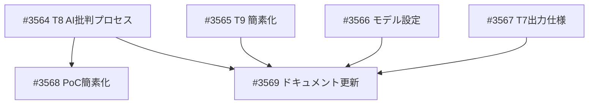

# CA-Eval ワークフロー: 設計書同期更新

**作成日**: 2026-02-18
**ステータス**: 計画中
**タイプ**: workflow
**GitHub Project**: [#49](https://github.com/users/YH-05/projects/49)
**元設計書**: `analyst/claude_code/workflow_design.md`

## 背景と目的

### 背景

CA-Eval ワークフロー詳細設計書（2026-02-17更新）にて以下の再設計が行われた：

1. **T8 の再設計**: 「3層検証（20チェック項目）」→「AI批判プロセス（critique → revision 2段階）」
2. **T9 の簡素化**: 5メトリクス→1メトリクス、不合格でもブロックしない
3. **T7 の拡張**: `applied_rules` / `not_applied_rules` / `confidence_rationale` の追加
4. **PoC 簡素化方針**: 全エージェント Sonnet 4.5 固定、四半期レポート種別区別の省略

既存のエージェント定義（ca-eval-lead.md, ca-report-generator.md 等）は旧設計に基づいており、設計書との乖離が生じている。

### 目的

既存エージェント定義・スキル・コマンドを設計書の最新版に同期する。

### 成功基準

- [ ] 全エージェント定義が設計書 §3-§4 と整合している
- [ ] `/ca-eval ORLY` で PoC 実行が可能（エージェント定義の整合性確認）
- [ ] T8 出力が `critique.json` + `revised-report.md`
- [ ] T9 出力が簡素化版 `accuracy-report.json`（1メトリクス）

## ギャップ分析結果

| GAP | 分類 | 重大度 | ファイル | 概要 |
|-----|------|--------|---------|------|
| GAP-1 | T8再設計 | Critical | ca-eval-lead.md | 3層検証→AI批判プロセス |
| GAP-2 | T9簡素化 | Major | ca-eval-lead.md | 5メトリクス→1メトリクス、非ブロック |
| GAP-3 | T7拡張 | Major | ca-report-generator.md | structured.json に applied_rules等追加、draft-report.md |
| GAP-4 | モデル設定 | Major | ca-eval-lead.md | 全チームメイト Sonnet 4.5 固定 |
| GAP-5 | PoC簡素化 | Minor | ca-report-parser.md | ①/②区別省略 |
| GAP-6 | ドキュメント | Minor | SKILL.md, ca-eval.md | 整合性更新 |

## 実装計画

### ファイルマップ

| 操作 | ファイルパス | 説明 |
|------|------------|------|
| 変更 | `.claude/agents/deep-research/ca-eval-lead.md` | T8→AI批判プロセス、T9→簡素化、モデル設定 |
| 変更 | `.claude/agents/ca-report-generator.md` | T7→draft出力、structured.json拡張 |
| 変更 | `.claude/agents/ca-report-parser.md` | PoC簡素化モード |
| 変更 | `.claude/skills/ca-eval/SKILL.md` | 設計書反映 |
| 変更 | `.claude/commands/ca-eval.md` | 微修正 |

### リスク評価

| リスク | 影響度 | 対策 |
|--------|--------|------|
| ca-eval-lead.md が大きすぎて意図しない変更 | 高 | セクション単位で差分適用、変更前後の行数比較 |
| 設計書と既存パターンの混在 | 中 | 変更箇所にコメントで設計書セクション番号を明記 |

## タスク一覧

### Wave 1（並行開発可能）

- [ ] ca-eval-lead T8: AI批判プロセスへ再設計
  - Issue: [#3564](https://github.com/YH-05/finance/issues/3564)
  - ステータス: todo

- [ ] ca-eval-lead T9: 精度検証の簡素化
  - Issue: [#3565](https://github.com/YH-05/finance/issues/3565)
  - ステータス: todo

- [ ] ca-eval-lead: 全チームメイト Sonnet 4.5 モデル固定
  - Issue: [#3566](https://github.com/YH-05/finance/issues/3566)
  - ステータス: todo

- [ ] ca-report-generator T7: 出力仕様の拡張
  - Issue: [#3567](https://github.com/YH-05/finance/issues/3567)
  - ステータス: todo

### Wave 2（Wave 1 完了後）

- [ ] ca-report-parser: PoC簡素化（レポート種別区別の省略）
  - Issue: [#3568](https://github.com/YH-05/finance/issues/3568)
  - ステータス: todo
  - 依存: #3564

- [ ] SKILL.md・Command定義の整合性更新
  - Issue: [#3569](https://github.com/YH-05/finance/issues/3569)
  - ステータス: todo
  - 依存: #3564, #3565, #3566, #3567

## 依存関係図

---

**最終更新**: 2026-02-18
