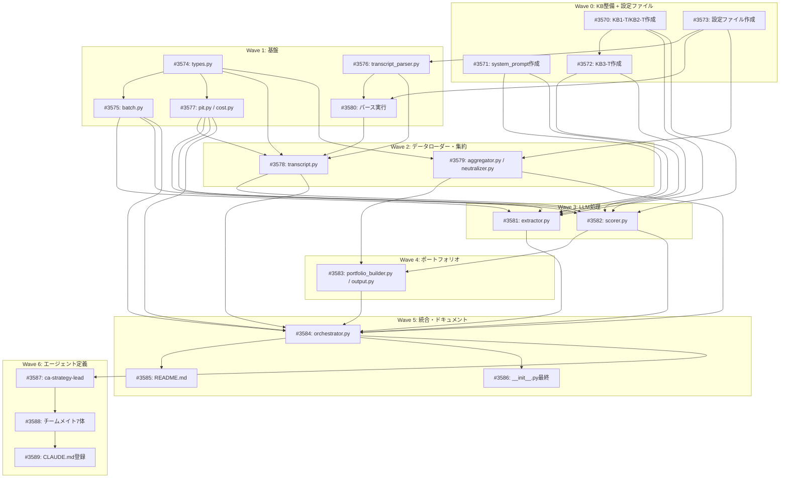

# ca_strategy (Simple AI Investment Strategy PoC)

**作成日**: 2026-02-18
**ステータス**: 計画中
**タイプ**: package (from_plan_file)
**GitHub Project**: [#50](https://github.com/users/YH-05/projects/50)
**パッケージ**: `src/dev/ca_strategy/`

## 背景と目的

### 背景

決算トランスクリプト（S&P Capital IQ）からAIが競争優位性を抽出し、KY（アナリストY）の投資判断軸（dogma.md / KB1-KB3）でスコアリングしてセクター中立ポートフォリオを構築するPoC。既存のca-eval（アナリストレポート評価）の知見を、決算トランスクリプトに応用する。

### 目的

- 300銘柄 x 3四半期（2015年Q1-Q3）の決算トランスクリプトから競争優位性を自動抽出
- KB1/KB2/KB3ルールに基づくスコアリングで30-50銘柄のポートフォリオを構築
- cutoff_date = 2015-09-30 でPoiT制約を遵守

### 成功基準

- [ ] 300銘柄のトランスクリプトが正常にパース・処理されること
- [ ] 5-15件/銘柄の競争優位性が抽出されること
- [ ] スコア分布が目標値（90%:6%, 70%:26%, 50%:35%, 30%:26%, 10%:6%）に概ね一致すること
- [ ] セクター中立ポートフォリオ（30-50銘柄）が構築されること
- [ ] LLMコストが$50以下であること
- [ ] 全処理がチェックポイントから再開可能であること

## リサーチ結果

### 既存パターン

| コンポーネント | ファイル | 再利用方針 |
|--------------|---------|-----------|
| Normalizer | `src/factor/core/normalizer.py` | セクター中立化で直接使用（`normalize_by_group`, robust Z-score） |
| Portfolio | `src/strategy/portfolio.py` | ポートフォリオ構築で直接使用（Holding dataclass） |
| EdgarFetcher | `src/edgar/fetcher.py` | SEC 10-K/10-Q取得のパターン参照 |
| BatchFetcher | `src/edgar/batch.py` | バッチ処理パターン参照（チェックポイントは独自実装） |
| ca-claim-extractor | `.claude/agents/ca-claim-extractor.md` | 抽出・スコアリングロジックのベース |

### 技術的考慮事項

- S&P Capital IQ JSONに末尾カンマ問題あり（修正パース必要）
- 32767文字切り詰めが一部トランスクリプトで発生（メタデータに記録）
- 非標準Bloomberg Ticker（数字開始5件）のマッピングが必要
- LLMコスト: 300銘柄 x 3四半期 x 2フェーズ で約$30見込み

## 実装計画

### アーキテクチャ概要

5フェーズパイプライン:
1. **Phase 1**: トランスクリプトからLLMで競争優位性を5-15件抽出
2. **Phase 2**: KB1-T/KB2-T/KB3-T + dogma.md でスコアリング（確信度10-90%）
3. **Phase 3**: セクター内Z-score正規化（Normalizer使用）
4. **Phase 4**: ベンチマークウェイトベースのポートフォリオ構築
5. **Phase 5**: JSON/CSV/Markdown出力生成

### ファイルマップ

| 操作 | ファイルパス | 説明 |
|------|------------|------|
| 新規 | `src/dev/ca_strategy/types.py` | 全Pydanticモデル定義（~300行） |
| 新規 | `src/dev/ca_strategy/transcript_parser.py` | S&P Capital IQ JSONパーサー（~250行） |
| 新規 | `src/dev/ca_strategy/transcript.py` | トランスクリプトローダー（~150行） |
| 新規 | `src/dev/ca_strategy/extractor.py` | Phase 1 LLM抽出（~250行） |
| 新規 | `src/dev/ca_strategy/scorer.py` | Phase 2 スコアリング（~280行） |
| 新規 | `src/dev/ca_strategy/aggregator.py` | スコア集約（~150行） |
| 新規 | `src/dev/ca_strategy/neutralizer.py` | セクター中立化（~100行） |
| 新規 | `src/dev/ca_strategy/portfolio_builder.py` | ポートフォリオ構築（~180行） |
| 新規 | `src/dev/ca_strategy/output.py` | 出力生成（~300行） |
| 新規 | `src/dev/ca_strategy/pit.py` | PoiT管理（~80行） |
| 新規 | `src/dev/ca_strategy/cost.py` | コスト追跡（~120行） |
| 新規 | `src/dev/ca_strategy/batch.py` | バッチ処理（~200行） |
| 新規 | `src/dev/ca_strategy/orchestrator.py` | 統合オーケストレーター（~350行） |

### リスク評価

| リスク | 影響度 | 対策 |
|--------|--------|------|
| LLMコスト超過 | 高 | CostTrackerで$50上限チェック |
| PoiTバイアス | 高 | pit.pyでcutoff_date厳密管理 |
| トランスクリプト品質 | 中 | 32767文字切り詰め検出・メタデータ記録 |
| バッチ処理中断 | 中 | チェックポイント機能で再開可能 |
| KB適応の精度 | 中 | KB3-T few-shotでキャリブレーション |

## タスク一覧

### Wave 0: KB整備 + 設定ファイル準備（7.5-9.5h）

- [ ] KB1-T/KB2-T ルール集のトランスクリプト適応
  - Issue: [#3570](https://github.com/YH-05/finance/issues/3570)
  - ステータス: todo
  - 見積もり: 2-3h

- [ ] system_prompt_transcript.md の作成
  - Issue: [#3571](https://github.com/YH-05/finance/issues/3571)
  - ステータス: todo
  - 見積もり: 1h

- [ ] KB3-T few-shot 集の作成（5銘柄）
  - Issue: [#3572](https://github.com/YH-05/finance/issues/3572)
  - ステータス: todo
  - 依存: #3570
  - 見積もり: 3-4h

- [ ] 設定ファイルの作成（ticker_mapping / universe / benchmark_weights）
  - Issue: [#3573](https://github.com/YH-05/finance/issues/3573)
  - ステータス: todo
  - 見積もり: 1.5h

### Wave 1: 基盤 -- 型定義・パーサー・ユーティリティ（7.5h）

- [ ] types.py -- 全Pydanticモデル定義
  - Issue: [#3574](https://github.com/YH-05/finance/issues/3574)
  - ステータス: todo
  - 見積もり: 2h

- [ ] batch.py -- バッチ処理ユーティリティ
  - Issue: [#3575](https://github.com/YH-05/finance/issues/3575)
  - ステータス: todo
  - 依存: #3574
  - 見積もり: 1.5h

- [ ] transcript_parser.py -- S&P Capital IQ JSONパーサー
  - Issue: [#3576](https://github.com/YH-05/finance/issues/3576)
  - ステータス: todo
  - 依存: #3573, #3574
  - 見積もり: 2h

- [ ] pit.py / cost.py -- PoiT管理・コスト追跡
  - Issue: [#3577](https://github.com/YH-05/finance/issues/3577)
  - ステータス: todo
  - 依存: #3574
  - 見積もり: 1.5h

- [ ] トランスクリプトパース実行（全月次ファイル）
  - Issue: [#3580](https://github.com/YH-05/finance/issues/3580)
  - ステータス: todo
  - 依存: #3573, #3576
  - 見積もり: 0.5h

### Wave 2: データローダー・集約ロジック（3.5h）

- [ ] transcript.py -- トランスクリプトローダー・バリデーション
  - Issue: [#3578](https://github.com/YH-05/finance/issues/3578)
  - ステータス: todo
  - 依存: #3574, #3576, #3577
  - 見積もり: 1.5h

- [ ] aggregator.py / neutralizer.py -- スコア集約・セクター中立化
  - Issue: [#3579](https://github.com/YH-05/finance/issues/3579)
  - ステータス: todo
  - 依存: #3573, #3574
  - 見積もり: 2h

### Wave 3: LLM処理（6h）

- [ ] extractor.py -- Phase 1 LLM競争優位性抽出
  - Issue: [#3581](https://github.com/YH-05/finance/issues/3581)
  - ステータス: todo
  - 依存: #3570, #3571, #3572, #3574, #3575, #3577, #3578
  - 見積もり: 3h

- [ ] scorer.py -- Phase 2 KB1/KB2/KB3スコアリング
  - Issue: [#3582](https://github.com/YH-05/finance/issues/3582)
  - ステータス: todo
  - 依存: #3570, #3571, #3572, #3574, #3575, #3577
  - 見積もり: 3h

### Wave 4: ポートフォリオ構築・出力（3h）

- [ ] portfolio_builder.py / output.py -- ポートフォリオ構築・出力生成
  - Issue: [#3583](https://github.com/YH-05/finance/issues/3583)
  - ステータス: todo
  - 依存: #3574, #3579, #3582
  - 見積もり: 3h

### Wave 5: 統合・ドキュメント・仕上げ（4h）

- [ ] orchestrator.py -- ワークフロー統合オーケストレーター
  - Issue: [#3584](https://github.com/YH-05/finance/issues/3584)
  - ステータス: todo
  - 依存: #3574, #3575, #3577, #3578, #3579, #3581, #3582, #3583
  - 見積もり: 2.5h

- [ ] README.md -- パッケージドキュメント作成
  - Issue: [#3585](https://github.com/YH-05/finance/issues/3585)
  - ステータス: todo
  - 依存: #3584
  - 見積もり: 1h

- [ ] __init__.py 最終更新・パッケージエクスポート確定
  - Issue: [#3586](https://github.com/YH-05/finance/issues/3586)
  - ステータス: todo
  - 依存: #3584
  - 見積もり: 0.5h

### Wave 6: エージェント定義ファイル作成（4h）

- [ ] ca-strategy-lead エージェント定義の作成
  - Issue: [#3587](https://github.com/YH-05/finance/issues/3587)
  - ステータス: todo
  - 依存: #3584
  - 見積もり: 1.5h

- [ ] ca-strategy チームメイトエージェント定義の作成（7エージェント）
  - Issue: [#3588](https://github.com/YH-05/finance/issues/3588)
  - ステータス: todo
  - 依存: #3587
  - 見積もり: 2h

- [ ] CLAUDE.md へのca-strategyエージェント登録
  - Issue: [#3589](https://github.com/YH-05/finance/issues/3589)
  - ステータス: todo
  - 依存: #3588
  - 見積もり: 0.5h

## 依存関係図

---

**最終更新**: 2026-02-18
