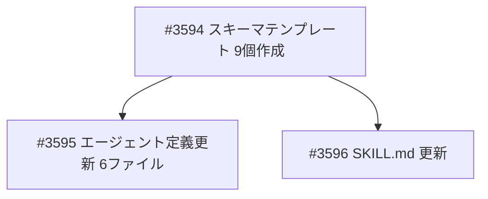

# ca-eval 構造化出力スキーマ定義

**作成日**: 2026-02-18
**ステータス**: 計画中
**タイプ**: from_plan_file
**GitHub Project**: [#51](https://github.com/users/YH-05/projects/51)

## 背景と目的

### 背景

ca-eval ワークフローの構造化出力 JSON ファイルに以下の問題がある：

1. **スキーマ定義の分散**: 各エージェント Markdown にインライン記述されており独立ファイルがない
2. **定義と実出力の乖離**: claims.json を筆頭に、フィールド名・構造が定義と実出力で大きく異なる
3. **サンプル間の不一致**: AME版 vs ATCOA版で構造が異なる（fact-check.json のグループ化方向が逆等）
4. **sec-data.json のスキーマ未定義**: finance-sec-filings は ca-eval 専用でなくスキーマ定義なし
5. **Pydantic モデル不在**: 型安全性・バリデーションの仕組みがない

### 目的

- 9 つの構造化出力すべての JSON スキーマをテンプレートファイルとして独立管理
- AME 最新版（`CA_eval_20260218-1454_AME`）の実出力構造を正とする
- 各エージェント定義のインラインスキーマをテンプレート参照に置換
- SKILL.md にスキーマファイル一覧を追記

### 成功基準

- [ ] 9 個のスキーマテンプレートファイルが作成されている
- [ ] 6 個のエージェント定義がテンプレート参照に更新されている
- [ ] SKILL.md にスキーマ一覧テーブルが追加されている
- [ ] `/ca-eval` 実行時の出力がスキーマに準拠している

## リサーチ結果

### AME版 vs ATCOA版 構造差分

| ファイル | AME版（正） | ATCOA版（旧） | 乖離度 |
|---------|------------|-------------|--------|
| `research-meta.json` | `task_results{}` + `outputs{}` + `summary{}` | `outputs{}` のみ | 大 |
| `claims.json` | `rule_applications{}` オブジェクト形式 | `rule_application{}` フラット文字列 | 大 |
| `fact-check.json` | `fact_checks[].factual_claims_checked[]` ネスト | `fact_checks[]` フラット | 大 |
| `pattern-verification.json` | `pattern_results[]` 統一 | 差異あり | 中 |
| `structured.json` | `rule_summary{}` 文字列値 | 差異あり | 中 |
| `critique.json` | ほぼ共通 | ほぼ共通 | 小 |
| `accuracy-report.json` | `mode_determination{}` 統一 | `data_quality_note` あり | 小 |

### 参考実装

| ファイル | 説明 |
|---------|------|
| `.claude/skills/ca-eval/templates/draft-report-format.md` | 既存の Markdown テンプレート（同パターンで参照） |
| `.claude/skills/ca-eval/templates/revised-report-format.md` | 既存の Markdown テンプレート |
| `research/CA_eval_20260218-1454_AME/` | AME版実出力（正のソース） |
| `research/CA_eval_20260218-1405_ATCOA/` | ATCOA版実出力（差分参照） |

## 実装計画

### アーキテクチャ概要

```
.claude/skills/ca-eval/templates/schemas/
├── research-meta.schema.md       <- T0 (ca-eval-lead)
├── sec-data.schema.md            <- T1 (ca-eval-lead/sec-collector)
├── parsed-report.schema.md       <- T2 (ca-report-parser)
├── claims.schema.md              <- T4 (ca-claim-extractor)
├── fact-check.schema.md          <- T5 (ca-fact-checker)
├── pattern-verification.schema.md <- T6 (ca-pattern-verifier)
├── structured.schema.md          <- T7 (ca-report-generator)
├── critique.schema.md            <- T8 (ca-eval-lead)
└── accuracy-report.schema.md     <- T9 (ca-eval-lead)
```

### ファイルマップ

| 操作 | ファイルパス | 説明 |
|------|------------|------|
| 新規作成 | `templates/schemas/*.schema.md` (9個) | スキーマテンプレート |
| 変更 | `.claude/agents/ca-report-parser.md` | インラインスキーマ→参照 |
| 変更 | `.claude/agents/ca-claim-extractor.md` | インラインスキーマ→参照 |
| 変更 | `.claude/agents/ca-fact-checker.md` | インラインスキーマ→参照 |
| 変更 | `.claude/agents/ca-pattern-verifier.md` | インラインスキーマ→参照 |
| 変更 | `.claude/agents/ca-report-generator.md` | インラインスキーマ→参照 |
| 変更 | `.claude/agents/deep-research/ca-eval-lead.md` | T0/T1/T8/T9 スキーマ参照追加 |
| 変更 | `.claude/skills/ca-eval/SKILL.md` | スキーマ一覧テーブル追加 |

### リスク評価

| リスク | 影響度 | 対策 |
|--------|--------|------|
| スキーマが厳密すぎて柔軟性を損なう | 中 | オプショナルフィールドを明示し柔軟性を確保 |
| エージェントがスキーマファイルを Read しない | 低 | 「Read で読み込み」を明記し、制約を強調 |

## タスク一覧

### Wave 1（並行開発可能）

- [ ] スキーマテンプレートファイル 9 個の作成
  - Issue: [#3594](https://github.com/YH-05/finance/issues/3594)
  - ステータス: todo

### Wave 2（Wave 1 完了後）

- [ ] エージェント定義のインラインスキーマをテンプレート参照に置換（6ファイル）
  - Issue: [#3595](https://github.com/YH-05/finance/issues/3595)
  - ステータス: todo
  - 依存: #3594

- [ ] SKILL.md のテンプレートファイルセクション更新
  - Issue: [#3596](https://github.com/YH-05/finance/issues/3596)
  - ステータス: todo
  - 依存: #3594

## 依存関係図



---

**最終更新**: 2026-02-18
