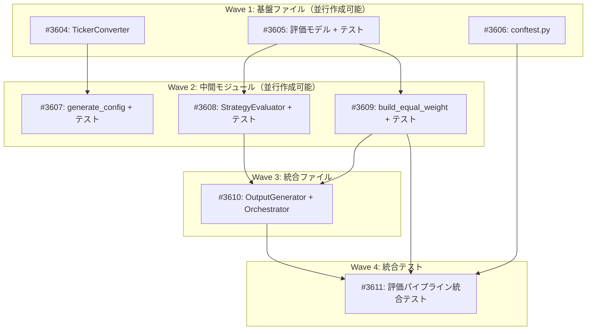

# Simple AI Investment Strategy PoC - 残作業実装

**作成日**: 2026-02-20
**完了日**: 2026-02-20
**ステータス**: 完了
**タイプ**: from_plan_file
**GitHub Project**: [#52](https://github.com/users/YH-05/projects/52)

## 背景と目的

### 背景

AI駆動の競争優位性ベース投資戦略の簡易 PoC。既存の `src/dev/ca_strategy/` パイプライン（Phase 0-3完了済み）に対して残作業を実装する。フル MAS（Multi-Agent System）の前段として位置づけ。

- **ユニバース**: `data/Transcript/list_portfolio_20151224.json` 準拠（408エントリ → 390ユニーク銘柄）
- **トランスクリプト**: 320/390銘柄（82.1%）にパース済みトランスクリプトあり
- **データソース**: 既存 S&P Capital IQ トランスクリプト JSON（2015Q1-Q3）
- **PoiTカットオフ**: 2015-09-30

### 目的

- 等ウェイトポートフォリオ構築機能の追加
- ACWI対比パフォーマンス評価・アナリスト相関計算モジュールの追加
- 設定ファイル（universe.json, benchmark_weights.json）の生成
- 既存コード含む包括的テストスイートの作成

### 成功基準

- [x] 閾値ベースの等ウェイトポートフォリオが構築できること
- [x] ACWI対比パフォーマンス（Sharpe, MaxDD, Beta, IR）が算出できること
- [x] KY/AKアナリストスコアとのSpearman順位相関が計算できること
- [x] 全テスト（既存+新規）が PASS すること
- [x] make check-all が成功すること

## リサーチ結果

### 既存パターン

- **RiskCalculator** (`src/strategy/risk/calculator.py`): ACWI対比パフォーマンス評価に直接利用可能
- **calculate_correlation** (`src/analyze/statistics/correlation.py`): Spearman順位相関計算
- **PortfolioBuilder内部メソッド**: `_compute_sector_counts()`, `_normalize_weights()` が等ウェイト版で再利用可能
- **日本語テスト名規則**: `test_正常系_`, `test_異常系_`, `test_エッジケース_`

### 参考実装

| ファイル | 説明 |
|---------|------|
| `src/strategy/risk/calculator.py` | パフォーマンス指標計算（Sharpe, MaxDD, Beta, IR） |
| `src/strategy/risk/metrics.py` | 評価結果の構造化パターン（RiskMetricsResult） |
| `src/analyze/statistics/correlation.py` | Spearman/Kendall 順位相関計算 |
| `src/market/yfinance/fetcher.py` | ACWI株価データ取得 |
| `tests/dev/ca_strategy/unit/test_portfolio_builder.py` | テストヘルパー関数パターン |

### 技術的考慮事項

- Bloomberg Ticker→ベースティッカー変換が必要（390銘柄、約40種類の取引所コード対応）
  - `TickerConverter`: Bloomberg 取引所コード→yfinance サフィックスのマッピング
  - `generate_config.py`: ベースティッカー（Bloomberg 先頭トークン）で `universe.json` を生成
  - `_BLOOMBERG_OVERRIDES`: 曖昧な取引所コード（NR, NQ, GK, LI）のオーバーライド
  - `ticker_mapping.json`: 数字始まり・歴史的ティッカーの解決（26件）
- KY/AKアナリストスコアのカバレッジ率は約20%（84/408件）
- MSCI ACWIセクターウェイトは時価総額近似で代用（有料データベース不要）
- トランスクリプトカバレッジ: 320/390銘柄（82.1%）、70銘柄はトランスクリプトなしでスキップ

## 実装計画

### アーキテクチャ概要

既存パイプライン（Phase 0-3）に7コンポーネントを追加:
1. `build_equal_weight()` — 閾値ベースの等ウェイトポートフォリオ（セクター制約なし）
2. `StrategyEvaluator` — パフォーマンス+アナリスト相関+透明性の3軸評価
3. `TickerConverter` — Bloomberg→yfinance変換（ルールベース+オーバーライド辞書）
4. `generate_config.py` — universe.json / benchmark_weights.json 生成
5. 評価型モデル群 — PerformanceMetrics, AnalystCorrelation, TransparencyMetrics, EvaluationResult, AnalystScore
6. OutputGenerator評価セクション — evaluation_summary.md / evaluation_results.json
7. Orchestrator統合 — `run_equal_weight_pipeline(thresholds)`

### ファイルマップ

| 操作 | ファイルパス | 説明 |
|------|------------|------|
| 新規作成 | `src/dev/ca_strategy/ticker_converter.py` | Bloomberg→yfinance変換（約120行） |
| 変更 | `src/dev/ca_strategy/types.py` | 評価モデル5種追加（約100行追加） |
| 新規作成 | `src/dev/ca_strategy/evaluator.py` | 3軸戦略評価（約200行） |
| 変更 | `src/dev/ca_strategy/portfolio_builder.py` | build_equal_weight() 追加（約60行追加） |
| 新規作成 | `src/dev/ca_strategy/generate_config.py` | 設定ファイル生成（約150行） |
| 変更 | `src/dev/ca_strategy/output.py` | 評価出力メソッド追加（約80行追加） |
| 変更 | `src/dev/ca_strategy/orchestrator.py` | 等ウェイト+評価統合（約120行追加） |
| 新規作成 | `tests/dev/ca_strategy/conftest.py` | 共通フィクスチャ（約120行） |
| 新規作成 | `tests/dev/ca_strategy/unit/test_ticker_converter.py` | 変換テスト |
| 変更 | `tests/dev/ca_strategy/unit/test_types.py` | 新モデルテスト追加 |
| 新規作成 | `tests/dev/ca_strategy/unit/test_evaluator.py` | 評価テスト |
| 変更 | `tests/dev/ca_strategy/unit/test_portfolio_builder.py` | 等ウェイトテスト追加 |
| 新規作成 | `tests/dev/ca_strategy/unit/test_generate_config.py` | 設定生成テスト |
| 新規作成 | `tests/dev/ca_strategy/integration/test_evaluation_pipeline.py` | 統合テスト |
| 変更 | `tests/dev/ca_strategy/unit/test_output.py` | 評価出力テスト追加 |

### リスク評価

| リスク | 影響度 | 対策 |
|--------|--------|------|
| 国際銘柄のティッカー変換不完全 | 中 | 対象取引所のみマッピング + オーバーライド辞書 |
| アナリストスコアのサンプルサイズ（70-84件） | 中 | サンプルサイズ・p値を報告、30未満で警告 |
| OutputGenerator後方互換性 | 低 | evaluation=None デフォルトで互換維持 |
| 既存モジュールインターフェース依存 | 低 | 安定した成熟モジュール、型ヒントで検知 |

## タスク一覧

### Wave 1（並行開発可能）

- [x] TickerConverter モジュールの作成
  - Issue: [#3604](https://github.com/YH-05/finance/issues/3604)
  - ステータス: done
  - 見積もり: 1h

- [x] 評価関連 Pydantic モデルの追加とテスト
  - Issue: [#3605](https://github.com/YH-05/finance/issues/3605)
  - ステータス: done
  - 見積もり: 1h

- [x] テスト共通フィクスチャ（conftest.py）の作成
  - Issue: [#3606](https://github.com/YH-05/finance/issues/3606)
  - ステータス: done
  - 見積もり: 0.5h

### Wave 2（Wave 1 完了後、並行開発可能）

- [x] generate_config.py の作成とテスト
  - Issue: [#3607](https://github.com/YH-05/finance/issues/3607)
  - ステータス: done
  - 依存: #3604
  - 見積もり: 1h

- [x] StrategyEvaluator モジュールの作成とテスト
  - Issue: [#3608](https://github.com/YH-05/finance/issues/3608)
  - ステータス: done
  - 依存: #3605
  - 見積もり: 1.5h

- [x] PortfolioBuilder 等ウェイトメソッド追加とテスト
  - Issue: [#3609](https://github.com/YH-05/finance/issues/3609)
  - ステータス: done
  - 依存: #3605
  - 見積もり: 1h

### Wave 3（Wave 2 完了後）

- [x] OutputGenerator 評価セクション追加と Orchestrator 統合
  - Issue: [#3610](https://github.com/YH-05/finance/issues/3610)
  - ステータス: done
  - 依存: #3608, #3609
  - 見積もり: 1.5h

### Wave 4（Wave 3 完了後）

- [x] 評価パイプライン統合テスト
  - Issue: [#3611](https://github.com/YH-05/finance/issues/3611)
  - ステータス: done
  - 依存: #3606, #3609, #3610
  - 見積もり: 0.5h

## 依存関係図

## 追加修正

### universe.json のソース修正（2026-02-20）

元計画 (`original-plan.md`) では `data/Transcript/list_portfolio_20151224.json`（408エントリ）をユニバースソースとして指定していたが、初回実装時に MSCI Kokusai 300銘柄で生成されていた。以下を修正:

1. **`ticker_converter.py`**: 不足していた20以上の取引所コード（US, GR, AU, SJ 等）を追加
2. **`generate_config.py`**: ベースティッカー方式に変更、`_BLOOMBERG_OVERRIDES` 追加、`ticker_mapping` パラメータ対応
3. **`universe.json`**: `list_portfolio_20151224.json` 準拠で再生成（390ユニーク銘柄、320がトランスクリプト対応）
4. **`benchmark_weights.json`**: 同ソースから再生成

---

**最終更新**: 2026-02-20（universe.json ソース修正・元計画との整合）
