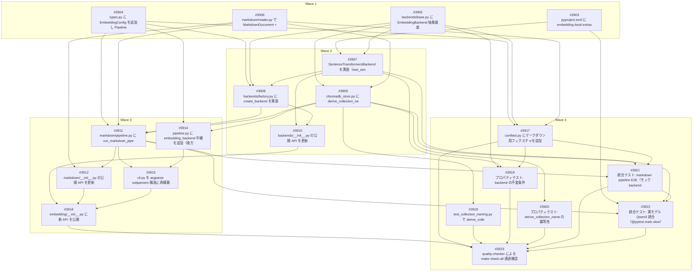

# ローカル埋め込みバックエンド統合（Qwen3 + マークダウンパイプライン）

**作成日**: 2026-04-10
**ステータス**: 計画中
**タイプ**: from_plan_file (package extension)
**GitHub Project**: [#112](https://github.com/users/YH-05/projects/112)
**対象パッケージ**: `src/embedding/`

## 背景と目的

### 背景

`src/embedding/` パッケージは現在、ニュース記事 JSON を入力として ChromaDB に格納するパイプラインを提供しているが、格納されるベクトルは **すべて 768 次元のゼロベクトル（ダミー）** であり、実際の埋め込みモデルは未統合。

クオンツ分析のために、ローカルに保存したマークダウンファイル（リサーチレポート、トランスクリプト要約、SEC EDGAR 抽出テキスト等）を実埋め込みベクトルとして ChromaDB に格納し、ベクトル検索・類似度計算に使えるようにする。

### 目的

1. モデル切り替え可能な埋め込みエンジンを `embedding` パッケージに統合する
2. マークダウンディレクトリを再帰的に取り込んで埋め込み・格納する新パイプラインを追加する
3. 既存ニュースパイプラインの挙動を壊さず、段階的に実埋め込みへ移行する道を用意する

### 成功基準

- [ ] `EmbeddingBackend` 抽象基底クラスと `SentenceTransformersBackend`（Qwen3-Embedding-0.6B）が動作する
- [ ] マークダウンディレクトリを再帰的に埋め込んで ChromaDB に格納できる
- [ ] ChromaDB コレクションがモデル別に自動命名される (`{base}__{model_slug}`)
- [ ] 既存ニュースパイプライン (`run_pipeline`) が `backend=None` で従来通り動作する（既存テスト全通過）
- [ ] CLI `embed-md` サブコマンドが動作し、`embedding-pipeline` スクリプトと `python -m embedding` は後方互換
- [ ] 単体・プロパティ・統合テストが追加され `make check-all` が通る
- [ ] 実モデル統合テスト（`@pytest.mark.slow`）が手動で通る

## リサーチ結果

### 参考実装

| ファイル | 参考にすべき点 |
|---------|---------------|
| `src/news/collectors/base.py`, `src/news/extractors/base.py` | ABC + `@abstractmethod` + `@property` パターン |
| `src/academic/__main__.py` | argparse subparsers 構造（`_build_parser` / `main(argv)` / `_handle_<cmd>`） |
| `src/embedding/chromadb_store.py:26-30` | オプショナル import（`try/except ImportError` + `None` チェック） |
| `tests/embedding/conftest.py:73-137` | テストフィクスチャパターン |

### 技術的考慮事項（リサーチで判明）

- **Qwen3-Embedding-0.6B は 1024 次元**（設計書のダミー 768 と異なる）、MRL で 32-1024 可変、max_seq_length=32K
- **sentence-transformers>=2.7.0 必須**、Mac では `flash_attention_2` 非推奨（MPS 未対応）
- **PYTORCH_ENABLE_MPS_FALLBACK=1 は torch import 前に設定必須** → `__init__` 内で `os.environ.setdefault()` 後に遅延 import
- **ChromaDB のコレクション次元数は最初の add() で固定、変更不可** → `derive_collection_name` でモデル別物理分離
- **ChromaDB metadata は str/int/float/bool のみ**（list/dict 不可）
- **numpy 2.4.1 インストール済み、chromadb / sentence-transformers / torch は未インストール**
- **既存テストは backend 引数を渡さない** → `backend=None` デフォルトで自動後方互換
- **既存コレクション `gemini-embedding-001`（768次元）と新 `{base}__qwen3-embedding-0.6b`（1024次元）は物理的に分かれる**

## 実装計画

### アーキテクチャ概要

src/embedding/ に『モデル切り替え可能な EmbeddingBackend 層』と『マークダウン再帰取り込みパイプライン』を追加する。backends/ サブパッケージに ABC ベースの Strategy パターンで EmbeddingBackend / SentenceTransformersBackend / factory を配置し、markdown/ サブパッケージに reader と pipeline を配置する。既存の chromadb_store.py / pipeline.py / cli.py は後方互換性を維持したまま拡張する（既存テスト全通過が必須条件）。CLI は argparse subparsers に再構築し、サブコマンドなし・embedding-pipeline スクリプトはニュースパイプラインを呼ぶ完全後方互換構造を保ちつつ、新規に embed-md / embed-news サブコマンドを追加する。sentence-transformers と torch は新 optional-dependencies 'embedding-local' に分離し、chromadb_store と同じ try/except ImportError の遅延 import パターンで pyright reportMissingImports='error' を回避する。Qwen3-Embedding-0.6B のデフォルト次元 1024 は derive_collection_name による物理分離で既存 gemini-embedding-001 (768-dim) コレクションと衝突しない。

### ディレクトリ構造

```
src/embedding/
├── backends/                    # 新規
│   ├── __init__.py
│   ├── base.py                  # EmbeddingBackend ABC
│   ├── factory.py               # create_backend()
│   └── sentence_transformers.py # SentenceTransformersBackend
├── markdown/                    # 新規
│   ├── __init__.py
│   ├── reader.py                # MarkdownDocument + read_markdown_directory
│   └── pipeline.py              # run_markdown_pipeline
├── chromadb_store.py            # 拡張: derive_collection_name, store_markdown_documents
├── pipeline.py                  # 拡張: backend オプション
├── types.py                     # 拡張: EmbeddingConfig 追加
├── cli.py                       # 再構築: subparsers (embed-md / embed-news)
└── __init__.py                  # 新 API 公開
```

### リスク評価

| リスク | レベル | 対策 |
|--------|--------|------|
| 既存ニュースパイプライン（run_pipeline / tests/embedding/unit/test_pipeline.py の全テスト）が backend オプション追加で壊れる可能性 | high | PipelineConfig.embedding_backend = None をデフォルトにして既存挙動を完全維持。既存テストは修正不要。Wave 3 完了時点で test_pipeline.py  |
| CLI 後方互換の壊れ: embedding-pipeline スクリプトと 'python -m embedding'（サブコマンドなし）が従来通り動かない | high | cli.py の main(argv) ディスパッチで args.command is None → _handle_embed_news(args) にフォールバック。既存 --news-dir / |
| sentence-transformers と torch のインストールコストが大きく、CI や開発者の uv sync 時間が増大する | medium | HF1 回答に基づき 'embedding-local' 新 extras に分離。デフォルト開発環境（uv sync）には入らず、uv sync --extra embedding --extra  |
| torch 遅延 import の失敗: PYTORCH_ENABLE_MPS_FALLBACK=1 が torch import 後では無効になる | medium | SentenceTransformersBackend.__init__ 内で (1) os.environ.setdefault('PYTORCH_ENABLE_MPS_FALLBACK', '1' |
| sentence-transformers の import コストが pytest 起動時間を悪化させる | medium | 全 unit テストでは patch('embedding.backends.sentence_transformers._sentence_transformers', mock_st) のモジュー |
| ChromaDB コレクション次元固定制約との衝突（既存 768-dim コレクションと新 1024-dim の混在） | low | derive_collection_name('{base}__{slug}') でモデル別に物理分離。既存 gemini-embedding-001 (768-dim) コレクションと新 qwen3 |
| cli.py の subparsers 再構築で既存テスト（もしあれば）や引数 parsing ロジックが壊れる | medium | src/academic/__main__.py の _build_parser + main(argv) + _handle_<cmd> パターンを直接踏襲。embed-news サブコマンド内部で |
| pyright typeCheckingMode='basic' + reportMissingImports='error' により sentence_transformers / torch の型 | low | モジュールレベルは try: import sentence_transformers as _sentence_transformers / except ImportError: _sentenc |
| Wave 2 で chromadb_store.py 拡張と backends 実装を並行するため、依存関係の誤認による後戻りが発生しうる | low | Wave 1 で types.py + backends/base.py + markdown/reader.py + pyproject.toml の土台を完成させてから Wave 2 に進む。Wa |
| ChromaDB metadata の型制約（str/int/float/bool のみ）違反 | low | store_markdown_documents の metadata dict 構築時に file_size を int / file_mtime を str / embedding_dim を i |

### 見積もり: 18-24 hours

## タスク一覧

### Wave 1（並行開発可能）

土台層（依存なし、完全並列可能）。pyproject.toml 依存追加、types.py への EmbeddingConfig、backends/base.py 抽象クラス + base テスト、markdown/reader.py + reader テストを独立実装。

- [ ] [Wave1] pyproject.toml に embedding-local extras を追加
  - Issue: [#3903](https://github.com/YH-05/quants/issues/3903)
  - ラベル: `enhancement`
  - 見積もり: 0.5 hour
  - 依存: なし
- [ ] [Wave1] types.py に EmbeddingConfig を追加し PipelineConfig を拡張
  - Issue: [#3904](https://github.com/YH-05/quants/issues/3904)
  - ラベル: `enhancement`
  - 見積もり: 1 hour
  - 依存: なし
- [ ] [Wave1] backends/base.py に EmbeddingBackend 抽象基底クラスと test_base.py を追加
  - Issue: [#3905](https://github.com/YH-05/quants/issues/3905)
  - ラベル: `enhancement`
  - 見積もり: 1.5 hours
  - 依存: なし
- [ ] [Wave1] markdown/reader.py で MarkdownDocument + read_markdown_directory を実装
  - Issue: [#3906](https://github.com/YH-05/quants/issues/3906)
  - ラベル: `enhancement`
  - 見積もり: 2 hours
  - 依存: なし

### Wave 2（並行開発可能）

実装層（Wave 1 依存）。task-5 / task-6 / task-7 は論理的に並列実装可能。task-8 は task-5 と task-6 が終わってから実施。

- [ ] [Wave2] SentenceTransformersBackend を実装（test_sentence_transformers.py 含む）
  - Issue: [#3907](https://github.com/YH-05/quants/issues/3907)
  - ラベル: `enhancement`
  - 見積もり: 3 hours
  - 依存: #3903, #3905
- [ ] [Wave2] backends/factory.py に create_backend を実装（test_factory.py 含む）
  - Issue: [#3908](https://github.com/YH-05/quants/issues/3908)
  - ラベル: `enhancement`
  - 見積もり: 1 hour
  - 依存: #3904, #3905, #3907
- [ ] [Wave2] chromadb_store.py に derive_collection_name / store_markdown_documents / store_articles 拡張を追加
  - Issue: [#3909](https://github.com/YH-05/quants/issues/3909)
  - ラベル: `enhancement`
  - 見積もり: 3 hours
  - 依存: #3905, #3906
- [ ] [Wave2] backends/__init__.py の公開 API を更新
  - Issue: [#3910](https://github.com/YH-05/quants/issues/3910)
  - ラベル: `enhancement`
  - 見積もり: 0.5 hour
  - 依存: #3907, #3908

### Wave 3（逐次実行）

統合層（Wave 2 依存）。markdown pipeline 構築後、pipeline.py 後方互換拡張、CLI subparsers 再構築、最後に embedding/__init__.py 公開 API を更新。

- [ ] [Wave3] markdown/pipeline.py に run_markdown_pipeline の 7 ステップを実装
  - Issue: [#3911](https://github.com/YH-05/quants/issues/3911)
  - ラベル: `enhancement`
  - 見積もり: 3 hours
  - 依存: #3904, #3906, #3908, #3909
- [ ] [Wave3] markdown/__init__.py の公開 API を更新
  - Issue: [#3912](https://github.com/YH-05/quants/issues/3912)
  - ラベル: `enhancement`
  - 見積もり: 0.25 hour
  - 依存: #3906, #3911
- [ ] [Wave3] pipeline.py に embedding_backend 中継を追加（後方互換拡張）
  - Issue: [#3914](https://github.com/YH-05/quants/issues/3914)
  - ラベル: `enhancement`
  - 見積もり: 1 hour
  - 依存: #3904, #3909
- [ ] [Wave3] cli.py を argparse subparsers 構造に再構築
  - Issue: [#3915](https://github.com/YH-05/quants/issues/3915)
  - ラベル: `refactor`
  - 見積もり: 2.5 hours
  - 依存: #3911, #3914
- [ ] [Wave3] embedding/__init__.py に新 API を公開
  - Issue: [#3916](https://github.com/YH-05/quants/issues/3916)
  - ラベル: `enhancement`
  - 見積もり: 0.5 hour
  - 依存: #3910, #3912, #3915

### Wave 4（並行開発可能）

テスト + 品質保証層（Wave 1-3 全依存）。conftest 拡張、単体テスト、プロパティテスト、統合テスト、最後に quality-checker による make check-all 通過確認。task-13/14/15/16/20/21 は並列実行可能、task-22 は最後。

- [ ] [Wave4] conftest.py にマークダウン用フィクスチャを追加
  - Issue: [#3917](https://github.com/YH-05/quants/issues/3917)
  - ラベル: `test`
  - 見積もり: 1 hour
  - 依存: #3904, #3905, #3906
- [ ] [Wave4] test_collection_naming.py で derive_collection_name の単体テストを追加
  - Issue: [#3918](https://github.com/YH-05/quants/issues/3918)
  - ラベル: `test`
  - 見積もり: 0.75 hour
  - 依存: #3909
- [ ] [Wave4] プロパティテスト: backend の不変条件
  - Issue: [#3919](https://github.com/YH-05/quants/issues/3919)
  - ラベル: `test`
  - 見積もり: 1.5 hours
  - 依存: #3905, #3907, #3917
- [ ] [Wave4] プロパティテスト: derive_collection_name の冪等性
  - Issue: [#3920](https://github.com/YH-05/quants/issues/3920)
  - ラベル: `test`
  - 見積もり: 1 hour
  - 依存: #3909
- [ ] [Wave4] 統合テスト: markdown pipeline E2E（モック backend + 実 ChromaDB）
  - Issue: [#3921](https://github.com/YH-05/quants/issues/3921)
  - ラベル: `test`
  - 見積もり: 2 hours
  - 依存: #3909, #3911, #3917
- [ ] [Wave4] 統合テスト: 実モデル Qwen3 統合（@pytest.mark.slow）
  - Issue: [#3922](https://github.com/YH-05/quants/issues/3922)
  - ラベル: `test`
  - 見積もり: 1.5 hours
  - 依存: #3903, #3907, #3911, #3921
- [ ] [Wave4] quality-checker による make check-all 通過確認
  - Issue: [#3923](https://github.com/YH-05/quants/issues/3923)
  - ラベル: `test`
  - 見積もり: 1 hour
  - 依存: #3916, #3917, #3918, #3919, #3920, #3921, #3922

## 依存関係図



## クリティカルパス

#3905 → #3907 → #3908 → #3911 → #3915 → #3916 → #3923

## 関連ドキュメント

- 元プラン: [`original-plan.md`](./original-plan.md)
- GitHub Project: [#112](https://github.com/users/YH-05/projects/112)
- コーディング規約: `.claude/rules/coding-standards.md`
- テスト戦略: `.claude/rules/testing-strategy.md`

---

**最終更新**: 2026-04-10
