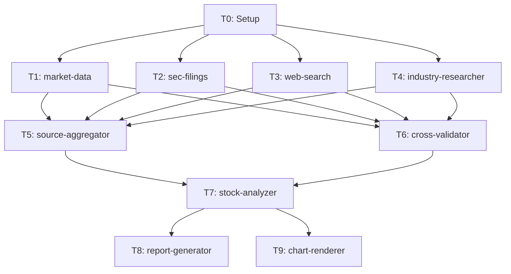

# dr-stock-lead 詳細設計書

## 概要

個別銘柄の包括的分析を行う Agent Teams リーダーエージェント。
`/dr-stock` コマンドから呼び出され、10タスク・5フェーズのワークフローを制御する。

### 設計方針

| 項目 | 方針 |
|------|------|
| 深度モード | **なし**（常にフルパイプライン実行） |
| 信頼度スコアリング | cross-validator に統合（専用エージェント不要） |
| 可視化 | Python チャートテンプレートの Bash 実行（エージェント不要） |
| 業界分析 | Python スクレイピングスクリプト + プリセット設定で収集 |

---

## タスク構成（10タスク）

```
Phase 0: Setup
  T0: research-meta.json 生成 + ディレクトリ作成

Phase 1: Data Collection（4並列）
  T1: finance-market-data     株価・財務指標・ピアグループデータ
  T2: finance-sec-filings     10-K/10-Q/8-K/Form4
  T3: finance-web              ニュース・アナリストレポート
  T4: industry-researcher      業界ポジション・競争優位性 ★新設

Phase 2: Integration + Validation（2並列）
  T5: dr-source-aggregator    raw-data.json 統合
  T6: dr-cross-validator      データ照合 + 信頼度付与（旧confidence-scorer統合）

Phase 3: Analysis
  T7: dr-stock-analyzer       包括的銘柄分析

Phase 4: Output（2並列）
  T8: dr-report-generator     レポート生成 + チャートスクリプト出力
  T9: chart-renderer           チャート出力（Bash でPython実行）

Phase 5: Cleanup
  TeamDelete + 完了通知
```

### 依存関係グラフ



---

## Phase 0: Setup

### T0: research-meta.json 生成

**実行者**: Lead 自身（エージェント不要）

1. リサーチID生成: `DR_stock_{YYYYMMDD}_{TICKER}`
2. ディレクトリ作成:
   ```
   research/{research_id}/
   ├── 00_meta/
   │   └── research-meta.json
   ├── 01_data_collection/
   ├── 02_validation/
   ├── 03_analysis/
   └── 04_output/
       └── charts/
   ```
3. research-meta.json 出力:
   ```json
   {
     "research_id": "DR_stock_20260211_AAPL",
     "type": "stock",
     "ticker": "AAPL",
     "created_at": "2026-02-11T10:00:00Z",
     "parameters": {
       "ticker": "AAPL",
       "peer_tickers": ["MSFT", "GOOGL", "AMZN", "META"],
       "analysis_period": "5y",
       "industry_preset": "Technology/Software_Infrastructure"
     },
     "status": "in_progress"
   }
   ```
4. **[HF0]** パラメータ確認: ticker、ピアグループ、分析期間をユーザーに提示

---

## Phase 1: Data Collection（4並列）

### T1: finance-market-data

**エージェント**: `finance-market-data`
**入力**: research-meta.json
**出力**: `01_data_collection/market-data.json`

| データ | ソース | 内容 |
|--------|--------|------|
| 株価（日足） | `src/market/yfinance/` | 5年分 OHLCV |
| ピア株価 | `src/market/yfinance/` | ピアグループ全銘柄の OHLCV |
| 財務指標 | yfinance.Ticker.info | P/E, P/B, EV/EBITDA, ROE, ROA 等 |
| ピア財務指標 | yfinance.Ticker.info | 同上（ピア全銘柄） |
| 配当履歴 | yfinance.Ticker.dividends | 5年分 |

### T2: finance-sec-filings

**エージェント**: `finance-sec-filings`
**入力**: research-meta.json
**出力**: `01_data_collection/sec-filings.json`

| データ | MCP ツール | 内容 |
|--------|-----------|------|
| 財務データ | `mcp__sec-edgar-mcp__get_financials` | 5年分の損益/BS/CF |
| 最近の 10-K/10-Q | `mcp__sec-edgar-mcp__get_recent_filings` | 直近2年分 |
| 8-K イベント | `mcp__sec-edgar-mcp__get_recent_filings` (8-K) | 直近1年 |
| インサイダー取引 | `mcp__sec-edgar-mcp__get_insider_summary` | サマリー |
| キーメトリクス | `mcp__sec-edgar-mcp__get_key_metrics` | 主要指標 |
| 10-K セクション | `mcp__sec-edgar-mcp__get_filing_sections` | Risk Factors, Competition |

### T3: finance-web

**エージェント**: `finance-web`
**入力**: research-meta.json
**出力**: `01_data_collection/web-data.json`

| データ | ツール | 検索クエリ例 |
|--------|--------|-------------|
| 最新ニュース | WebSearch | `"{TICKER}" latest news 2026` |
| アナリスト評価 | WebSearch | `"{TICKER}" analyst rating target price` |
| 決算レビュー | WebSearch | `"{TICKER}" earnings review Q{N} 2026` |
| 競合動向 | WebSearch | `"{TICKER}" vs competitors {peer_tickers}` |
| 経営陣動向 | WebSearch | `"{TICKER}" CEO management changes` |

最大20件の記事を WebFetch で本文取得。

### T4: industry-researcher ★新設

**エージェント**: 新規作成 `industry-researcher`
**入力**: research-meta.json + `data/config/industry-research-presets.json`
**出力**: `01_data_collection/industry-data.json`

**データ収集方式**: Python スクレイピングスクリプトの Bash 実行 + WebSearch 補完

```
収集フロー:
1. research-meta.json から industry_preset を取得
2. プリセット設定ファイルからスクレイピング対象・クエリを読み込み
3. 蓄積データ確認（data/raw/industry_reports/ に既存データがあるか）
   - 7日以内のデータあり → そのまま使用
   - なし or 古い → スクレイピングスクリプト実行
4. WebSearch で補完（最新の業界動向）
5. 10-K の Competition/Risk Factors セクションを参照
6. dogma.md の12判断ルールに基づく競争優位性評価フレームワーク適用
```

**データソース優先度**:

| 優先度 | ソース | 取得方法 | 内容 |
|--------|--------|---------|------|
| 1 | SEC EDGAR 10-K | T2 と共有 | Competition, Risk Factors セクション |
| 2 | コンサルレポート | Bash: `uv run python -m market.industry.collect` | McKinsey, BCG, Deloitte Insights |
| 3 | 投資銀行レポート | Bash: 同上 | Goldman, Morgan Stanley 公開部分 |
| 4 | 政府統計 API | Bash: 同上 | BLS 業界別データ |
| 5 | 業界専門メディア | WebSearch + WebFetch | セクター固有の専門サイト |

**プリセット設定**: `data/config/industry-research-presets.json`

```json
{
  "version": "1.0",
  "presets": {
    "Technology": {
      "Semiconductors": {
        "peer_groups": {
          "mega_cap": ["NVDA", "AVGO", "AMD", "INTC", "QCOM"],
          "equipment": ["ASML", "AMAT", "LRCX", "KLAC"]
        },
        "scraping_queries": {
          "consulting": [
            "semiconductor industry outlook 2026",
            "chip market forecast McKinsey BCG"
          ],
          "investment_bank": [
            "semiconductor sector report Goldman Morgan Stanley"
          ],
          "government": {
            "bls_series": ["CES3133440001"],
            "census_naics": ["3344"]
          }
        },
        "competitive_factors": [
          "製造プロセス技術", "設計IP", "顧客ロックイン", "規模の経済"
        ],
        "industry_media": [
          "https://www.semiconductors.org",
          "https://semiwiki.com"
        ],
        "key_metrics": [
          "gross_margin", "r_and_d_intensity", "capex_intensity"
        ]
      },
      "Software_Infrastructure": {
        "peer_groups": {
          "cloud": ["MSFT", "AMZN", "GOOGL", "CRM", "ORCL"],
          "cybersecurity": ["CRWD", "PANW", "FTNT", "ZS"]
        },
        "scraping_queries": {
          "consulting": [
            "cloud computing market 2026 Gartner",
            "SaaS industry trends McKinsey"
          ],
          "investment_bank": [
            "software sector equity research 2026"
          ]
        },
        "competitive_factors": [
          "ネットワーク効果", "スイッチングコスト", "エコシステム", "データ蓄積"
        ],
        "key_metrics": [
          "net_retention_rate", "rule_of_40", "cac_payback"
        ]
      }
    },
    "Healthcare": {
      "Pharmaceuticals": {
        "peer_groups": {
          "big_pharma": ["LLY", "NVO", "JNJ", "MRK", "ABBV", "PFE"],
          "biotech": ["AMGN", "GILD", "REGN", "VRTX"]
        },
        "scraping_queries": {
          "consulting": [
            "pharmaceutical industry outlook 2026",
            "drug pipeline analysis McKinsey"
          ]
        },
        "competitive_factors": [
          "パイプライン深度", "特許ポートフォリオ", "規制承認実績", "販売網"
        ],
        "industry_media": [
          "https://www.fiercepharma.com"
        ],
        "key_metrics": [
          "pipeline_value", "patent_cliff_exposure", "r_and_d_productivity"
        ]
      }
    },
    "Financials": {
      "Banks": {
        "peer_groups": {
          "money_center": ["JPM", "BAC", "WFC", "C", "GS", "MS"],
          "regional": ["USB", "PNC", "TFC", "FITB"]
        },
        "scraping_queries": {
          "consulting": [
            "banking industry outlook 2026",
            "fintech disruption banks McKinsey"
          ]
        },
        "competitive_factors": [
          "預金基盤", "ブランド信頼性", "テクノロジー投資", "規制対応力"
        ],
        "key_metrics": [
          "net_interest_margin", "efficiency_ratio", "roa", "cet1_ratio"
        ]
      }
    },
    "Consumer_Discretionary": {
      "Retail": {
        "peer_groups": {
          "e_commerce": ["AMZN", "BABA", "JD", "MELI"],
          "specialty": ["HD", "LOW", "TJX", "COST"]
        },
        "scraping_queries": {
          "consulting": [
            "retail industry trends 2026",
            "e-commerce market outlook Deloitte"
          ]
        },
        "competitive_factors": [
          "ブランド認知", "物流ネットワーク", "顧客データ", "価格競争力"
        ],
        "key_metrics": [
          "same_store_sales", "inventory_turnover", "customer_acquisition_cost"
        ]
      }
    },
    "Energy": {
      "Oil_Gas": {
        "peer_groups": {
          "integrated": ["XOM", "CVX", "SHEL", "TTE", "BP"],
          "upstream": ["COP", "EOG", "PXD", "DVN"]
        },
        "scraping_queries": {
          "consulting": [
            "energy transition outlook 2026",
            "oil gas industry McKinsey"
          ],
          "government": {
            "eia_series": ["PET.RWTC.D"]
          }
        },
        "competitive_factors": [
          "埋蔵量規模", "生産コスト", "精製能力", "エネルギー転換対応"
        ],
        "industry_media": [
          "https://www.eia.gov"
        ],
        "key_metrics": [
          "reserve_replacement_ratio", "production_cost_per_boe", "capex_intensity"
        ]
      }
    }
  },
  "default_scraping_queries": {
    "consulting": [
      "{company} industry analysis {year}",
      "{industry} market outlook {year} McKinsey BCG Bain Deloitte"
    ],
    "investment_bank": [
      "{company} sector report {year}",
      "{industry} equity research Goldman Morgan Stanley JP Morgan"
    ],
    "competitive": [
      "{company} competitive advantage moat",
      "{company} market share {industry}",
      "{company} vs {peer} comparison"
    ]
  },
  "competitive_advantage_framework": "analyst/Competitive_Advantage/analyst_YK/dogma.md"
}
```

**出力スキーマ**:

```json
{
  "research_id": "DR_stock_20260211_AAPL",
  "collected_at": "2026-02-11T10:15:00Z",
  "industry_preset_used": "Technology/Software_Infrastructure",
  "industry_position": {
    "market_share": {"global_smartphones": 23, "source": "consulting_report"},
    "market_rank": 1,
    "trend": "stable"
  },
  "competitive_landscape": {
    "top_competitors": [
      {"ticker": "MSFT", "overlap_areas": ["クラウド", "デバイス"]},
      {"ticker": "GOOGL", "overlap_areas": ["モバイルOS", "AI"]}
    ],
    "barriers_to_entry": "high",
    "threat_of_substitution": "medium"
  },
  "industry_trends": [
    {
      "trend": "AI統合の加速",
      "impact_on_company": "positive",
      "source": "McKinsey Insights",
      "source_tier": 2,
      "collected_at": "2026-02-09T00:00:00Z"
    }
  ],
  "competitive_advantage_evaluation": {
    "framework": "dogma.md 12判断ルール",
    "moat_type": "brand_ecosystem",
    "moat_strength": "wide",
    "confidence": "high",
    "key_advantages": [
      "エコシステムロックイン（ルール3: スイッチングコスト）",
      "ブランド価値（ルール1: 価格決定力）"
    ]
  },
  "government_data": {
    "bls": {"industry_employment_growth": 2.3, "series": "CES3133440001"},
    "census": null
  },
  "data_freshness": {
    "consulting_reports": "2026-02-09",
    "government_data": "2026-01-15",
    "web_search": "2026-02-11"
  }
}
```

---

## Phase 2: Integration + Validation（2並列）

### T5: dr-source-aggregator

**エージェント**: `dr-source-aggregator`
**入力**: `01_data_collection/*.json`（4ファイル）
**出力**: `01_data_collection/raw-data.json`

Phase 1 の4ファイルを統合し、ソースTier付きの統一フォーマットに変換。

```json
{
  "research_id": "DR_stock_20260211_AAPL",
  "sources": {
    "market_data": {"status": "success", "tier": 2, "data": {...}},
    "sec_filings": {"status": "success", "tier": 1, "data": {...}},
    "web_search":  {"status": "success", "tier": 3, "data": {...}},
    "industry":    {"status": "success", "tier": 2, "data": {...}}
  },
  "summary": {
    "total_sources": 4,
    "successful": 4,
    "failed": 0,
    "tier_distribution": {"tier1": 1, "tier2": 2, "tier3": 1}
  }
}
```

### T6: dr-cross-validator（★拡張）

**エージェント**: `dr-cross-validator`
**入力**: `01_data_collection/*.json`（4ファイル）
**出力**: `02_validation/cross-validation.json`

旧 dr-confidence-scorer の役割を統合:

| 機能 | 旧担当 | 統合後 |
|------|--------|--------|
| ソース間データ照合 | dr-cross-validator | dr-cross-validator |
| 矛盾の検出 | dr-cross-validator | dr-cross-validator |
| データポイントごと信頼度付与 | dr-confidence-scorer | **dr-cross-validator** |
| ソースTier重み付け | dr-confidence-scorer | **dr-cross-validator** |
| 矛盾時の信頼度ダウングレード | dr-confidence-scorer | **dr-cross-validator** |

**信頼度スコアリングルール**:

```
high:   Tier 1 ソースで確認 + 他ソースと矛盾なし
medium: Tier 2 ソースで確認 or Tier 1 だが他ソースと軽微な差異
low:    Tier 3 のみ or ソース間で矛盾あり
```

**[HF1]** データ品質レポートをユーザーに提示:
- 収集成功/失敗のサマリー
- 矛盾が検出されたデータポイント
- 低信頼度データの一覧

---

## Phase 3: Analysis

### T7: dr-stock-analyzer

**エージェント**: `dr-stock-analyzer`
**入力**: `01_data_collection/raw-data.json` + `02_validation/cross-validation.json`
**出力**: `03_analysis/stock-analysis.json`

4つの分析ピラー:

1. **財務健全性分析**: 5年トレンド + セグメント分析
   - 売上高 CAGR、営業利益率、ROE/ROA/ROIC
   - D/E、流動比率、インタレストカバレッジ
   - FCF マージン、FCF トレンド

2. **バリュエーション分析**: DCF + 全指標 + シナリオ
   - 絶対評価: DCF 簡易試算
   - 相対評価: P/E, P/B, EV/EBITDA, PEG vs 業界平均
   - ヒストリカルレンジ: 5年 P/E レンジと現在位置

3. **ビジネス品質分析**: 詳細な競争分析
   - T4 industry-researcher の結果を統合
   - dogma.md フレームワークによる競争優位性評価
   - 経営陣評価、資本配分分析

4. **カタリスト・リスク分析**: イベントカレンダー + リスクマトリックス
   - 製品/財務/規制/戦略のカタリスト
   - 10-K Risk Factors に基づくリスク評価
   - ブル/ベース/ベアの3シナリオ

出力スキーマは既存の `dr-stock-analyzer.md` に準拠。

---

## Phase 4: Output（2並列）

### T8: dr-report-generator

**エージェント**: `dr-report-generator`
**入力**: `03_analysis/stock-analysis.json` + `02_validation/cross-validation.json`
**出力**:
- `04_output/report.md`（Markdown レポート）
- `04_output/render_charts.py`（チャート生成スクリプト）

レポート生成と同時に、チャート生成用の Python スクリプトを出力。
スクリプトは既存の `src/analyze/visualization/` を使用するコードを生成。

### T9: chart-renderer ★方式変更

**実行方式**: Lead が Bash で Python スクリプトを実行（エージェント不要）

```bash
uv run python research/{research_id}/04_output/render_charts.py
```

**生成されるチャート**:

| チャート | 使用クラス/関数 | ファイル名 |
|---------|---------------|-----------|
| 株価チャート（ローソク足 + MA） | `CandlestickChart` | `charts/price_chart.png` |
| ピア比較（相対パフォーマンス） | `LineChart` | `charts/peer_comparison.png` |
| 財務指標トレンド | `LineChart` | `charts/financial_trend.png` |
| バリュエーション比較 | `HeatmapChart` | `charts/valuation_heatmap.png` |
| セクターパフォーマンス | `plot_cumulative_returns()` | `charts/sector_performance.png` |

**render_charts.py テンプレート構造**:

```python
"""dr-stock チャート生成スクリプト.

dr-report-generator が分析データに基づいて自動生成するスクリプト。
既存の analyze.visualization フレームワークを使用。
"""
import json
from pathlib import Path

from analyze.visualization.price_charts import CandlestickChart, LineChart
from analyze.visualization.heatmap import HeatmapChart
from analyze.visualization.performance import plot_cumulative_returns

# パス設定
RESEARCH_DIR = Path(__file__).parent.parent
CHARTS_DIR = Path(__file__).parent / "charts"
CHARTS_DIR.mkdir(exist_ok=True)

# データ読み込み
with open(RESEARCH_DIR / "03_analysis" / "stock-analysis.json") as f:
    analysis = json.load(f)
with open(RESEARCH_DIR / "01_data_collection" / "market-data.json") as f:
    market = json.load(f)

# 1. 株価チャート
candle = CandlestickChart(
    df=market["prices"],
    title=f"{analysis['ticker']} - 株価推移（5年）"
)
candle.add_sma(periods=[50, 200])
candle.add_bollinger_bands()
candle.build().save(str(CHARTS_DIR / "price_chart.png"))

# 2. ピア比較
line = LineChart(
    data=market["peer_prices"],
    title="ピア比較 - 相対パフォーマンス"
)
line.build().save(str(CHARTS_DIR / "peer_comparison.png"))

# 3. 財務指標トレンド
# ... (分析データに応じて動的生成)

# 4. バリュエーション比較ヒートマップ
# ... (分析データに応じて動的生成)

print(f"Charts generated in {CHARTS_DIR}")
```

**[HF2]** 最終出力をユーザーに提示:
- レポート概要
- 生成チャート一覧
- 分析の主要な結論

---

## チームメイト構成（8エージェント）

| # | 名前 | エージェント | Phase |
|---|------|------------|-------|
| 1 | market-data | finance-market-data | 1 |
| 2 | sec-filings | finance-sec-filings | 1 |
| 3 | web-search | finance-web | 1 |
| 4 | industry | industry-researcher | 1 |
| 5 | aggregator | dr-source-aggregator | 2 |
| 6 | validator | dr-cross-validator | 2 |
| 7 | analyzer | dr-stock-analyzer | 3 |
| 8 | reporter | dr-report-generator | 4 |

T0（Setup）と T9（chart-renderer）は Lead 自身が実行。

---

## エラーハンドリング

### Phase 1 の部分失敗

| 失敗タスク | 影響 | 対処 |
|-----------|------|------|
| T1 market-data | 致命的 | リトライ → 失敗時は中断 |
| T2 sec-filings | 致命的 | リトライ → 失敗時は中断 |
| T3 web-search | 非致命的 | 警告付きで続行 |
| T4 industry | 非致命的 | 警告付きで続行（業界分析は縮小版） |

### Phase 2 の部分失敗

| 失敗タスク | 影響 | 対処 |
|-----------|------|------|
| T5 aggregator | 致命的 | リトライ → 失敗時は中断 |
| T6 validator | 非致命的 | 警告付きで続行（信頼度=unknown） |

### Phase 4 の部分失敗

| 失敗タスク | 影響 | 対処 |
|-----------|------|------|
| T8 reporter | 致命的 | リトライ → 失敗時は中断 |
| T9 chart-renderer | 非致命的 | 警告付きで続行（レポートのみ出力） |

---

## 出力ディレクトリ構造

```
research/DR_stock_20260211_AAPL/
├── 00_meta/
│   └── research-meta.json
├── 01_data_collection/
│   ├── market-data.json        ← T1
│   ├── sec-filings.json        ← T2
│   ├── web-data.json           ← T3
│   ├── industry-data.json      ← T4
│   └── raw-data.json           ← T5（統合版）
├── 02_validation/
│   └── cross-validation.json   ← T6
├── 03_analysis/
│   └── stock-analysis.json     ← T7
└── 04_output/
    ├── report.md               ← T8
    ├── render_charts.py        ← T8（生成スクリプト）
    └── charts/                 ← T9（生成画像）
        ├── price_chart.png
        ├── peer_comparison.png
        ├── financial_trend.png
        ├── valuation_heatmap.png
        └── sector_performance.png
```

---

## 前提条件

### 必須パッケージ（既存）

| パッケージ | 用途 |
|-----------|------|
| `src/market/yfinance/` | 株価・財務データ取得 |
| `src/edgar/` | SEC EDGAR データ取得 |
| `src/analyze/visualization/` | チャート生成 |
| `src/analyze/technical/` | テクニカル指標 |
| `src/analyze/statistics/` | 統計分析 |

### 新規必要パッケージ

| パッケージ | 用途 | 作成 Issue |
|-----------|------|-----------|
| `src/market/industry/` | 業界レポートスクレイピング | 別途 Issue |

### 新規必要ファイル

| ファイル | 用途 |
|---------|------|
| `data/config/industry-research-presets.json` | 業界分析プリセット設定 |
| `.claude/agents/deep-research/industry-researcher.md` | 業界リサーチエージェント |
| `.claude/agents/deep-research/dr-stock-lead.md` | 本 Lead エージェント |
| `.claude/skills/dr-stock/SKILL.md` | dr-stock スキル |
| `.claude/commands/dr-stock.md` | /dr-stock コマンド |

### 廃止対象

| 対象 | 理由 | 代替 |
|------|------|------|
| dr-confidence-scorer | cross-validator に統合 | T6 |
| dr-visualizer | Python スクリプト実行に変更 | T9 |
| depth モード | 常にフル実行 | なし |
| `MarketAnalysisProvider` | `MarketDataAnalyzer` に統合 | 別途 Issue |

---

## 変更履歴

| 日付 | 変更内容 |
|------|---------|
| 2026-02-11 | 初版作成。3つのフィードバック反映: industry-researcher新設、confidence-scorer削除、chart-renderer方式変更 |
