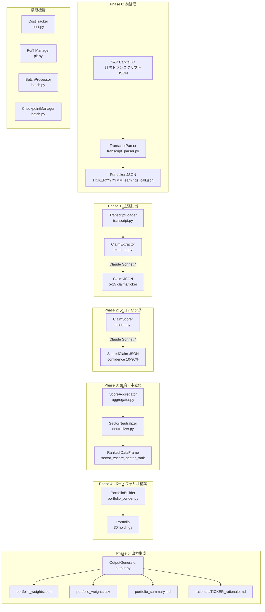

# ca_strategy

AI駆動の競争優位性ベース投資戦略パッケージ。決算トランスクリプトからClaude API（Sonnet 4）を使用して競争優位性を抽出・評価し、セクター中立化されたポートフォリオを構築する。

## 概要

MSCI Kokusaiベンチマーク構成銘柄（約300銘柄）を対象に、S&P Capital IQ決算トランスクリプトからLLMで競争優位性を抽出・スコアリングし、30銘柄ポートフォリオを自動構築する。Point-in-Time（PoiT）制約により、2015-09-30時点で利用可能な情報のみを使用し、ルックアヘッドバイアスを防止する。

**主な特徴:**

- 5フェーズのパイプラインアーキテクチャ
- KB1-T/KB2-T/KB3-Tナレッジベースによる評価キャリブレーション
- チェックポイントによるパイプライン中断・再開
- LLMコスト追跡と閾値アラート
- セクター中立Z-scoreによるランキング

## アーキテクチャ（5フェーズ）



## 使用例

### フルパイプライン実行

```python
from pathlib import Path
from dev.ca_strategy import Orchestrator

orch = Orchestrator(
    config_path=Path("research/ca_strategy_poc/config"),
    kb_base_dir=Path("analyst/transcript_eval"),
    workspace_dir=Path("research/ca_strategy_poc/workspace"),
)

# 全5フェーズを順次実行
orch.run_full_pipeline()
```

### チェックポイントからの再開

```python
# Phase 3以降を再実行（Phase 1-2のチェックポイントを読み込み）
orch.run_from_checkpoint(phase=3)
```

### トランスクリプト前処理（Phase 0）

```bash
uv run python -m dev.ca_strategy.run_parse_transcripts \
    --source-dir /path/to/data/Transcript \
    --start-month 2015-01 \
    --end-month 2015-09
```

## ディレクトリ構成

```
ca_strategy/
├── __init__.py              # 公開API（Orchestrator）
├── orchestrator.py          # Phase 1-5 パイプライン制御
├── types.py                 # Pydantic v2 データモデル（全15モデル）
├── extractor.py             # Phase 1: LLM主張抽出
├── scorer.py                # Phase 2: LLMスコアリング
├── aggregator.py            # Phase 3a: 構造的重み付き集約
├── neutralizer.py           # Phase 3b: セクター中立化
├── portfolio_builder.py     # Phase 4: ポートフォリオ構築
├── output.py                # Phase 5: 出力ファイル生成
├── cost.py                  # LLMコスト追跡
├── pit.py                   # Point-in-Time制約管理
├── batch.py                 # バッチ処理・チェックポイント
├── transcript.py            # トランスクリプト読込・検証
├── transcript_parser.py     # S&P Capital IQ JSON変換
├── run_parse_transcripts.py # 前処理CLIスクリプト
└── README.md                # 本ファイル
```

## データフォーマット仕様

### 入力: トランスクリプトJSON

```json
{
  "metadata": {
    "ticker": "AAPL",
    "event_date": "2015-01-28",
    "fiscal_quarter": "Q1 2015",
    "is_truncated": false
  },
  "sections": [
    {
      "speaker": "Tim Cook",
      "role": "Executives",
      "section_type": "prepared_remarks",
      "content": "Good afternoon, everyone..."
    }
  ]
}
```

### Phase 1 出力: Claim JSON

```json
{
  "ticker": "AAPL",
  "transcript_source": "Q1 2015 Earnings Call",
  "claims": [
    {
      "id": "AAPL-CA-001",
      "claim_type": "competitive_advantage",
      "claim": "Appleのエコシステム統合は...",
      "evidence": "Tim Cook stated that...",
      "rule_evaluation": {
        "applied_rules": ["rule_6", "rule_11"],
        "results": {"rule_6": true, "rule_11": true},
        "confidence": 0.7,
        "adjustments": ["structural advantage confirmed"]
      }
    }
  ]
}
```

### Phase 2 出力: ScoredClaim JSON

```json
{
  "scored_claims": [
    {
      "id": "AAPL-CA-001",
      "final_confidence": 0.7,
      "gatekeeper": {
        "rule9_factual_error": false,
        "rule3_industry_common": false
      },
      "kb2_patterns": [
        {
          "pattern": "pattern_I",
          "match": true,
          "adjustment": 0.1,
          "reasoning": "持続的競争優位のパターンに合致"
        }
      ],
      "confidence_adjustments": [
        {
          "source": "kb2_pattern_I",
          "adjustment": 0.1,
          "reasoning": "構造的優位性パターン"
        }
      ]
    }
  ]
}
```

### Phase 5 出力: portfolio_weights.json

```json
{
  "as_of_date": "2015-09-30",
  "holdings": [
    {
      "ticker": "AAPL",
      "weight": 0.045,
      "sector": "Information Technology",
      "score": 0.82,
      "rationale_summary": "Sector rank 1, score 0.82"
    }
  ],
  "sector_allocation": [
    {
      "sector": "Information Technology",
      "benchmark_weight": 0.15,
      "actual_weight": 0.16,
      "stock_count": 5
    }
  ],
  "data_sources": {
    "benchmark": "MSCI Kokusai (MSCI World ex Japan)",
    "scoring": "CA Strategy Phase 1-3",
    "universe": "300 stocks, MSCI Kokusai constituents"
  }
}
```

## 依存関係

### 内部パッケージ

| パッケージ | 用途 | 参照元 |
|-----------|------|--------|
| `utils_core` | 構造化ロギング（`get_logger`） | 全モジュール |
| `factor` | セクター中立化（`Normalizer`） | `neutralizer.py` |

### 外部ライブラリ

| ライブラリ | バージョン | 用途 |
|-----------|-----------|------|
| `pydantic` | v2 | データモデル定義・バリデーション |
| `anthropic` | - | Claude API クライアント（Phase 1, 2） |
| `pandas` | - | DataFrame操作（Phase 3） |
| `tqdm` | - | バッチ処理プログレスバー |

## 設定ファイル

`research/ca_strategy_poc/config/` ディレクトリに配置する。

### universe.json

投資ユニバース定義。全対象銘柄とGICSセクター分類を記載。

```json
{
  "tickers": [
    {"ticker": "AAPL", "gics_sector": "Information Technology"},
    {"ticker": "MSFT", "gics_sector": "Information Technology"}
  ]
}
```

### benchmark_weights.json

ベンチマーク（MSCI Kokusai）のセクターウェイト。

```json
{
  "weights": {
    "Information Technology": 0.15,
    "Health Care": 0.12,
    "Financials": 0.18
  }
}
```

### ticker_mapping.json

数字で始まる非標準Bloomberg Tickerから標準Tickerへのマッピング。

```json
{
  "7203": {
    "ticker": "TM",
    "company": "Toyota Motor Corporation"
  }
}
```

## コスト見積もり

Claude Sonnet 4（入力$3/1Mトークン、出力$15/1Mトークン）を使用。

| Phase | 処理内容 | 呼び出し回数 | 推定コスト |
|-------|---------|-------------|-----------|
| Phase 1 | 主張抽出 | 約300回（1銘柄/1回） | 約$15 |
| Phase 2 | スコアリング | 約300回（1銘柄/1回） | 約$15 |
| **合計** | | **約600回** | **約$30** |

- `CostTracker` がリアルタイムでコストを追跡
- デフォルト警告閾値: $50（超過時にログ警告）
- コスト記録は `workspace/cost_tracking.json` に保存

## トラブルシューティング

### チェックポイントからの再開

パイプラインが途中で失敗した場合、`run_from_checkpoint()` で中断したフェーズから再開できる。

```python
# Phase 1完了後にPhase 2で失敗した場合
orch.run_from_checkpoint(phase=2)

# Phase 3以降の再実行
orch.run_from_checkpoint(phase=3)
```

チェックポイントファイルは `workspace/checkpoints/` に保存される:
- `phase1_claims.json`: Phase 1の抽出結果
- `phase2_scored.json`: Phase 2のスコアリング結果

### コスト上限の管理

```python
from dev.ca_strategy.cost import CostTracker

tracker = CostTracker(warning_threshold=30.0)  # $30で警告
# ... パイプライン実行 ...
print(f"Total cost: ${tracker.get_total_cost():.2f}")
print(f"Phase 1 cost: ${tracker.get_phase_cost('phase1'):.2f}")
```

### 実行ログの確認

各フェーズの実行状態は `workspace/execution_log.json` に記録される。

```json
{
  "phases": [
    {"phase": "phase1", "status": "completed", "timestamp": "..."},
    {"phase": "phase2", "status": "failed", "error": "API error", "timestamp": "..."}
  ]
}
```

### PoiT制約違反の検出

```python
from dev.ca_strategy.pit import validate_pit_compliance, CUTOFF_DATE

is_valid = validate_pit_compliance(transcripts, CUTOFF_DATE)
# False の場合、cutoff_date以降のトランスクリプトが含まれている
```

## 更新履歴

このREADME.mdは、モジュール構造・公開API・アーキテクチャに変更があった場合に更新すること。

更新トリガー:
- 新規モジュール追加時
- パイプラインフェーズの変更時
- 設定ファイル形式の変更時
